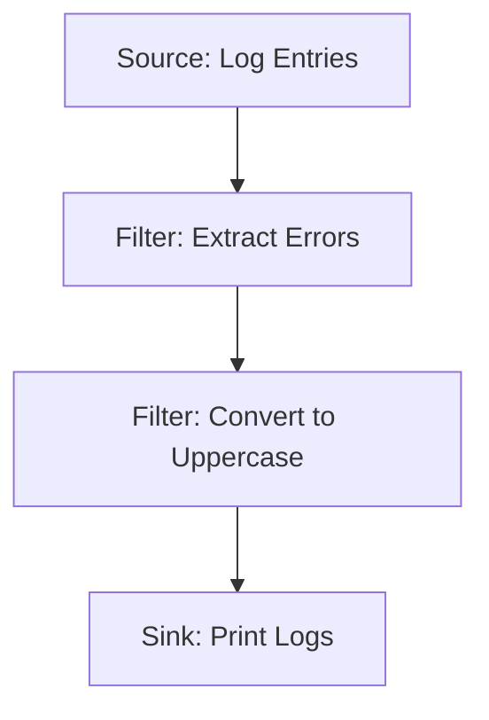

## 12.8 Pipe and Filter Architecture with Conduit

In the world of software architecture, the **Pipe and Filter Pattern** stands out as a robust method for processing data streams through a series of transformations. This pattern is particularly well-suited for applications that require data to be processed in stages, where each stage performs a specific transformation or computation. In Haskell, the **Conduit Library** provides a powerful framework for implementing this pattern, allowing developers to compose complex data processing pipelines with ease and efficiency.

### Understanding the Pipe and Filter Pattern

**Intent**: The Pipe and Filter pattern is designed to process data streams by passing them through a series of components, known as filters, which transform the data. These filters are connected by pipes, which transport the data from one filter to the next.

**Key Participants**:
- **Filters**: Independent processing units that transform data.
- **Pipes**: Connectors that transport data between filters.
- **Data Streams**: The flow of data that is processed by the filters.

**Applicability**: Use the Pipe and Filter pattern when:
- You need to process data in a series of independent steps.
- The processing steps can be reused in different contexts.
- You want to build a system that is easy to extend and modify.

### The Conduit Library

The **Conduit Library** in Haskell is a powerful tool for building streaming data processing applications. It provides a framework for constructing pipelines that process data incrementally, allowing for efficient memory usage and the ability to handle large data sets.

**Features of Conduit**:
- **Resource Safety**: Ensures that resources are properly managed and released.
- **Backpressure**: Controls the flow of data to prevent overwhelming the system.
- **Composability**: Allows for easy composition of complex data processing pipelines.

#### Installing Conduit

To get started with Conduit, you need to install the library. You can do this using Cabal or Stack:

```bash
cabal update
cabal install conduit
```

or

```bash
stack add conduit
```

### Implementing Pipe and Filter with Conduit

Let's explore how to implement the Pipe and Filter architecture using the Conduit library in Haskell. We'll walk through the process of composing data processing pipelines and demonstrate how to transform and aggregate log data in real-time.

#### Basic Conduit Concepts

Before diving into the implementation, it's important to understand some basic concepts in Conduit:

- **Source**: A producer of data.
- **Sink**: A consumer of data.
- **Conduit**: A transformer that can both consume and produce data.

#### Example: Real-Time Log Processing

Imagine we have a system that generates log data, and we want to process this data in real-time to extract useful information. We'll use the Pipe and Filter pattern with Conduit to achieve this.

**Step 1: Define the Data Stream**

First, let's define a simple data stream representing log entries:

```haskell
{-# LANGUAGE OverloadedStrings #-}

import Data.Conduit
import qualified Data.Conduit.List as CL
import Data.Text (Text)
import qualified Data.Text as T

-- Sample log entries
logEntries :: [Text]
logEntries = 
  [ "INFO: User logged in"
  , "ERROR: Failed to connect to database"
  , "INFO: User logged out"
  , "WARNING: Low disk space"
  ]
```

**Step 2: Create Filters**

Next, we'll create filters to process the log entries. Each filter will perform a specific transformation or computation.

```haskell
-- Filter to extract error messages
filterErrors :: Monad m => ConduitT Text Text m ()
filterErrors = CL.filter (T.isPrefixOf "ERROR")

-- Filter to convert log entries to uppercase
toUpperCase :: Monad m => ConduitT Text Text m ()
toUpperCase = CL.map T.toUpper
```

**Step 3: Compose the Pipeline**

Now, we'll compose the pipeline by connecting the filters using pipes.

```haskell
-- Compose the pipeline
processLogs :: Monad m => ConduitT () Text m ()
processLogs = CL.sourceList logEntries .| filterErrors .| toUpperCase
```

**Step 4: Consume the Data**

Finally, we'll consume the processed data using a sink.

```haskell
-- Sink to print the processed log entries
printLogs :: IO ()
printLogs = runConduit $ processLogs .| CL.mapM_ print
```

**Try It Yourself**: Modify the code to add a new filter that counts the number of error messages.

### Visualizing the Pipe and Filter Architecture

To better understand the flow of data through the pipeline, let's visualize the Pipe and Filter architecture using a Mermaid.js diagram.



**Diagram Description**: This diagram illustrates the flow of data through the pipeline. The log entries are first passed through a filter that extracts error messages, then through a filter that converts the messages to uppercase, and finally to a sink that prints the logs.

### Design Considerations

When implementing the Pipe and Filter pattern with Conduit, consider the following:

- **Resource Management**: Ensure that resources are properly managed to prevent leaks.
- **Error Handling**: Implement robust error handling to deal with unexpected data or failures.
- **Performance**: Optimize the pipeline for performance by minimizing data copying and leveraging lazy evaluation.

### Haskell Unique Features

Haskell's strong type system and lazy evaluation make it particularly well-suited for implementing the Pipe and Filter pattern. The Conduit library leverages these features to provide a powerful and efficient framework for streaming data processing.

### Differences and Similarities

The Pipe and Filter pattern is similar to other data processing patterns, such as the **Chain of Responsibility** pattern. However, it differs in that it focuses on data transformation rather than decision-making. In Haskell, the Conduit library provides a unique approach to implementing this pattern, leveraging the language's functional programming capabilities.

### References and Further Reading

For more information on the Conduit library and the Pipe and Filter pattern, check out the following resources:

- [Conduit Library on Hackage](https://hackage.haskell.org/package/conduit)
- [Real World Haskell](http://book.realworldhaskell.org/)
- [Haskell Programming from First Principles](https://haskellbook.com/)

### Knowledge Check

Before moving on, let's review some key concepts:

- What is the Pipe and Filter pattern?
- How does the Conduit library facilitate streaming data processing in Haskell?
- What are some design considerations when implementing this pattern?

### Embrace the Journey

Remember, mastering the Pipe and Filter architecture with Conduit is just the beginning. As you progress, you'll be able to build more complex and efficient data processing systems. Keep experimenting, stay curious, and enjoy the journey!

## Quiz: Pipe and Filter Architecture with Conduit



### What is the primary purpose of the Pipe and Filter pattern?

- [x] To process data streams through a series of transformations
- [ ] To manage database connections
- [ ] To handle user authentication
- [ ] To render user interfaces

> **Explanation:** The Pipe and Filter pattern is designed to process data streams by passing them through a series of transformations.

### Which Haskell library is commonly used for implementing the Pipe and Filter pattern?

- [x] Conduit
- [ ] Aeson
- [ ] Warp
- [ ] Persistent

> **Explanation:** The Conduit library is commonly used in Haskell for implementing the Pipe and Filter pattern.

### What is a key feature of the Conduit library?

- [x] Resource safety
- [ ] Automatic UI generation
- [ ] Database migration
- [ ] Network communication

> **Explanation:** The Conduit library ensures resource safety, which is a key feature for managing resources efficiently.

### In the Conduit library, what is a "Sink"?

- [x] A consumer of data
- [ ] A producer of data
- [ ] A transformer of data
- [ ] A connector of data

> **Explanation:** In the Conduit library, a "Sink" is a consumer of data.

### What does the `.|` operator do in a Conduit pipeline?

- [x] Connects components in a pipeline
- [ ] Defines a new data type
- [ ] Initiates a network request
- [ ] Compiles the Haskell code

> **Explanation:** The `.|` operator is used to connect components in a Conduit pipeline.

### Which of the following is a design consideration when using the Pipe and Filter pattern?

- [x] Resource management
- [ ] UI design
- [ ] Database indexing
- [ ] User authentication

> **Explanation:** Resource management is a critical design consideration when using the Pipe and Filter pattern.

### What is a "Filter" in the context of the Pipe and Filter pattern?

- [x] An independent processing unit that transforms data
- [ ] A database query
- [ ] A user interface component
- [ ] A network protocol

> **Explanation:** A "Filter" is an independent processing unit that transforms data in the Pipe and Filter pattern.

### How does Haskell's lazy evaluation benefit the Pipe and Filter pattern?

- [x] By allowing efficient data processing without unnecessary computations
- [ ] By automatically generating user interfaces
- [ ] By managing database connections
- [ ] By handling network requests

> **Explanation:** Haskell's lazy evaluation allows efficient data processing without unnecessary computations, benefiting the Pipe and Filter pattern.

### What is the role of "Pipes" in the Pipe and Filter pattern?

- [x] To transport data between filters
- [ ] To store data in a database
- [ ] To render user interfaces
- [ ] To manage network connections

> **Explanation:** Pipes transport data between filters in the Pipe and Filter pattern.

### True or False: The Pipe and Filter pattern is primarily used for decision-making processes.

- [ ] True
- [x] False

> **Explanation:** False. The Pipe and Filter pattern is primarily used for data transformation, not decision-making processes.



By mastering the Pipe and Filter architecture with Conduit, you can build scalable, efficient, and maintainable data processing systems in Haskell. Keep exploring and applying these concepts to real-world projects to deepen your understanding and expertise.
