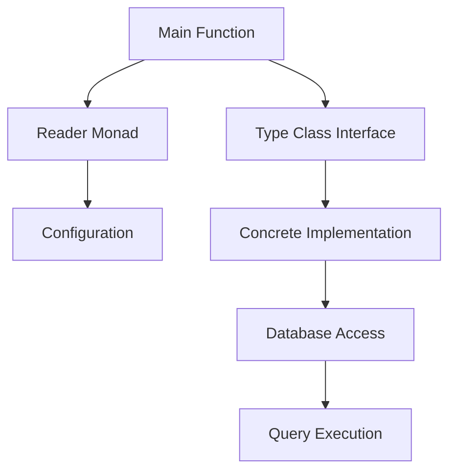

## 12.9 Dependency Injection via Monads and Type Classes

In the realm of software engineering, **Dependency Injection (DI)** is a design pattern that facilitates the decoupling of components by providing their dependencies from the outside rather than hard-coding them. This pattern is crucial for creating modular, testable, and maintainable code. In Haskell, a functional programming language, DI can be elegantly implemented using **Monads** and **Type Classes**. This section delves into these advanced techniques, providing expert software engineers and architects with the tools to enhance their Haskell applications.

### Understanding Dependency Injection

**Dependency Injection** is a technique where an object or function receives its dependencies from an external source rather than creating them internally. This approach promotes loose coupling and enhances testability by allowing dependencies to be mocked or substituted during testing.

#### Key Benefits of Dependency Injection

- **Modularity**: Components are independent and can be developed, tested, and maintained separately.
- **Testability**: Dependencies can be easily mocked or replaced, facilitating unit testing.
- **Flexibility**: Systems can be reconfigured by changing the injected dependencies without altering the components themselves.

### Implementing Dependency Injection in Haskell

Haskell, with its strong type system and functional paradigm, offers unique approaches to implementing DI. Two primary methods are using the **Reader Monad** and **Type Classes**.

#### The Reader Monad

The **Reader Monad** is a powerful tool for dependency injection in Haskell. It allows functions to access shared configuration or environment data without explicitly passing it as an argument.

##### How the Reader Monad Works

The Reader Monad encapsulates a computation that depends on a shared environment. It provides a way to "read" from this environment within a monadic context.

```haskell
import Control.Monad.Reader

-- Define a configuration type
data Config = Config { dbConnectionString :: String }

-- A function that uses the Reader Monad to access the configuration
fetchData :: Reader Config String
fetchData = do
    config <- ask
    return $ "Fetching data using connection: " ++ dbConnectionString config

-- Running the Reader Monad
main :: IO ()
main = do
    let config = Config "localhost:5432"
    putStrLn $ runReader fetchData config
```

In this example, `fetchData` is a computation that depends on the `Config` environment. The `ask` function retrieves the current environment, allowing `fetchData` to access the `dbConnectionString`.

##### Advantages of Using the Reader Monad

- **Simplicity**: The Reader Monad provides a straightforward way to pass configuration data through a series of computations.
- **Composability**: Reader-based functions can be easily composed, promoting code reuse.

#### Type Classes for Dependency Injection

Type Classes in Haskell provide another method for implementing DI. They allow you to define a set of functions that can operate on multiple types, enabling polymorphic behavior.

##### Using Type Classes for DI

By defining a type class for a dependency, you can create different implementations for various contexts.

```haskell
-- Define a type class for a database
class Database db where
    query :: db -> String -> IO String

-- Implement the type class for a specific database
data Postgres = Postgres { connectionString :: String }

instance Database Postgres where
    query db sql = return $ "Querying Postgres with: " ++ sql

-- A function that uses the Database type class
fetchUserData :: Database db => db -> IO String
fetchUserData db = query db "SELECT * FROM users"

-- Using the function with a specific database
main :: IO ()
main = do
    let postgres = Postgres "localhost:5432"
    result <- fetchUserData postgres
    putStrLn result
```

In this example, the `Database` type class abstracts the database operations, allowing `fetchUserData` to work with any type that implements the `Database` interface.

##### Benefits of Using Type Classes

- **Abstraction**: Type classes abstract the implementation details, allowing for flexible and interchangeable components.
- **Polymorphism**: Functions can operate on any type that implements the required interface, promoting code reuse.

### Combining Monads and Type Classes

For more complex scenarios, you can combine the Reader Monad with Type Classes to achieve even greater flexibility and modularity.

#### Example: Abstracting Database Access

Consider a scenario where you need to abstract database access behind interfaces, allowing for different database implementations.

```haskell
import Control.Monad.Reader

-- Define a type class for database operations
class Monad m => Database m where
    query :: String -> m String

-- Implement the type class for a specific database using the Reader Monad
newtype App a = App { runApp :: Reader Config a }
    deriving (Functor, Applicative, Monad, MonadReader Config)

instance Database App where
    query sql = do
        config <- ask
        return $ "Querying database with: " ++ sql ++ " using " ++ dbConnectionString config

-- A function that uses the Database type class
fetchUserData :: Database m => m String
fetchUserData = query "SELECT * FROM users"

-- Running the application
main :: IO ()
main = do
    let config = Config "localhost:5432"
    putStrLn $ runReader (runApp fetchUserData) config
```

In this example, the `App` monad combines the Reader Monad with the `Database` type class, allowing `fetchUserData` to access the configuration and perform database queries.

### Visualizing Dependency Injection in Haskell

To better understand the flow of dependency injection using Monads and Type Classes, let's visualize the process with a diagram.



**Diagram Description**: This diagram illustrates the flow of dependency injection in Haskell. The main function utilizes the Reader Monad to access configuration data and the Type Class interface to interact with a concrete implementation, ultimately leading to database access and query execution.

### Design Considerations

When implementing dependency injection in Haskell, consider the following:

- **Complexity**: While Monads and Type Classes offer powerful abstractions, they can introduce complexity. Ensure that the benefits outweigh the added complexity.
- **Performance**: Consider the performance implications of using Monads and Type Classes, especially in performance-critical applications.
- **Readability**: Maintain code readability by documenting the purpose and usage of Monads and Type Classes.

### Haskell Unique Features

Haskell's strong type system and functional paradigm provide unique features for implementing DI:

- **Type Safety**: Haskell's type system ensures that dependencies are correctly injected and used, reducing runtime errors.
- **Immutability**: Haskell's immutable data structures promote safe and predictable dependency management.

### Differences and Similarities

Dependency Injection in Haskell using Monads and Type Classes differs from traditional object-oriented DI:

- **No Mutable State**: Unlike OO DI, Haskell's DI does not rely on mutable state, promoting safer and more predictable code.
- **Functional Composition**: Haskell's DI leverages functional composition, allowing for more flexible and reusable components.

### Try It Yourself

To deepen your understanding of dependency injection in Haskell, try modifying the provided examples:

- **Experiment with Different Configurations**: Change the configuration data and observe how it affects the application's behavior.
- **Implement Additional Type Classes**: Create new type classes for other dependencies, such as logging or caching, and integrate them into the application.

### Knowledge Check

- **What are the key benefits of using Dependency Injection in Haskell?**
- **How does the Reader Monad facilitate dependency injection?**
- **What role do Type Classes play in implementing DI in Haskell?**

### Embrace the Journey

Remember, mastering dependency injection in Haskell is just the beginning. As you progress, you'll discover more advanced patterns and techniques that will enhance your functional programming skills. Keep experimenting, stay curious, and enjoy the journey!

## Quiz: Dependency Injection via Monads and Type Classes



### What is the primary purpose of Dependency Injection?

- [x] To provide dependencies from the outside rather than hard-coding them
- [ ] To increase the complexity of the code
- [ ] To reduce the number of functions in a program
- [ ] To enforce strict type checking

> **Explanation:** Dependency Injection aims to decouple components by providing their dependencies externally, enhancing modularity and testability.

### How does the Reader Monad facilitate Dependency Injection?

- [x] By encapsulating computations that depend on a shared environment
- [ ] By allowing mutable state within functions
- [ ] By enforcing strict evaluation
- [ ] By providing a global state

> **Explanation:** The Reader Monad encapsulates computations that depend on a shared environment, allowing functions to access dependencies without explicit arguments.

### What is a key benefit of using Type Classes for Dependency Injection?

- [x] They allow for polymorphic behavior and abstraction
- [ ] They enforce a single implementation for all types
- [ ] They increase the verbosity of the code
- [ ] They require mutable state

> **Explanation:** Type Classes provide polymorphic behavior, allowing functions to operate on multiple types and abstracting implementation details.

### What is a potential drawback of using Monads and Type Classes for Dependency Injection?

- [x] Increased complexity
- [ ] Lack of type safety
- [ ] Reduced modularity
- [ ] Inability to handle side effects

> **Explanation:** While powerful, Monads and Type Classes can introduce complexity, which should be managed to ensure code maintainability.

### How can you combine the Reader Monad and Type Classes for Dependency Injection?

- [x] By creating a monad that implements a type class interface
- [ ] By using mutable state within the Reader Monad
- [ ] By enforcing strict evaluation in type classes
- [ ] By avoiding the use of type classes altogether

> **Explanation:** Combining the Reader Monad with Type Classes allows for flexible and modular dependency injection by implementing type class interfaces within a monadic context.

### What is a unique feature of Haskell that aids in Dependency Injection?

- [x] Strong type system
- [ ] Mutable state
- [ ] Lack of type safety
- [ ] Global variables

> **Explanation:** Haskell's strong type system ensures that dependencies are correctly injected and used, reducing runtime errors.

### What is a key difference between Dependency Injection in Haskell and traditional OO DI?

- [x] Haskell DI does not rely on mutable state
- [ ] Haskell DI requires global variables
- [ ] Haskell DI is less modular
- [ ] Haskell DI enforces strict evaluation

> **Explanation:** Unlike OO DI, Haskell's DI does not rely on mutable state, promoting safer and more predictable code.

### How can you test functions that use Dependency Injection in Haskell?

- [x] By mocking or substituting dependencies
- [ ] By using global variables
- [ ] By enforcing strict evaluation
- [ ] By avoiding the use of type classes

> **Explanation:** Dependency Injection allows for easy mocking or substitution of dependencies, facilitating unit testing.

### What is an advantage of using the Reader Monad for Dependency Injection?

- [x] Simplicity and composability
- [ ] Increased verbosity
- [ ] Requirement for mutable state
- [ ] Lack of type safety

> **Explanation:** The Reader Monad provides a simple and composable way to pass configuration data through computations.

### True or False: Type Classes in Haskell enforce a single implementation for all types.

- [ ] True
- [x] False

> **Explanation:** Type Classes allow for multiple implementations, enabling polymorphic behavior and abstraction.



By exploring these advanced techniques, you can leverage Haskell's unique features to implement dependency injection effectively, enhancing the modularity and testability of your applications.
