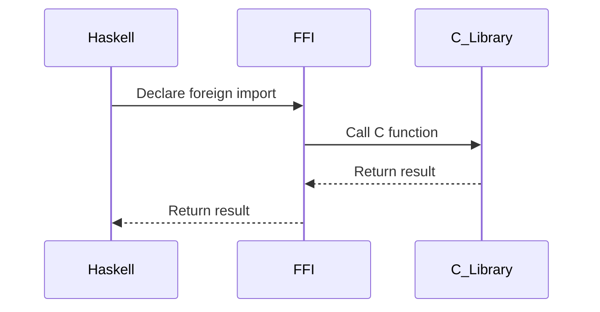

## 13.1 Foreign Function Interface (FFI) with C Libraries

In the world of software development, interoperability is a key aspect that allows different programming languages to work together seamlessly. Haskell, known for its strong type system and functional programming paradigm, provides a powerful mechanism to interact with C libraries through the Foreign Function Interface (FFI). This capability enables Haskell developers to leverage existing C libraries for tasks such as high-performance computations, system-level programming, and more.

### Understanding the Foreign Function Interface (FFI)

The Foreign Function Interface (FFI) is a mechanism that allows Haskell programs to call functions written in other programming languages, such as C. This interoperability is crucial for integrating Haskell with existing codebases, utilizing optimized libraries, and performing system-level operations that are not natively supported in Haskell.

#### Key Concepts of FFI

- **Interoperability**: FFI enables Haskell to interact with C libraries, allowing developers to use existing C functions within Haskell programs.
- **Foreign Imports**: The `foreign import` syntax is used to bind C functions to Haskell, making them accessible as if they were native Haskell functions.
- **Type Safety**: Ensuring that the types of C functions are correctly represented in Haskell to prevent runtime errors and undefined behavior.
- **Resource Management**: Properly managing resources such as memory and file handles when interfacing with C to avoid leaks and other issues.

### Implementing FFI in Haskell

To use FFI in Haskell, you need to declare foreign imports that specify the C functions you want to call. This involves defining the function signature in Haskell, which should match the C function's signature.

#### Basic Syntax

The basic syntax for importing a C function into Haskell is as follows:

```haskell
foreign import ccall "math.h sin" c_sin :: CDouble -> CDouble
```

- **`foreign import`**: This keyword indicates that a foreign function is being imported.
- **`ccall`**: Specifies the calling convention, which is typically `ccall` for C functions.
- **`"math.h sin"`**: The C function to be imported, including the header file and function name.
- **`c_sin`**: The Haskell name for the imported function.
- **`CDouble -> CDouble`**: The type signature in Haskell, matching the C function's signature.

#### Example: Integrating a C Library

Let's consider an example where we integrate a C library for high-performance computations. Suppose we have a C function that calculates the square root of a number:

```c
// sqrt.c
#include <math.h>

double sqrt_c(double x) {
    return sqrt(x);
}
```

To use this function in Haskell, we first compile the C code into a shared library:

```bash
gcc -c -o sqrt.o sqrt.c
gcc -shared -o libsqrt.so sqrt.o
```

Next, we import the function into Haskell using FFI:

```haskell
{-# LANGUAGE ForeignFunctionInterface #-}

module Main where

import Foreign.C.Types

foreign import ccall "sqrt_c" c_sqrt :: CDouble -> CDouble

main :: IO ()
main = do
    let number = 25.0
    let result = c_sqrt number
    putStrLn $ "The square root of " ++ show number ++ " is " ++ show result
```

In this example, we:

1. **Declared the Foreign Function**: We used `foreign import ccall` to declare the `sqrt_c` function from the C library.
2. **Defined the Type Signature**: We specified that `c_sqrt` takes a `CDouble` and returns a `CDouble`, matching the C function's signature.
3. **Called the Function**: We called `c_sqrt` in the `main` function and printed the result.

### Safety Considerations

When working with FFI, it's crucial to ensure type safety and proper resource management. Here are some considerations:

- **Type Matching**: Ensure that the Haskell types match the C types to prevent undefined behavior. Use types from the `Foreign.C.Types` module to represent C types in Haskell.
- **Memory Management**: Be cautious with memory allocation and deallocation. Use Haskell's garbage collector for memory managed by Haskell, and ensure proper cleanup for memory allocated in C.
- **Error Handling**: Handle errors gracefully, especially when dealing with system-level operations or functions that can fail.

### Advanced FFI Techniques

Beyond basic function calls, FFI in Haskell supports more advanced techniques, such as:

- **Calling Haskell from C**: You can expose Haskell functions to be called from C, allowing for bidirectional interoperability.
- **Handling Callbacks**: Use FFI to handle C callbacks by passing Haskell functions as arguments to C functions.
- **Interfacing with Complex Data Structures**: Use Haskell's `Storable` type class to work with complex C data structures.

#### Example: Handling Callbacks

Suppose we have a C function that accepts a callback:

```c
// callback.c
#include <stdio.h>

typedef void (*callback_t)(int);

void register_callback(callback_t callback) {
    for (int i = 0; i < 5; i++) {
        callback(i);
    }
}
```

We can handle this callback in Haskell as follows:

```haskell
{-# LANGUAGE ForeignFunctionInterface #-}

module Main where

import Foreign
import Foreign.C.Types

type Callback = CInt -> IO ()

foreign import ccall "wrapper"
    mkCallback :: Callback -> IO (FunPtr Callback)

foreign import ccall "register_callback"
    c_register_callback :: FunPtr Callback -> IO ()

callback :: Callback
callback n = putStrLn $ "Callback called with " ++ show n

main :: IO ()
main = do
    callbackPtr <- mkCallback callback
    c_register_callback callbackPtr
```

In this example, we:

1. **Defined the Callback Type**: We defined `Callback` as a type alias for a function that takes a `CInt` and returns `IO ()`.
2. **Created a Callback Wrapper**: We used `foreign import ccall "wrapper"` to create a wrapper for the Haskell callback function.
3. **Registered the Callback**: We registered the callback with the C function using `c_register_callback`.

### Visualizing FFI Workflow

To better understand the workflow of FFI in Haskell, let's visualize the process using a sequence diagram.



**Diagram Description**: This sequence diagram illustrates the interaction between Haskell, FFI, and a C library. Haskell declares a foreign import, FFI calls the C function, and the result is returned to Haskell.

### References and Further Reading

- [Haskell Foreign Function Interface (FFI) - GHC Documentation](https://downloads.haskell.org/~ghc/latest/docs/html/users_guide/ffi-chap.html)
- [Interfacing with C - Haskell Wiki](https://wiki.haskell.org/Interfacing_with_C)
- [Foreign Function Interface - Haskell 2010 Language Report](https://www.haskell.org/onlinereport/haskell2010/haskellch8.html)

### Knowledge Check

To reinforce your understanding of FFI in Haskell, consider the following questions:

1. What is the purpose of the `foreign import` keyword in Haskell?
2. How do you ensure type safety when using FFI?
3. What are some common use cases for FFI in Haskell?
4. How can you handle C callbacks in Haskell using FFI?
5. What are the safety considerations when working with FFI?

### Embrace the Journey

Remember, mastering FFI in Haskell opens up a world of possibilities for integrating with existing C libraries and enhancing the performance of your applications. As you explore FFI, keep experimenting, stay curious, and enjoy the journey!

## Quiz: Foreign Function Interface (FFI) with C Libraries



### What is the primary purpose of the Foreign Function Interface (FFI) in Haskell?

- [x] To call functions written in other languages from Haskell
- [ ] To compile Haskell code into C
- [ ] To convert Haskell types to C types
- [ ] To manage memory in Haskell

> **Explanation:** The FFI is used to call functions written in other languages, such as C, from Haskell.

### Which keyword is used to declare a foreign import in Haskell?

- [x] foreign import
- [ ] import
- [ ] foreign
- [ ] ccall

> **Explanation:** The `foreign import` keyword is used to declare a foreign function in Haskell.

### How do you ensure type safety when using FFI in Haskell?

- [x] By matching Haskell types with C types
- [ ] By using dynamic typing
- [ ] By ignoring type mismatches
- [ ] By using only primitive types

> **Explanation:** Ensuring that Haskell types match C types is crucial for type safety in FFI.

### What is the role of the `ccall` keyword in FFI?

- [x] It specifies the calling convention for C functions
- [ ] It imports C libraries
- [ ] It compiles C code
- [ ] It manages memory allocation

> **Explanation:** The `ccall` keyword specifies the calling convention for C functions in FFI.

### How can you handle C callbacks in Haskell using FFI?

- [x] By using the `foreign import ccall "wrapper"` syntax
- [ ] By writing C code in Haskell
- [ ] By using only pure functions
- [ ] By avoiding callbacks

> **Explanation:** The `foreign import ccall "wrapper"` syntax is used to handle C callbacks in Haskell.

### What is a common use case for FFI in Haskell?

- [x] Integrating high-performance C libraries
- [ ] Writing web applications
- [ ] Creating graphical user interfaces
- [ ] Compiling Haskell to JavaScript

> **Explanation:** FFI is commonly used to integrate high-performance C libraries with Haskell.

### Which module provides types for representing C types in Haskell?

- [x] Foreign.C.Types
- [ ] Data.C.Types
- [ ] System.C.Types
- [ ] Haskell.C.Types

> **Explanation:** The `Foreign.C.Types` module provides types for representing C types in Haskell.

### What is a safety consideration when using FFI?

- [x] Proper memory management
- [ ] Using only pure functions
- [ ] Avoiding type classes
- [ ] Ignoring type mismatches

> **Explanation:** Proper memory management is a crucial safety consideration when using FFI.

### Can Haskell functions be called from C using FFI?

- [x] True
- [ ] False

> **Explanation:** Haskell functions can be exposed to be called from C using FFI.

### What is the purpose of the `FunPtr` type in FFI?

- [x] To represent function pointers in Haskell
- [ ] To manage memory allocation
- [ ] To convert Haskell types to C types
- [ ] To compile C code

> **Explanation:** The `FunPtr` type is used to represent function pointers in Haskell for FFI.


