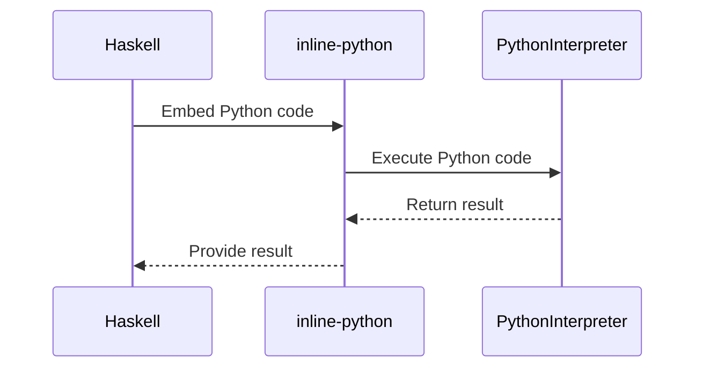

## 13.11 Bridging with Python and Other Languages (e.g., inline-python)

In the ever-evolving landscape of software development, the ability to leverage multiple programming languages within a single project can be a game-changer. Haskell, known for its strong type system and functional programming paradigm, can be seamlessly integrated with Python, a language renowned for its simplicity and extensive libraries, using tools like `inline-python`. This section delves into the intricacies of bridging Haskell with Python and other languages, focusing on the `inline-python` library, which allows developers to embed Python code directly within Haskell source files.

### Introduction to Inline Libraries

Inline libraries enable developers to embed code from other languages directly into Haskell, providing a powerful mechanism for interoperability. This capability is particularly useful when you want to leverage the strengths of different languages within a single application. For instance, you might use Haskell for its robust type system and concurrency support, while utilizing Python for its vast array of machine learning libraries.

#### Key Benefits of Inline Libraries

- **Seamless Integration**: Inline libraries allow for the seamless integration of different programming languages, enabling developers to use the best tool for each task.
- **Code Reusability**: By embedding code from other languages, you can reuse existing libraries and frameworks without having to rewrite them in Haskell.
- **Enhanced Productivity**: Leveraging the strengths of multiple languages can lead to more efficient development processes and faster time-to-market.

### Understanding inline-python

The `inline-python` library is a Haskell package that allows developers to write Python code directly within Haskell source files. This integration is achieved by embedding Python code snippets in Haskell, which are then executed using the Python interpreter. This approach provides a seamless way to access Python's extensive libraries and functionalities from within a Haskell application.

#### Features of inline-python

- **Direct Embedding**: Write Python code directly in Haskell files, making it easy to integrate Python functionalities.
- **Interoperability**: Access Python libraries and functions from Haskell, enabling the use of Python's rich ecosystem.
- **Ease of Use**: The library provides a simple API for embedding and executing Python code, making it accessible even to those new to Haskell-Python integration.

#### Installing inline-python

To get started with `inline-python`, you need to install the library using Haskell's package manager. You can do this by adding `inline-python` to your project's dependencies in the Cabal file or using Stack.

```bash
cabal install inline-python
```

Or, if you're using Stack:

```bash
stack add-source https://hackage.haskell.org/package/inline-python
```

### Using inline-python: A Practical Example

Let's explore a practical example of using `inline-python` to leverage Python's machine learning libraries within a Haskell application. We'll demonstrate how to use Python's `numpy` library to perform numerical computations from Haskell.

#### Setting Up the Environment

Before diving into the code, ensure that you have Python installed on your system along with the necessary libraries. You can install `numpy` using pip:

```bash
pip install numpy
```

#### Writing Haskell Code with Embedded Python

Here's a simple Haskell program that uses `inline-python` to perform matrix multiplication using `numpy`.

```haskell
{-# LANGUAGE QuasiQuotes #-}

import Language.Python.Inline

main :: IO ()
main = do
  let matrixA = [[1, 2], [3, 4]]
      matrixB = [[5, 6], [7, 8]]
  result <- [py| import numpy as np
                 matrixA = np.array($matrixA)
                 matrixB = np.array($matrixB)
                 result = np.dot(matrixA, matrixB)
                 result.tolist() |]
  print (result :: [[Int]])
```

**Explanation:**

- **QuasiQuotes**: We use the `QuasiQuotes` language extension to embed Python code within Haskell.
- **Embedding Python Code**: The `[py| ... |]` syntax is used to embed Python code. Inside this block, we import `numpy`, convert Haskell lists to `numpy` arrays, perform matrix multiplication, and convert the result back to a Haskell list.
- **Type Annotation**: We specify the expected type of the result using a type annotation.

### Visualizing the Integration Process

To better understand how Haskell interacts with Python using `inline-python`, let's visualize the process with a sequence diagram.



**Diagram Explanation:**

- **Haskell**: Initiates the process by embedding Python code.
- **inline-python**: Acts as a bridge, sending the embedded code to the Python interpreter.
- **PythonInterpreter**: Executes the code and returns the result to `inline-python`, which then passes it back to Haskell.

### Advanced Use Cases

The integration of Haskell with Python using `inline-python` opens up a plethora of advanced use cases. Let's explore a few scenarios where this interoperability can be particularly beneficial.

#### Machine Learning and Data Analysis

Python is a popular choice for machine learning and data analysis due to its rich ecosystem of libraries like `scikit-learn`, `pandas`, and `tensorflow`. By embedding Python code in Haskell, you can leverage these libraries to perform complex data analysis tasks while benefiting from Haskell's strong type system and concurrency support.

**Example: Using scikit-learn for Classification**

```haskell
{-# LANGUAGE QuasiQuotes #-}

import Language.Python.Inline

main :: IO ()
main = do
  let features = [[1.0, 2.0], [3.0, 4.0], [5.0, 6.0]]
      labels = [0, 1, 0]
  prediction <- [py| from sklearn.tree import DecisionTreeClassifier
                     clf = DecisionTreeClassifier()
                     clf.fit($features, $labels)
                     result = clf.predict([[3.0, 4.0]])
                     result.tolist() |]
  print (prediction :: [Int])
```

**Explanation:**

- **scikit-learn**: We use the `DecisionTreeClassifier` from `scikit-learn` to train a simple model and make predictions.
- **Data Transfer**: Haskell lists are passed to Python as input features and labels, and predictions are returned as a Haskell list.

#### Scientific Computing

For scientific computing tasks, Python's `scipy` and `matplotlib` libraries provide powerful tools for numerical computations and data visualization. By integrating these libraries with Haskell, you can perform complex scientific computations and visualize results directly from your Haskell application.

**Example: Plotting a Graph with matplotlib**

```haskell
{-# LANGUAGE QuasiQuotes #-}

import Language.Python.Inline

main :: IO ()
main = do
  [py| import matplotlib.pyplot as plt
       plt.plot([1, 2, 3, 4], [1, 4, 9, 16])
       plt.ylabel('some numbers')
       plt.show() |]
  putStrLn "Plot displayed using matplotlib"
```

**Explanation:**

- **matplotlib**: We use `matplotlib` to plot a simple graph. The Python code is embedded within Haskell, and the plot is displayed using Python's plotting capabilities.

### Design Considerations

When integrating Haskell with Python using `inline-python`, there are several design considerations to keep in mind:

- **Performance Overhead**: Embedding Python code in Haskell introduces some performance overhead due to context switching between the two languages. Consider this when designing performance-critical applications.
- **Error Handling**: Ensure that errors in the embedded Python code are properly handled and communicated back to the Haskell application.
- **Data Conversion**: Be mindful of data conversion between Haskell and Python, as this can introduce additional complexity and potential for errors.

### Haskell Unique Features

Haskell's unique features, such as its strong static typing and lazy evaluation, can complement Python's dynamic nature. By combining these features, you can create robust applications that leverage the strengths of both languages.

- **Type Safety**: Haskell's type system can help catch errors at compile time, providing an additional layer of safety when integrating with dynamically typed languages like Python.
- **Concurrency**: Haskell's concurrency model can be used to manage parallel execution of Python code, enhancing performance in multi-threaded applications.

### Differences and Similarities

While both Haskell and Python are high-level languages, they differ significantly in their paradigms and use cases. Understanding these differences can help you make informed decisions when integrating the two.

- **Paradigm**: Haskell is a purely functional language, while Python supports multiple paradigms, including procedural and object-oriented programming.
- **Typing**: Haskell has a strong static type system, whereas Python is dynamically typed.
- **Use Cases**: Haskell is often used for applications requiring high reliability and concurrency, while Python is popular for data science, machine learning, and web development.

### References and Further Reading

- [inline-python on Hackage](https://hackage.haskell.org/package/inline-python)
- [Python's Official Documentation](https://docs.python.org/3/)
- [Haskell's Official Documentation](https://www.haskell.org/documentation/)

### Knowledge Check

To reinforce your understanding of bridging Haskell with Python using `inline-python`, consider the following questions and exercises:

1. **Question**: What are the key benefits of using inline libraries for language interoperability?
2. **Exercise**: Modify the matrix multiplication example to perform element-wise multiplication instead.
3. **Question**: How does `inline-python` handle data conversion between Haskell and Python?
4. **Exercise**: Use `inline-python` to integrate a Python library of your choice into a Haskell application.

### Embrace the Journey

Remember, integrating Haskell with Python using `inline-python` is just the beginning. As you explore this powerful combination, you'll discover new ways to leverage the strengths of both languages to build innovative and efficient applications. Keep experimenting, stay curious, and enjoy the journey!

## Quiz: Bridging with Python and Other Languages (e.g., inline-python)



### What is the primary purpose of inline libraries in Haskell?

- [x] To embed code from other languages directly in Haskell
- [ ] To convert Haskell code into other languages
- [ ] To compile Haskell code into Python bytecode
- [ ] To create standalone Haskell applications

> **Explanation:** Inline libraries allow embedding code from other languages directly in Haskell, facilitating interoperability.

### Which language feature does inline-python primarily utilize to embed Python code in Haskell?

- [x] QuasiQuotes
- [ ] Type Classes
- [ ] Monads
- [ ] GADTs

> **Explanation:** QuasiQuotes is used to embed Python code within Haskell source files.

### What is a key benefit of using inline-python for Haskell developers?

- [x] Access to Python's extensive libraries
- [ ] Automatic type conversion between Haskell and Python
- [ ] Real-time code compilation
- [ ] Native execution of Python code in Haskell

> **Explanation:** Inline-python allows Haskell developers to access Python's extensive libraries directly.

### How does inline-python handle errors in embedded Python code?

- [x] Errors are communicated back to the Haskell application
- [ ] Errors are ignored
- [ ] Errors are logged but not returned
- [ ] Errors are automatically corrected

> **Explanation:** Errors in embedded Python code are communicated back to the Haskell application for handling.

### What is a potential drawback of using inline-python in performance-critical applications?

- [x] Performance overhead due to context switching
- [ ] Lack of type safety
- [ ] Difficulty in debugging
- [ ] Limited library support

> **Explanation:** Embedding Python code introduces performance overhead due to context switching between languages.

### Which Python library is used in the example for matrix multiplication?

- [x] numpy
- [ ] pandas
- [ ] matplotlib
- [ ] scikit-learn

> **Explanation:** The numpy library is used for matrix multiplication in the example.

### What is a common use case for integrating Haskell with Python?

- [x] Machine learning and data analysis
- [ ] Web server development
- [ ] Operating system design
- [ ] Real-time gaming

> **Explanation:** Python's rich ecosystem makes it ideal for machine learning and data analysis, which can be integrated with Haskell.

### Which Haskell feature complements Python's dynamic nature?

- [x] Strong static typing
- [ ] Dynamic typing
- [ ] Object-oriented programming
- [ ] Procedural programming

> **Explanation:** Haskell's strong static typing complements Python's dynamic nature by providing compile-time error checking.

### What is the role of the Python interpreter in the inline-python process?

- [x] Executes the embedded Python code
- [ ] Compiles Haskell code
- [ ] Converts Python code to Haskell
- [ ] Manages data conversion

> **Explanation:** The Python interpreter executes the embedded Python code within the Haskell application.

### True or False: inline-python allows for real-time execution of Python code within Haskell applications.

- [x] True
- [ ] False

> **Explanation:** Inline-python enables real-time execution of Python code within Haskell applications by embedding and executing Python code snippets.


