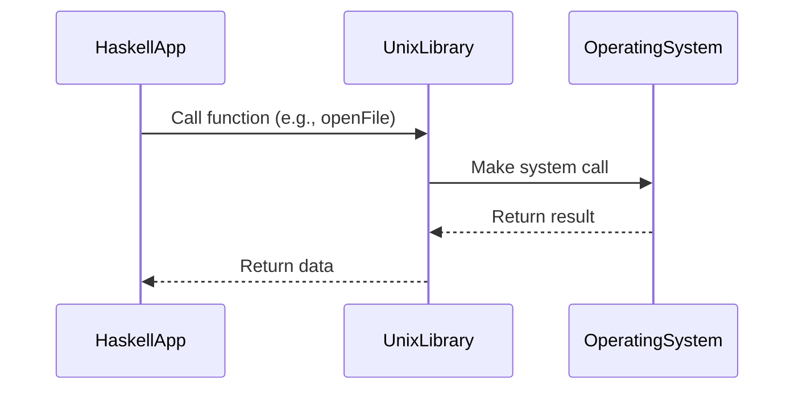

## 13.12 Interacting with Operating System APIs

Interacting with operating system (OS) APIs is a crucial aspect of software development, especially when building applications that require direct access to system resources or need to perform tasks such as file manipulation, process management, and network communication. In Haskell, a purely functional programming language, this interaction is facilitated through various libraries and packages that provide bindings to OS-level functionalities. This section will guide you through the process of accessing OS APIs using Haskell, focusing on key libraries like `unix` and `win32`, and demonstrate how to write a Haskell application that monitors system resources.

### Understanding System Libraries

System libraries in Haskell serve as the bridge between the high-level functional programming paradigm and the low-level imperative operations required to interact with the OS. These libraries provide the necessary abstractions and bindings to perform system-level tasks without compromising the functional nature of Haskell.

#### Key Libraries

1. **Unix Package**: This library provides access to POSIX-compliant operating systems, allowing you to perform operations such as file handling, process control, and inter-process communication.

2. **Win32 Package**: This library offers bindings to the Windows API, enabling you to interact with Windows-specific functionalities like GUI components, file systems, and registry access.

3. **System.IO**: Part of the standard library, this module provides basic input and output operations, including file handling and interaction with standard streams.

4. **Network**: This library facilitates network programming, allowing you to create and manage network connections, send and receive data, and handle network protocols.

### Implementing OS Interactions in Haskell

To effectively interact with OS APIs in Haskell, you need to understand how to use the aforementioned libraries to perform various system-level tasks. Let's explore some common scenarios and how to implement them in Haskell.

#### Accessing File Systems

Accessing and manipulating the file system is a fundamental requirement for many applications. Haskell provides several functions to perform file operations, such as reading, writing, and modifying files.

```haskell
import System.IO

-- Function to read a file and print its contents
readFileContents :: FilePath -> IO ()
readFileContents path = do
    handle <- openFile path ReadMode
    contents <- hGetContents handle
    putStrLn contents
    hClose handle

-- Function to write data to a file
writeToFile :: FilePath -> String -> IO ()
writeToFile path content = do
    handle <- openFile path WriteMode
    hPutStr handle content
    hClose handle
```

In the above example, `openFile` is used to open a file, `hGetContents` reads the file's contents, and `hPutStr` writes data to the file. The `IO` monad is used to handle side effects, ensuring that the functional purity of Haskell is maintained.

#### Process Management

Managing processes is another critical aspect of interacting with OS APIs. The `unix` package provides functions to create, manage, and terminate processes.

```haskell
import System.Posix.Process

-- Function to create a new process
createProcessExample :: IO ProcessID
createProcessExample = forkProcess $ do
    putStrLn "This is a child process"
    executeFile "/bin/ls" True [] Nothing

-- Function to terminate a process
terminateProcessExample :: ProcessID -> IO ()
terminateProcessExample pid = signalProcess sigTERM pid
```

In this example, `forkProcess` is used to create a new process, and `executeFile` runs a command within that process. `signalProcess` sends a termination signal to a process, demonstrating how to manage process lifecycles.

#### Network Communication

Network communication is essential for applications that require data exchange over the internet or local networks. The `network` library provides the necessary functions to create and manage network connections.

```haskell
import Network.Socket

-- Function to create a simple TCP server
createTCPServer :: IO ()
createTCPServer = withSocketsDo $ do
    addr <- resolve "3000"
    sock <- open addr
    putStrLn "Server is listening on port 3000"
    forever $ do
        (conn, _) <- accept sock
        handleConnection conn
  where
    resolve port = do
        let hints = defaultHints { addrFlags = [AI_PASSIVE], addrSocketType = Stream }
        addr:_ <- getAddrInfo (Just hints) Nothing (Just port)
        return addr

    open addr = socket (addrFamily addr) (addrSocketType addr) (addrProtocol addr) >>= \sock -> do
        bind sock (addrAddress addr)
        listen sock 10
        return sock

    handleConnection conn = do
        msg <- recv conn 1024
        putStrLn $ "Received message: " ++ msg
        send conn "Hello, client!"
        close conn
```

This code snippet demonstrates how to create a simple TCP server that listens on port 3000, accepts incoming connections, and sends a response back to the client.

### Writing a Haskell Application to Monitor System Resources

Let's put the concepts we've learned into practice by writing a Haskell application that monitors system resources such as CPU usage, memory usage, and disk space.

#### Monitoring CPU Usage

To monitor CPU usage, we can use the `unix` package to read system files that provide CPU statistics.

```haskell
import System.IO
import Control.Monad (forever)

-- Function to read CPU usage from /proc/stat
readCPUUsage :: IO ()
readCPUUsage = forever $ do
    handle <- openFile "/proc/stat" ReadMode
    contents <- hGetLine handle
    let cpuStats = words contents
    putStrLn $ "CPU Usage: " ++ show (calculateCPUUsage cpuStats)
    hClose handle

-- Function to calculate CPU usage
calculateCPUUsage :: [String] -> Double
calculateCPUUsage stats = let
    user = read (stats !! 1) :: Double
    nice = read (stats !! 2) :: Double
    system = read (stats !! 3) :: Double
    idle = read (stats !! 4) :: Double
    total = user + nice + system + idle
    in (user + nice + system) / total * 100
```

This example reads CPU statistics from `/proc/stat` and calculates the CPU usage percentage.

#### Monitoring Memory Usage

Similarly, we can monitor memory usage by reading from `/proc/meminfo`.

```haskell
-- Function to read memory usage from /proc/meminfo
readMemoryUsage :: IO ()
readMemoryUsage = forever $ do
    handle <- openFile "/proc/meminfo" ReadMode
    contents <- hGetContents handle
    let memInfo = lines contents
    putStrLn $ "Memory Usage: " ++ show (parseMemoryInfo memInfo)
    hClose handle

-- Function to parse memory information
parseMemoryInfo :: [String] -> (Double, Double)
parseMemoryInfo info = let
    totalMem = read (words (info !! 0) !! 1) :: Double
    freeMem = read (words (info !! 1) !! 1) :: Double
    in (totalMem, freeMem)
```

This code reads memory information and calculates the total and free memory available.

#### Monitoring Disk Space

To monitor disk space, we can use the `unix` package to execute system commands and parse their output.

```haskell
import System.Process

-- Function to check disk space using df command
checkDiskSpace :: IO ()
checkDiskSpace = do
    (_, Just hout, _, _) <- createProcess (proc "df" ["-h"]) { std_out = CreatePipe }
    contents <- hGetContents hout
    putStrLn "Disk Space Usage:"
    putStrLn contents
```

This example uses the `df` command to check disk space usage and prints the output.

### Visualizing Haskell's Interaction with Operating System APIs

To better understand how Haskell interacts with OS APIs, let's visualize the process using a sequence diagram.



**Diagram Description**: This sequence diagram illustrates the interaction between a Haskell application, the Unix library, and the operating system. The Haskell application calls a function provided by the Unix library, which in turn makes a system call to the operating system. The operating system processes the request and returns the result to the Unix library, which then passes the data back to the Haskell application.

### Design Considerations

When interacting with OS APIs in Haskell, there are several design considerations to keep in mind:

- **Error Handling**: OS interactions often involve dealing with errors such as file not found, permission denied, or network timeouts. Use Haskell's robust error handling mechanisms, such as `Maybe`, `Either`, and exceptions, to manage these errors gracefully.

- **Concurrency**: Many OS-level tasks, such as network communication and file I/O, can benefit from concurrency. Utilize Haskell's concurrency primitives, such as `forkIO` and `async`, to perform these tasks efficiently.

- **Performance**: Interacting with OS APIs can introduce performance bottlenecks. Profile your application to identify and optimize these bottlenecks.

- **Portability**: Consider the portability of your application across different operating systems. Use conditional compilation and abstraction layers to handle OS-specific functionality.

### Haskell Unique Features

Haskell's unique features, such as its strong type system, purity, and laziness, provide several advantages when interacting with OS APIs:

- **Type Safety**: Haskell's type system ensures that functions interacting with OS APIs are used correctly, reducing runtime errors.

- **Purity and Side Effects**: By encapsulating side effects in the `IO` monad, Haskell maintains purity and allows for easier reasoning about code.

- **Laziness**: Haskell's lazy evaluation can optimize performance by deferring computations until necessary, especially when dealing with large data streams from the OS.

### Differences and Similarities with Other Patterns

Interacting with OS APIs in Haskell shares similarities with other design patterns, such as:

- **Adapter Pattern**: Libraries like `unix` and `win32` act as adapters, providing a functional interface to imperative OS APIs.

- **Facade Pattern**: These libraries also serve as facades, simplifying complex OS interactions into easy-to-use functions.

However, unlike traditional object-oriented patterns, Haskell's approach emphasizes immutability, type safety, and functional purity.

### Try It Yourself

To deepen your understanding, try modifying the code examples provided:

- **Experiment with File Operations**: Modify the file reading and writing functions to handle different file formats or perform additional processing on the data.

- **Enhance Process Management**: Extend the process management example to create a simple task manager that lists running processes and allows you to terminate them.

- **Build a Network Application**: Use the network communication example to build a simple chat application that allows multiple clients to communicate with each other.

### Knowledge Check

- **What are the key libraries for interacting with OS APIs in Haskell?**
- **How does Haskell handle side effects when interacting with the OS?**
- **What are some design considerations when working with OS APIs in Haskell?**

### Embrace the Journey

Remember, mastering OS interactions in Haskell is just the beginning. As you progress, you'll build more complex and interactive applications. Keep experimenting, stay curious, and enjoy the journey!

## Quiz: Interacting with Operating System APIs



### What is the primary purpose of the `unix` package in Haskell?

- [x] To provide access to POSIX-compliant operating systems
- [ ] To offer bindings to the Windows API
- [ ] To facilitate network programming
- [ ] To handle JSON serialization

> **Explanation:** The `unix` package provides access to POSIX-compliant operating systems, allowing for file handling, process control, and inter-process communication.

### Which Haskell module is part of the standard library for basic input and output operations?

- [ ] Network
- [x] System.IO
- [ ] Win32
- [ ] Aeson

> **Explanation:** `System.IO` is part of the standard library and provides basic input and output operations, including file handling and interaction with standard streams.

### How does Haskell encapsulate side effects when interacting with the OS?

- [ ] Using the `State` monad
- [x] Using the `IO` monad
- [ ] Using the `Reader` monad
- [ ] Using the `Writer` monad

> **Explanation:** Haskell encapsulates side effects in the `IO` monad, maintaining purity and allowing for easier reasoning about code.

### What is a key design consideration when interacting with OS APIs in Haskell?

- [ ] Ignoring error handling
- [ ] Avoiding concurrency
- [x] Managing performance bottlenecks
- [ ] Using mutable state

> **Explanation:** Managing performance bottlenecks is a key design consideration when interacting with OS APIs, as these interactions can introduce performance issues.

### Which library would you use to interact with Windows-specific functionalities in Haskell?

- [ ] Unix
- [x] Win32
- [ ] Network
- [ ] System.IO

> **Explanation:** The `win32` package offers bindings to the Windows API, enabling interaction with Windows-specific functionalities.

### What is the role of the `IO` monad in Haskell?

- [ ] To provide concurrency primitives
- [x] To encapsulate side effects
- [ ] To handle JSON serialization
- [ ] To manage network connections

> **Explanation:** The `IO` monad encapsulates side effects, allowing Haskell to maintain purity while interacting with the outside world.

### How can you perform network communication in Haskell?

- [ ] Using the `System.IO` module
- [ ] Using the `unix` package
- [x] Using the `network` library
- [ ] Using the `win32` package

> **Explanation:** The `network` library provides functions to create and manage network connections, send and receive data, and handle network protocols.

### What is a common use case for the `forkProcess` function in Haskell?

- [ ] To handle file I/O
- [x] To create a new process
- [ ] To manage network connections
- [ ] To serialize data

> **Explanation:** `forkProcess` is used to create a new process, allowing for process management and execution of commands within that process.

### Which function is used to read a file's contents in Haskell?

- [ ] writeFile
- [x] hGetContents
- [ ] send
- [ ] recv

> **Explanation:** `hGetContents` is used to read a file's contents in Haskell, allowing for file manipulation and data processing.

### True or False: Haskell's lazy evaluation can optimize performance by deferring computations until necessary.

- [x] True
- [ ] False

> **Explanation:** Haskell's lazy evaluation defers computations until necessary, optimizing performance, especially when dealing with large data streams.


