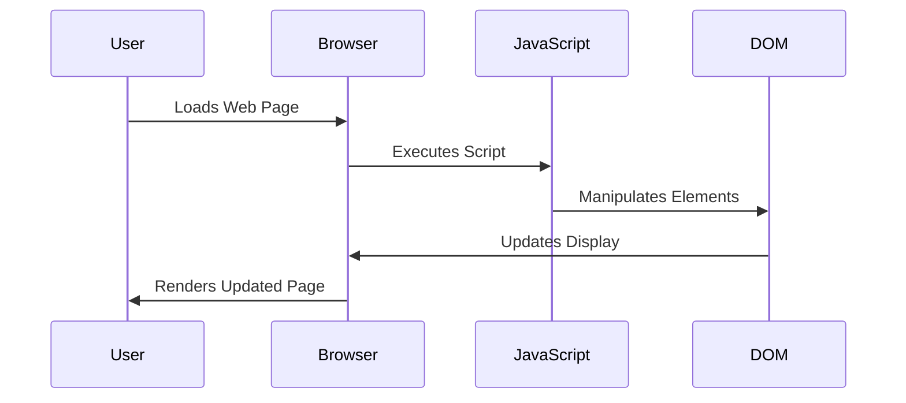

## 13.2 Interoperability with JavaScript using GHCJS

In the ever-evolving landscape of web development, the ability to leverage the strengths of multiple programming languages is invaluable. **GHCJS**, a Haskell to JavaScript compiler, offers a unique opportunity for developers to write client-side code in Haskell, a language renowned for its strong type system and functional programming paradigm. This section delves into the intricacies of using GHCJS to interface with JavaScript libraries and APIs, enabling the development of browser-based applications entirely in Haskell.

### Understanding GHCJS

**GHCJS** is a compiler that translates Haskell code into JavaScript, allowing Haskell programs to run in web browsers. This capability opens up a plethora of possibilities for Haskell developers, enabling them to utilize Haskell's powerful features on the client side.

#### Key Features of GHCJS

- **Seamless Integration**: GHCJS allows for seamless integration with existing JavaScript libraries and APIs, making it possible to leverage the vast ecosystem of JavaScript tools.
- **Type Safety**: By using Haskell, developers can ensure type safety and reduce runtime errors, which are common in JavaScript.
- **Functional Paradigm**: Haskell's functional programming paradigm can lead to more concise and maintainable code compared to traditional JavaScript.

### Setting Up GHCJS

Before diving into development, it's essential to set up your environment for GHCJS. Follow these steps to get started:

1. **Install GHCJS**: You can install GHCJS using the Haskell tool Stack. Run the following command in your terminal:

   ```bash
   stack setup
   stack install ghcjs
   ```

2. **Create a New Project**: Use Stack to create a new Haskell project:

   ```bash
   stack new my-ghcjs-project
   cd my-ghcjs-project
   ```

3. **Configure the Project**: Modify your `stack.yaml` file to use GHCJS as the compiler:

   ```yaml
   compiler: ghcjs-8.6.0.1
   ```

4. **Build the Project**: Build your project using GHCJS:

   ```bash
   stack build
   ```

### Writing Client-Side Code in Haskell

With GHCJS set up, you can start writing client-side code in Haskell. Let's explore how to create a simple web application using GHCJS.

#### Example: A Simple Web Application

We'll create a basic web application that displays a message on a webpage.

```haskell
{-# LANGUAGE OverloadedStrings #-}

import GHCJS.DOM
import GHCJS.DOM.Document
import GHCJS.DOM.Element
import GHCJS.DOM.Node

main :: IO ()
main = do
  Just doc <- currentDocument
  Just body <- getBody doc
  newElement <- createElement doc ("p" :: String)
  setInnerHTML newElement ("Hello, Haskell!" :: String)
  appendChild_ body newElement
```

**Explanation**:

- **DOM Manipulation**: We use the GHCJS DOM library to manipulate the Document Object Model (DOM). This library provides Haskell bindings to the DOM API, allowing us to create and modify HTML elements.
- **Creating Elements**: We create a new paragraph element and set its inner HTML to "Hello, Haskell!".
- **Appending Elements**: Finally, we append the new element to the body of the document.

### Interfacing with JavaScript Libraries

One of the significant advantages of using GHCJS is the ability to interface with existing JavaScript libraries. Let's explore how to achieve this.

#### Example: Using a JavaScript Library

Suppose we want to use the popular JavaScript library **jQuery** to manipulate the DOM. We can achieve this by creating Haskell bindings to the jQuery functions.

```haskell
{-# LANGUAGE ForeignFunctionInterface #-}

import GHCJS.Types
import GHCJS.Foreign.Callback
import GHCJS.Marshal
import GHCJS.DOM.Element

foreign import javascript unsafe "$1($2).text($3);"
  js_setText :: JSVal -> JSString -> JSString -> IO ()

setText :: Element -> String -> IO ()
setText element text = do
  jsVal <- toJSVal element
  js_setText jsVal ("p" :: JSString) (toJSString text)
```

**Explanation**:

- **Foreign Function Interface (FFI)**: We use Haskell's FFI to call JavaScript functions directly from Haskell code. The `foreign import javascript` syntax allows us to define a Haskell function that corresponds to a JavaScript function.
- **Interacting with the DOM**: We use the `js_setText` function to set the text of a paragraph element using jQuery.

### Visualizing JavaScript's Interaction with Web Browsers and Web Pages

To better understand how JavaScript interacts with web browsers and web pages, let's visualize the process using a Mermaid.js diagram.



**Diagram Explanation**:

- **User Interaction**: The user loads a web page in their browser.
- **Script Execution**: The browser executes the JavaScript code embedded in the page.
- **DOM Manipulation**: JavaScript interacts with the DOM to manipulate elements.
- **Display Update**: The DOM updates the display, and the browser renders the updated page to the user.

### Advanced Interoperability Techniques

As you become more comfortable with GHCJS, you can explore advanced techniques for interoperability with JavaScript.

#### Callback Functions

GHCJS allows you to define Haskell functions as JavaScript callbacks, enabling seamless integration with JavaScript event-driven programming.

```haskell
import GHCJS.Foreign.Callback
import GHCJS.Marshal

foreign import javascript unsafe "$1.onclick = $2;"
  js_setOnClick :: JSVal -> Callback (IO ()) -> IO ()

setOnClick :: Element -> IO () -> IO ()
setOnClick element action = do
  callback <- asyncCallback action
  jsVal <- toJSVal element
  js_setOnClick jsVal callback
```

**Explanation**:

- **Async Callbacks**: We use `asyncCallback` to create a JavaScript callback from a Haskell function. This allows us to handle events such as clicks in a Haskell-friendly way.

#### Handling JavaScript Promises

JavaScript promises are a common pattern for handling asynchronous operations. GHCJS provides tools to work with promises in Haskell.

```haskell
import GHCJS.Promise

foreign import javascript unsafe "fetch($1)"
  js_fetch :: JSString -> IO (Promise JSVal)

fetchData :: String -> IO (Promise JSVal)
fetchData url = js_fetch (toJSString url)
```

**Explanation**:

- **Promises in Haskell**: We use the `Promise` type to represent JavaScript promises in Haskell. The `js_fetch` function demonstrates how to call a JavaScript function that returns a promise.

### Best Practices for Using GHCJS

When working with GHCJS, it's essential to follow best practices to ensure efficient and maintainable code.

- **Leverage Haskell's Type System**: Use Haskell's strong type system to catch errors at compile time and ensure code correctness.
- **Optimize for Performance**: Be mindful of the performance implications of translating Haskell code to JavaScript, especially in performance-critical applications.
- **Integrate with JavaScript Ecosystem**: Take advantage of the vast ecosystem of JavaScript libraries and tools to enhance your applications.

### Try It Yourself

Now that we've covered the basics of using GHCJS, it's time to experiment with the code examples. Try modifying the examples to:

- Change the message displayed in the web application.
- Use a different JavaScript library for DOM manipulation.
- Implement a new feature using JavaScript callbacks.

### References and Further Reading

- [GHCJS GitHub Repository](https://github.com/ghcjs/ghcjs)
- [MDN Web Docs: JavaScript](https://developer.mozilla.org/en-US/docs/Web/JavaScript)
- [Haskell Foreign Function Interface](https://www.haskell.org/onlinereport/haskell2010/haskellch8.html)

### Knowledge Check

- What is GHCJS, and how does it enable Haskell code to run in web browsers?
- How can you use Haskell's FFI to call JavaScript functions?
- What are some best practices for using GHCJS in web development?

### Embrace the Journey

Remember, this is just the beginning. As you progress, you'll build more complex and interactive web pages. Keep experimenting, stay curious, and enjoy the journey!

## Quiz: Interoperability with JavaScript using GHCJS



### What is GHCJS?

- [x] A Haskell to JavaScript compiler
- [ ] A JavaScript to Haskell compiler
- [ ] A JavaScript library for DOM manipulation
- [ ] A Haskell library for server-side programming

> **Explanation:** GHCJS is a compiler that translates Haskell code into JavaScript, allowing Haskell programs to run in web browsers.

### How can you install GHCJS using Stack?

- [x] `stack setup` and `stack install ghcjs`
- [ ] `npm install ghcjs`
- [ ] `cabal install ghcjs`
- [ ] `brew install ghcjs`

> **Explanation:** GHCJS can be installed using Stack by running `stack setup` followed by `stack install ghcjs`.

### What is the purpose of the Foreign Function Interface (FFI) in Haskell?

- [x] To call JavaScript functions from Haskell code
- [ ] To compile Haskell code to JavaScript
- [ ] To manage Haskell package dependencies
- [ ] To optimize Haskell code for performance

> **Explanation:** The FFI in Haskell allows developers to call functions written in other languages, such as JavaScript, from Haskell code.

### Which library provides Haskell bindings to the DOM API?

- [x] GHCJS.DOM
- [ ] React
- [ ] Angular
- [ ] jQuery

> **Explanation:** The GHCJS.DOM library provides Haskell bindings to the DOM API, enabling DOM manipulation in Haskell.

### How can you create a JavaScript callback from a Haskell function?

- [x] Using `asyncCallback`
- [ ] Using `toJSVal`
- [ ] Using `createElement`
- [ ] Using `setInnerHTML`

> **Explanation:** The `asyncCallback` function is used to create a JavaScript callback from a Haskell function, allowing Haskell functions to be used as event handlers in JavaScript.

### What type represents JavaScript promises in Haskell?

- [x] `Promise`
- [ ] `Future`
- [ ] `Async`
- [ ] `Task`

> **Explanation:** The `Promise` type in Haskell represents JavaScript promises, allowing Haskell code to work with asynchronous operations in JavaScript.

### What is a key advantage of using Haskell for client-side code?

- [x] Type safety and reduced runtime errors
- [ ] Easier integration with server-side code
- [ ] Faster execution than JavaScript
- [ ] Simpler syntax than JavaScript

> **Explanation:** Haskell's strong type system provides type safety, reducing runtime errors, which is a significant advantage when writing client-side code.

### How can you append a new element to the body of a document in Haskell?

- [x] Using `appendChild_`
- [ ] Using `setInnerHTML`
- [ ] Using `createElement`
- [ ] Using `toJSVal`

> **Explanation:** The `appendChild_` function is used to append a new element to the body of a document in Haskell.

### What is the role of `toJSVal` in GHCJS?

- [x] To convert Haskell values to JavaScript values
- [ ] To create new DOM elements
- [ ] To set the inner HTML of an element
- [ ] To handle asynchronous operations

> **Explanation:** The `toJSVal` function is used to convert Haskell values to JavaScript values, enabling interoperability between Haskell and JavaScript.

### True or False: GHCJS allows Haskell programs to run on the server side.

- [ ] True
- [x] False

> **Explanation:** GHCJS is specifically designed to compile Haskell code to JavaScript for client-side execution in web browsers.


