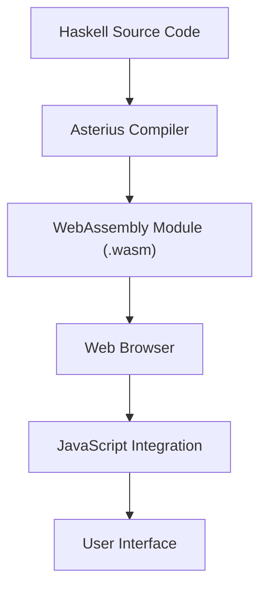

## 13.3 Working with WebAssembly (WASM) and Asterius

In the ever-evolving landscape of web development, the need for high-performance applications has led to the emergence of **WebAssembly (WASM)**, a binary instruction format that allows code to run in web browsers at near-native speeds. **Asterius** is a groundbreaking tool that enables Haskell developers to compile their code to WebAssembly, opening up new possibilities for Haskell in the browser. This section delves into the intricacies of using WebAssembly and Asterius to bring Haskell applications to the web, providing expert insights and practical examples.

### Understanding WebAssembly (WASM)

**WebAssembly (WASM)** is a low-level assembly-like language with a compact binary format that runs with near-native performance. It is designed as a portable compilation target for high-level languages like C, C++, and Rust, enabling deployment on the web for client and server applications.

#### Key Features of WebAssembly

- **Portability**: WASM is designed to be a portable target for compilation, allowing code to run on any platform that supports a web browser.
- **Performance**: WASM executes at near-native speed by taking advantage of common hardware capabilities available on a wide range of platforms.
- **Security**: WASM runs in a safe, sandboxed execution environment, providing a secure way to execute code from untrusted sources.
- **Interoperability**: WASM can interact with JavaScript and other web technologies, making it a versatile tool for web development.

### Introducing Asterius

**Asterius** is a Haskell-to-WebAssembly compiler that allows Haskell code to be executed in the browser. It leverages the power of WebAssembly to bring Haskell's strong typing and functional programming paradigms to web applications.

#### Why Use Asterius?

- **Performance**: Asterius compiles Haskell code to WebAssembly, enabling high-performance execution in the browser.
- **Integration**: It allows seamless integration of Haskell with existing JavaScript codebases, enhancing the capabilities of web applications.
- **Portability**: With Asterius, Haskell applications can be deployed across different platforms without modification.

### Implementing Haskell with WebAssembly and Asterius

To harness the power of WebAssembly and Asterius, follow these steps to compile and run Haskell code in the browser:

#### Setting Up the Environment

1. **Install Asterius**: Begin by installing Asterius from its [GitHub repository](https://github.com/tweag/asterius). Follow the installation instructions to set up the compiler on your system.

2. **Prepare Your Haskell Code**: Write or adapt your Haskell code to be compatible with Asterius. Ensure that your code does not rely on unsupported libraries or features.

3. **Compile to WebAssembly**: Use Asterius to compile your Haskell code to WebAssembly. This process generates a `.wasm` file that can be executed in the browser.

```bash
ahc-cabal build
```

#### Running Haskell Code in the Browser

Once you have compiled your Haskell code to WebAssembly, you can run it in the browser. Here is a simple example of how to integrate the generated `.wasm` file with an HTML page:

```html
<!DOCTYPE html>
<html lang="en">
<head>
    <meta charset="UTF-8">
    <title>Haskell WebAssembly Example</title>
    <script>
        async function loadWasm() {
            const response = await fetch('your-haskell-module.wasm');
            const bytes = await response.arrayBuffer();
            const { instance } = await WebAssembly.instantiate(bytes);
            console.log(instance.exports.yourFunction());
        }
        window.onload = loadWasm;
    </script>
</head>
<body>
    <h1>Haskell WebAssembly Example</h1>
    <p>Check the console for output from Haskell code.</p>
</body>
</html>
```

### Visualizing the Interaction between Haskell, WebAssembly, and the Browser

To better understand how Haskell code interacts with WebAssembly and the browser, consider the following diagram:



**Diagram Description**: This diagram illustrates the flow from Haskell source code through the Asterius compiler to a WebAssembly module, which is then executed in the web browser and integrated with JavaScript to form the user interface.

### Key Considerations and Best Practices

- **Code Optimization**: Ensure your Haskell code is optimized for performance before compiling to WebAssembly. This includes minimizing dependencies and using efficient algorithms.
- **Debugging**: Debugging WebAssembly can be challenging. Use browser developer tools to inspect and debug the WebAssembly module.
- **Interoperability**: Leverage JavaScript interoperability to enhance the functionality of your Haskell WebAssembly modules.

### Haskell Unique Features in WebAssembly

Haskell's unique features, such as strong static typing, lazy evaluation, and pure functions, can be effectively utilized in WebAssembly to create robust and maintainable web applications. Asterius preserves these features, allowing developers to write high-level, expressive code that compiles to efficient WebAssembly modules.

### Differences and Similarities with Other Languages

While languages like C++ and Rust are commonly used with WebAssembly, Haskell offers distinct advantages in terms of expressiveness and type safety. Unlike imperative languages, Haskell's functional paradigm encourages a different approach to problem-solving, which can lead to more concise and reliable code.

### Try It Yourself

Experiment with the example provided by modifying the Haskell code and observing the changes in the browser output. Consider adding new functions or integrating with JavaScript to enhance the application's capabilities.

### Knowledge Check

- **Question**: What are the key benefits of using WebAssembly for web applications?
- **Exercise**: Compile a simple Haskell function to WebAssembly using Asterius and run it in the browser.

### Summary

WebAssembly and Asterius provide a powerful combination for running Haskell code in the browser with high performance. By leveraging these technologies, developers can create sophisticated web applications that benefit from Haskell's functional programming paradigms. Remember, this is just the beginning. As you progress, you'll build more complex and interactive web applications. Keep experimenting, stay curious, and enjoy the journey!

## Quiz: Working with WebAssembly (WASM) and Asterius



### What is WebAssembly (WASM)?

- [x] A binary instruction format for executable programs in browsers.
- [ ] A high-level programming language for web development.
- [ ] A JavaScript framework for building web applications.
- [ ] A database management system.

> **Explanation:** WebAssembly (WASM) is a binary instruction format designed to run code in web browsers at near-native speeds.

### What is Asterius?

- [x] A compiler that compiles Haskell to WebAssembly.
- [ ] A JavaScript library for Haskell integration.
- [ ] A web server framework for Haskell.
- [ ] A Haskell package manager.

> **Explanation:** Asterius is a compiler that allows Haskell code to be compiled into WebAssembly, enabling it to run in web browsers.

### What is a key feature of WebAssembly?

- [x] Portability across different platforms.
- [ ] Built-in support for databases.
- [ ] Native support for HTML rendering.
- [ ] Integrated development environment.

> **Explanation:** WebAssembly is designed to be a portable compilation target, allowing code to run on any platform that supports a web browser.

### How does Asterius enhance Haskell's capabilities?

- [x] By allowing Haskell code to run in web browsers.
- [ ] By providing a graphical user interface for Haskell applications.
- [ ] By integrating Haskell with cloud services.
- [ ] By offering a new syntax for Haskell programming.

> **Explanation:** Asterius compiles Haskell code to WebAssembly, enabling it to execute in web browsers, thus enhancing its capabilities for web applications.

### What is a benefit of using Haskell with WebAssembly?

- [x] Strong static typing and functional programming paradigms.
- [ ] Automatic HTML generation.
- [ ] Built-in CSS styling.
- [ ] Direct database access.

> **Explanation:** Haskell's strong static typing and functional programming paradigms are preserved in WebAssembly, offering robustness and maintainability.

### What is a challenge when working with WebAssembly?

- [x] Debugging the WebAssembly module.
- [ ] Writing HTML code.
- [ ] Creating CSS styles.
- [ ] Managing server-side logic.

> **Explanation:** Debugging WebAssembly can be challenging, but browser developer tools can be used to inspect and debug the modules.

### What is the role of JavaScript in WebAssembly integration?

- [x] To enhance the functionality of WebAssembly modules.
- [ ] To compile WebAssembly code.
- [ ] To replace WebAssembly in web applications.
- [ ] To manage server-side operations.

> **Explanation:** JavaScript is used to enhance the functionality of WebAssembly modules by providing interoperability and integration with web technologies.

### What is a unique feature of Haskell that benefits WebAssembly applications?

- [x] Lazy evaluation.
- [ ] Dynamic typing.
- [ ] Built-in HTML rendering.
- [ ] Automatic CSS generation.

> **Explanation:** Haskell's lazy evaluation is a unique feature that can be effectively utilized in WebAssembly to create efficient applications.

### What should you consider when optimizing Haskell code for WebAssembly?

- [x] Minimizing dependencies and using efficient algorithms.
- [ ] Adding more libraries for functionality.
- [ ] Increasing the code size for better performance.
- [ ] Using dynamic typing for flexibility.

> **Explanation:** To optimize Haskell code for WebAssembly, it's important to minimize dependencies and use efficient algorithms to ensure high performance.

### True or False: Asterius allows Haskell code to be executed on the server side only.

- [ ] True
- [x] False

> **Explanation:** False. Asterius allows Haskell code to be compiled to WebAssembly, enabling it to run in web browsers, not just on the server side.


