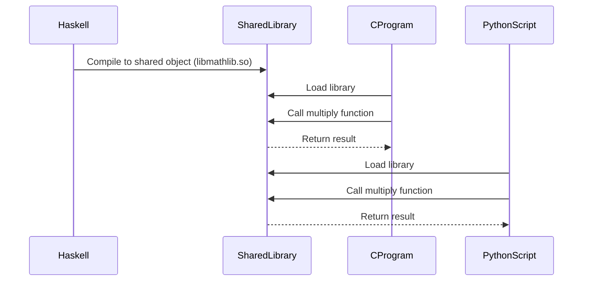

## 13.4 Calling Haskell from Other Languages

In the world of software development, interoperability is key to leveraging the strengths of different programming languages. Haskell, known for its strong type system and functional programming paradigm, can be integrated with other languages to create powerful, efficient, and maintainable systems. In this section, we will explore how to call Haskell functions from other languages such as C and Python, using Foreign Function Interface (FFI), shared libraries, and bindings.

### Interfacing from Other Languages

Interfacing Haskell with other languages involves exposing Haskell functions so that they can be called from languages like C, Python, and others. This process is crucial for integrating Haskell into existing systems or leveraging Haskell's capabilities in a multi-language environment.

#### Exposing Haskell Functions

To expose Haskell functions to other languages, we need to:

1. **Define the Haskell Functions**: Write the functions in Haskell that you want to expose.
2. **Use FFI to Export Functions**: Utilize Haskell's Foreign Function Interface to make these functions available to other languages.
3. **Create Bindings**: Develop bindings in the target language to call the exported Haskell functions.

### Implementation

The implementation of calling Haskell from other languages involves several steps, including using FFI exports and creating bindings.

#### Using FFI Exports

Haskell's Foreign Function Interface (FFI) allows Haskell code to call, and be called by, foreign languages. Here's how you can use FFI to export Haskell functions:

1. **Define Foreign Export**: Use the `foreign export` keyword to specify which Haskell functions should be accessible from other languages.

   ```haskell
   {-# LANGUAGE ForeignFunctionInterface #-}

   module MyModule where

   import Foreign.C.Types

   -- A simple Haskell function to add two integers
   add :: CInt -> CInt -> CInt
   add x y = x + y

   -- Export the function to be accessible from C
   foreign export ccall add :: CInt -> CInt -> CInt
   ```

2. **Compile the Haskell Code**: Compile the Haskell code into a shared library or dynamic link library (DLL) that can be linked with other languages.

   ```bash
   ghc -shared -o libmymodule.so MyModule.hs
   ```

3. **Create Bindings in the Target Language**: Write code in the target language to load the shared library and call the exported functions.

#### Creating Bindings

Bindings are necessary to call the exported Haskell functions from the target language. Let's see how to create bindings in C and Python.

##### C Bindings

To call the exported Haskell function from C, you need to:

1. **Include the Necessary Headers**: Use the appropriate headers to load the shared library.

   ```c
   #include <stdio.h>
   #include <dlfcn.h>

   typedef int (*add_func)(int, int);

   int main() {
       void *handle = dlopen("./libmymodule.so", RTLD_LAZY);
       if (!handle) {
           fprintf(stderr, "Error loading library: %s\n", dlerror());
           return 1;
       }

       add_func add = (add_func) dlsym(handle, "add");
       if (!add) {
           fprintf(stderr, "Error loading function: %s\n", dlerror());
           return 1;
       }

       int result = add(3, 4);
       printf("Result of add(3, 4): %d\n", result);

       dlclose(handle);
       return 0;
   }
   ```

2. **Compile and Run the C Code**: Compile the C code and link it with the shared library.

   ```bash
   gcc -o myprogram myprogram.c -ldl
   ./myprogram
   ```

##### Python Bindings

To call the exported Haskell function from Python, you can use the `ctypes` library:

1. **Load the Shared Library**: Use `ctypes` to load the shared library.

   ```python
   import ctypes

   # Load the shared library
   lib = ctypes.CDLL('./libmymodule.so')

   # Define the argument and return types of the function
   lib.add.argtypes = [ctypes.c_int, ctypes.c_int]
   lib.add.restype = ctypes.c_int

   # Call the function
   result = lib.add(3, 4)
   print(f"Result of add(3, 4): {result}")
   ```

2. **Run the Python Code**: Execute the Python script to see the result.

   ```bash
   python myscript.py
   ```

### Example: Providing a Haskell Library as a Shared Object or DLL

Let's walk through a complete example of providing a Haskell library as a shared object or DLL.

#### Step 1: Write Haskell Code

Create a Haskell module with the functions you want to expose.

```haskell
{-# LANGUAGE ForeignFunctionInterface #-}

module MathLib where

import Foreign.C.Types

-- A function to multiply two integers
multiply :: CInt -> CInt -> CInt
multiply x y = x * y

-- Export the function
foreign export ccall multiply :: CInt -> CInt -> CInt
```

#### Step 2: Compile the Haskell Code

Compile the Haskell code into a shared library.

```bash
ghc -shared -o libmathlib.so MathLib.hs
```

#### Step 3: Create C Bindings

Write a C program to use the shared library.

```c
#include <stdio.h>
#include <dlfcn.h>

typedef int (*multiply_func)(int, int);

int main() {
    void *handle = dlopen("./libmathlib.so", RTLD_LAZY);
    if (!handle) {
        fprintf(stderr, "Error loading library: %s\n", dlerror());
        return 1;
    }

    multiply_func multiply = (multiply_func) dlsym(handle, "multiply");
    if (!multiply) {
        fprintf(stderr, "Error loading function: %s\n", dlerror());
        return 1;
    }

    int result = multiply(6, 7);
    printf("Result of multiply(6, 7): %d\n", result);

    dlclose(handle);
    return 0;
}
```

Compile and run the C program.

```bash
gcc -o myprogram myprogram.c -ldl
./myprogram
```

#### Step 4: Create Python Bindings

Write a Python script to use the shared library.

```python
import ctypes

# Load the shared library
lib = ctypes.CDLL('./libmathlib.so')

# Define the argument and return types of the function
lib.multiply.argtypes = [ctypes.c_int, ctypes.c_int]
lib.multiply.restype = ctypes.c_int

# Call the function
result = lib.multiply(6, 7)
print(f"Result of multiply(6, 7): {result}")
```

Run the Python script.

```bash
python myscript.py
```

### Visualizing the Process

To better understand the process of calling Haskell from other languages, let's visualize the workflow using a sequence diagram.



### Design Considerations

When calling Haskell from other languages, consider the following:

- **Performance**: Ensure that the overhead of calling Haskell functions from other languages is acceptable for your use case.
- **Type Safety**: Be cautious with type conversions between Haskell and the target language to avoid runtime errors.
- **Error Handling**: Implement robust error handling to manage potential issues when interfacing between languages.

### Haskell Unique Features

Haskell's strong type system and lazy evaluation can be leveraged when integrating with other languages. However, be mindful of the differences in memory management and execution models between Haskell and imperative languages.

### Differences and Similarities

While Haskell's FFI is similar to other languages' FFIs, Haskell's type system and purity introduce unique challenges and opportunities. Unlike languages with mutable state, Haskell's immutability requires careful consideration when interfacing with stateful systems.

### Try It Yourself

Experiment with the provided examples by modifying the Haskell functions and observing the changes in the C and Python programs. Try adding more complex functions or integrating with other languages like Java or Ruby.

### Knowledge Check

- What are the key steps to expose Haskell functions to other languages?
- How does Haskell's FFI facilitate interoperability?
- What are some potential challenges when calling Haskell from other languages?

### Embrace the Journey

Remember, this is just the beginning. As you progress, you'll discover more ways to integrate Haskell with other languages, enhancing your systems' capabilities. Keep experimenting, stay curious, and enjoy the journey!

## Quiz: Calling Haskell from Other Languages



### What is the primary purpose of Haskell's Foreign Function Interface (FFI)?

- [x] To allow Haskell code to call, and be called by, foreign languages.
- [ ] To compile Haskell code into machine code.
- [ ] To optimize Haskell code for performance.
- [ ] To provide a graphical user interface for Haskell applications.

> **Explanation:** Haskell's FFI is designed to enable interoperability between Haskell and other programming languages, allowing Haskell code to call and be called by foreign languages.

### Which keyword is used in Haskell to export functions for use in other languages?

- [x] `foreign export`
- [ ] `module export`
- [ ] `function export`
- [ ] `external export`

> **Explanation:** The `foreign export` keyword is used in Haskell to specify which functions should be accessible from other languages.

### What is the role of a shared library in calling Haskell from other languages?

- [x] It contains compiled Haskell code that can be linked with other languages.
- [ ] It provides a user interface for Haskell applications.
- [ ] It optimizes Haskell code for better performance.
- [ ] It translates Haskell code into other programming languages.

> **Explanation:** A shared library contains compiled Haskell code that can be linked with other languages, allowing them to call Haskell functions.

### Which Python library is commonly used to load shared libraries and call functions from them?

- [x] `ctypes`
- [ ] `numpy`
- [ ] `pandas`
- [ ] `matplotlib`

> **Explanation:** The `ctypes` library in Python is used to load shared libraries and call functions from them, facilitating interoperability with languages like Haskell.

### What is a potential challenge when calling Haskell from other languages?

- [x] Type conversions between Haskell and the target language.
- [ ] Lack of available Haskell libraries.
- [ ] Difficulty in writing Haskell code.
- [ ] Inability to compile Haskell code.

> **Explanation:** Type conversions between Haskell and the target language can be challenging due to differences in type systems and memory management.

### How can you ensure type safety when calling Haskell functions from other languages?

- [x] By carefully managing type conversions and using appropriate data types.
- [ ] By avoiding the use of complex data types.
- [ ] By using only primitive data types.
- [ ] By not using any type conversions.

> **Explanation:** Ensuring type safety involves carefully managing type conversions and using appropriate data types to avoid runtime errors.

### What is the purpose of creating bindings in the target language?

- [x] To load the shared library and call the exported Haskell functions.
- [ ] To compile the Haskell code into the target language.
- [ ] To optimize the Haskell code for performance.
- [ ] To provide a graphical user interface for the Haskell functions.

> **Explanation:** Creating bindings in the target language allows you to load the shared library and call the exported Haskell functions.

### What is a shared object file in the context of calling Haskell from other languages?

- [x] A compiled Haskell library that can be linked with other languages.
- [ ] A source code file containing Haskell functions.
- [ ] A configuration file for Haskell applications.
- [ ] A documentation file for Haskell libraries.

> **Explanation:** A shared object file is a compiled Haskell library that can be linked with other languages, enabling them to call Haskell functions.

### True or False: Haskell's FFI can only be used with C.

- [ ] True
- [x] False

> **Explanation:** Haskell's FFI can be used with various languages, not just C, by creating appropriate bindings and using shared libraries.

### What is the benefit of using Haskell's strong type system when integrating with other languages?

- [x] It helps ensure type safety and reduces runtime errors.
- [ ] It simplifies the process of writing Haskell code.
- [ ] It makes Haskell code run faster.
- [ ] It provides a graphical user interface for Haskell applications.

> **Explanation:** Haskell's strong type system helps ensure type safety and reduces runtime errors, which is beneficial when integrating with other languages.


