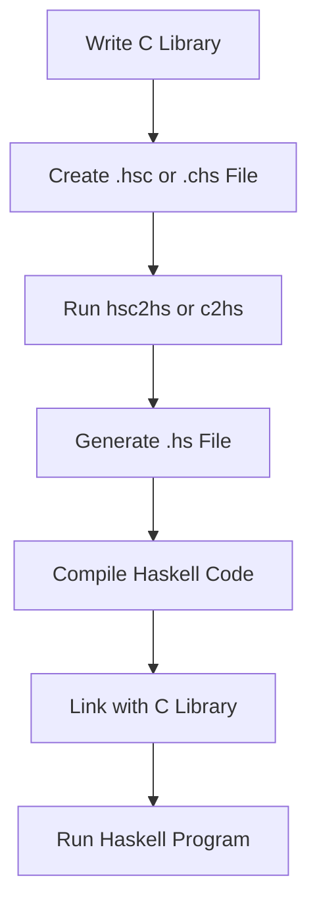

## 13.5 Using Non-Haskell Libraries in Haskell

In the world of software development, leveraging existing libraries and tools is crucial for building efficient and robust applications. Haskell, with its strong type system and functional programming paradigm, offers a unique approach to integrating non-Haskell libraries. This section will guide you through the process of using non-Haskell libraries in Haskell, focusing on writing bindings, utilizing tools like `hsc2hs` and `c2hs`, and providing practical examples.

### Binding Libraries

**Binding Libraries** refers to the process of creating a bridge between Haskell and foreign libraries, allowing Haskell programs to call functions and use data structures defined in other languages, such as C. This is achieved through the Foreign Function Interface (FFI), which provides a standardized way to interact with non-Haskell code.

#### Writing Haskell Bindings for Foreign Libraries

To write Haskell bindings for foreign libraries, follow these steps:

1. **Identify the Functions and Data Structures**: Determine which functions and data structures from the foreign library you need to use in your Haskell code.

2. **Define Foreign Imports**: Use Haskell's FFI to declare foreign imports. This involves specifying the foreign function's name, its type signature in Haskell, and any necessary calling conventions.

3. **Handle Data Conversion**: Convert data between Haskell and the foreign language. This often involves using Haskell's `Foreign` module to manage pointers and memory.

4. **Test the Bindings**: Ensure that the bindings work correctly by writing tests that call the foreign functions and verify their behavior.

#### Example: Integrating a Popular C Library

Let's integrate a simple C library that provides basic mathematical operations. We'll create Haskell bindings to call these functions.

**C Library Code (mathlib.c):**

```c
#include <math.h>

double add(double a, double b) {
    return a + b;
}

double subtract(double a, double b) {
    return a - b;
}

double multiply(double a, double b) {
    return a * b;
}

double divide(double a, double b) {
    if (b == 0) {
        return 0; // Handle division by zero
    }
    return a / b;
}
```

**Haskell Binding Code (MathLib.hs):**

```haskell
{-# LANGUAGE ForeignFunctionInterface #-}

module MathLib where

import Foreign.C.Types

-- Foreign function imports
foreign import ccall "mathlib.h add"
    c_add :: CDouble -> CDouble -> CDouble

foreign import ccall "mathlib.h subtract"
    c_subtract :: CDouble -> CDouble -> CDouble

foreign import ccall "mathlib.h multiply"
    c_multiply :: CDouble -> CDouble -> CDouble

foreign import ccall "mathlib.h divide"
    c_divide :: CDouble -> CDouble -> CDouble

-- Haskell wrappers
add :: Double -> Double -> Double
add a b = realToFrac (c_add (realToFrac a) (realToFrac b))

subtract :: Double -> Double -> Double
subtract a b = realToFrac (c_subtract (realToFrac a) (realToFrac b))

multiply :: Double -> Double -> Double
multiply a b = realToFrac (c_multiply (realToFrac a) (realToFrac b))

divide :: Double -> Double -> Double
divide a b = realToFrac (c_divide (realToFrac a) (realToFrac b))
```

**Explanation:**

- **Foreign Imports**: We use the `foreign import ccall` syntax to declare the C functions we want to use in Haskell.
- **Data Conversion**: The `realToFrac` function is used to convert between Haskell's `Double` and C's `CDouble`.
- **Haskell Wrappers**: We define Haskell functions (`add`, `subtract`, `multiply`, `divide`) that wrap the foreign functions, providing a more idiomatic Haskell interface.

### Tools for Automating Binding Generation

Writing bindings manually can be tedious and error-prone. Fortunately, Haskell provides tools like `hsc2hs` and `c2hs` to automate this process.

#### hsc2hs

`hsc2hs` is a tool that simplifies the process of writing Haskell bindings to C libraries. It allows you to include C code directly in your Haskell source files and automatically generates the necessary FFI declarations.

**Example Usage of hsc2hs:**

1. **Create a .hsc File**: Write a Haskell source file with a `.hsc` extension. This file can include C code and special directives for `hsc2hs`.

**Example (MathLib.hsc):**

```haskell
{-# LANGUAGE ForeignFunctionInterface #-}

module MathLib where

#include <math.h>

foreign import ccall "add"
    c_add :: CDouble -> CDouble -> CDouble

foreign import ccall "subtract"
    c_subtract :: CDouble -> CDouble -> CDouble

foreign import ccall "multiply"
    c_multiply :: CDouble -> CDouble -> CDouble

foreign import ccall "divide"
    c_divide :: CDouble -> CDouble -> CDouble
```

2. **Run hsc2hs**: Use the `hsc2hs` command to process the `.hsc` file and generate a `.hs` file with the necessary FFI declarations.

```bash
hsc2hs MathLib.hsc
```

3. **Compile and Link**: Compile the generated Haskell code and link it with the C library.

```bash
ghc -o myprogram MathLib.hs mathlib.c
```

#### c2hs

`c2hs` is another tool that automates the generation of Haskell bindings to C libraries. It provides more advanced features than `hsc2hs`, such as automatic type conversion and support for C structs.

**Example Usage of c2hs:**

1. **Create a .chs File**: Write a Haskell source file with a `.chs` extension. This file can include C code and special directives for `c2hs`.

**Example (MathLib.chs):**

```haskell
module MathLib where

{#include <math.h>#}

{#fun add as ^ { `CDouble', `CDouble' } -> `CDouble' #}
{#fun subtract as ^ { `CDouble', `CDouble' } -> `CDouble' #}
{#fun multiply as ^ { `CDouble', `CDouble' } -> `CDouble' #}
{#fun divide as ^ { `CDouble', `CDouble' } -> `CDouble' #}
```

2. **Run c2hs**: Use the `c2hs` command to process the `.chs` file and generate a `.hs` file with the necessary FFI declarations.

```bash
c2hs MathLib.chs
```

3. **Compile and Link**: Compile the generated Haskell code and link it with the C library.

```bash
ghc -o myprogram MathLib.hs mathlib.c
```

### Visualizing the Integration Process

To better understand the integration process, let's visualize the workflow of using `hsc2hs` and `c2hs` to generate Haskell bindings for a C library.



**Diagram Description**: This flowchart illustrates the steps involved in integrating a C library into a Haskell project using `hsc2hs` or `c2hs`. It starts with writing the C library, creating a `.hsc` or `.chs` file, running the tool to generate a `.hs` file, compiling the Haskell code, linking it with the C library, and finally running the Haskell program.

### Key Considerations

When integrating non-Haskell libraries into Haskell, consider the following:

- **Performance**: Foreign function calls can introduce overhead. Minimize the number of calls and batch operations when possible.
- **Error Handling**: Foreign libraries may use different error handling mechanisms. Ensure that errors are properly propagated and handled in Haskell.
- **Memory Management**: Be mindful of memory allocation and deallocation. Use Haskell's `Foreign` module to manage pointers and avoid memory leaks.
- **Thread Safety**: Ensure that the foreign library is thread-safe if used in a concurrent Haskell program.

### Haskell Unique Features

Haskell's strong type system and functional paradigm offer unique advantages when integrating non-Haskell libraries:

- **Type Safety**: Haskell's type system ensures that foreign function calls are type-safe, reducing the risk of runtime errors.
- **Immutability**: Haskell's immutable data structures simplify reasoning about state changes when interacting with foreign libraries.
- **Concurrency**: Haskell's lightweight concurrency model allows for efficient integration of foreign libraries in concurrent applications.

### Differences and Similarities

When integrating non-Haskell libraries, it's important to understand the differences and similarities between Haskell and the foreign language:

- **Data Types**: Haskell's data types may differ from those in the foreign language. Use Haskell's `Foreign` module to convert between types.
- **Memory Management**: Haskell's garbage collector manages memory differently than languages like C. Be aware of how memory is allocated and deallocated.
- **Error Handling**: Haskell's error handling mechanisms (e.g., `Maybe`, `Either`) differ from those in other languages. Ensure that errors are properly handled and propagated.

### Try It Yourself

To deepen your understanding, try modifying the code examples provided:

- **Add New Functions**: Extend the C library with additional mathematical operations and update the Haskell bindings accordingly.
- **Handle Errors**: Implement error handling in the C library and propagate errors to Haskell using `Either`.
- **Optimize Performance**: Experiment with optimizing the performance of foreign function calls by batching operations.

### Knowledge Check

Before moving on, let's review some key concepts:

- **What is the purpose of writing Haskell bindings for foreign libraries?**
- **How do `hsc2hs` and `c2hs` differ in their approach to generating bindings?**
- **What are some key considerations when integrating non-Haskell libraries into Haskell?**

### Embrace the Journey

Integrating non-Haskell libraries into Haskell can be challenging, but it's a rewarding journey that expands your ability to leverage existing tools and libraries. Remember, this is just the beginning. As you progress, you'll build more complex and interactive applications. Keep experimenting, stay curious, and enjoy the journey!

## Quiz: Using Non-Haskell Libraries in Haskell



### What is the primary purpose of writing Haskell bindings for foreign libraries?

- [x] To enable Haskell programs to call functions and use data structures defined in other languages
- [ ] To convert Haskell code into C code
- [ ] To compile Haskell programs into machine code
- [ ] To optimize Haskell code for performance

> **Explanation:** Writing Haskell bindings allows Haskell programs to interact with functions and data structures from other languages, such as C.

### Which tool is used to automate the generation of Haskell bindings and includes C code directly in Haskell source files?

- [x] hsc2hs
- [ ] c2hs
- [ ] GHC
- [ ] Cabal

> **Explanation:** `hsc2hs` allows you to include C code directly in Haskell source files and automates the generation of FFI declarations.

### What is a key consideration when integrating non-Haskell libraries into Haskell?

- [x] Memory management
- [ ] Syntax highlighting
- [ ] Code formatting
- [ ] Version control

> **Explanation:** Memory management is crucial when integrating non-Haskell libraries, as it involves handling pointers and avoiding memory leaks.

### How does Haskell's type system benefit the integration of non-Haskell libraries?

- [x] It ensures type safety for foreign function calls
- [ ] It simplifies syntax
- [ ] It improves performance
- [ ] It enhances readability

> **Explanation:** Haskell's type system ensures that foreign function calls are type-safe, reducing the risk of runtime errors.

### Which of the following is a tool that provides advanced features like automatic type conversion for Haskell bindings?

- [ ] hsc2hs
- [x] c2hs
- [ ] GHC
- [ ] Stack

> **Explanation:** `c2hs` provides advanced features like automatic type conversion and support for C structs.

### What is the role of the Foreign Function Interface (FFI) in Haskell?

- [x] It provides a standardized way to interact with non-Haskell code
- [ ] It compiles Haskell code into machine code
- [ ] It manages Haskell's garbage collection
- [ ] It formats Haskell code

> **Explanation:** The FFI provides a standardized way for Haskell to interact with non-Haskell code, such as C libraries.

### What is a potential performance consideration when using foreign function calls in Haskell?

- [x] Foreign function calls can introduce overhead
- [ ] Foreign function calls improve performance
- [ ] Foreign function calls are always faster than Haskell functions
- [ ] Foreign function calls require no optimization

> **Explanation:** Foreign function calls can introduce overhead, so it's important to minimize the number of calls and batch operations when possible.

### How can you handle errors from foreign libraries in Haskell?

- [x] Use Haskell's error handling mechanisms like `Either`
- [ ] Ignore the errors
- [ ] Use global variables
- [ ] Rely on the foreign library to handle errors

> **Explanation:** Use Haskell's error handling mechanisms, such as `Either`, to propagate and handle errors from foreign libraries.

### What is a benefit of Haskell's immutable data structures when integrating with foreign libraries?

- [x] They simplify reasoning about state changes
- [ ] They improve syntax
- [ ] They enhance performance
- [ ] They reduce code size

> **Explanation:** Haskell's immutable data structures simplify reasoning about state changes when interacting with foreign libraries.

### True or False: Haskell's concurrency model allows for efficient integration of foreign libraries in concurrent applications.

- [x] True
- [ ] False

> **Explanation:** Haskell's lightweight concurrency model allows for efficient integration of foreign libraries in concurrent applications.


