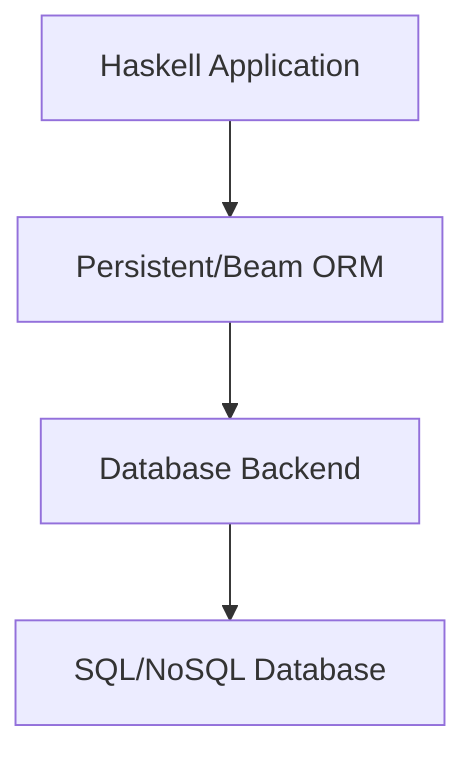

## 13.6 Integrating with Databases and ORM Patterns (Persistent, Beam)

In the world of software development, integrating applications with databases is a fundamental task. Haskell, with its strong type system and functional programming paradigm, offers unique approaches to database integration through libraries like Persistent and Beam. These libraries provide type-safe, expressive, and efficient ways to interact with databases, allowing developers to leverage Haskell's strengths in building robust and maintainable applications.

### Database Access in Haskell

Before diving into ORM libraries, it's essential to understand the basics of database access in Haskell. Haskell can interact with both SQL and NoSQL databases, providing flexibility in choosing the right database technology for your application.

#### Interacting with SQL Databases

Haskell supports SQL database interaction through libraries like `postgresql-simple`, `mysql`, and `sqlite`. These libraries provide low-level access to databases, allowing you to execute raw SQL queries and handle results manually. While this approach offers flexibility, it requires careful handling of SQL strings and result parsing.

#### Interacting with NoSQL Databases

For NoSQL databases, Haskell offers libraries like `mongoDB` and `cassandra-client`. These libraries provide interfaces to interact with NoSQL databases, allowing you to perform operations like inserting, querying, and updating documents or records.

### ORM Libraries in Haskell

Object-Relational Mapping (ORM) libraries abstract the database interaction layer, allowing developers to work with database entities as Haskell data types. This abstraction simplifies database operations and enhances type safety. In Haskell, two prominent ORM libraries are Persistent and Beam.

#### Persistent

Persistent is a high-level ORM library that integrates seamlessly with Yesod, a popular Haskell web framework. It provides a type-safe way to interact with databases, automatically generating SQL queries from Haskell data types.

##### Key Features of Persistent

- **Type Safety**: Persistent ensures that database queries are type-safe, reducing runtime errors.
- **Automatic Schema Generation**: It can generate database schemas from Haskell data types.
- **Migration Support**: Persistent supports database migrations, allowing you to evolve your database schema over time.

##### Using Persistent

To use Persistent, you need to define your database schema using Haskell data types. Here's an example of defining a simple `User` entity:

```haskell
{-# LANGUAGE GADTs #-}
{-# LANGUAGE GeneralizedNewtypeDeriving #-}
{-# LANGUAGE TemplateHaskell #-}
{-# LANGUAGE QuasiQuotes #-}
{-# LANGUAGE TypeFamilies #-}

import Database.Persist.TH

share [mkPersist sqlSettings, mkMigrate "migrateAll"] [persistLowerCase|
User
    name String
    age Int Maybe
    deriving Show
|]
```

In this example, we define a `User` entity with `name` and `age` fields. The `mkPersist` and `mkMigrate` functions generate the necessary code for interacting with the database.

##### Performing CRUD Operations

With Persistent, you can perform CRUD (Create, Read, Update, Delete) operations using a type-safe API. Here's an example of inserting a new user:

```haskell
import Database.Persist.Sqlite
import Control.Monad.IO.Class (liftIO)

main :: IO ()
main = runSqlite ":memory:" $ do
    runMigration migrateAll
    userId <- insert $ User "Alice" (Just 30)
    liftIO $ print userId
```

This code snippet demonstrates how to insert a new user into an SQLite database. The `runSqlite` function sets up a connection to the database, and `runMigration` applies the necessary migrations.

#### Beam

Beam is another powerful ORM library for Haskell, designed to provide a more flexible and composable approach to database interaction. It supports multiple backends, including PostgreSQL, SQLite, and MySQL.

##### Key Features of Beam

- **Composability**: Beam allows you to compose queries using Haskell's functional programming features.
- **Backend Agnostic**: It supports multiple database backends, making it easy to switch databases.
- **Type Safety**: Like Persistent, Beam ensures type-safe database interactions.

##### Using Beam

To use Beam, you need to define your database schema using Haskell data types and Beam's DSL (Domain-Specific Language). Here's an example of defining a `User` table:

```haskell
{-# LANGUAGE DeriveGeneric #-}
{-# LANGUAGE TypeFamilies #-}
{-# LANGUAGE FlexibleInstances #-}
{-# LANGUAGE MultiParamTypeClasses #-}
{-# LANGUAGE OverloadedStrings #-}

import Database.Beam
import Database.Beam.Sqlite
import Data.Text (Text)
import GHC.Generics (Generic)

data UserT f = User
  { _userId   :: Columnar f Int
  , _userName :: Columnar f Text
  , _userAge  :: Columnar f (Maybe Int)
  } deriving (Generic)

instance Beamable UserT

instance Table UserT where
  data PrimaryKey UserT f = UserId (Columnar f Int) deriving (Generic)
  primaryKey = UserId . _userId

type User = UserT Identity
type UserId = PrimaryKey UserT Identity

deriving instance Show User
deriving instance Show UserId
```

In this example, we define a `User` table with `userId`, `userName`, and `userAge` columns. The `Beamable` and `Table` instances are necessary for Beam to work with the table.

##### Performing CRUD Operations

Beam provides a composable API for performing CRUD operations. Here's an example of inserting a new user:

```haskell
import Database.Beam.Sqlite
import Database.SQLite.Simple

main :: IO ()
main = do
  conn <- open "example.db"
  runBeamSqlite conn $ do
    runInsert $ insert (userTable myDatabase) $
      insertValues [User 1 "Alice" (Just 30)]
  close conn
```

This code snippet demonstrates how to insert a new user into an SQLite database using Beam. The `runBeamSqlite` function sets up a connection to the database, and `runInsert` performs the insertion.

### Mapping Database Tables to Haskell Data Types

Both Persistent and Beam require you to map database tables to Haskell data types. This mapping is crucial for ensuring type safety and leveraging Haskell's type system.

#### Persistent Mapping

In Persistent, you define your schema using Template Haskell and quasi-quotations. This approach allows Persistent to generate the necessary code for interacting with the database.

#### Beam Mapping

In Beam, you define your schema using Haskell data types and Beam's DSL. This approach provides more flexibility and composability, allowing you to leverage Haskell's functional programming features.

### Design Considerations

When choosing between Persistent and Beam, consider the following factors:

- **Complexity**: Persistent is easier to use for simple applications, while Beam offers more flexibility for complex queries.
- **Backend Support**: Beam supports multiple backends, making it easier to switch databases.
- **Integration**: Persistent integrates seamlessly with Yesod, while Beam is more standalone.

### Haskell Unique Features

Haskell's strong type system and functional programming paradigm provide unique advantages for database integration:

- **Type Safety**: Both Persistent and Beam leverage Haskell's type system to ensure type-safe database interactions.
- **Composability**: Haskell's functional programming features allow you to compose queries and operations in a flexible and expressive way.

### Differences and Similarities

While Persistent and Beam both provide ORM functionality, they differ in their approach and design philosophy:

- **Persistent**: Focuses on simplicity and integration with Yesod, using Template Haskell for schema generation.
- **Beam**: Emphasizes composability and flexibility, using a DSL for defining schemas and queries.

### Visualizing Database Integration

To better understand how Persistent and Beam integrate with databases, let's visualize the process using a Mermaid.js diagram:



**Diagram Description**: This diagram illustrates the flow of data from a Haskell application through the Persistent or Beam ORM to the database backend, which interacts with the actual SQL or NoSQL database.

### Try It Yourself

To deepen your understanding of Persistent and Beam, try modifying the code examples provided. Experiment with different database backends, add new fields to the schema, or perform complex queries. This hands-on approach will help solidify your knowledge and skills in integrating Haskell applications with databases.

### References and Links

For further reading and exploration, check out the following resources:

- [Persistent Documentation](https://www.yesodweb.com/book/persistent)
- [Beam Documentation](https://hackage.haskell.org/package/beam-core)

### Knowledge Check

To reinforce your understanding, consider the following questions:

- What are the key differences between Persistent and Beam?
- How does Haskell's type system enhance database integration?
- What are the benefits of using ORM libraries in Haskell?

### Embrace the Journey

Remember, mastering database integration in Haskell is a journey. As you progress, you'll build more complex and efficient applications. Keep experimenting, stay curious, and enjoy the journey!

## Quiz: Integrating with Databases and ORM Patterns (Persistent, Beam)



### What is the primary advantage of using ORM libraries like Persistent and Beam in Haskell?

- [x] Type-safe database interactions
- [ ] Faster query execution
- [ ] Easier integration with NoSQL databases
- [ ] Automatic database scaling

> **Explanation:** ORM libraries like Persistent and Beam provide type-safe database interactions, leveraging Haskell's strong type system.

### Which Haskell feature is crucial for ensuring type-safe database interactions?

- [x] Strong type system
- [ ] Lazy evaluation
- [ ] Pattern matching
- [ ] Higher-order functions

> **Explanation:** Haskell's strong type system is crucial for ensuring type-safe database interactions, reducing runtime errors.

### What is a key difference between Persistent and Beam?

- [x] Persistent uses Template Haskell for schema generation, while Beam uses a DSL.
- [ ] Beam integrates with Yesod, while Persistent is standalone.
- [ ] Persistent supports multiple backends, while Beam is limited to SQLite.
- [ ] Beam is easier to use for simple applications.

> **Explanation:** Persistent uses Template Haskell for schema generation, while Beam uses a DSL, providing more flexibility.

### How does Beam support multiple database backends?

- [x] By being backend agnostic
- [ ] By using Template Haskell
- [ ] By integrating with Yesod
- [ ] By providing automatic migrations

> **Explanation:** Beam is backend agnostic, supporting multiple database backends, making it easier to switch databases.

### What is the purpose of the `mkPersist` function in Persistent?

- [x] To generate necessary code for interacting with the database
- [ ] To perform database migrations
- [ ] To execute raw SQL queries
- [ ] To define database connections

> **Explanation:** The `mkPersist` function generates the necessary code for interacting with the database in Persistent.

### Which library is better suited for complex queries in Haskell?

- [x] Beam
- [ ] Persistent
- [ ] postgresql-simple
- [ ] mysql

> **Explanation:** Beam is better suited for complex queries due to its composability and flexibility.

### What is a common feature of both Persistent and Beam?

- [x] Type-safe database interactions
- [ ] Integration with Yesod
- [ ] Use of Template Haskell
- [ ] Support for NoSQL databases

> **Explanation:** Both Persistent and Beam provide type-safe database interactions, leveraging Haskell's type system.

### How can you perform CRUD operations in Persistent?

- [x] Using a type-safe API
- [ ] By executing raw SQL queries
- [ ] By using Template Haskell
- [ ] By defining database connections

> **Explanation:** Persistent provides a type-safe API for performing CRUD operations, ensuring type safety.

### What is the role of the `runBeamSqlite` function in Beam?

- [x] To set up a connection to the SQLite database
- [ ] To perform database migrations
- [ ] To generate SQL queries
- [ ] To define database schemas

> **Explanation:** The `runBeamSqlite` function sets up a connection to the SQLite database in Beam.

### True or False: Persistent and Beam both support automatic database scaling.

- [ ] True
- [x] False

> **Explanation:** Neither Persistent nor Beam supports automatic database scaling; they focus on type-safe database interactions.


