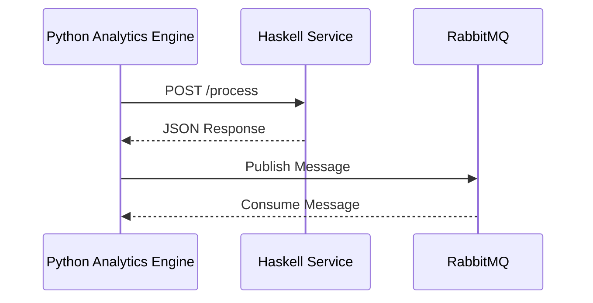

## 13.7 Functional Programming in a Polyglot Environment

In today's software landscape, applications often need to integrate multiple programming languages and paradigms. This polyglot approach allows developers to leverage the strengths of different languages to build more robust, efficient, and scalable systems. Haskell, with its strong emphasis on functional programming, offers unique advantages in such environments. However, integrating Haskell with other languages presents its own set of challenges and opportunities.

### Challenges of Mixing Paradigms and Language Ecosystems

When combining Haskell with other languages, several challenges arise:

- **Language Paradigm Differences**: Haskell's functional paradigm contrasts with the imperative or object-oriented paradigms of languages like Java or Python. This can lead to difficulties in understanding and integrating codebases.
- **Data Type Mismatches**: Haskell's strong static typing and advanced type system can clash with dynamically typed languages, requiring careful handling of data conversions.
- **Performance Overheads**: Interfacing between languages can introduce performance bottlenecks, especially if data needs to be serialized and deserialized frequently.
- **Tooling and Ecosystem Differences**: Each language has its own set of tools, libraries, and frameworks, which may not always play well together.

### Strategies for Effective Integration

To overcome these challenges, several strategies can be employed:

#### Using APIs

APIs provide a standardized way for different components of a system to communicate, regardless of the language they are written in. By exposing Haskell functions as APIs, you can allow other languages to interact with Haskell code seamlessly.

- **RESTful APIs**: Use libraries like Servant or Yesod to create RESTful services in Haskell. These services can be consumed by applications written in any language that supports HTTP.
- **GraphQL**: For more complex interactions, consider using GraphQL to expose Haskell services. This allows clients to request exactly the data they need, reducing over-fetching and under-fetching.

#### Message Queues

Message queues decouple the components of a system, allowing them to communicate asynchronously. This is particularly useful in polyglot environments where different languages may have different performance characteristics.

- **RabbitMQ or Kafka**: Use these message brokers to facilitate communication between Haskell services and components written in other languages. Haskell libraries like `amqp` and `hw-kafka-client` can help you integrate with these systems.

#### Standardized Data Formats

Using standardized data formats ensures that data can be easily exchanged between different languages.

- **JSON and XML**: These are widely supported across languages and can be used to serialize data for communication between Haskell and other languages.
- **Protocol Buffers**: For more efficient serialization, consider using Protocol Buffers. Haskell has libraries like `proto-lens` that support Protocol Buffers.

### Example: Haskell Service Communicating with a Python Analytics Engine

Let's explore a practical example where a Haskell service communicates with a Python analytics engine. This example will demonstrate how to use APIs, message queues, and standardized data formats to achieve seamless integration.

#### Setting Up the Haskell Service

First, we'll create a simple Haskell service that exposes an API for data processing. We'll use the Servant library to define and implement the API.

```haskell
{-# LANGUAGE DataKinds #-}
{-# LANGUAGE TypeOperators #-}
{-# LANGUAGE OverloadedStrings #-}

module Main where

import Network.Wai
import Network.Wai.Handler.Warp
import Servant

type API = "process" :> ReqBody '[JSON] InputData :> Post '[JSON] OutputData

data InputData = InputData
  { inputValue :: Int
  } deriving (Show, Eq, Generic)

instance FromJSON InputData
instance ToJSON InputData

data OutputData = OutputData
  { outputValue :: Int
  } deriving (Show, Eq, Generic)

instance FromJSON OutputData
instance ToJSON OutputData

processData :: InputData -> Handler OutputData
processData input = return $ OutputData (inputValue input * 2)

server :: Server API
server = processData

api :: Proxy API
api = Proxy

app :: Application
app = serve api server

main :: IO ()
main = run 8080 app
```

In this example, the Haskell service exposes a single endpoint `/process` that accepts JSON input and returns JSON output. The `processData` function doubles the input value.

#### Communicating with the Python Analytics Engine

Next, we'll set up a Python script that communicates with the Haskell service. The script will send data to the Haskell service and process the response.

```python
import requests
import json

def call_haskell_service(input_value):
    url = "http://localhost:8080/process"
    headers = {'Content-Type': 'application/json'}
    data = {'inputValue': input_value}
    response = requests.post(url, headers=headers, data=json.dumps(data))
    return response.json()

if __name__ == "__main__":
    input_value = 5
    result = call_haskell_service(input_value)
    print(f"Processed output: {result['outputValue']}")
```

This Python script uses the `requests` library to send a POST request to the Haskell service. It sends an integer value and prints the processed output received from the service.

#### Using Message Queues for Asynchronous Communication

For more complex scenarios, you might want to use message queues to handle communication between Haskell and Python components. Here's a basic example using RabbitMQ.

##### Haskell Producer

```haskell
{-# LANGUAGE OverloadedStrings #-}

import Network.AMQP

main :: IO ()
main = do
    conn <- openConnection "127.0.0.1" "/" "guest" "guest"
    chan <- openChannel conn

    let msg = newMsg { msgBody = "Hello, Python!" }
    publishMsg chan "exchange" "routingKey" msg

    closeConnection conn
    putStrLn "Message sent to RabbitMQ"
```

##### Python Consumer

```python
import pika

def callback(ch, method, properties, body):
    print(f"Received {body}")

connection = pika.BlockingConnection(pika.ConnectionParameters('localhost'))
channel = connection.channel()

channel.queue_declare(queue='queue_name')
channel.basic_consume(queue='queue_name', on_message_callback=callback, auto_ack=True)

print('Waiting for messages. To exit press CTRL+C')
channel.start_consuming()
```

In this setup, the Haskell producer sends a message to RabbitMQ, and the Python consumer receives and processes it.

### Visualizing the Integration

To better understand the flow of data and control in this polyglot environment, let's visualize the architecture using a sequence diagram.



This diagram illustrates the interaction between the Python analytics engine, the Haskell service, and RabbitMQ. The Python engine sends a request to the Haskell service, receives a response, and then publishes a message to RabbitMQ for further processing.

### Design Considerations

When integrating Haskell in a polyglot environment, consider the following:

- **Performance**: Minimize data serialization and deserialization to reduce overhead.
- **Error Handling**: Implement robust error handling to manage failures in communication between components.
- **Security**: Ensure that data exchanged between languages is secure, especially when using APIs or message queues.
- **Scalability**: Design your system to handle increased load by scaling individual components independently.

### Haskell Unique Features

Haskell offers several unique features that can be leveraged in a polyglot environment:

- **Strong Typing**: Use Haskell's type system to ensure data integrity and prevent runtime errors.
- **Concurrency**: Utilize Haskell's concurrency primitives to handle multiple requests efficiently.
- **Lazy Evaluation**: Take advantage of lazy evaluation to optimize performance and resource usage.

### Differences and Similarities

When working in a polyglot environment, it's important to recognize the differences and similarities between Haskell and other languages:

- **Type Systems**: Haskell's type system is more expressive and strict compared to dynamically typed languages like Python.
- **Concurrency Models**: Haskell's concurrency model is based on lightweight threads, which differs from the threading models in languages like Java.
- **Functional Paradigm**: Haskell's pure functional paradigm contrasts with the imperative paradigms of languages like C++.

### Try It Yourself

To deepen your understanding, try modifying the code examples provided:

- **Extend the Haskell API**: Add more endpoints to the Haskell service and update the Python script to interact with them.
- **Experiment with Message Queues**: Implement a more complex message-passing system using RabbitMQ or Kafka.
- **Integrate Additional Languages**: Try adding a third language, such as JavaScript, to the mix and explore how it can interact with Haskell and Python.

### Knowledge Check

- **What are the main challenges of integrating Haskell with other languages?**
- **How can APIs facilitate communication between Haskell and other languages?**
- **What role do message queues play in a polyglot environment?**
- **How can standardized data formats help in language interoperability?**

### Embrace the Journey

Remember, integrating Haskell in a polyglot environment is just the beginning. As you progress, you'll discover more ways to leverage Haskell's strengths in combination with other languages. Keep experimenting, stay curious, and enjoy the journey!

## Quiz: Functional Programming in a Polyglot Environment



### What is a key challenge when integrating Haskell with other languages?

- [x] Language paradigm differences
- [ ] Lack of libraries
- [ ] Poor performance
- [ ] Limited community support

> **Explanation:** Language paradigm differences are a key challenge due to Haskell's functional nature compared to imperative or object-oriented languages.

### Which strategy can be used to facilitate communication between Haskell and other languages?

- [x] Using APIs
- [ ] Ignoring type systems
- [ ] Avoiding message queues
- [ ] Disabling security features

> **Explanation:** APIs provide a standardized way for different components to communicate, making them an effective strategy for integration.

### What is the role of message queues in a polyglot environment?

- [x] Decoupling components for asynchronous communication
- [ ] Increasing data serialization overhead
- [ ] Reducing security
- [ ] Limiting scalability

> **Explanation:** Message queues decouple components, allowing them to communicate asynchronously, which is beneficial in a polyglot environment.

### Which data format is commonly used for language interoperability?

- [x] JSON
- [ ] CSV
- [ ] YAML
- [ ] HTML

> **Explanation:** JSON is a widely supported data format that facilitates interoperability between different languages.

### How does Haskell's strong typing benefit a polyglot environment?

- [x] Ensures data integrity and prevents runtime errors
- [ ] Increases code complexity
- [ ] Reduces performance
- [ ] Limits language compatibility

> **Explanation:** Haskell's strong typing ensures data integrity and helps prevent runtime errors, which is beneficial in a polyglot environment.

### What is a potential drawback of using message queues?

- [x] Performance overhead due to serialization
- [ ] Lack of scalability
- [ ] Poor error handling
- [ ] Limited language support

> **Explanation:** Message queues can introduce performance overhead due to the need for data serialization and deserialization.

### Which Haskell feature can optimize performance in a polyglot environment?

- [x] Lazy evaluation
- [ ] Dynamic typing
- [ ] Manual memory management
- [ ] Synchronous I/O

> **Explanation:** Lazy evaluation can optimize performance by deferring computations until necessary, reducing resource usage.

### What is a benefit of using Protocol Buffers over JSON?

- [x] More efficient serialization
- [ ] Easier to read
- [ ] Better for human interaction
- [ ] Simpler to implement

> **Explanation:** Protocol Buffers provide more efficient serialization compared to JSON, which can be beneficial in performance-critical applications.

### How can Haskell's concurrency model differ from other languages?

- [x] Based on lightweight threads
- [ ] Uses heavyweight processes
- [ ] Relies on global locks
- [ ] Requires manual thread management

> **Explanation:** Haskell's concurrency model is based on lightweight threads, which is different from the threading models in some other languages.

### True or False: Haskell's functional paradigm is similar to the imperative paradigm of languages like C++.

- [ ] True
- [x] False

> **Explanation:** Haskell's functional paradigm is different from the imperative paradigm of languages like C++, focusing on immutability and pure functions.


