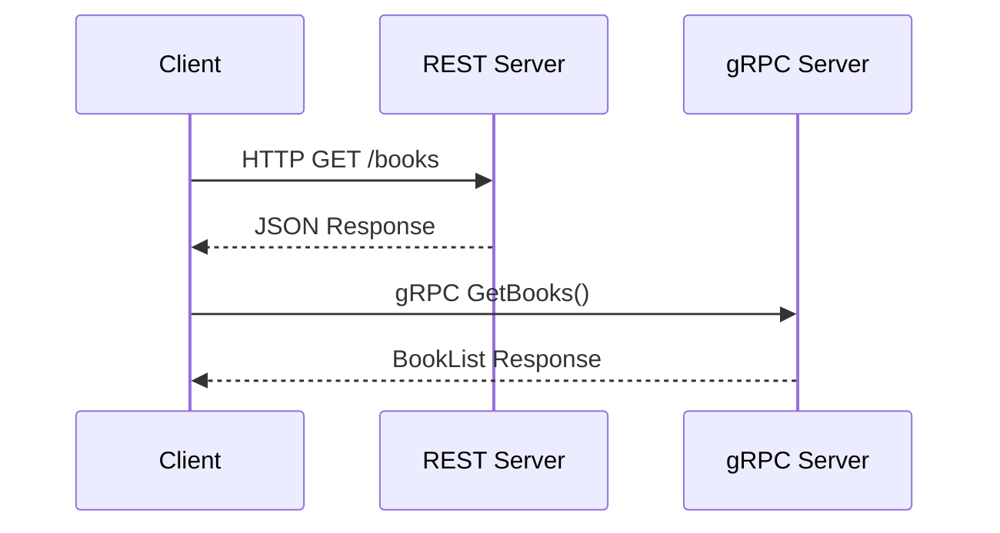

## 13.8 Exposing Haskell Services via REST and gRPC

In today's interconnected world, exposing services via APIs is a fundamental requirement for any application. Haskell, with its strong type system and functional programming paradigm, offers robust solutions for building APIs. In this section, we will explore how to expose Haskell services using REST and gRPC, two popular methods for API communication. We will delve into the implementation details using libraries like **Servant** for RESTful services and **grpc-haskell** for gRPC.

### RESTful Services

REST (Representational State Transfer) is an architectural style that uses HTTP for communication. It is widely used for building web services due to its simplicity and scalability. RESTful services typically use JSON or XML for data interchange.

#### Building RESTful APIs with Servant

**Servant** is a Haskell library that allows you to define web services at the type level. It provides a way to specify API endpoints, request and response formats, and more, all within Haskell's type system.

##### Key Concepts in Servant

- **Type-Level API Definition**: Define your API using types, ensuring compile-time safety.
- **Automatic Documentation**: Generate API documentation automatically from your type definitions.
- **Server and Client Generation**: Generate both server and client code from the same API definition.

##### Example: Creating a Simple REST API

Let's create a simple REST API using Servant. We'll build an API that manages a list of books.

```haskell
{-# LANGUAGE DataKinds #-}
{-# LANGUAGE TypeOperators #-}
{-# LANGUAGE DeriveGeneric #-}

import Data.Aeson (ToJSON, FromJSON)
import GHC.Generics (Generic)
import Servant
import Network.Wai.Handler.Warp (run)

-- Define a data type for a book
data Book = Book
  { title :: String
  , author :: String
  } deriving (Eq, Show, Generic)

instance ToJSON Book
instance FromJSON Book

-- Define the API type
type BookAPI = "books" :> Get '[JSON] [Book]
          :<|> "books" :> ReqBody '[JSON] Book :> Post '[JSON] Book

-- Implement the server
server :: Server BookAPI
server = return books
    :<|> addBook

  where
    books = [Book "Learn You a Haskell" "Miran Lipovaca"]
    addBook book = return book

-- Create the application
app :: Application
app = serve (Proxy :: Proxy BookAPI) server

-- Run the server
main :: IO ()
main = run 8080 app
```

In this example, we define a `Book` data type and a `BookAPI` type that specifies two endpoints: one for retrieving a list of books and another for adding a new book. The `server` function implements these endpoints.

##### Try It Yourself

- Modify the `Book` data type to include additional fields such as `year` or `ISBN`.
- Add a new endpoint to delete a book by title.

### gRPC

gRPC (gRPC Remote Procedure Calls) is a high-performance, open-source universal RPC framework. It uses HTTP/2 for transport, Protocol Buffers as the interface description language, and provides features such as authentication, load balancing, and more.

#### Implementing gRPC Services with grpc-haskell

**grpc-haskell** is a Haskell library for building gRPC services. It allows you to define service interfaces using Protocol Buffers and generate Haskell code for both the client and server.

##### Key Concepts in gRPC

- **Protocol Buffers**: Define your service and messages using a `.proto` file.
- **HTTP/2**: Utilize HTTP/2 for efficient communication.
- **Bidirectional Streaming**: Support for streaming requests and responses.

##### Example: Creating a gRPC Service

Let's create a gRPC service that provides similar functionality to our REST API example.

1. **Define the Protocol Buffers File (`book.proto`)**

```protobuf
syntax = "proto3";

package book;

service BookService {
  rpc GetBooks (Empty) returns (BookList);
  rpc AddBook (Book) returns (Book);
}

message Empty {}

message Book {
  string title = 1;
  string author = 2;
}

message BookList {
  repeated Book books = 1;
}
```

2. **Generate Haskell Code**

Use the `protoc` compiler with the Haskell plugin to generate Haskell code from the `.proto` file.

```bash
protoc --plugin=protoc-gen-haskell --haskell_out=. book.proto
```

3. **Implement the Server**

```haskell
{-# LANGUAGE OverloadedStrings #-}

import Network.GRPC.HighLevel.Generated
import Network.GRPC.HighLevel.Server
import Network.GRPC.HighLevel.Server.Unregistered
import Control.Monad.IO.Class (liftIO)
import qualified Data.Vector as V

-- Define the server handlers
getBooksHandler :: ServerRequest 'Normal Empty BookList -> IO (ServerResponse 'Normal BookList)
getBooksHandler _ = return $ ServerNormalResponse (BookList (V.fromList [Book "Learn You a Haskell" "Miran Lipovaca"])) [] StatusOk ""

addBookHandler :: ServerRequest 'Normal Book Book -> IO (ServerResponse 'Normal Book)
addBookHandler (ServerNormalRequest _metadata book) = return $ ServerNormalResponse book [] StatusOk ""

-- Create the server
main :: IO ()
main = do
  let config = defaultServiceOptions
  runServer config [unary (RPC :: RPC BookService "GetBooks") getBooksHandler, unary (RPC :: RPC BookService "AddBook") addBookHandler]
```

In this example, we define a `book.proto` file that specifies the `BookService` with two RPC methods: `GetBooks` and `AddBook`. We then implement the server using `grpc-haskell`.

##### Try It Yourself

- Extend the `Book` message to include additional fields.
- Implement a new RPC method to update a book's details.

### Visualizing REST and gRPC Communication

To better understand the differences between REST and gRPC, let's visualize their communication patterns.



**Caption**: This diagram illustrates the communication flow between a client and both a REST server and a gRPC server. REST uses HTTP methods and JSON, while gRPC uses RPC calls and Protocol Buffers.

### Design Considerations

When choosing between REST and gRPC, consider the following:

- **Use REST** if you need a simple, widely-supported API with easy integration into web applications.
- **Use gRPC** if you require high performance, bidirectional streaming, or need to leverage HTTP/2 features.

### Haskell Unique Features

Haskell's strong type system and functional paradigm offer unique advantages when building APIs:

- **Type Safety**: Ensure API correctness at compile time.
- **Concurrency**: Leverage Haskell's concurrency features for efficient server implementations.
- **Pure Functions**: Simplify testing and reasoning about your code.

### Differences and Similarities

- **REST and gRPC** both allow for remote communication but differ in protocol and data format.
- **REST** is more human-readable and easier to debug, while **gRPC** offers better performance and supports streaming.

### References and Links

- [Servant Documentation](https://haskell-servant.readthedocs.io/)
- [grpc-haskell GitHub Repository](https://github.com/awakesecurity/gRPC-haskell)
- [Protocol Buffers Documentation](https://developers.google.com/protocol-buffers)

### Knowledge Check

- What are the main differences between REST and gRPC?
- How does Haskell's type system benefit API development?
- What are the advantages of using Servant for RESTful services?

### Embrace the Journey

Remember, mastering API development in Haskell is a journey. As you progress, you'll build more complex and efficient services. Keep experimenting, stay curious, and enjoy the journey!

## Quiz: Exposing Haskell Services via REST and gRPC



### What is the primary transport protocol used by gRPC?

- [ ] HTTP/1.1
- [x] HTTP/2
- [ ] WebSocket
- [ ] FTP

> **Explanation:** gRPC uses HTTP/2 as its transport protocol, which allows for efficient communication and supports features like multiplexing and bidirectional streaming.

### Which Haskell library is commonly used for building RESTful services?

- [ ] grpc-haskell
- [x] Servant
- [ ] Snap
- [ ] Yesod

> **Explanation:** Servant is a popular Haskell library for building RESTful services, allowing developers to define APIs at the type level.

### What data format is typically used in RESTful services?

- [x] JSON
- [ ] Protocol Buffers
- [ ] XML
- [ ] YAML

> **Explanation:** RESTful services commonly use JSON for data interchange due to its simplicity and wide support across platforms.

### What is the purpose of Protocol Buffers in gRPC?

- [ ] To provide a human-readable data format
- [x] To define service interfaces and messages
- [ ] To handle HTTP requests
- [ ] To manage database connections

> **Explanation:** Protocol Buffers are used in gRPC to define service interfaces and messages, enabling efficient serialization and deserialization of data.

### Which feature is unique to gRPC compared to REST?

- [ ] Stateless communication
- [ ] Human-readable data format
- [x] Bidirectional streaming
- [ ] Use of HTTP/1.1

> **Explanation:** gRPC supports bidirectional streaming, allowing clients and servers to send multiple messages in both directions over a single connection.

### What is a key advantage of using Haskell for API development?

- [ ] Dynamic typing
- [x] Strong type safety
- [ ] Lack of concurrency support
- [ ] Manual memory management

> **Explanation:** Haskell's strong type safety ensures that APIs are correct at compile time, reducing runtime errors and improving reliability.

### What is the role of the `serve` function in a Servant application?

- [ ] To handle database connections
- [ ] To define API endpoints
- [x] To run the server with the specified API
- [ ] To generate client code

> **Explanation:** The `serve` function in Servant is used to run the server with the specified API, connecting the API type to the server implementation.

### How can you generate Haskell code from a Protocol Buffers file?

- [ ] Using the `ghc` compiler
- [x] Using the `protoc` compiler with a Haskell plugin
- [ ] Manually writing the code
- [ ] Using the `stack` build tool

> **Explanation:** The `protoc` compiler with a Haskell plugin is used to generate Haskell code from a Protocol Buffers file, automating the process of creating service interfaces and messages.

### What is a common use case for RESTful services?

- [x] Web applications
- [ ] High-performance computing
- [ ] Real-time gaming
- [ ] Machine learning

> **Explanation:** RESTful services are commonly used in web applications due to their simplicity, scalability, and ease of integration with HTTP-based systems.

### True or False: gRPC is more human-readable than REST.

- [ ] True
- [x] False

> **Explanation:** REST is generally more human-readable than gRPC because it uses JSON or XML, which are text-based formats, whereas gRPC uses Protocol Buffers, a binary format.


