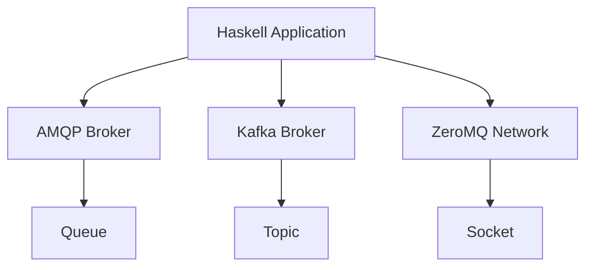

## 13.9 Messaging and Integration with Other Systems

In today's interconnected world, integrating with various systems and services is crucial for building scalable and robust applications. Haskell, with its strong type system and functional programming paradigm, offers unique advantages for implementing messaging systems and integrating with other platforms. In this section, we'll explore how to leverage Haskell to work with popular messaging systems like AMQP, Kafka, and ZeroMQ, and demonstrate how to integrate these systems into Haskell applications.

### Introduction to Messaging Systems

Messaging systems are essential for enabling communication between distributed components in a software architecture. They facilitate asynchronous communication, decoupling the sender and receiver, and allowing for scalable and fault-tolerant systems. Let's delve into some of the most widely used messaging systems:

- **AMQP (Advanced Message Queuing Protocol)**: A protocol for message-oriented middleware environments. It provides features like message orientation, queuing, routing, reliability, and security.
- **Kafka**: A distributed event streaming platform capable of handling trillions of events a day. It's used for building real-time data pipelines and streaming applications.
- **ZeroMQ**: A high-performance asynchronous messaging library aimed at use in scalable distributed or concurrent applications.

### Implementing Messaging Systems in Haskell

Haskell provides libraries and tools to interact with these messaging systems. Let's explore how to implement each of these systems in Haskell.

#### AMQP in Haskell

AMQP is a protocol that facilitates message-oriented middleware environments. It is widely used in enterprise systems for reliable message delivery. In Haskell, we can use the `amqp` library to interact with AMQP brokers like RabbitMQ.

**Key Concepts of AMQP:**

- **Exchange**: Receives messages from producers and routes them to queues.
- **Queue**: Stores messages until they are consumed by a consumer.
- **Binding**: Connects exchanges to queues based on routing rules.

**Example: Connecting to an AMQP Broker**

```haskell
{-# LANGUAGE OverloadedStrings #-}

import Network.AMQP

main :: IO ()
main = do
    conn <- openConnection "127.0.0.1" "/" "guest" "guest"
    chan <- openChannel conn

    -- Declare a queue
    declareQueue chan newQueue {queueName = "myQueue"}

    -- Publish a message
    publishMsg chan "" "myQueue" newMsg {msgBody = "Hello, AMQP!"}

    -- Close the connection
    closeConnection conn
    putStrLn "Message sent successfully!"
```

**Explanation:**

- We establish a connection to the AMQP broker using `openConnection`.
- A channel is opened with `openChannel`.
- We declare a queue named "myQueue" using `declareQueue`.
- A message is published to the queue with `publishMsg`.
- Finally, we close the connection with `closeConnection`.

#### Kafka in Haskell

Kafka is a distributed event streaming platform used for building real-time data pipelines. In Haskell, the `hw-kafka-client` library provides a way to interact with Kafka.

**Key Concepts of Kafka:**

- **Producer**: Sends messages to Kafka topics.
- **Consumer**: Reads messages from Kafka topics.
- **Topic**: A category or feed name to which records are published.

**Example: Producing and Consuming Kafka Messages**

```haskell
{-# LANGUAGE OverloadedStrings #-}

import Kafka.Consumer
import Kafka.Producer

-- Producer configuration
producerProps :: ProducerProperties
producerProps = brokersList [BrokerAddress "localhost:9092"]
                <> logLevel KafkaLogDebug

-- Consumer configuration
consumerProps :: ConsumerProperties
consumerProps = brokersList [BrokerAddress "localhost:9092"]
                <> groupId (ConsumerGroupId "myGroup")
                <> noAutoCommitOffsets
                <> logLevel KafkaLogDebug

main :: IO ()
main = do
    -- Producing a message
    runProducer producerProps $ do
        produceMessage (ProducerRecord "myTopic" Nothing (Just "Hello, Kafka!"))

    -- Consuming messages
    runConsumer consumerProps (Subscription [TopicName "myTopic"]) $ \msg -> do
        print $ crValue msg
        commitAllOffsets OffsetCommit

    putStrLn "Kafka interaction complete!"
```

**Explanation:**

- We define producer and consumer properties using `ProducerProperties` and `ConsumerProperties`.
- A producer sends a message to the "myTopic" topic using `produceMessage`.
- A consumer subscribes to "myTopic" and processes incoming messages.

#### ZeroMQ in Haskell

ZeroMQ is a high-performance asynchronous messaging library. It provides a message queue, but unlike traditional message brokers, it can be used in a variety of messaging patterns.

**Key Concepts of ZeroMQ:**

- **Socket**: An abstraction for a communication endpoint.
- **Context**: Manages sockets and their communication.
- **Patterns**: ZeroMQ supports various messaging patterns like PUB-SUB, REQ-REP, etc.

**Example: PUB-SUB Pattern with ZeroMQ**

```haskell
{-# LANGUAGE OverloadedStrings #-}

import System.ZMQ4.Monadic

main :: IO ()
main = runZMQ $ do
    -- Publisher
    pubSocket <- socket Pub
    bind pubSocket "tcp://*:5555"

    -- Subscriber
    subSocket <- socket Sub
    connect subSocket "tcp://localhost:5555"
    subscribe subSocket ""

    -- Publish a message
    liftIO $ putStrLn "Publishing message..."
    send pubSocket [] "Hello, ZeroMQ!"

    -- Receive a message
    msg <- receive subSocket
    liftIO $ putStrLn $ "Received message: " ++ unpack msg
```

**Explanation:**

- We create a publisher socket and bind it to a TCP address.
- A subscriber socket connects to the publisher's address.
- The publisher sends a message, and the subscriber receives it.

### Integrating Event Streaming Platforms with Haskell Applications

Integrating event streaming platforms like Kafka into Haskell applications involves setting up producers and consumers to handle data streams. This integration allows Haskell applications to process real-time data efficiently.

**Example: Real-Time Data Processing with Kafka**

Consider a scenario where we need to process real-time sensor data. We can use Kafka to stream the data and Haskell to process it.

```haskell
{-# LANGUAGE OverloadedStrings #-}

import Kafka.Consumer
import Kafka.Producer
import Data.Aeson (decode, encode)
import Data.Maybe (fromJust)

data SensorData = SensorData { sensorId :: String, value :: Double } deriving (Show, Generic)

instance FromJSON SensorData
instance ToJSON SensorData

processSensorData :: SensorData -> IO ()
processSensorData data = putStrLn $ "Processing data: " ++ show data

main :: IO ()
main = do
    -- Kafka consumer setup
    runConsumer consumerProps (Subscription [TopicName "sensorData"]) $ \msg -> do
        let sensorData = decode (crValue msg) :: Maybe SensorData
        case sensorData of
            Just data -> processSensorData data
            Nothing -> putStrLn "Failed to decode sensor data"

    putStrLn "Real-time data processing complete!"
```

**Explanation:**

- We define a `SensorData` data type and implement JSON encoding/decoding.
- A Kafka consumer subscribes to the "sensorData" topic.
- Incoming messages are decoded and processed using `processSensorData`.

### Design Considerations

When integrating messaging systems with Haskell applications, consider the following:

- **Concurrency**: Utilize Haskell's concurrency primitives to handle multiple messages simultaneously.
- **Error Handling**: Implement robust error handling to manage message processing failures.
- **Scalability**: Design your system to scale with increasing message volumes.
- **Security**: Ensure secure communication between components, especially when dealing with sensitive data.

### Haskell Unique Features

Haskell's strong type system and functional paradigm offer unique advantages in messaging and integration:

- **Type Safety**: Ensure message integrity and prevent runtime errors with Haskell's type system.
- **Concurrency**: Leverage Haskell's lightweight threads and STM for efficient message processing.
- **Immutability**: Benefit from immutable data structures for predictable and reliable message handling.

### Differences and Similarities

While AMQP, Kafka, and ZeroMQ serve similar purposes, they differ in their architecture and use cases:

- **AMQP**: Best for enterprise systems requiring reliable message delivery.
- **Kafka**: Ideal for real-time data streaming and processing.
- **ZeroMQ**: Suitable for high-performance, low-latency messaging.

### Try It Yourself

Experiment with the provided code examples by modifying the message content, topics, or adding additional processing logic. Try integrating these messaging systems into a Haskell application to see how they can enhance your system's capabilities.

### Visualizing Messaging System Integration

Below is a diagram illustrating the integration of a Haskell application with various messaging systems:



**Diagram Description**: This diagram shows a Haskell application interacting with AMQP, Kafka, and ZeroMQ systems. The application sends and receives messages through these systems, demonstrating integration with different messaging platforms.

### References and Links

- [AMQP Protocol](https://www.amqp.org/)
- [Apache Kafka](https://kafka.apache.org/)
- [ZeroMQ](https://zeromq.org/)

### Knowledge Check

- What are the key differences between AMQP, Kafka, and ZeroMQ?
- How can Haskell's type system benefit messaging system integration?
- What are some design considerations when integrating messaging systems with Haskell applications?

### Embrace the Journey

Remember, integrating messaging systems with Haskell is just the beginning. As you progress, you'll build more complex and interactive systems. Keep experimenting, stay curious, and enjoy the journey!

## Quiz: Messaging and Integration with Other Systems



### What is the primary purpose of messaging systems like AMQP, Kafka, and ZeroMQ?

- [x] To enable communication between distributed components
- [ ] To store large amounts of data
- [ ] To provide a user interface
- [ ] To compile Haskell code

> **Explanation:** Messaging systems facilitate communication between distributed components, enabling asynchronous and decoupled interactions.

### Which Haskell library is commonly used to interact with AMQP brokers?

- [x] amqp
- [ ] hw-kafka-client
- [ ] zeromq-haskell
- [ ] aeson

> **Explanation:** The `amqp` library is used for interacting with AMQP brokers like RabbitMQ in Haskell.

### What is a key feature of Kafka that makes it suitable for real-time data streaming?

- [x] Distributed event streaming
- [ ] High latency
- [ ] Limited scalability
- [ ] Synchronous communication

> **Explanation:** Kafka's distributed event streaming capability makes it ideal for real-time data processing and streaming applications.

### In ZeroMQ, what is the role of a socket?

- [x] It acts as a communication endpoint
- [ ] It stores messages
- [ ] It compiles code
- [ ] It provides a user interface

> **Explanation:** In ZeroMQ, a socket is an abstraction for a communication endpoint, facilitating message exchange.

### How does Haskell's type system benefit messaging system integration?

- [x] Ensures message integrity and prevents runtime errors
- [ ] Increases runtime errors
- [ ] Decreases code readability
- [ ] Limits scalability

> **Explanation:** Haskell's strong type system ensures message integrity and helps prevent runtime errors, enhancing reliability.

### What is a common use case for AMQP in enterprise systems?

- [x] Reliable message delivery
- [ ] Real-time data streaming
- [ ] Low-latency messaging
- [ ] User interface design

> **Explanation:** AMQP is commonly used in enterprise systems for reliable message delivery, ensuring messages are delivered accurately.

### Which messaging system is known for its high-performance, low-latency messaging?

- [x] ZeroMQ
- [ ] AMQP
- [ ] Kafka
- [ ] HTTP

> **Explanation:** ZeroMQ is known for its high-performance, low-latency messaging, making it suitable for real-time applications.

### What is the role of a Kafka producer?

- [x] Sends messages to Kafka topics
- [ ] Reads messages from Kafka topics
- [ ] Compiles Haskell code
- [ ] Provides a user interface

> **Explanation:** A Kafka producer sends messages to Kafka topics, facilitating data streaming and processing.

### What is the purpose of a queue in AMQP?

- [x] Stores messages until they are consumed
- [ ] Compiles code
- [ ] Provides a user interface
- [ ] Increases latency

> **Explanation:** In AMQP, a queue stores messages until they are consumed by a consumer, ensuring reliable message delivery.

### True or False: Haskell's concurrency primitives can be used to handle multiple messages simultaneously.

- [x] True
- [ ] False

> **Explanation:** Haskell's concurrency primitives, such as lightweight threads and STM, can be used to handle multiple messages simultaneously, enhancing performance.


