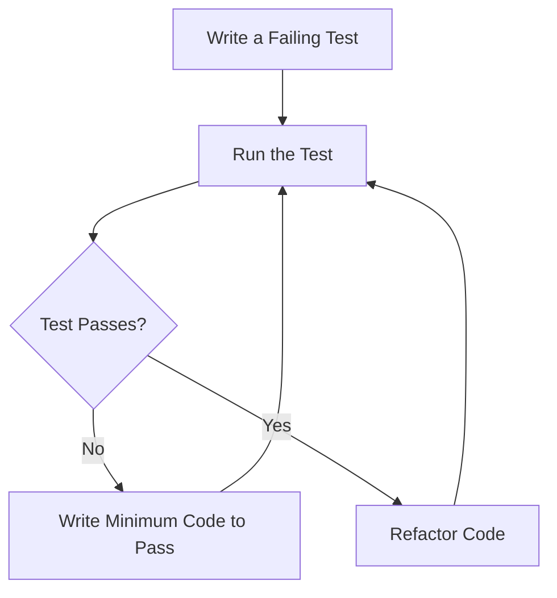

## 14.1 Test-Driven Development (TDD) in Haskell

Test-Driven Development (TDD) is a software development process that emphasizes writing tests before writing the actual code. This approach is particularly beneficial in Haskell, a language known for its strong type system and functional programming paradigm. In this section, we will delve into the TDD process, explore its benefits, and demonstrate how to implement TDD in Haskell using practical examples.

### Understanding the TDD Process

The TDD process is iterative and consists of three main steps:

1. **Write a Test**: Before writing any functional code, you start by writing a test that defines a small piece of functionality. This test will initially fail because the functionality does not yet exist.

2. **Implement the Code**: Write the minimum amount of code necessary to pass the test. This step focuses on implementing the functionality defined by the test.

3. **Refactor**: Once the test passes, you can refactor the code to improve its structure and readability while ensuring that the tests still pass.

This cycle is often referred to as the "Red-Green-Refactor" loop, where "Red" indicates a failing test, "Green" indicates a passing test, and "Refactor" involves improving the code.

### Benefits of TDD in Haskell

Implementing TDD in Haskell offers several advantages:

- **Ensures Code Meets Requirements**: By writing tests first, you ensure that the code meets the specified requirements from the outset.
- **Facilitates Refactoring**: With a comprehensive suite of tests, you can refactor code with confidence, knowing that any regressions will be caught by the tests.
- **Improves Code Quality**: TDD encourages writing modular and testable code, leading to higher quality software.
- **Enhances Documentation**: Tests serve as a form of documentation, providing examples of how the code is intended to be used.

### Implementing TDD in Haskell

To implement TDD in Haskell, you will typically use a testing framework. Haskell offers several testing frameworks, such as Hspec, QuickCheck, and Tasty. In this section, we will focus on Hspec, a popular choice for behavior-driven development (BDD) in Haskell.

#### Setting Up Hspec

To get started with Hspec, you need to install it using Cabal or Stack. Here is how you can set it up using Stack:

```bash
stack new my-haskell-project
cd my-haskell-project
stack setup
stack install hspec
```

Add Hspec to your project's dependencies in the `package.yaml` file:

```yaml
dependencies:
  - base >= 4.7 && < 5
  - hspec
```

#### Writing Your First Test

Let's write a simple test for a function that adds two numbers. Create a file named `Spec.hs` in the `test` directory:

```haskell
-- Spec.hs
import Test.Hspec

main :: IO ()
main = hspec $ do
  describe "add" $ do
    it "adds two numbers" $ do
      add 2 3 `shouldBe` 5
```

#### Implementing the Function

Now, let's implement the `add` function in a module named `Lib.hs`:

```haskell
-- Lib.hs
module Lib (add) where

add :: Int -> Int -> Int
add x y = x + y
```

#### Running the Tests

To run the tests, execute the following command:

```bash
stack test
```

You should see output indicating that the test has passed.

### Advanced TDD Techniques in Haskell

#### Property-Based Testing with QuickCheck

QuickCheck is a powerful tool for property-based testing in Haskell. Instead of writing individual test cases, you define properties that your code should satisfy, and QuickCheck generates random test cases to verify these properties.

Let's extend our example to use QuickCheck:

```haskell
-- Spec.hs
import Test.Hspec
import Test.QuickCheck
import Lib (add)

main :: IO ()
main = hspec $ do
  describe "add" $ do
    it "adds two numbers" $ do
      add 2 3 `shouldBe` 5

    it "is commutative" $ property $
      \x y -> add x y == add y x
```

In this example, we define a property that the `add` function should be commutative, meaning `add x y` should equal `add y x`.

#### Using Hspec with QuickCheck

Hspec integrates seamlessly with QuickCheck, allowing you to combine behavior-driven development with property-based testing. This combination provides a robust testing strategy that covers both specific examples and general properties.

### Visualizing the TDD Process

To better understand the TDD process, let's visualize the "Red-Green-Refactor" cycle using a flowchart:



This diagram illustrates the iterative nature of TDD, where you continuously write tests, implement code, and refactor.

### Best Practices for TDD in Haskell

- **Write Small Tests**: Focus on writing small, focused tests that cover individual pieces of functionality.
- **Use Property-Based Testing**: Leverage QuickCheck to define properties that your code should satisfy, providing a higher level of assurance.
- **Refactor Regularly**: Take advantage of the safety net provided by tests to refactor and improve your code.
- **Document with Tests**: Use tests as a form of documentation to demonstrate how your code is intended to be used.

### Try It Yourself

Experiment with the code examples provided in this section. Try modifying the `add` function to introduce a bug and observe how the tests catch the error. Additionally, explore writing more complex properties using QuickCheck to deepen your understanding of property-based testing.

### References and Further Reading

- [Hspec Documentation](https://hspec.github.io/)
- [QuickCheck Documentation](https://hackage.haskell.org/package/QuickCheck)
- [Stack Documentation](https://docs.haskellstack.org/en/stable/README/)

### Knowledge Check

- What are the three main steps in the TDD process?
- How does TDD facilitate refactoring in Haskell?
- What is the role of property-based testing in TDD?

### Embrace the Journey

Remember, mastering TDD in Haskell is a journey. As you continue to practice and refine your skills, you'll become more adept at writing robust, high-quality software. Keep experimenting, stay curious, and enjoy the process of learning and growing as a Haskell developer.

## Quiz: Test-Driven Development (TDD) in Haskell



### What is the first step in the TDD process?

- [x] Write a failing test
- [ ] Implement the code
- [ ] Refactor the code
- [ ] Run the tests

> **Explanation:** The first step in TDD is to write a test that defines the desired functionality, which will initially fail because the functionality does not yet exist.

### What is the main benefit of writing tests before code in TDD?

- [x] Ensures code meets requirements
- [ ] Reduces code complexity
- [ ] Increases execution speed
- [ ] Simplifies deployment

> **Explanation:** Writing tests before code ensures that the code meets the specified requirements from the outset.

### Which Haskell testing framework is commonly used for behavior-driven development?

- [x] Hspec
- [ ] QuickCheck
- [ ] Tasty
- [ ] HUnit

> **Explanation:** Hspec is a popular choice for behavior-driven development in Haskell.

### What does the "Green" phase in the TDD cycle represent?

- [ ] Writing a failing test
- [x] Passing the test
- [ ] Refactoring the code
- [ ] Running the tests

> **Explanation:** The "Green" phase indicates that the test has passed.

### How does QuickCheck enhance testing in Haskell?

- [x] By generating random test cases
- [ ] By simplifying test syntax
- [ ] By reducing test execution time
- [ ] By automating code refactoring

> **Explanation:** QuickCheck enhances testing by generating random test cases to verify properties.

### What is a key advantage of property-based testing?

- [x] It provides a higher level of assurance
- [ ] It simplifies code implementation
- [ ] It reduces test maintenance
- [ ] It increases code readability

> **Explanation:** Property-based testing provides a higher level of assurance by verifying that code satisfies general properties.

### Which tool is used to install Hspec in a Haskell project?

- [x] Stack
- [ ] Cabal
- [ ] GHC
- [ ] Nix

> **Explanation:** Stack is commonly used to install Hspec in a Haskell project.

### What is the purpose of refactoring in the TDD cycle?

- [x] To improve code structure and readability
- [ ] To increase test coverage
- [ ] To reduce code execution time
- [ ] To simplify test cases

> **Explanation:** Refactoring aims to improve code structure and readability while ensuring that tests still pass.

### How can tests serve as documentation in TDD?

- [x] By providing examples of code usage
- [ ] By reducing code complexity
- [ ] By increasing test execution speed
- [ ] By simplifying deployment

> **Explanation:** Tests serve as documentation by providing examples of how the code is intended to be used.

### True or False: TDD in Haskell can only be implemented using Hspec.

- [ ] True
- [x] False

> **Explanation:** TDD in Haskell can be implemented using various testing frameworks, including Hspec, QuickCheck, and Tasty.


