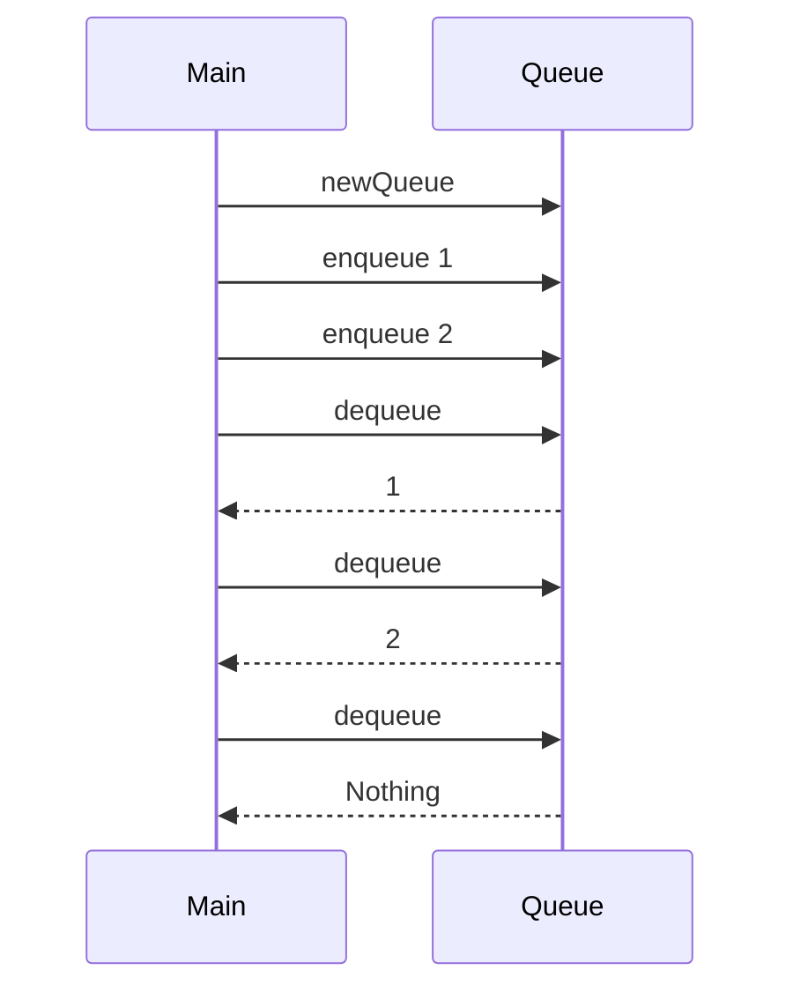

## 14.10 Testing Asynchronous and Concurrent Code

Testing asynchronous and concurrent code is a critical aspect of software development, especially in a functional programming language like Haskell. This section explores the challenges, strategies, and techniques for effectively testing concurrent systems in Haskell.

### Challenges in Testing Asynchronous and Concurrent Code

Concurrency introduces complexity due to nondeterminism and race conditions. These challenges make it difficult to ensure that concurrent systems behave correctly under all circumstances.

#### Nondeterminism

Nondeterminism arises when the order of execution is not predetermined. This can lead to different outcomes in different runs of the same program, making it challenging to reproduce bugs.

#### Race Conditions

Race conditions occur when multiple threads or processes access shared resources concurrently, and the final outcome depends on the order of access. This can lead to inconsistent or incorrect results.

### Strategies for Testing Concurrent Code

To effectively test concurrent code, we need strategies that help control concurrency and make tests deterministic.

#### Controlling Concurrency in Tests

One approach to testing concurrent code is to control the concurrency in tests. This can be achieved by using deterministic abstractions that allow us to simulate concurrent behavior in a controlled environment.

#### Using Deterministic Abstractions

Deterministic abstractions, such as software transactional memory (STM) and mock concurrency primitives, can help simulate concurrent behavior in a predictable manner. This allows us to test concurrent systems without the unpredictability of real-world concurrency.

### Example: Testing a Concurrent Data Structure

Let's explore an example of testing a concurrent data structure for correctness. We'll use a simple concurrent queue implemented using STM.

#### Implementing a Concurrent Queue

First, we'll implement a concurrent queue using STM. This queue will support basic operations like enqueue and dequeue.

```haskell
import Control.Concurrent.STM
import Control.Monad

-- Define a concurrent queue using STM
data ConcurrentQueue a = ConcurrentQueue (TVar [a])

-- Create a new empty queue
newQueue :: STM (ConcurrentQueue a)
newQueue = do
    tvar <- newTVar []
    return $ ConcurrentQueue tvar

-- Enqueue an element
enqueue :: ConcurrentQueue a -> a -> STM ()
enqueue (ConcurrentQueue tvar) x = do
    xs <- readTVar tvar
    writeTVar tvar (xs ++ [x])

-- Dequeue an element
dequeue :: ConcurrentQueue a -> STM (Maybe a)
dequeue (ConcurrentQueue tvar) = do
    xs <- readTVar tvar
    case xs of
        [] -> return Nothing
        (y:ys) -> do
            writeTVar tvar ys
            return (Just y)
```

#### Testing the Concurrent Queue

Now, let's write tests to ensure the correctness of our concurrent queue. We'll use the `Hspec` testing framework for this purpose.

```haskell
import Test.Hspec
import Control.Concurrent.STM

main :: IO ()
main = hspec $ do
    describe "ConcurrentQueue" $ do
        it "enqueues and dequeues elements correctly" $ do
            atomically $ do
                queue <- newQueue
                enqueue queue 1
                enqueue queue 2
                x <- dequeue queue
                y <- dequeue queue
                z <- dequeue queue
                liftIO $ x `shouldBe` Just 1
                liftIO $ y `shouldBe` Just 2
                liftIO $ z `shouldBe` Nothing
```

### Visualizing Concurrency in Haskell

To better understand how concurrency works in Haskell, let's visualize the flow of operations in our concurrent queue using a sequence diagram.



This diagram illustrates the sequence of operations in our concurrent queue, showing how elements are enqueued and dequeued.

### Advanced Testing Techniques

In addition to basic testing, there are advanced techniques that can help ensure the correctness of concurrent systems.

#### Property-Based Testing

Property-based testing is a powerful technique for testing concurrent systems. It involves specifying properties that the system should satisfy and generating random test cases to verify these properties.

#### Using QuickCheck for Property-Based Testing

QuickCheck is a popular library for property-based testing in Haskell. Let's use QuickCheck to test our concurrent queue.

```haskell
import Test.QuickCheck
import Control.Concurrent.STM

-- Property: Enqueuing and then dequeuing should return the same element
prop_enqueueDequeue :: Int -> Property
prop_enqueueDequeue x = monadicIO $ do
    queue <- run $ atomically newQueue
    run $ atomically $ enqueue queue x
    result <- run $ atomically $ dequeue queue
    assert (result == Just x)

main :: IO ()
main = quickCheck prop_enqueueDequeue
```

### Handling Nondeterminism in Tests

To handle nondeterminism in tests, we can use techniques like mocking and stubbing to simulate concurrent behavior in a controlled environment.

#### Mocking Concurrency Primitives

Mocking concurrency primitives allows us to simulate concurrent behavior without the unpredictability of real-world concurrency. This can be useful for testing systems that rely on concurrency primitives like threads and locks.

### Design Considerations for Concurrent Systems

When designing concurrent systems, it's important to consider factors like scalability, performance, and fault tolerance.

#### Scalability

Scalability is a key consideration for concurrent systems. We need to ensure that our systems can handle increasing workloads without degrading performance.

#### Performance

Performance is another important consideration. We need to ensure that our systems can perform efficiently under concurrent workloads.

#### Fault Tolerance

Fault tolerance is critical for concurrent systems. We need to ensure that our systems can recover from failures and continue to operate correctly.

### Haskell Unique Features for Concurrency

Haskell offers unique features that make it well-suited for concurrent programming.

#### Software Transactional Memory (STM)

STM is a powerful concurrency abstraction in Haskell that allows us to write concurrent code without the complexity of locks and threads.

#### Lightweight Threads

Haskell's lightweight threads make it easy to write concurrent programs without the overhead of traditional threads.

### Differences and Similarities with Other Patterns

Concurrent patterns in Haskell share similarities with patterns in other languages, but there are also key differences.

#### Similarities

- Both Haskell and other languages use concurrency primitives like threads and locks.
- Property-based testing is a common technique for testing concurrent systems in many languages.

#### Differences

- Haskell's STM provides a higher-level abstraction for concurrency compared to traditional locks and threads.
- Haskell's lightweight threads offer better performance and scalability compared to traditional threads.

### Try It Yourself

To deepen your understanding of testing concurrent code in Haskell, try modifying the concurrent queue example to support additional operations like `peek` and `isEmpty`. Write tests to ensure the correctness of these operations.

### Knowledge Check

- What are the main challenges in testing concurrent code?
- How can deterministic abstractions help in testing concurrent systems?
- What is the role of property-based testing in concurrent systems?

### Embrace the Journey

Remember, testing concurrent code is a challenging but rewarding task. As you progress, you'll gain a deeper understanding of concurrency and develop more robust and reliable systems. Keep experimenting, stay curious, and enjoy the journey!

## Quiz: Testing Asynchronous and Concurrent Code



### What is a common challenge in testing concurrent code?

- [x] Nondeterminism
- [ ] Determinism
- [ ] Simplicity
- [ ] Predictability

> **Explanation:** Nondeterminism is a common challenge in testing concurrent code because the order of execution is not predetermined.

### How can deterministic abstractions help in testing concurrent systems?

- [x] By simulating concurrent behavior in a controlled environment
- [ ] By introducing more nondeterminism
- [ ] By making tests less reliable
- [ ] By increasing complexity

> **Explanation:** Deterministic abstractions help by simulating concurrent behavior in a controlled environment, making tests more predictable and reliable.

### What is a race condition?

- [x] A situation where the outcome depends on the order of access to shared resources
- [ ] A condition where all threads run in parallel without issues
- [ ] A scenario where resources are never shared
- [ ] A type of deterministic behavior

> **Explanation:** A race condition occurs when the outcome depends on the order of access to shared resources, leading to inconsistent results.

### What is the purpose of property-based testing?

- [x] To specify properties that the system should satisfy and generate random test cases
- [ ] To write specific test cases for each possible input
- [ ] To ignore properties and focus on implementation details
- [ ] To simplify the testing process

> **Explanation:** Property-based testing involves specifying properties that the system should satisfy and generating random test cases to verify these properties.

### What is a unique feature of Haskell for concurrency?

- [x] Software Transactional Memory (STM)
- [ ] Traditional locks and threads
- [ ] Imperative concurrency models
- [ ] Lack of concurrency support

> **Explanation:** Haskell's Software Transactional Memory (STM) is a unique feature that provides a higher-level abstraction for concurrency.

### What is the benefit of using lightweight threads in Haskell?

- [x] Better performance and scalability
- [ ] Increased complexity
- [ ] Higher overhead
- [ ] Reduced reliability

> **Explanation:** Lightweight threads in Haskell offer better performance and scalability compared to traditional threads.

### How can mocking concurrency primitives help in testing?

- [x] By simulating concurrent behavior without real-world unpredictability
- [ ] By making tests less reliable
- [ ] By introducing more nondeterminism
- [ ] By increasing complexity

> **Explanation:** Mocking concurrency primitives allows us to simulate concurrent behavior without the unpredictability of real-world concurrency.

### What is a key consideration for designing concurrent systems?

- [x] Scalability
- [ ] Simplicity
- [ ] Lack of fault tolerance
- [ ] Ignoring performance

> **Explanation:** Scalability is a key consideration for designing concurrent systems to ensure they can handle increasing workloads.

### What is the role of STM in Haskell?

- [x] To provide a higher-level abstraction for concurrency
- [ ] To introduce more complexity
- [ ] To reduce reliability
- [ ] To ignore concurrency

> **Explanation:** STM provides a higher-level abstraction for concurrency, making it easier to write concurrent code without the complexity of locks and threads.

### True or False: Property-based testing is only useful for concurrent systems.

- [ ] True
- [x] False

> **Explanation:** False. Property-based testing is useful for testing various types of systems, not just concurrent ones.


