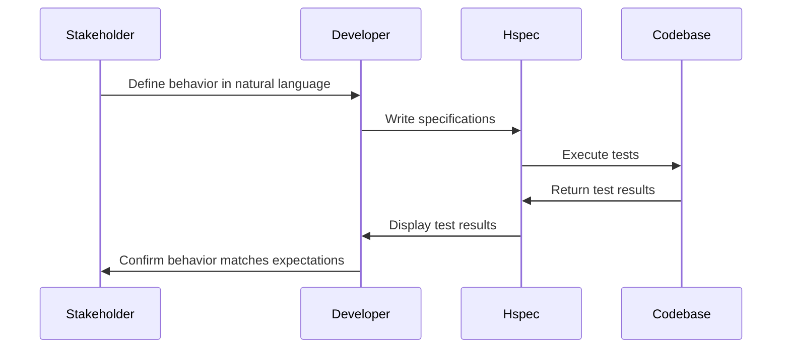

## 14.11 Behavior-Driven Development (BDD) with Hspec

Behavior-Driven Development (BDD) is a software development approach that emphasizes collaboration between developers, QA, and non-technical stakeholders. It focuses on creating a shared understanding of how an application should behave. In Haskell, Hspec is a popular testing framework that facilitates BDD by allowing developers to write tests in a descriptive and human-readable format. This section will guide you through the concepts of BDD, the usage of Hspec, and how to effectively apply these in Haskell projects.

### BDD Concepts

Behavior-Driven Development is centered around the idea of specifying the behavior of software in terms of examples that are understandable by all stakeholders. This approach ensures that the development process is aligned with business goals and user needs. Here are some key concepts of BDD:

- **Collaboration**: BDD encourages collaboration between developers, testers, and business stakeholders to ensure that everyone has a clear understanding of the requirements.
- **Ubiquitous Language**: BDD promotes the use of a common language that is shared by all stakeholders, reducing misunderstandings and miscommunications.
- **Executable Specifications**: BDD uses examples to specify the behavior of the system. These examples are written in a way that they can be executed as tests, providing a living documentation of the system's behavior.
- **Focus on Behavior**: BDD shifts the focus from testing the implementation to specifying the desired behavior of the system.

### Hspec Usage

Hspec is a testing framework for Haskell inspired by Ruby's RSpec. It allows you to write tests in a descriptive style, making them easy to read and understand. Hspec tests are organized into specifications, which describe the behavior of the system in terms of examples. Here's how you can use Hspec to implement BDD in Haskell:

1. **Installation**: To use Hspec, you need to add it to your project's dependencies. You can do this by adding `hspec` to your `cabal` or `stack` configuration file.

2. **Writing Specifications**: Hspec allows you to write specifications using a simple and expressive syntax. Each specification consists of a description of the behavior and a set of examples that demonstrate that behavior.

3. **Running Tests**: Hspec provides a command-line tool that you can use to run your tests. It outputs the results in a human-readable format, making it easy to see which tests passed and which failed.

4. **Integration with Continuous Integration**: Hspec can be easily integrated with continuous integration systems, allowing you to automatically run your tests whenever you make changes to your code.

### Example: Specifying Application Features in Terms of Examples

Let's walk through an example of using Hspec to specify the behavior of a simple calculator application. We'll start by defining the behavior we expect from the calculator and then write Hspec tests to verify that behavior.

#### Step 1: Define the Behavior

Before writing any code, we need to define the behavior we expect from the calculator. For example, we might want the calculator to be able to add, subtract, multiply, and divide numbers. We can express these requirements in natural language:

- The calculator should add two numbers correctly.
- The calculator should subtract two numbers correctly.
- The calculator should multiply two numbers correctly.
- The calculator should divide two numbers correctly, and handle division by zero gracefully.

#### Step 2: Write Hspec Tests

Now that we have defined the behavior, we can write Hspec tests to specify this behavior in terms of examples. Here's how we might write these tests:

```haskell
-- CalculatorSpec.hs
module CalculatorSpec (spec) where

import Test.Hspec
import Calculator (add, subtract, multiply, divide)

spec :: Spec
spec = do
  describe "Calculator" $ do
    it "adds two numbers correctly" $ do
      add 1 2 `shouldBe` 3

    it "subtracts two numbers correctly" $ do
      subtract 5 3 `shouldBe` 2

    it "multiplies two numbers correctly" $ do
      multiply 4 3 `shouldBe` 12

    it "divides two numbers correctly" $ do
      divide 6 2 `shouldBe` Right 3

    it "handles division by zero gracefully" $ do
      divide 6 0 `shouldBe` Left "Division by zero"
```

#### Step 3: Implement the Calculator

With our tests in place, we can now implement the calculator to satisfy these specifications:

```haskell
-- Calculator.hs
module Calculator (add, subtract, multiply, divide) where

add :: Int -> Int -> Int
add x y = x + y

subtract :: Int -> Int -> Int
subtract x y = x - y

multiply :: Int -> Int -> Int
multiply x y = x * y

divide :: Int -> Int -> Either String Int
divide _ 0 = Left "Division by zero"
divide x y = Right (x `div` y)
```

#### Step 4: Run the Tests

To run the tests, use the Hspec command-line tool:

```bash
$ stack test
```

This will execute the tests and provide a summary of the results.

### Visualizing BDD with Hspec

To better understand how BDD with Hspec works, let's visualize the process using a sequence diagram. This diagram illustrates the interaction between different components during the BDD process.



### Key Participants

- **Stakeholders**: Provide the requirements and expected behavior of the system.
- **Developers**: Translate the requirements into executable specifications using Hspec.
- **Hspec**: Executes the specifications and verifies that the code behaves as expected.
- **Codebase**: Contains the implementation that is being tested.

### Applicability

BDD with Hspec is particularly useful in scenarios where:

- There is a need for clear communication between technical and non-technical stakeholders.
- The project requires a living documentation of the system's behavior.
- The development process benefits from a focus on behavior rather than implementation details.

### Design Considerations

When using BDD with Hspec, consider the following:

- **Collaboration**: Ensure that all stakeholders are involved in the process of defining behavior.
- **Clarity**: Write specifications in a clear and concise manner, using language that is understandable by all stakeholders.
- **Maintainability**: Keep your specifications up to date as the system evolves.

### Haskell Unique Features

Haskell's strong type system and pure functional nature make it an excellent choice for BDD. The use of types can help ensure that specifications are precise and unambiguous. Additionally, Haskell's support for higher-order functions and function composition allows for expressive and concise specifications.

### Differences and Similarities

BDD is often compared to Test-Driven Development (TDD). While both approaches emphasize writing tests before code, BDD focuses more on the behavior of the system from the perspective of stakeholders, whereas TDD focuses on the correctness of the implementation.

### Try It Yourself

To deepen your understanding of BDD with Hspec, try modifying the calculator example:

- Add support for additional operations, such as exponentiation or modulus.
- Introduce a new feature, such as memory storage, and write specifications for it.
- Experiment with error handling by specifying and implementing behavior for invalid inputs.

### Knowledge Check

- What is the primary focus of BDD?
- How does Hspec facilitate BDD in Haskell?
- What are the benefits of using BDD with Hspec in a Haskell project?

### Embrace the Journey

Remember, mastering BDD with Hspec is a journey. As you continue to explore and experiment, you'll gain a deeper understanding of how to create software that truly meets the needs of its users. Keep collaborating, stay curious, and enjoy the process!

## Quiz: Behavior-Driven Development (BDD) with Hspec



### What is the primary focus of Behavior-Driven Development (BDD)?

- [x] Specifying the behavior of the system in terms of examples
- [ ] Testing the implementation details of the system
- [ ] Writing tests after the code is implemented
- [ ] Focusing solely on performance optimization

> **Explanation:** BDD focuses on specifying the behavior of the system in terms of examples that are understandable by all stakeholders.

### How does Hspec facilitate BDD in Haskell?

- [x] By allowing tests to be written in a descriptive and human-readable format
- [ ] By providing a graphical user interface for test execution
- [ ] By automatically generating code from specifications
- [ ] By focusing on performance testing

> **Explanation:** Hspec facilitates BDD by allowing developers to write tests in a descriptive style that aligns with the behavior expected by stakeholders.

### What is a key benefit of using BDD with Hspec in a Haskell project?

- [x] It creates a living documentation of the system's behavior
- [ ] It eliminates the need for manual testing
- [ ] It guarantees 100% code coverage
- [ ] It automatically optimizes the code for performance

> **Explanation:** BDD with Hspec creates a living documentation of the system's behavior, which helps ensure that the development process is aligned with business goals and user needs.

### In BDD, who typically defines the expected behavior of the system?

- [x] Stakeholders
- [ ] Developers
- [ ] Testers
- [ ] Project Managers

> **Explanation:** Stakeholders, including business analysts and product owners, typically define the expected behavior of the system in BDD.

### What is the role of Hspec in the BDD process?

- [x] To execute specifications and verify that the code behaves as expected
- [ ] To automatically generate specifications from code
- [ ] To provide a user interface for stakeholders
- [ ] To optimize the code for performance

> **Explanation:** Hspec executes the specifications and verifies that the code behaves as expected, providing feedback to developers and stakeholders.

### What is the main difference between BDD and TDD?

- [x] BDD focuses on behavior from the perspective of stakeholders, while TDD focuses on implementation correctness
- [ ] BDD is only used for web applications, while TDD is used for all types of applications
- [ ] BDD requires a graphical user interface, while TDD does not
- [ ] BDD is a subset of TDD

> **Explanation:** BDD focuses on the behavior of the system from the perspective of stakeholders, whereas TDD focuses on the correctness of the implementation.

### Which of the following is a unique feature of Haskell that benefits BDD?

- [x] Strong type system
- [ ] Dynamic typing
- [ ] Lack of type inference
- [ ] Object-oriented programming

> **Explanation:** Haskell's strong type system helps ensure that specifications are precise and unambiguous, which benefits BDD.

### What is the purpose of using a ubiquitous language in BDD?

- [x] To reduce misunderstandings and miscommunications
- [ ] To increase the complexity of specifications
- [ ] To ensure that only developers understand the specifications
- [ ] To focus on performance optimization

> **Explanation:** A ubiquitous language in BDD reduces misunderstandings and miscommunications by ensuring that all stakeholders use a common language.

### How can Hspec be integrated into a continuous integration system?

- [x] By automatically running tests whenever code changes are made
- [ ] By providing a graphical user interface for test execution
- [ ] By generating code from specifications
- [ ] By focusing on performance testing

> **Explanation:** Hspec can be integrated into a continuous integration system to automatically run tests whenever code changes are made, ensuring that the system behaves as expected.

### True or False: BDD with Hspec eliminates the need for collaboration between developers and stakeholders.

- [ ] True
- [x] False

> **Explanation:** BDD with Hspec emphasizes collaboration between developers and stakeholders to ensure that the system's behavior aligns with business goals and user needs.


