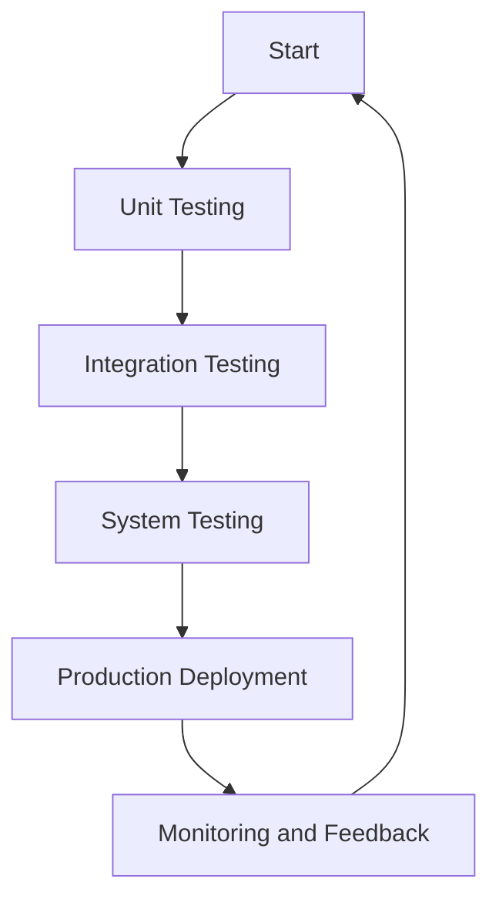

## 14.12 Integration and System Testing

Integration and system testing are critical phases in the software development lifecycle, ensuring that individual components and the entire system function correctly. In Haskell, these testing strategies leverage the language's functional programming paradigms to create robust, reliable, and maintainable software. This guide delves into the intricacies of integration and system testing within the Haskell ecosystem, providing expert insights and practical examples.

### Understanding Integration Testing

**Integration Testing** focuses on verifying the interactions between different components or modules of a software system. It ensures that integrated parts work together as expected. In Haskell, integration testing often involves testing the interactions between pure functions, monadic computations, and external systems like databases or web services.

#### Key Concepts in Integration Testing

- **Component Interaction**: Test how different modules or functions interact with each other.
- **Data Flow**: Verify the correctness of data passing between components.
- **Boundary Testing**: Check the interfaces between modules for correct data exchange.
- **Error Handling**: Ensure that errors are propagated and handled correctly across module boundaries.

#### Haskell-Specific Considerations

Haskell's strong type system and pure functions provide unique advantages for integration testing:

- **Type Safety**: Leverage Haskell's type system to catch integration issues at compile time.
- **Pure Functions**: Test pure functions in isolation before integrating them with impure components.
- **Monads**: Use monads to manage side effects and dependencies, facilitating easier integration testing.

#### Integration Testing Tools and Libraries

- **Hspec**: A testing framework for Haskell, useful for writing integration tests.
- **QuickCheck**: Property-based testing to verify properties of integrated components.
- **Servant**: For testing web APIs, providing tools to simulate HTTP requests and responses.

#### Example: Testing a Web Application

Consider a Haskell web application built using the Servant library. Integration testing involves verifying the interactions between the web server, database, and application logic.

```haskell
{-# LANGUAGE DataKinds #-}
{-# LANGUAGE TypeOperators #-}

import Servant
import Network.Wai.Handler.Warp (run)
import Test.Hspec
import Test.Hspec.Wai
import Test.Hspec.Wai.JSON

type API = "items" :> Get '[JSON] [String]

server :: Server API
server = return ["Item1", "Item2", "Item3"]

app :: Application
app = serve (Proxy :: Proxy API) server

main :: IO ()
main = hspec $ with (return app) $ do
  describe "GET /items" $ do
    it "responds with 200" $ do
      get "/items" `shouldRespondWith` 200
    it "responds with a list of items" $ do
      get "/items" `shouldRespondWith` "[\"Item1\",\"Item2\",\"Item3\"]"
```

In this example, we define a simple API and test its integration with the server using Hspec and Servant. The tests ensure that the server responds correctly to HTTP requests.

### Understanding System Testing

**System Testing** involves testing the complete software system in a production-like environment. It ensures that the entire application meets the specified requirements and functions correctly as a whole.

#### Key Concepts in System Testing

- **End-to-End Testing**: Test the entire application workflow from start to finish.
- **Environment Simulation**: Replicate the production environment to catch environment-specific issues.
- **User Scenarios**: Validate real-world user interactions with the system.
- **Performance Testing**: Assess the system's performance under load.

#### Haskell-Specific Considerations

- **Functional Purity**: Use Haskell's pure functions to simplify system testing by reducing side effects.
- **Concurrency**: Test concurrent and parallel components using Haskell's concurrency primitives.
- **Lazy Evaluation**: Ensure that lazy evaluation does not introduce unexpected behavior in the system.

#### System Testing Tools and Libraries

- **Hspec**: Extend Hspec for system-level tests.
- **Selenium**: Automate browser-based testing for web applications.
- **GHCi**: Use the interactive environment for exploratory testing.

#### Example: End-to-End Testing of a Web Application

For a comprehensive system test, consider a web application with a frontend, backend, and database. Use Selenium to automate browser interactions and verify the entire system's functionality.

```haskell
-- Pseudocode for Selenium-based system testing

import Selenium.WebDriver

main :: IO ()
main = runSession defaultConfig $ do
  openPage "http://localhost:8080"
  findElem (ByCSS "input#username") >>= sendKeys "testuser"
  findElem (ByCSS "input#password") >>= sendKeys "password"
  findElem (ByCSS "button#login") >>= click
  pageTitle <- getTitle
  liftIO $ putStrLn $ "Page title is: " ++ pageTitle
```

This pseudocode demonstrates how to use Selenium to automate a login process, verifying that the system behaves correctly from the user's perspective.

### Visualizing Integration and System Testing

To better understand the flow of integration and system testing, consider the following diagram:



**Diagram Description**: This flowchart illustrates the testing process, starting from unit testing, progressing through integration and system testing, and culminating in production deployment and monitoring.

### Best Practices for Integration and System Testing

- **Automate Tests**: Use automation tools to run tests consistently and efficiently.
- **Continuous Integration**: Integrate testing into the CI/CD pipeline for early detection of issues.
- **Mock External Services**: Use mocks and stubs to simulate external dependencies during testing.
- **Test Data Management**: Manage test data carefully to ensure repeatable and reliable tests.
- **Performance Benchmarks**: Establish performance benchmarks to evaluate system performance.

### Haskell Unique Features in Testing

Haskell's unique features, such as its type system, purity, and laziness, offer distinct advantages in testing:

- **Type-Driven Development**: Use types to guide test design and catch errors early.
- **Pure Functions**: Test pure functions in isolation, reducing the complexity of integration tests.
- **Lazy Evaluation**: Be mindful of lazy evaluation when designing tests to avoid unexpected behavior.

### Differences and Similarities with Other Testing Patterns

Integration and system testing are often confused with unit testing and acceptance testing. Here's how they differ:

- **Unit Testing**: Focuses on individual components, while integration testing focuses on interactions.
- **Acceptance Testing**: Validates the system against user requirements, similar to system testing but often involves stakeholders.

### Design Considerations

When designing integration and system tests, consider the following:

- **Test Coverage**: Ensure comprehensive coverage of all critical paths and interactions.
- **Scalability**: Design tests that can scale with the system as it grows.
- **Maintainability**: Write tests that are easy to maintain and update as the system evolves.

### Try It Yourself

Experiment with the provided code examples by modifying the API endpoints, adding new test cases, or integrating with a different database. This hands-on approach will deepen your understanding of integration and system testing in Haskell.

### Knowledge Check

- **Question**: What are the key differences between integration and system testing?
- **Exercise**: Write an integration test for a Haskell application that interacts with a database.
- **Summary**: Integration and system testing are essential for verifying the interactions and overall functionality of a software system. Haskell's unique features provide powerful tools for designing effective tests.

### Embrace the Journey

Remember, mastering integration and system testing in Haskell is a journey. As you progress, you'll build more complex and reliable systems. Keep experimenting, stay curious, and enjoy the process!

## Quiz: Integration and System Testing



### What is the primary focus of integration testing?

- [x] Testing interactions between components
- [ ] Testing individual components in isolation
- [ ] Testing the entire system in a production-like environment
- [ ] Testing user acceptance criteria

> **Explanation:** Integration testing focuses on verifying how different components work together.

### Which Haskell feature is particularly useful for catching integration issues at compile time?

- [x] Strong type system
- [ ] Lazy evaluation
- [ ] Monads
- [ ] Higher-order functions

> **Explanation:** Haskell's strong type system helps catch integration issues early in the development process.

### What is the main goal of system testing?

- [x] Testing the complete system in a production-like environment
- [ ] Testing individual components
- [ ] Testing interactions between modules
- [ ] Testing user interfaces

> **Explanation:** System testing involves testing the entire application to ensure it meets specified requirements.

### Which tool is commonly used for browser-based system testing in Haskell?

- [x] Selenium
- [ ] Hspec
- [ ] QuickCheck
- [ ] Servant

> **Explanation:** Selenium is used for automating browser interactions in system testing.

### What is a key advantage of using pure functions in integration testing?

- [x] Easier isolation and testing
- [ ] Increased complexity
- [ ] More side effects
- [ ] Reduced test coverage

> **Explanation:** Pure functions can be tested in isolation, simplifying integration testing.

### How can lazy evaluation affect system testing?

- [x] It can introduce unexpected behavior
- [ ] It simplifies test design
- [ ] It increases test coverage
- [ ] It has no effect on testing

> **Explanation:** Lazy evaluation can lead to unexpected behavior if not carefully managed during testing.

### What is a common practice to simulate external dependencies during testing?

- [x] Use mocks and stubs
- [ ] Use real services
- [ ] Ignore dependencies
- [ ] Use only pure functions

> **Explanation:** Mocks and stubs simulate external dependencies, making tests more reliable.

### What is the benefit of integrating testing into the CI/CD pipeline?

- [x] Early detection of issues
- [ ] Increased manual testing
- [ ] Reduced test coverage
- [ ] Delayed feedback

> **Explanation:** Integrating testing into the CI/CD pipeline allows for early detection of issues.

### Which testing strategy involves validating real-world user interactions?

- [x] System testing
- [ ] Unit testing
- [ ] Integration testing
- [ ] Acceptance testing

> **Explanation:** System testing validates the entire application, including real-world user interactions.

### True or False: Integration testing is the same as unit testing.

- [ ] True
- [x] False

> **Explanation:** Integration testing focuses on interactions between components, while unit testing focuses on individual components.


