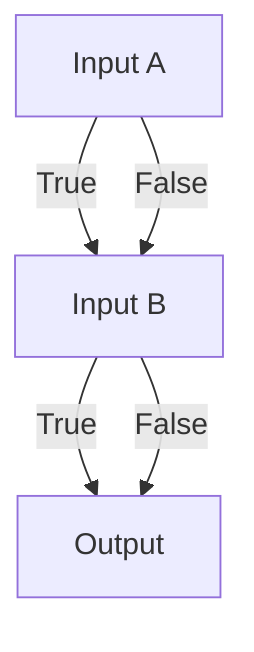
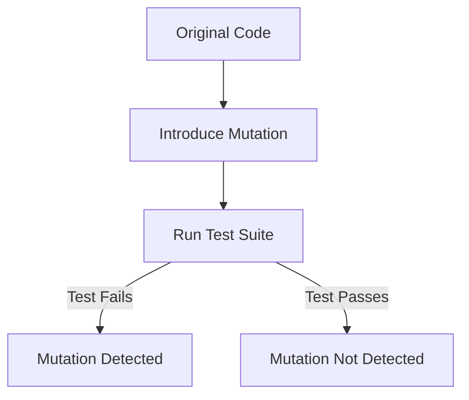
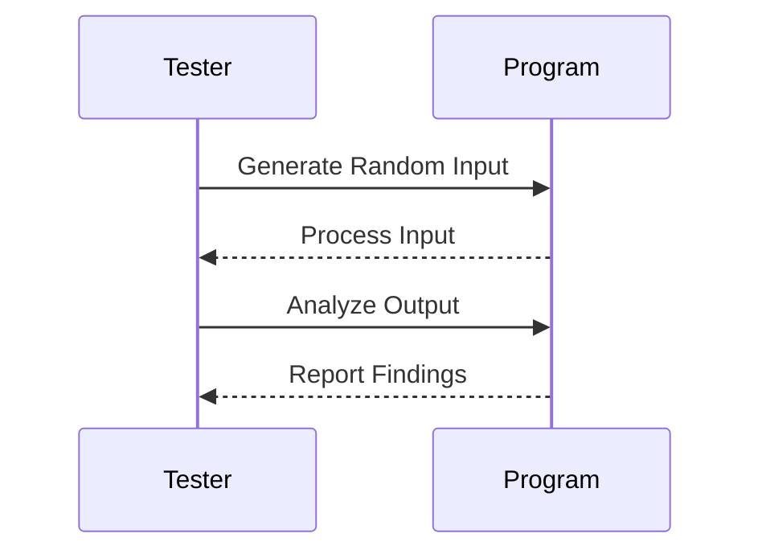

## 14.14 Advanced Testing Techniques

In the realm of software engineering, testing is a critical component that ensures the reliability and correctness of applications. As Haskell developers, we have a unique advantage due to the language's strong type system and functional nature, which inherently reduce many common bugs. However, to achieve high-quality software, we must employ advanced testing techniques that go beyond traditional unit testing. In this section, we will delve into combinatorial testing, mutation testing, and fuzzing, exploring how these techniques can be applied in Haskell to improve test coverage and software robustness.

### Combinatorial Testing

**Combinatorial testing** is a method that involves testing all possible combinations of input parameters. This technique is particularly useful for identifying interaction faults that occur when specific combinations of inputs lead to unexpected behavior.

#### Why Combinatorial Testing?

- **Comprehensive Coverage**: By testing all combinations, we ensure that no interaction between inputs is overlooked.
- **Efficiency**: While exhaustive testing of all input combinations can be infeasible, combinatorial testing focuses on a manageable subset that still provides significant coverage.
- **Fault Detection**: It is effective in uncovering faults that only manifest under specific input combinations.

#### Implementing Combinatorial Testing in Haskell

To implement combinatorial testing in Haskell, we can leverage libraries such as `QuickCheck` to generate combinations of inputs. Let's consider a simple example where we have a function that takes two boolean inputs and returns a boolean output.

```haskell
import Test.QuickCheck

-- A simple function that we want to test
andFunction :: Bool -> Bool -> Bool
andFunction a b = a && b

-- Property to test all combinations of inputs
prop_combinatorialTest :: Bool -> Bool -> Bool
prop_combinatorialTest a b = andFunction a b == (a && b)

-- Running the test
main :: IO ()
main = quickCheck prop_combinatorialTest
```

In this example, `QuickCheck` generates all possible combinations of boolean inputs, ensuring that our `andFunction` behaves as expected for each combination.

#### Visualizing Combinatorial Testing

To better understand how combinatorial testing works, let's visualize the process using a decision table.



This diagram illustrates the decision paths for a simple boolean function, highlighting how combinatorial testing covers all possible input paths.

### Mutation Testing

**Mutation testing** is a technique that involves modifying a program's source code in small ways (mutations) to test the effectiveness of test cases. The goal is to ensure that the test suite can detect these mutations, thereby demonstrating its robustness.

#### Why Mutation Testing?

- **Test Suite Evaluation**: Mutation testing provides a measure of the quality of your test suite by checking if it can catch introduced errors.
- **Improved Test Coverage**: It helps identify areas of the code that are not adequately tested.
- **Fault Detection**: By simulating potential faults, it ensures that the test suite is capable of detecting real bugs.

#### Implementing Mutation Testing in Haskell

In Haskell, mutation testing can be implemented using tools like `MuCheck`. Here's a basic example of how mutation testing can be applied to a simple function.

```haskell
-- Original function
multiply :: Int -> Int -> Int
multiply x y = x * y

-- Mutated version of the function
multiplyMutant :: Int -> Int -> Int
multiplyMutant x y = x + y

-- Test case
testMultiply :: Bool
testMultiply = multiply 2 3 == 6

-- Test case for mutant
testMultiplyMutant :: Bool
testMultiplyMutant = multiplyMutant 2 3 /= 6
```

In this example, we introduce a mutation by changing the multiplication operation to addition. The test case `testMultiplyMutant` should fail, indicating that the test suite is effective in catching this mutation.

#### Visualizing Mutation Testing

Let's visualize the mutation testing process using a flowchart.



This flowchart illustrates the steps involved in mutation testing, emphasizing the importance of detecting mutations to ensure test suite robustness.

### Fuzzing

**Fuzzing** is a technique that involves providing random data as input to a program to discover vulnerabilities and unexpected behavior. It is particularly effective in identifying edge cases and security vulnerabilities.

#### Why Fuzzing?

- **Uncovering Edge Cases**: Fuzzing can reveal unexpected behavior that occurs with unusual input data.
- **Security Testing**: It is widely used to identify security vulnerabilities, such as buffer overflows and injection attacks.
- **Automated Testing**: Fuzzing tools can automatically generate a wide range of inputs, reducing the manual effort required for testing.

#### Implementing Fuzzing in Haskell

In Haskell, fuzzing can be implemented using libraries like `FuzzCheck`. Let's consider an example where we fuzz a simple string processing function.

```haskell
import Test.FuzzCheck

-- A simple function that processes a string
processString :: String -> String
processString s = reverse s

-- Fuzz test
fuzzTest :: IO ()
fuzzTest = fuzzCheck processString
```

In this example, `FuzzCheck` generates random strings to test the `processString` function, helping identify any unexpected behavior.

#### Visualizing Fuzzing

To visualize the fuzzing process, let's use a sequence diagram.



This sequence diagram illustrates the interaction between the tester and the program during the fuzzing process, highlighting the steps involved in generating and analyzing random inputs.

### Combining Advanced Testing Techniques

By combining combinatorial testing, mutation testing, and fuzzing, we can achieve comprehensive test coverage and robust software quality. Each technique addresses different aspects of testing, and together they provide a holistic approach to software testing.

#### Practical Example: Testing a Calculator

Let's apply these techniques to a practical example: testing a simple calculator application.

```haskell
-- Calculator functions
add :: Int -> Int -> Int
add x y = x + y

subtract :: Int -> Int -> Int
subtract x y = x - y

multiply :: Int -> Int -> Int
multiply x y = x * y

divide :: Int -> Int -> Maybe Int
divide _ 0 = Nothing
divide x y = Just (x `div` y)

-- Combinatorial testing
prop_combinatorialAdd :: Int -> Int -> Bool
prop_combinatorialAdd x y = add x y == x + y

-- Mutation testing
multiplyMutant :: Int -> Int -> Int
multiplyMutant x y = x + y

testMultiplyMutant :: Bool
testMultiplyMutant = multiplyMutant 2 3 /= 6

-- Fuzzing
fuzzTestDivide :: IO ()
fuzzTestDivide = fuzzCheck divide
```

In this example, we apply combinatorial testing to the `add` function, mutation testing to the `multiply` function, and fuzzing to the `divide` function. This comprehensive approach ensures that our calculator application is thoroughly tested.

### Try It Yourself

To deepen your understanding, try modifying the code examples provided. Experiment with different input types, introduce new mutations, or create additional fuzz tests. This hands-on approach will help you grasp the nuances of each testing technique.

### Knowledge Check

- **Question**: What is the primary goal of combinatorial testing?
- **Challenge**: Implement a mutation test for the `subtract` function in the calculator example.
- **Exercise**: Create a fuzz test for a string parsing function that handles JSON data.

### Summary

In this section, we've explored advanced testing techniques in Haskell, including combinatorial testing, mutation testing, and fuzzing. These techniques provide powerful tools for enhancing test coverage and ensuring software reliability. By integrating these methods into your testing strategy, you can achieve a higher level of confidence in your Haskell applications.

Remember, this is just the beginning. As you continue to explore and experiment with these techniques, you'll discover new ways to improve your testing practices and build more robust software. Keep experimenting, stay curious, and enjoy the journey!

## Quiz: Advanced Testing Techniques



### What is the primary goal of combinatorial testing?

- [x] To test all possible combinations of input parameters
- [ ] To test only the most common input parameters
- [ ] To test the performance of the application
- [ ] To test the security of the application

> **Explanation:** Combinatorial testing aims to cover all possible combinations of input parameters to ensure comprehensive test coverage.

### Which technique involves modifying a program's source code to test the effectiveness of test cases?

- [x] Mutation testing
- [ ] Combinatorial testing
- [ ] Fuzzing
- [ ] Unit testing

> **Explanation:** Mutation testing involves introducing small changes (mutations) to the source code to evaluate the robustness of the test suite.

### What is the main advantage of fuzzing?

- [x] It can uncover edge cases and security vulnerabilities
- [ ] It provides exhaustive coverage of all input combinations
- [ ] It is the fastest testing technique
- [ ] It requires no setup or configuration

> **Explanation:** Fuzzing is effective in identifying edge cases and security vulnerabilities by providing random data as input to the program.

### In mutation testing, what does it mean if a test case fails?

- [x] The test suite is effective in catching the mutation
- [ ] The mutation was not detected
- [ ] The program has a bug
- [ ] The test case is incorrect

> **Explanation:** If a test case fails during mutation testing, it indicates that the test suite is effective in detecting the introduced mutation.

### Which library is commonly used for combinatorial testing in Haskell?

- [x] QuickCheck
- [ ] MuCheck
- [ ] FuzzCheck
- [ ] Hspec

> **Explanation:** QuickCheck is a popular library in Haskell used for property-based testing, including combinatorial testing.

### What does fuzzing primarily test for?

- [x] Unexpected behavior with random inputs
- [ ] Performance under load
- [ ] Code coverage
- [ ] User interface responsiveness

> **Explanation:** Fuzzing tests for unexpected behavior by providing random inputs to the program, helping identify edge cases and vulnerabilities.

### How does mutation testing help improve test coverage?

- [x] By identifying areas of the code that are not adequately tested
- [ ] By generating random inputs
- [ ] By testing all input combinations
- [ ] By measuring performance metrics

> **Explanation:** Mutation testing helps identify parts of the code that are not adequately tested by introducing mutations and checking if the test suite can detect them.

### What is a key benefit of using combinatorial testing?

- [x] It ensures that no interaction between inputs is overlooked
- [ ] It is the fastest testing technique
- [ ] It requires no setup or configuration
- [ ] It focuses only on edge cases

> **Explanation:** Combinatorial testing ensures that all interactions between inputs are tested, providing comprehensive coverage.

### Which testing technique is particularly useful for security testing?

- [x] Fuzzing
- [ ] Combinatorial testing
- [ ] Mutation testing
- [ ] Unit testing

> **Explanation:** Fuzzing is widely used for security testing as it can uncover vulnerabilities by providing random inputs to the program.

### True or False: Mutation testing can be used to evaluate the quality of a test suite.

- [x] True
- [ ] False

> **Explanation:** True. Mutation testing evaluates the quality of a test suite by checking if it can detect introduced mutations.


