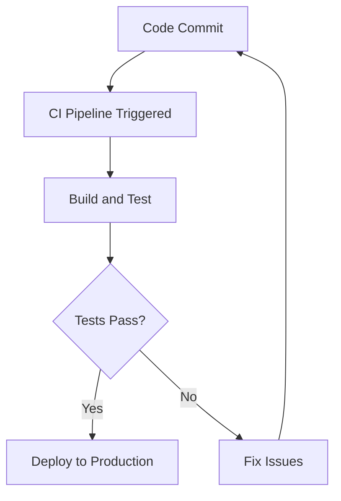

## 14.15 Continuous Integration and Delivery Pipelines

In the modern software development landscape, Continuous Integration (CI) and Continuous Delivery (CD) are essential practices that enable teams to deliver high-quality software efficiently and reliably. This section delves into the concepts, tools, and implementation strategies for setting up CI/CD pipelines specifically tailored for Haskell projects.

### Understanding CI/CD Concepts

Continuous Integration and Continuous Delivery are practices that aim to automate the software development lifecycle, from code integration to deployment. Let's break down these concepts:

- **Continuous Integration (CI)**: This involves automatically integrating code changes from multiple contributors into a shared repository. The main goals are to detect integration issues early, ensure code quality, and maintain a stable codebase. CI typically includes automated testing and builds.

- **Continuous Delivery (CD)**: This extends CI by automating the deployment process, ensuring that code changes can be released to production at any time. CD focuses on delivering software in short cycles, reducing the time to market, and minimizing risks associated with deployment.

### Benefits of CI/CD for Haskell Projects

Implementing CI/CD pipelines in Haskell projects offers several advantages:

- **Improved Code Quality**: Automated testing ensures that code changes do not introduce regressions or bugs.
- **Faster Feedback**: Developers receive immediate feedback on their code changes, allowing for quicker iterations.
- **Reduced Manual Effort**: Automation reduces the need for manual testing and deployment, freeing up developer time for more valuable tasks.
- **Enhanced Collaboration**: CI/CD encourages collaboration by integrating code changes frequently and resolving conflicts early.
- **Increased Deployment Frequency**: With automated deployment, teams can release features and fixes more frequently and reliably.

### Key CI/CD Tools for Haskell

Several tools can help automate the CI/CD process for Haskell projects. Here are some popular options:

- **Travis CI**: A cloud-based CI service that integrates seamlessly with GitHub. It supports Haskell out of the box and provides a simple configuration file to define build and test steps.

- **GitHub Actions**: A powerful automation platform that allows you to define workflows directly in your GitHub repository. It supports Haskell and offers a wide range of pre-built actions for common tasks.

- **Jenkins**: An open-source automation server that can be customized to fit any CI/CD workflow. Jenkins supports Haskell through plugins and custom scripts.

### Implementing CI/CD Pipelines for Haskell Projects

Let's explore the steps to set up a CI/CD pipeline for a Haskell project using GitHub Actions as an example.

#### Step 1: Define the Workflow

Create a `.github/workflows/ci.yml` file in your repository to define the CI workflow. Here's a basic example:

```yaml
name: Haskell CI

on:
  push:
    branches:
      - main
  pull_request:
    branches:
      - main

jobs:
  build:
    runs-on: ubuntu-latest

    steps:
    - name: Checkout code
      uses: actions/checkout@v2

    - name: Set up GHC
      uses: actions/setup-haskell@v1
      with:
        ghc-version: '8.10.4'

    - name: Install dependencies
      run: |
        cabal update
        cabal install --only-dependencies

    - name: Build
      run: cabal build

    - name: Run tests
      run: cabal test
```

#### Step 2: Automate Testing

Ensure that your Haskell project includes a comprehensive test suite. Use libraries like `Hspec` or `QuickCheck` to write unit and property-based tests. The CI pipeline will automatically run these tests on every code change.

#### Step 3: Continuous Deployment

To implement Continuous Deployment, extend the workflow to include deployment steps. For example, you can deploy to a cloud provider or a package registry. Here's a simplified example of deploying to AWS:

```yaml
deploy:
  runs-on: ubuntu-latest
  needs: build

  steps:
  - name: Checkout code
    uses: actions/checkout@v2

  - name: Deploy to AWS
    env:
      AWS_ACCESS_KEY_ID: ${{ secrets.AWS_ACCESS_KEY_ID }}
      AWS_SECRET_ACCESS_KEY: ${{ secrets.AWS_SECRET_ACCESS_KEY }}
    run: |
      aws s3 sync ./build s3://my-haskell-app-bucket
```

### Example: Automatically Running Tests and Deploying on Code Changes

Let's walk through a complete example of setting up a CI/CD pipeline for a Haskell project using GitHub Actions.

1. **Create a New Haskell Project**: Use `cabal` or `stack` to initialize a new Haskell project.

2. **Write Tests**: Add unit tests using `Hspec` or property-based tests using `QuickCheck`.

3. **Configure GitHub Actions**: Create a `.github/workflows/ci.yml` file with the workflow definition.

4. **Push Changes**: Commit and push your code changes to GitHub. The CI pipeline will automatically trigger, running the build and test steps.

5. **Monitor Results**: Check the GitHub Actions tab in your repository to view the status of the CI pipeline. Fix any issues and iterate as needed.

6. **Deploy**: Once the tests pass, the deployment step will automatically run, deploying your application to the specified environment.

### Visualizing CI/CD Workflow

To better understand the CI/CD process, let's visualize it using a flowchart.



**Diagram Description**: This flowchart illustrates the CI/CD workflow. It starts with a code commit, triggering the CI pipeline. The code is built and tested, and if the tests pass, the application is deployed to production. If the tests fail, the developer fixes the issues and recommits the code.

### Best Practices for CI/CD in Haskell

- **Keep Pipelines Fast**: Optimize build and test times to provide quick feedback. Use caching strategies to speed up dependency installation.

- **Ensure Reproducibility**: Use tools like `Nix` or `Docker` to create reproducible build environments.

- **Secure Secrets**: Store sensitive information like API keys and credentials securely using GitHub Secrets or environment variables.

- **Monitor and Improve**: Continuously monitor the CI/CD pipeline for failures and bottlenecks. Use metrics and logs to identify areas for improvement.

### Try It Yourself

Experiment with setting up a CI/CD pipeline for your own Haskell project. Start with a simple workflow and gradually add complexity as needed. Try modifying the example workflow to include additional steps, such as code linting or integration tests.

### References and Further Reading

- [GitHub Actions Documentation](https://docs.github.com/en/actions)
- [Travis CI Documentation](https://docs.travis-ci.com/)
- [Jenkins Documentation](https://www.jenkins.io/doc/)
- [Hspec Testing Library](https://hspec.github.io/)
- [QuickCheck Property-Based Testing](https://hackage.haskell.org/package/QuickCheck)

### Knowledge Check

- What are the main goals of Continuous Integration?
- How does Continuous Delivery extend Continuous Integration?
- What are some popular CI/CD tools for Haskell projects?
- How can you ensure reproducibility in CI/CD pipelines?
- What are some best practices for securing secrets in CI/CD workflows?

### Summary

In this section, we've explored the concepts and implementation of Continuous Integration and Delivery pipelines for Haskell projects. By automating the build, test, and deployment processes, we can improve code quality, reduce manual effort, and deliver software more efficiently. Remember, this is just the beginning. As you progress, you'll refine and optimize your CI/CD workflows to meet the unique needs of your projects. Keep experimenting, stay curious, and enjoy the journey!

## Quiz: Continuous Integration and Delivery Pipelines



### What is the primary goal of Continuous Integration (CI)?

- [x] To automatically integrate code changes and detect issues early
- [ ] To deploy code changes to production
- [ ] To manage project dependencies
- [ ] To write unit tests

> **Explanation:** Continuous Integration focuses on automatically integrating code changes and detecting issues early to maintain a stable codebase.

### Which tool is a cloud-based CI service that integrates with GitHub?

- [x] Travis CI
- [ ] Jenkins
- [ ] CircleCI
- [ ] Bamboo

> **Explanation:** Travis CI is a cloud-based CI service that integrates seamlessly with GitHub.

### What does Continuous Delivery (CD) aim to automate?

- [x] The deployment process
- [ ] Code integration
- [ ] Writing tests
- [ ] Managing dependencies

> **Explanation:** Continuous Delivery aims to automate the deployment process, ensuring code changes can be released to production at any time.

### Which of the following is a benefit of implementing CI/CD in Haskell projects?

- [x] Improved code quality
- [ ] Increased manual testing
- [ ] Slower feedback loops
- [ ] Reduced collaboration

> **Explanation:** CI/CD improves code quality by automating testing and providing immediate feedback on code changes.

### What is a best practice for securing secrets in CI/CD workflows?

- [x] Use GitHub Secrets or environment variables
- [ ] Store them in plain text files
- [ ] Hardcode them in the source code
- [ ] Share them via email

> **Explanation:** Using GitHub Secrets or environment variables is a best practice for securing sensitive information in CI/CD workflows.

### How can you ensure reproducibility in CI/CD pipelines?

- [x] Use tools like Nix or Docker
- [ ] Manually configure each build environment
- [ ] Avoid using version control
- [ ] Use different environments for each build

> **Explanation:** Tools like Nix or Docker help create reproducible build environments, ensuring consistency across builds.

### What is the purpose of the `cabal update` command in a CI pipeline?

- [x] To update the list of available packages
- [ ] To build the project
- [ ] To run tests
- [ ] To deploy the application

> **Explanation:** The `cabal update` command updates the list of available packages, ensuring the latest versions are used.

### Which step in a CI/CD pipeline involves running automated tests?

- [x] Continuous Integration
- [ ] Continuous Deployment
- [ ] Code Review
- [ ] Code Commit

> **Explanation:** Automated tests are typically run during the Continuous Integration phase to ensure code quality.

### What is a common strategy to speed up dependency installation in CI pipelines?

- [x] Use caching
- [ ] Increase server resources
- [ ] Run tests in parallel
- [ ] Use a different programming language

> **Explanation:** Caching is a common strategy to speed up dependency installation by reusing previously downloaded packages.

### True or False: Continuous Delivery requires manual approval for every deployment.

- [ ] True
- [x] False

> **Explanation:** Continuous Delivery automates the deployment process, allowing code changes to be released to production without manual approval.


