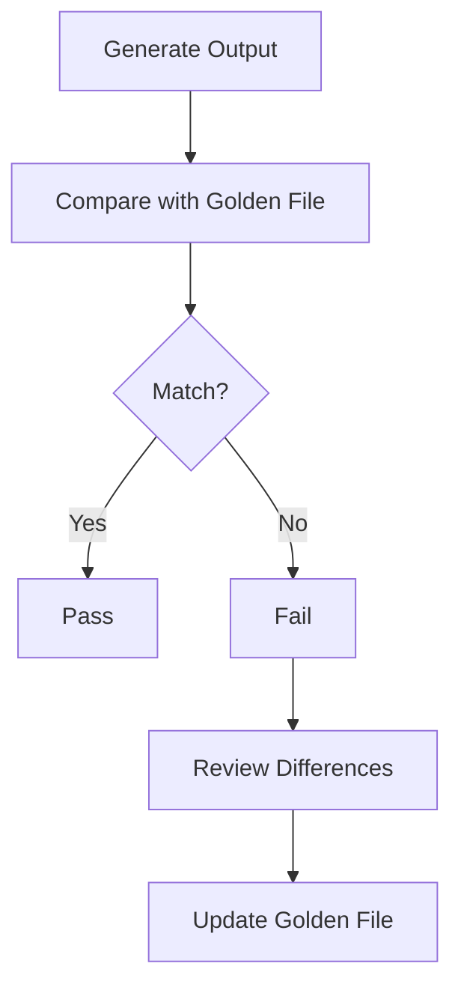
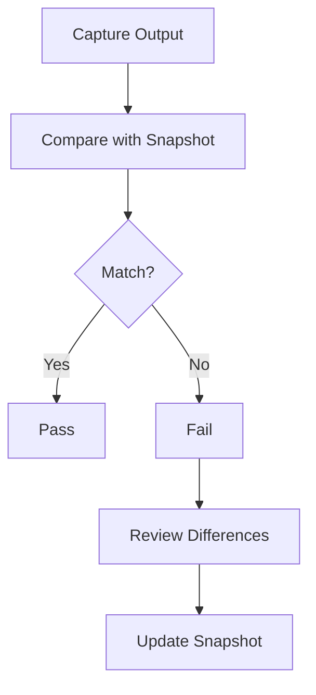

## 14.16 Golden Testing and Snapshot Testing

In the realm of software testing, ensuring that your code behaves as expected is paramount. For Haskell developers, two powerful techniques—Golden Testing and Snapshot Testing—offer robust solutions for validating complex outputs. This section delves into these testing methodologies, providing expert insights, practical examples, and best practices for implementing them in Haskell projects.

### Introduction to Golden Testing

Golden Testing is a technique where the output of a function or program is compared against a "golden" or known-good snapshot. This approach is particularly useful for validating outputs that are complex, large, or difficult to verify manually.

#### Intent

The primary intent of Golden Testing is to ensure that changes in the codebase do not inadvertently alter the expected output. By maintaining a set of golden files, developers can quickly identify when a change has affected the output, allowing for rapid debugging and correction.

#### Key Participants

- **Golden Files**: These are the reference outputs against which current outputs are compared.
- **Test Suite**: A collection of tests that generate outputs and compare them to the golden files.
- **Diff Tool**: A utility to highlight differences between the current output and the golden file.

### Applicability

Golden Testing is applicable in scenarios where:

- The output is too complex or voluminous to verify manually.
- The output format is stable and unlikely to change frequently.
- Regression testing is critical to ensure that new changes do not break existing functionality.

### Sample Code Snippet

Let's explore a simple example of Golden Testing in Haskell. Suppose we have a function that generates a report from a dataset:

```haskell
module ReportGenerator where

import Data.List (intercalate)

-- A simple function to generate a CSV report from a list of tuples
generateReport :: [(String, Int)] -> String
generateReport dataRows =
    let header = "Name,Score"
        rows = map (\\(name, score) -> name ++ "," ++ show score) dataRows
    in intercalate "\n" (header : rows)
```

To implement Golden Testing, we need to:

1. Generate the report.
2. Compare it against a pre-existing golden file.

```haskell
module Main where

import ReportGenerator
import System.IO
import System.Exit (exitFailure)

-- Function to read the golden file
readGoldenFile :: FilePath -> IO String
readGoldenFile path = readFile path

-- Function to write the current output to a file
writeCurrentOutput :: FilePath -> String -> IO ()
writeCurrentOutput path content = writeFile path content

-- Function to compare the current output with the golden file
compareWithGolden :: FilePath -> FilePath -> IO ()
compareWithGolden goldenPath currentPath = do
    goldenContent <- readGoldenFile goldenPath
    currentContent <- readGoldenFile currentPath
    if goldenContent == currentContent
        then putStrLn "Test passed: Output matches the golden file."
        else do
            putStrLn "Test failed: Output does not match the golden file."
            exitFailure

main :: IO ()
main = do
    let dataRows = [("Alice", 85), ("Bob", 90), ("Charlie", 78)]
    let report = generateReport dataRows
    let currentOutputPath = "current_output.csv"
    let goldenFilePath = "golden_output.csv"

    writeCurrentOutput currentOutputPath report
    compareWithGolden goldenFilePath currentOutputPath
```

### Design Considerations

- **Version Control**: Store golden files in version control to track changes over time.
- **Diff Tools**: Use diff tools to visualize differences when tests fail.
- **Update Strategy**: Establish a clear strategy for updating golden files when intentional changes are made.

### Haskell Unique Features

Haskell's strong type system and pure functions make it an ideal candidate for Golden Testing. The immutability of data ensures that tests are repeatable and consistent.

### Differences and Similarities

Golden Testing is often confused with Snapshot Testing. While both involve comparing outputs to a reference, Snapshot Testing is typically more dynamic and used in environments where outputs change frequently.

### Snapshot Testing

Snapshot Testing is a technique where the output of a function or component is captured and stored as a snapshot. This snapshot is then used as a reference for future tests.

#### Intent

The intent of Snapshot Testing is to capture the current state of an output and use it as a baseline for detecting changes. This is particularly useful in UI testing, where visual changes need to be tracked.

#### Key Participants

- **Snapshots**: Captured outputs stored for future comparison.
- **Test Runner**: Executes tests and compares outputs to snapshots.
- **Update Mechanism**: Allows for updating snapshots when changes are intentional.

### Applicability

Snapshot Testing is applicable in scenarios where:

- Outputs are expected to change frequently.
- Visual or UI components need to be tested.
- Rapid feedback on changes is required.

### Sample Code Snippet

Consider a Haskell web application where we need to test the HTML output of a page:

```haskell
module WebPageRenderer where

-- A simple function to render an HTML page
renderPage :: String -> String
renderPage title =
    "<html><head><title>" ++ title ++ "</title></head><body><h1>" ++ title ++ "</h1></body></html>"
```

To implement Snapshot Testing, we capture the HTML output and compare it to a stored snapshot:

```haskell
module Main where

import WebPageRenderer
import System.IO
import System.Exit (exitFailure)

-- Function to read the snapshot file
readSnapshot :: FilePath -> IO String
readSnapshot path = readFile path

-- Function to write the current output to a file
writeCurrentOutput :: FilePath -> String -> IO ()
writeCurrentOutput path content = writeFile path content

-- Function to compare the current output with the snapshot
compareWithSnapshot :: FilePath -> FilePath -> IO ()
compareWithSnapshot snapshotPath currentPath = do
    snapshotContent <- readSnapshot snapshotPath
    currentContent <- readSnapshot currentPath
    if snapshotContent == currentContent
        then putStrLn "Test passed: Output matches the snapshot."
        else do
            putStrLn "Test failed: Output does not match the snapshot."
            exitFailure

main :: IO ()
main = do
    let title = "Welcome to Haskell"
    let page = renderPage title
    let currentOutputPath = "current_output.html"
    let snapshotPath = "snapshot.html"

    writeCurrentOutput currentOutputPath page
    compareWithSnapshot snapshotPath currentOutputPath
```

### Design Considerations

- **Snapshot Management**: Regularly review and update snapshots to reflect intentional changes.
- **Automation**: Integrate snapshot testing into CI/CD pipelines for continuous feedback.
- **Tooling**: Utilize tools that support snapshot testing for efficient management.

### Haskell Unique Features

Haskell's lazy evaluation and pure functions facilitate efficient snapshot testing by ensuring that outputs are consistent and predictable.

### Differences and Similarities

Snapshot Testing is more dynamic than Golden Testing, making it suitable for environments where outputs change frequently. However, both techniques share the common goal of ensuring output consistency.

### Visualizing Golden and Snapshot Testing

To better understand the workflow of Golden and Snapshot Testing, let's visualize the process using Mermaid.js diagrams.

#### Golden Testing Workflow



#### Snapshot Testing Workflow



### References and Links

For further reading on Golden Testing and Snapshot Testing, consider the following resources:

- [Haskell Testing Libraries](https://hackage.haskell.org/packages/#cat:Testing)
- [Golden Testing in Haskell](https://www.fpcomplete.com/blog/2017/09/testing-with-golden-files)
- [Snapshot Testing with Jest](https://jestjs.io/docs/snapshot-testing)

### Knowledge Check

- What are the primary differences between Golden Testing and Snapshot Testing?
- How can you integrate Golden Testing into a CI/CD pipeline?
- What are the benefits of using Haskell's type system in testing?

### Embrace the Journey

Remember, mastering Golden and Snapshot Testing is just the beginning. As you progress, you'll build more robust and reliable applications. Keep experimenting, stay curious, and enjoy the journey!

### Quiz: Golden Testing and Snapshot Testing



### What is the primary purpose of Golden Testing?

- [x] To compare output to a known-good snapshot
- [ ] To test performance optimizations
- [ ] To automate deployment processes
- [ ] To manage dependencies

> **Explanation:** Golden Testing involves comparing the output of a function or program to a known-good snapshot to ensure consistency.

### In which scenario is Snapshot Testing most applicable?

- [x] When outputs are expected to change frequently
- [ ] When testing low-level algorithms
- [ ] When optimizing memory usage
- [ ] When managing database connections

> **Explanation:** Snapshot Testing is ideal for environments where outputs change frequently, such as UI components.

### What is a key benefit of using Haskell for Golden Testing?

- [x] Strong type system ensures consistent outputs
- [ ] Dynamic typing allows for flexible tests
- [ ] Built-in support for UI testing
- [ ] Automatic memory management

> **Explanation:** Haskell's strong type system and pure functions ensure that outputs are consistent and repeatable.

### How can you visualize differences in Golden Testing?

- [x] Using diff tools
- [ ] Using performance profilers
- [ ] Using memory analyzers
- [ ] Using dependency graphs

> **Explanation:** Diff tools are used to visualize differences between the current output and the golden file.

### What is a common tool used for Snapshot Testing in JavaScript?

- [x] Jest
- [ ] Mocha
- [ ] Jasmine
- [ ] Karma

> **Explanation:** Jest is a popular testing framework in JavaScript that supports Snapshot Testing.

### Which of the following is a key participant in Golden Testing?

- [x] Golden Files
- [ ] Memory Allocators
- [ ] Dependency Managers
- [ ] UI Components

> **Explanation:** Golden Files are the reference outputs against which current outputs are compared in Golden Testing.

### What is the role of a test runner in Snapshot Testing?

- [x] To execute tests and compare outputs to snapshots
- [ ] To manage memory allocation
- [ ] To optimize code performance
- [ ] To handle database transactions

> **Explanation:** The test runner executes tests and compares the outputs to stored snapshots.

### How can you integrate Snapshot Testing into a CI/CD pipeline?

- [x] Automate tests to run on each commit
- [ ] Manually review each snapshot
- [ ] Optimize code for performance
- [ ] Manage dependencies manually

> **Explanation:** Automating Snapshot Testing to run on each commit provides continuous feedback in a CI/CD pipeline.

### What is a key consideration when managing snapshots?

- [x] Regularly review and update snapshots
- [ ] Optimize for memory usage
- [ ] Minimize code dependencies
- [ ] Automate deployment processes

> **Explanation:** Regularly reviewing and updating snapshots ensures they reflect intentional changes.

### True or False: Golden Testing is more dynamic than Snapshot Testing.

- [ ] True
- [x] False

> **Explanation:** Snapshot Testing is more dynamic than Golden Testing, as it is used in environments where outputs change frequently.




