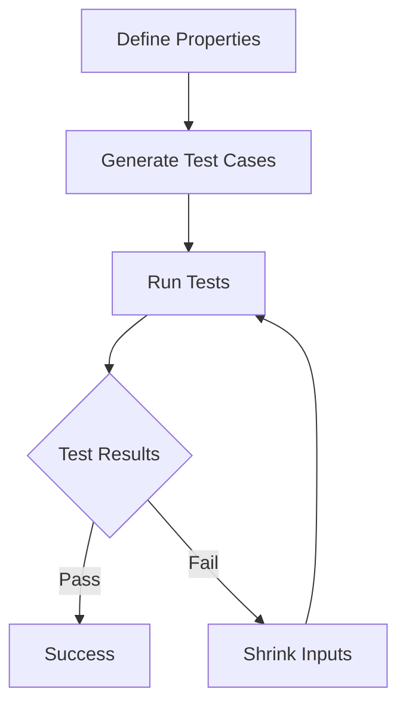

## 14.2 Property-Based Testing with QuickCheck

Property-based testing is a powerful paradigm that shifts the focus from writing individual test cases to defining the properties that a function should satisfy for all possible inputs. In Haskell, the QuickCheck library is a popular tool for implementing property-based testing. This section will guide you through the concepts, usage, and benefits of QuickCheck, providing you with the knowledge to enhance your software's robustness and reliability.

### Understanding Property-Based Testing

**Property-Based Testing** is a testing methodology where you define properties that your code should satisfy for a wide range of inputs. Unlike traditional unit tests, which check specific cases, property-based tests aim to validate the general behavior of your code.

#### Key Concepts

- **Properties**: Statements about the expected behavior of your code. For example, a property for a sorting function might state that the output list should be ordered.
- **Generators**: Tools that automatically create a wide range of input data for testing properties.
- **Shrinking**: The process of simplifying failing test cases to the smallest example that still fails, making debugging easier.

### QuickCheck: The Haskell Library for Property-Based Testing

**QuickCheck** is a Haskell library that automates the process of property-based testing. It generates random test cases, checks if the properties hold, and reports any failures.

#### Installing QuickCheck

To use QuickCheck, you need to install it via Cabal or Stack:

```bash
cabal update
cabal install QuickCheck
```

Or, if you're using Stack:

```bash
stack add QuickCheck
```

#### Writing Your First Property

Let's start with a simple example: testing a sorting function.

```haskell
import Test.QuickCheck

-- A simple sorting function
sort :: Ord a => [a] -> [a]
sort = undefined -- Assume this is implemented

-- Property: The output list should be ordered
prop_sorted :: [Int] -> Bool
prop_sorted xs = isSorted (sort xs)

-- Helper function to check if a list is sorted
isSorted :: Ord a => [a] -> Bool
isSorted [] = True
isSorted [x] = True
isSorted (x:y:xs) = x <= y && isSorted (y:xs)

-- Running the test
main :: IO ()
main = quickCheck prop_sorted
```

### Deep Dive into QuickCheck

#### Defining Properties

Properties in QuickCheck are defined as Haskell functions that return a `Bool`. They express the expected behavior of your code.

- **Commutativity**: For a function `f`, `f x y` should equal `f y x`.
- **Associativity**: For a function `f`, `f (f x y) z` should equal `f x (f y z)`.

#### Generators and Arbitrary Instances

QuickCheck uses generators to produce random inputs. The `Arbitrary` type class is central to this process.

```haskell
instance Arbitrary MyType where
  arbitrary = do
    -- Define how to generate random instances of MyType
```

#### Shrinking

When a test fails, QuickCheck attempts to shrink the input to a simpler form that still causes the failure. This helps in identifying the root cause of the problem.

### Advanced QuickCheck Techniques

#### Custom Generators

Sometimes, the default generators are not sufficient. You can define custom generators to control the distribution of test data.

```haskell
genEven :: Gen Int
genEven = do
  n <- arbitrary
  return (n * 2)
```

#### Conditional Properties

You can use the `==>` operator to specify conditions under which a property should hold.

```haskell
prop_nonEmptyList :: [Int] -> Property
prop_nonEmptyList xs = not (null xs) ==> head xs == last (reverse xs)
```

#### Combining Properties

Properties can be combined using logical operators to create more complex tests.

```haskell
prop_complex :: [Int] -> Bool
prop_complex xs = prop_sorted xs && prop_length xs
```

### Visualizing Property-Based Testing

To better understand the flow of property-based testing, let's visualize the process using a flowchart.



**Figure 1**: The flow of property-based testing with QuickCheck.

### Practical Applications of QuickCheck

#### Testing Data Structures

QuickCheck is particularly useful for testing data structures. For example, you can test that a binary search tree maintains its invariants after insertions and deletions.

#### Validating Algorithms

Algorithms often have properties that can be expressed and tested using QuickCheck. For instance, you can test that a graph algorithm maintains connectivity.

#### Ensuring Code Refactoring

When refactoring code, QuickCheck can help ensure that the new implementation behaves the same as the old one by comparing their outputs for a wide range of inputs.

### Best Practices for Property-Based Testing

- **Start Simple**: Begin with simple properties and gradually add complexity.
- **Use Shrinking**: Leverage shrinking to simplify failing test cases.
- **Combine Properties**: Use logical operators to combine properties and cover more ground.
- **Document Properties**: Clearly document what each property is testing.

### Common Pitfalls and How to Avoid Them

- **Over-Specification**: Avoid making properties too specific, as this can limit the effectiveness of the tests.
- **Ignoring Edge Cases**: Ensure that edge cases are considered in your properties.
- **Complex Generators**: Keep generators simple to avoid introducing errors in the test setup.

### Try It Yourself

Experiment with the provided code examples by modifying the properties or the sorting function. Try introducing a bug in the sorting function and observe how QuickCheck detects it.

### Further Reading and Resources

- [QuickCheck Documentation](https://hackage.haskell.org/package/QuickCheck)
- [Property-Based Testing: A Quick Introduction](https://www.fpcomplete.com/blog/2017/09/property-based-testing)
- [Haskell Wiki: QuickCheck](https://wiki.haskell.org/Introduction_to_QuickCheck2)

### Knowledge Check

- What is the primary advantage of property-based testing over traditional unit testing?
- How does QuickCheck simplify debugging when a test fails?
- Why is it important to define custom generators in some cases?

### Conclusion

Property-based testing with QuickCheck is a powerful tool in the Haskell developer's toolkit. It allows you to define and test the properties of your code, ensuring that it behaves correctly across a wide range of inputs. By mastering QuickCheck, you can significantly enhance the reliability and robustness of your software.

## Quiz: Property-Based Testing with QuickCheck



### What is the primary focus of property-based testing?

- [x] Defining properties that functions should satisfy for all inputs.
- [ ] Writing specific test cases for known inputs.
- [ ] Ensuring code coverage for all functions.
- [ ] Testing only edge cases.

> **Explanation:** Property-based testing focuses on defining properties that should hold for all possible inputs, rather than specific test cases.

### What does QuickCheck use to generate test cases?

- [x] Generators
- [ ] Manual input
- [ ] User-defined lists
- [ ] Random number generators

> **Explanation:** QuickCheck uses generators to automatically create a wide range of input data for testing properties.

### What is the purpose of shrinking in QuickCheck?

- [x] Simplifying failing test cases to the smallest example that still fails.
- [ ] Reducing the number of test cases.
- [ ] Minimizing the size of the input data.
- [ ] Optimizing the performance of tests.

> **Explanation:** Shrinking helps in identifying the root cause of a problem by simplifying failing test cases to the smallest example that still fails.

### How can you specify conditions under which a property should hold in QuickCheck?

- [x] Using the `==>` operator
- [ ] Using the `&&` operator
- [ ] Using the `||` operator
- [ ] Using the `not` operator

> **Explanation:** The `==>` operator is used to specify conditions under which a property should hold in QuickCheck.

### What is a common pitfall in property-based testing?

- [x] Over-specification of properties
- [ ] Under-specification of properties
- [ ] Using too many generators
- [ ] Ignoring test results

> **Explanation:** Over-specification can limit the effectiveness of the tests by making them too specific.

### What is a benefit of using QuickCheck for refactoring code?

- [x] Ensuring the new implementation behaves the same as the old one.
- [ ] Reducing the number of lines of code.
- [ ] Increasing code complexity.
- [ ] Simplifying the codebase.

> **Explanation:** QuickCheck can help ensure that the new implementation behaves the same as the old one by comparing their outputs for a wide range of inputs.

### Why might you need to define custom generators in QuickCheck?

- [x] To control the distribution of test data.
- [ ] To reduce the number of test cases.
- [ ] To simplify the test setup.
- [ ] To avoid using the `Arbitrary` type class.

> **Explanation:** Custom generators allow you to control the distribution of test data, which can be important for certain properties.

### What is a key advantage of property-based testing?

- [x] It tests the general behavior of your code.
- [ ] It focuses on specific edge cases.
- [ ] It reduces the need for documentation.
- [ ] It eliminates the need for unit tests.

> **Explanation:** Property-based testing focuses on the general behavior of your code, rather than specific cases.

### How does QuickCheck handle failing test cases?

- [x] By shrinking them to the simplest form that still fails.
- [ ] By ignoring them.
- [ ] By retrying them with different inputs.
- [ ] By logging them for later review.

> **Explanation:** QuickCheck shrinks failing test cases to the simplest form that still fails, making debugging easier.

### True or False: QuickCheck can only be used for testing pure functions.

- [x] False
- [ ] True

> **Explanation:** QuickCheck can be used for testing both pure and impure functions, although it is most commonly used with pure functions.



Remember, mastering property-based testing with QuickCheck is just the beginning. As you continue to explore Haskell's testing capabilities, you'll discover even more ways to ensure the quality and reliability of your software. Keep experimenting, stay curious, and enjoy the journey!
