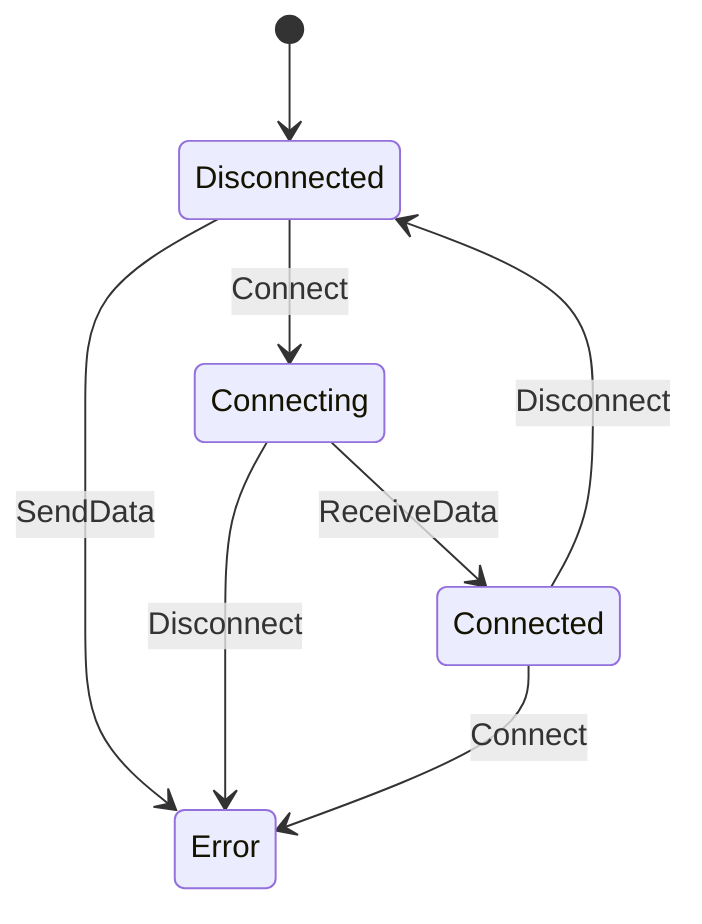

## 14.3 Model-Based Testing Strategies

Model-Based Testing (MBT) is a powerful technique that leverages abstract models to generate test cases, ensuring comprehensive coverage and robust software systems. In this section, we will delve into the intricacies of MBT, focusing on its implementation in Haskell. We will explore how to define state machines, derive tests, and apply these concepts to real-world scenarios like network protocol testing.

### Understanding Model-Based Testing

**Model-Based Testing** involves creating abstract representations of the system under test (SUT). These models serve as blueprints to generate test cases, ensuring that the system behaves as expected across various scenarios. The primary goal of MBT is to automate the testing process, reduce human error, and increase test coverage.

#### Key Concepts

- **Abstract Models**: Simplified representations of the SUT, capturing essential behaviors and interactions.
- **State Machines**: A common modeling technique used to represent the states and transitions of a system.
- **Test Case Generation**: The process of deriving executable tests from the abstract models.

### Why Use Model-Based Testing in Haskell?

Haskell's strong type system, immutability, and functional paradigm make it an ideal candidate for implementing MBT. The language's features facilitate the creation of precise and expressive models, enabling developers to generate reliable test cases.

#### Benefits of MBT in Haskell

- **Strong Typing**: Ensures model correctness and prevents runtime errors.
- **Immutability**: Simplifies reasoning about state transitions.
- **Higher-Order Functions**: Enable concise and flexible model definitions.

### Implementing Model-Based Testing

To implement MBT in Haskell, we follow a structured approach:

1. **Define the Model**: Create an abstract representation of the SUT using state machines or protocols.
2. **Generate Test Cases**: Derive test cases from the model, ensuring comprehensive coverage.
3. **Execute Tests**: Run the generated tests against the SUT to validate its behavior.

#### Step 1: Define the Model

The first step in MBT is to define an abstract model of the SUT. This model typically consists of states, transitions, and actions. Let's consider a simple example of a network protocol.

```haskell
-- Define the states of the protocol
data ProtocolState = Disconnected | Connecting | Connected | Error deriving (Show, Eq)

-- Define the events that can occur
data ProtocolEvent = Connect | Disconnect | SendData | ReceiveData deriving (Show, Eq)

-- Define the state transitions
transition :: ProtocolState -> ProtocolEvent -> ProtocolState
transition Disconnected Connect = Connecting
transition Connecting ReceiveData = Connected
transition Connected Disconnect = Disconnected
transition _ _ = Error
```

In this example, we define a simple state machine for a network protocol with four states and four events. The `transition` function describes how the system moves between states based on events.

#### Step 2: Generate Test Cases

Once the model is defined, we generate test cases by exploring all possible state transitions. This ensures that every path through the state machine is tested.

```haskell
-- Generate test cases by exploring state transitions
generateTestCases :: ProtocolState -> [ProtocolEvent] -> [(ProtocolState, ProtocolEvent, ProtocolState)]
generateTestCases state events = [(state, event, transition state event) | event <- events]

-- Example usage
testCases :: [(ProtocolState, ProtocolEvent, ProtocolState)]
testCases = generateTestCases Disconnected [Connect, Disconnect, SendData, ReceiveData]
```

The `generateTestCases` function explores all possible transitions from a given state, producing a list of test cases.

#### Step 3: Execute Tests

Finally, we execute the generated test cases against the SUT to validate its behavior.

```haskell
-- Execute test cases and validate the system behavior
executeTests :: [(ProtocolState, ProtocolEvent, ProtocolState)] -> Bool
executeTests cases = all (\\(start, event, expected) -> transition start event == expected) cases

-- Example usage
isValid :: Bool
isValid = executeTests testCases
```

The `executeTests` function checks that each transition in the test cases matches the expected behavior.

### Visualizing Model-Based Testing

To better understand the flow of MBT, let's visualize the state machine using a diagram.



This diagram illustrates the states and transitions of our network protocol model, providing a clear overview of the system's behavior.

### Advanced Model-Based Testing Techniques

As we delve deeper into MBT, we can explore advanced techniques to enhance our testing strategy.

#### Using Property-Based Testing

Haskell's property-based testing libraries, such as QuickCheck, can be integrated with MBT to automatically generate test inputs and validate properties of the model.

```haskell
import Test.QuickCheck

-- Define a property to test the protocol model
prop_protocol :: ProtocolState -> ProtocolEvent -> Bool
prop_protocol state event = transition state event /= Error

-- Run the property-based test
main :: IO ()
main = quickCheck prop_protocol
```

In this example, we define a property that ensures no transition leads to an `Error` state, and use QuickCheck to validate it.

#### Handling Complex Models

For more complex systems, we can extend our models with additional features such as guards, actions, and parallel states.

```haskell
-- Define guards and actions for complex models
data Guard = IsConnected | IsNotConnected deriving (Show, Eq)
data Action = LogEvent | SendAck deriving (Show, Eq)

-- Extend the transition function with guards and actions
transitionWithGuards :: ProtocolState -> ProtocolEvent -> Guard -> (ProtocolState, Action)
transitionWithGuards Connected SendData IsConnected = (Connected, SendAck)
transitionWithGuards state event _ = (transition state event, LogEvent)
```

This extended model includes guards and actions, allowing for more sophisticated testing scenarios.

### Real-World Application: Network Protocol Testing

Let's apply MBT to a real-world scenario: testing a network protocol implementation against its specification.

#### Define the Protocol Model

We start by defining a detailed model of the protocol, capturing all possible states and transitions.

```haskell
data NetworkState = Idle | Sending | Receiving | Closed deriving (Show, Eq)
data NetworkEvent = Open | Close | Send | Receive deriving (Show, Eq)

networkTransition :: NetworkState -> NetworkEvent -> NetworkState
networkTransition Idle Open = Sending
networkTransition Sending Send = Receiving
networkTransition Receiving Receive = Idle
networkTransition _ Close = Closed
networkTransition _ _ = Closed
```

#### Generate and Execute Test Cases

Next, we generate test cases from the model and execute them against the protocol implementation.

```haskell
networkTestCases :: [(NetworkState, NetworkEvent, NetworkState)]
networkTestCases = generateTestCases Idle [Open, Close, Send, Receive]

executeNetworkTests :: [(NetworkState, NetworkEvent, NetworkState)] -> Bool
executeNetworkTests cases = all (\\(start, event, expected) -> networkTransition start event == expected) cases

isNetworkValid :: Bool
isNetworkValid = executeNetworkTests networkTestCases
```

### Challenges and Considerations

While MBT offers numerous benefits, it also presents challenges that must be addressed:

- **Model Complexity**: Creating accurate models for complex systems can be challenging and time-consuming.
- **State Explosion**: Large state spaces can lead to an overwhelming number of test cases.
- **Tooling and Integration**: Integrating MBT with existing development workflows and tools may require additional effort.

### Best Practices for Model-Based Testing

To maximize the effectiveness of MBT, consider the following best practices:

- **Start Simple**: Begin with simple models and gradually increase complexity.
- **Iterate and Refine**: Continuously refine models based on test results and system changes.
- **Leverage Automation**: Use tools and libraries to automate test generation and execution.
- **Collaborate with Stakeholders**: Involve domain experts and stakeholders in the modeling process to ensure accuracy.

### Knowledge Check

Let's reinforce our understanding of MBT with a few questions:

- What are the key components of a model in MBT?
- How does Haskell's type system benefit MBT?
- What challenges might arise when implementing MBT for complex systems?

### Embrace the Journey

Remember, mastering MBT is a journey. As you progress, you'll gain deeper insights into your systems and develop more robust testing strategies. Keep experimenting, stay curious, and enjoy the process!

### References and Further Reading

- [QuickCheck: A Lightweight Tool for Random Testing of Haskell Programs](https://hackage.haskell.org/package/QuickCheck)
- [Model-Based Testing: A Guide for the Uninitiated](https://www.researchgate.net/publication/220742475_Model-Based_Testing_A_Guide_for_the_Uninitiated)
- [State Machines in Haskell](https://wiki.haskell.org/State_Machine)

## Quiz: Model-Based Testing Strategies



### What is the primary goal of Model-Based Testing (MBT)?

- [x] To automate the testing process and increase test coverage
- [ ] To manually test each component of the system
- [ ] To reduce the number of test cases
- [ ] To eliminate the need for testing

> **Explanation:** MBT aims to automate testing and ensure comprehensive coverage by generating test cases from abstract models.

### Which Haskell feature is particularly beneficial for MBT?

- [x] Strong typing
- [ ] Dynamic typing
- [ ] Weak typing
- [ ] No typing

> **Explanation:** Haskell's strong typing ensures model correctness and prevents runtime errors, making it ideal for MBT.

### What is a common modeling technique used in MBT?

- [x] State machines
- [ ] Neural networks
- [ ] Genetic algorithms
- [ ] Decision trees

> **Explanation:** State machines are commonly used in MBT to represent the states and transitions of a system.

### What is the first step in implementing MBT?

- [x] Define the model
- [ ] Execute tests
- [ ] Generate test cases
- [ ] Write documentation

> **Explanation:** The first step in MBT is to define an abstract model of the system under test.

### How can property-based testing be integrated with MBT in Haskell?

- [x] By using libraries like QuickCheck to generate test inputs and validate properties
- [ ] By manually writing test cases
- [ ] By using neural networks
- [ ] By eliminating test cases

> **Explanation:** Property-based testing libraries like QuickCheck can be used to automatically generate test inputs and validate model properties.

### What challenge might arise from large state spaces in MBT?

- [x] State explosion
- [ ] Lack of test cases
- [ ] Incomplete models
- [ ] Simplified testing

> **Explanation:** Large state spaces can lead to an overwhelming number of test cases, known as state explosion.

### What is a best practice for starting with MBT?

- [x] Start simple and gradually increase complexity
- [ ] Begin with the most complex models
- [ ] Avoid automation
- [ ] Ignore stakeholder input

> **Explanation:** Starting with simple models and gradually increasing complexity helps manage the challenges of MBT.

### What is a key benefit of using Haskell for MBT?

- [x] Immutability simplifies reasoning about state transitions
- [ ] Dynamic typing allows for flexible models
- [ ] Weak typing reduces errors
- [ ] No need for type definitions

> **Explanation:** Haskell's immutability simplifies reasoning about state transitions, making it beneficial for MBT.

### What is the role of test case generation in MBT?

- [x] To derive executable tests from the abstract models
- [ ] To manually write each test case
- [ ] To eliminate the need for testing
- [ ] To reduce test coverage

> **Explanation:** Test case generation involves deriving executable tests from the abstract models to ensure comprehensive coverage.

### True or False: MBT can completely eliminate the need for manual testing.

- [ ] True
- [x] False

> **Explanation:** While MBT automates many aspects of testing, manual testing may still be necessary for certain scenarios and edge cases.




