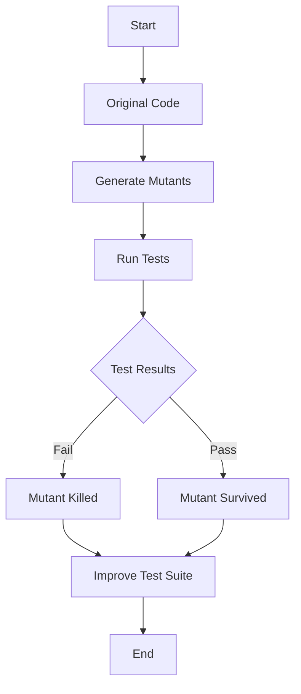

## 14.4 Mutation Testing for Robustness

In the realm of software testing, ensuring that your test suite is robust and effective is crucial. Mutation testing is a powerful technique that helps achieve this by introducing small changes, or "mutations," to your code to verify that your tests can detect these changes. In this section, we'll delve into mutation testing in Haskell, exploring its concepts, tools, and practical applications.

### Understanding Mutation Testing

**Mutation Testing** is a method used to evaluate the quality of a test suite. By deliberately introducing faults into the code, mutation testing assesses whether the existing tests can catch these faults. If a test fails due to a mutation, it is considered effective. Conversely, if a test passes despite the mutation, it may indicate a gap in the test coverage.

#### Key Concepts

- **Mutants**: These are the altered versions of the original code, created by introducing small changes.
- **Mutation Operators**: These are the rules or patterns used to generate mutants. Common mutation operators include changing arithmetic operators, modifying logical connectors, and altering control flow statements.
- **Killing a Mutant**: A mutant is considered "killed" if a test case fails when executed against it. This indicates that the test suite is sensitive to the change introduced by the mutant.
- **Surviving Mutants**: These are mutants that pass all the tests, suggesting that the test suite might be inadequate in covering certain scenarios.

### The Importance of Mutation Testing

Mutation testing provides several benefits:

- **Improves Test Quality**: By identifying weaknesses in the test suite, developers can enhance test cases to cover more scenarios.
- **Increases Confidence**: A robust test suite that can detect mutations gives developers confidence in the correctness of their code.
- **Encourages Comprehensive Testing**: Mutation testing encourages developers to think about edge cases and potential faults that might not be immediately obvious.

### Mutation Testing in Haskell

Haskell, with its strong type system and functional nature, presents unique challenges and opportunities for mutation testing. The immutability and purity of functions in Haskell mean that certain types of mutations common in imperative languages may not apply. However, Haskell's type system can be leveraged to create sophisticated mutation operators that respect type constraints.

#### Tools for Mutation Testing in Haskell

One of the primary tools for mutation testing in Haskell is **MuCheck**. MuCheck is a mutation testing framework specifically designed for Haskell, allowing developers to introduce mutations and evaluate their test suites.

- **MuCheck**: A Haskell-specific mutation testing tool that integrates with existing test frameworks. It automates the process of generating mutants and running tests against them.

For more information on MuCheck, you can visit the [MuCheck](https://hackage.haskell.org/package/MuCheck) page.

### Setting Up MuCheck

To get started with MuCheck, you need to install it and integrate it with your Haskell project. Here's a step-by-step guide:

1. **Install MuCheck**: You can install MuCheck using Cabal or Stack, depending on your project setup.

   ```bash
   cabal install MuCheck
   ```

2. **Integrate with Your Project**: Add MuCheck to your project's dependencies and configure it to work with your test suite.

3. **Define Mutation Operators**: Customize or use existing mutation operators to generate mutants for your code.

4. **Run Mutation Tests**: Execute MuCheck to generate mutants and run your test suite against them.

### Example: Mutation Testing in Action

Let's walk through a simple example to illustrate how mutation testing works in Haskell using MuCheck.

#### Original Code

Consider the following Haskell function that calculates the factorial of a number:

```haskell
-- | Calculate the factorial of a number
factorial :: Integer -> Integer
factorial 0 = 1
factorial n = n * factorial (n - 1)
```

#### Test Suite

Here's a basic test suite for the `factorial` function:

```haskell
import Test.HUnit

-- Test case for factorial
testFactorial :: Test
testFactorial = TestList [
    TestCase (assertEqual "factorial 0" 1 (factorial 0)),
    TestCase (assertEqual "factorial 1" 1 (factorial 1)),
    TestCase (assertEqual "factorial 5" 120 (factorial 5))
  ]

main :: IO Counts
main = runTestTT testFactorial
```

#### Introducing Mutants

Using MuCheck, we can introduce mutations to the `factorial` function. For example, changing the multiplication operator to addition:

```haskell
factorial n = n + factorial (n - 1)
```

#### Running Mutation Tests

Run MuCheck to see if the test suite can detect the mutation:

```bash
mucheck --run-tests
```

If the test suite fails for the mutated code, it indicates that the tests are effective. If not, it suggests that the test suite needs improvement.

### Visualizing Mutation Testing

To better understand the process of mutation testing, let's visualize it using a flowchart.



**Figure 1**: Flowchart of the Mutation Testing Process

### Challenges and Considerations

While mutation testing is a powerful technique, it comes with its own set of challenges:

- **Performance Overhead**: Generating and testing a large number of mutants can be computationally expensive.
- **Equivalent Mutants**: Some mutants may be functionally equivalent to the original code, making them undetectable by tests.
- **Complexity**: Designing effective mutation operators that respect Haskell's type system can be complex.

### Best Practices for Mutation Testing

To make the most of mutation testing, consider the following best practices:

- **Start Small**: Begin with a small subset of your codebase to understand the process and refine your mutation operators.
- **Automate**: Integrate mutation testing into your continuous integration pipeline to regularly assess test effectiveness.
- **Focus on Critical Code**: Prioritize mutation testing for critical parts of your codebase where robustness is paramount.

### Try It Yourself

To gain hands-on experience with mutation testing, try modifying the `factorial` function and its test suite. Experiment with different mutation operators and observe how your tests respond. This exercise will help you understand the strengths and limitations of your test suite.

### References and Further Reading

- [MuCheck](https://hackage.haskell.org/package/MuCheck): Official page for MuCheck, the mutation testing tool for Haskell.
- [Mutation Testing in Software Engineering](https://en.wikipedia.org/wiki/Mutation_testing): Wikipedia article on mutation testing.
- [Haskell Programming Language](https://www.haskell.org/): Official Haskell website for more information on the language.

### Knowledge Check

Before we conclude, let's reinforce what we've learned with a few questions:

1. What is the primary goal of mutation testing?
2. How does MuCheck help in mutation testing for Haskell?
3. What are some common mutation operators used in mutation testing?
4. Why is it important to "kill" a mutant in mutation testing?
5. What challenges might you face when implementing mutation testing in Haskell?

### Embrace the Journey

Remember, mutation testing is just one tool in your testing arsenal. As you explore and experiment with it, you'll gain deeper insights into your code and its robustness. Keep pushing the boundaries of what's possible with Haskell, and enjoy the journey of continuous improvement.

## Quiz: Mutation Testing for Robustness



### What is the primary goal of mutation testing?

- [x] To evaluate the effectiveness of a test suite by introducing faults.
- [ ] To improve code performance.
- [ ] To refactor code for better readability.
- [ ] To automate code deployment.

> **Explanation:** Mutation testing aims to assess the robustness of a test suite by introducing faults and checking if the tests can detect them.

### Which tool is commonly used for mutation testing in Haskell?

- [x] MuCheck
- [ ] QuickCheck
- [ ] HSpec
- [ ] Stack

> **Explanation:** MuCheck is a mutation testing tool specifically designed for Haskell.

### What is a "mutant" in the context of mutation testing?

- [x] A modified version of the original code with small changes.
- [ ] A new feature added to the codebase.
- [ ] A bug introduced by a developer.
- [ ] A test case that fails unexpectedly.

> **Explanation:** A mutant is a version of the code that has been altered to test the effectiveness of the test suite.

### What does it mean to "kill" a mutant?

- [x] A test case fails when executed against the mutant.
- [ ] The mutant is removed from the codebase.
- [ ] The mutant is merged into the main branch.
- [ ] The mutant is ignored by the test suite.

> **Explanation:** Killing a mutant means that the test suite successfully detects the change, causing a test to fail.

### What is a common challenge in mutation testing?

- [x] Performance overhead due to generating and testing many mutants.
- [ ] Lack of available mutation operators.
- [ ] Difficulty in writing test cases.
- [ ] Inability to integrate with version control systems.

> **Explanation:** Mutation testing can be computationally expensive due to the need to generate and test numerous mutants.

### How can mutation testing be integrated into the development process?

- [x] By automating it in the continuous integration pipeline.
- [ ] By manually running tests after each code change.
- [ ] By using it only during code reviews.
- [ ] By applying it only to legacy code.

> **Explanation:** Automating mutation testing in the CI pipeline ensures regular assessment of test effectiveness.

### What is an "equivalent mutant"?

- [x] A mutant that is functionally identical to the original code.
- [ ] A mutant that causes all tests to fail.
- [ ] A mutant that introduces a new feature.
- [ ] A mutant that cannot be compiled.

> **Explanation:** Equivalent mutants are those that do not change the functionality of the code, making them undetectable by tests.

### Why is it important to focus mutation testing on critical code?

- [x] Because robustness is paramount in critical parts of the codebase.
- [ ] Because critical code is easier to mutate.
- [ ] Because non-critical code does not require testing.
- [ ] Because critical code changes frequently.

> **Explanation:** Focusing on critical code ensures that the most important parts of the application are thoroughly tested.

### What is a mutation operator?

- [x] A rule or pattern used to generate mutants.
- [ ] A tool for deploying code changes.
- [ ] A function for optimizing code performance.
- [ ] A method for refactoring code.

> **Explanation:** Mutation operators define how the original code is altered to create mutants.

### True or False: Mutation testing can only be applied to functional programming languages.

- [ ] True
- [x] False

> **Explanation:** Mutation testing can be applied to any programming language, not just functional ones.


