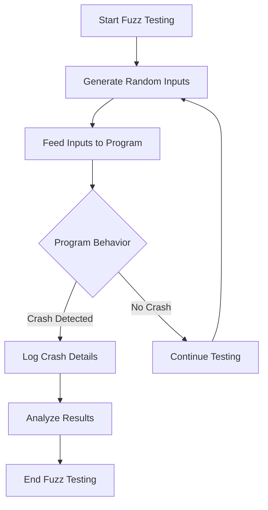

## 14.5 Fuzz Testing Techniques

In the realm of software testing, **Fuzz Testing** stands out as a powerful technique for uncovering hidden bugs and vulnerabilities by providing invalid, unexpected, or random data as inputs to a program. This method is particularly effective in identifying edge cases that traditional testing methods might overlook. In this section, we will delve into the intricacies of fuzz testing in Haskell, exploring its implementation, benefits, and how it can be leveraged to enhance the reliability of your software systems.

### Understanding Fuzz Testing

Fuzz testing, or fuzzing, is an automated testing technique that involves feeding random data to a program to identify potential crashes, assertion failures, or memory leaks. The primary goal is to stress-test the software by simulating unexpected usage patterns, thereby revealing defects that might not be apparent through conventional testing methods.

#### Key Concepts

- **Randomized Input Generation**: The core of fuzz testing lies in generating random inputs that can trigger unexpected behavior in the software.
- **Automated Execution**: Fuzz testing is typically automated, allowing for extensive testing without manual intervention.
- **Crash Detection**: The primary focus is on detecting crashes or unexpected behavior that could indicate a bug.
- **Coverage Improvement**: By exploring a wide range of inputs, fuzz testing can improve code coverage and uncover edge cases.

### Why Fuzz Testing in Haskell?

Haskell, with its strong type system and emphasis on pure functions, offers unique advantages for fuzz testing. The language's features can be leveraged to create robust fuzz testing frameworks that efficiently explore the input space and detect anomalies.

#### Benefits of Fuzz Testing in Haskell

- **Type Safety**: Haskell's type system helps ensure that generated inputs conform to expected types, reducing false positives.
- **Pure Functions**: The use of pure functions in Haskell makes it easier to isolate and test specific components without side effects.
- **Lazy Evaluation**: Haskell's lazy evaluation model allows for efficient handling of large input spaces, making it well-suited for fuzz testing.
- **Concurrency Support**: Haskell's support for concurrency can be utilized to run multiple fuzz tests in parallel, speeding up the testing process.

### Implementing Fuzz Testing in Haskell

To implement fuzz testing in Haskell, we can utilize libraries that facilitate the generation of random inputs and automate the testing process. One such library is `QuickCheck`, which is widely used for property-based testing in Haskell.

#### Using QuickCheck for Fuzz Testing

`QuickCheck` is a Haskell library that allows developers to specify properties of their code and automatically generate test cases to verify those properties. It can be adapted for fuzz testing by focusing on generating random inputs that stress-test the software.

```haskell
import Test.QuickCheck

-- Define a simple property to test
prop_reverseInvariant :: [Int] -> Bool
prop_reverseInvariant xs = reverse (reverse xs) == xs

-- Run the QuickCheck test
main :: IO ()
main = quickCheck prop_reverseInvariant
```

In this example, `QuickCheck` generates random lists of integers and verifies that reversing a list twice yields the original list. This simple property can be extended to more complex scenarios, making `QuickCheck` a versatile tool for fuzz testing.

#### Advanced Fuzz Testing with QuickFuzz

For more advanced fuzz testing, the `QuickFuzz` library extends `QuickCheck` by providing additional capabilities for generating complex inputs and analyzing test results.

```haskell
import Test.QuickFuzz

-- Define a fuzz test for a parser
fuzzTestParser :: IO ()
fuzzTestParser = quickFuzz myParser

-- Example parser function
myParser :: String -> Either String AST
myParser input = parse input

main :: IO ()
main = fuzzTestParser
```

In this example, `QuickFuzz` is used to stress-test a parser by generating random strings and feeding them to the parser function. The goal is to identify inputs that cause the parser to fail or produce incorrect results.

### Visualizing Fuzz Testing Workflow

To better understand the fuzz testing process, let's visualize the workflow using a Mermaid.js diagram.



**Diagram Description**: This flowchart illustrates the fuzz testing workflow, where random inputs are generated and fed to the program. If a crash is detected, details are logged for analysis. The process continues iteratively to maximize coverage.

### Enhancing Fuzz Testing with Custom Generators

While `QuickCheck` and `QuickFuzz` provide powerful tools for fuzz testing, creating custom generators can further enhance the testing process by tailoring input generation to specific use cases.

#### Creating Custom Generators

Custom generators allow you to define specific input patterns or constraints that are relevant to your application. This can be particularly useful when testing complex data structures or protocols.

```haskell
import Test.QuickCheck

-- Define a custom generator for email addresses
genEmail :: Gen String
genEmail = do
    user <- listOf1 $ elements ['a'..'z']
    domain <- listOf1 $ elements ['a'..'z']
    return $ user ++ "@" ++ domain ++ ".com"

-- Use the custom generator in a property test
prop_validEmail :: Property
prop_validEmail = forAll genEmail $ \email ->
    isValidEmail email

-- Example email validation function
isValidEmail :: String -> Bool
isValidEmail email = '@' `elem` email && '.' `elem` (dropWhile (/= '@') email)

main :: IO ()
main = quickCheck prop_validEmail
```

In this example, we define a custom generator `genEmail` for generating random email addresses and use it in a property test to verify email validity.

### Try It Yourself: Experimenting with Fuzz Testing

To gain hands-on experience with fuzz testing in Haskell, try modifying the code examples provided. Here are some suggestions:

- **Modify the Input Generation**: Change the input generation logic to test different data types or structures.
- **Extend the Properties**: Add more complex properties to test, such as invariants or performance constraints.
- **Analyze Crash Reports**: Implement logic to analyze and categorize crash reports for better debugging.

### Knowledge Check

Before we move on, let's reinforce your understanding of fuzz testing with a few questions:

- What is the primary goal of fuzz testing?
- How does Haskell's type system benefit fuzz testing?
- What are the advantages of using custom generators in fuzz testing?

### Conclusion

Fuzz testing is a powerful technique for improving software reliability by uncovering hidden bugs and vulnerabilities. In Haskell, the combination of a strong type system, pure functions, and advanced libraries like `QuickCheck` and `QuickFuzz` makes fuzz testing an effective strategy for stress-testing your applications. By leveraging these tools and techniques, you can enhance the robustness of your software and ensure it performs reliably under unexpected conditions.

Remember, fuzz testing is just one part of a comprehensive testing strategy. Combine it with other testing methods to achieve the best results. Keep experimenting, stay curious, and enjoy the journey of making your software more resilient!

## Quiz: Fuzz Testing Techniques



### What is the primary goal of fuzz testing?

- [x] To uncover hidden bugs and vulnerabilities by providing random inputs
- [ ] To improve code readability
- [ ] To optimize performance
- [ ] To enhance user interface design

> **Explanation:** Fuzz testing aims to uncover hidden bugs and vulnerabilities by providing random inputs to the software.

### Which Haskell library is commonly used for property-based testing and can be adapted for fuzz testing?

- [x] QuickCheck
- [ ] HUnit
- [ ] Tasty
- [ ] Hspec

> **Explanation:** QuickCheck is a Haskell library commonly used for property-based testing and can be adapted for fuzz testing.

### What advantage does Haskell's type system provide in fuzz testing?

- [x] It ensures generated inputs conform to expected types, reducing false positives.
- [ ] It makes the code run faster.
- [ ] It simplifies user interface design.
- [ ] It automatically fixes bugs.

> **Explanation:** Haskell's type system ensures that generated inputs conform to expected types, reducing false positives in fuzz testing.

### What is the role of custom generators in fuzz testing?

- [x] To define specific input patterns or constraints relevant to the application
- [ ] To automatically fix bugs
- [ ] To improve code readability
- [ ] To enhance user interface design

> **Explanation:** Custom generators in fuzz testing allow you to define specific input patterns or constraints that are relevant to your application.

### How does lazy evaluation benefit fuzz testing in Haskell?

- [x] It allows efficient handling of large input spaces.
- [ ] It makes the code run faster.
- [ ] It simplifies user interface design.
- [ ] It automatically fixes bugs.

> **Explanation:** Lazy evaluation in Haskell allows for efficient handling of large input spaces, which is beneficial for fuzz testing.

### What is the primary focus of fuzz testing?

- [x] Detecting crashes or unexpected behavior
- [ ] Improving code readability
- [ ] Optimizing performance
- [ ] Enhancing user interface design

> **Explanation:** The primary focus of fuzz testing is detecting crashes or unexpected behavior that could indicate a bug.

### Which library extends QuickCheck for more advanced fuzz testing capabilities?

- [x] QuickFuzz
- [ ] HUnit
- [ ] Tasty
- [ ] Hspec

> **Explanation:** QuickFuzz extends QuickCheck for more advanced fuzz testing capabilities.

### What is the benefit of using concurrency in fuzz testing with Haskell?

- [x] It allows running multiple fuzz tests in parallel, speeding up the testing process.
- [ ] It makes the code run faster.
- [ ] It simplifies user interface design.
- [ ] It automatically fixes bugs.

> **Explanation:** Using concurrency in fuzz testing with Haskell allows running multiple fuzz tests in parallel, speeding up the testing process.

### What is a common use case for fuzz testing?

- [x] Stress-testing parsers with random byte sequences
- [ ] Improving code readability
- [ ] Optimizing performance
- [ ] Enhancing user interface design

> **Explanation:** A common use case for fuzz testing is stress-testing parsers with random byte sequences to uncover hidden bugs.

### True or False: Fuzz testing is only effective for testing user interfaces.

- [ ] True
- [x] False

> **Explanation:** Fuzz testing is not limited to user interfaces; it is effective for testing various components of a software system, especially those that handle input data.


