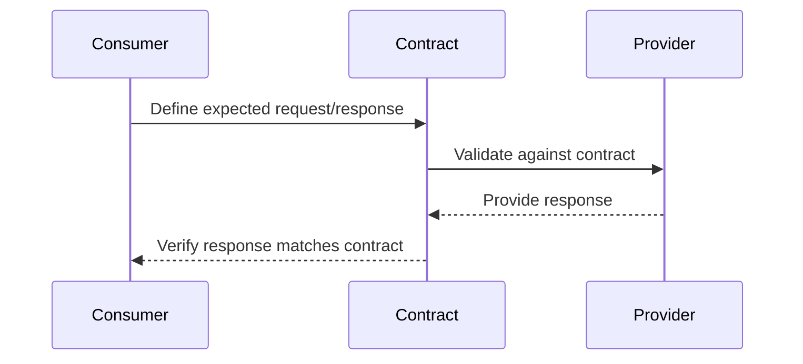

## 14.6 Contract Testing for Services

In the world of distributed systems and microservices, ensuring that different components interact correctly is crucial. Contract testing is a powerful technique that verifies the interactions between two separate systems, such as a client and a server, ensuring they adhere to a predefined contract. In this section, we will explore how to implement contract testing in Haskell, leveraging its unique features to create robust and reliable systems.

### Understanding Contract Testing

**Contract Testing** is a testing methodology that focuses on the interactions between services. It ensures that a service (consumer) can communicate with another service (provider) as expected. The contract is a formal agreement that specifies the inputs and outputs of the service interactions.

#### Key Concepts

- **Consumer**: The service or component that makes requests to another service.
- **Provider**: The service or component that responds to requests from a consumer.
- **Contract**: A formal specification of the interactions between the consumer and provider, including request and response formats.

#### Benefits of Contract Testing

- **Decoupling**: Allows independent development and deployment of services.
- **Early Detection**: Identifies integration issues early in the development cycle.
- **Documentation**: Serves as living documentation of service interactions.
- **Reliability**: Increases confidence in the stability of service interactions.

### Implementing Contract Testing in Haskell

Haskell's strong type system and functional programming paradigm make it an excellent choice for implementing contract testing. Let's explore how to define contracts and enforce them using Haskell.

#### Defining Contracts

In Haskell, contracts can be defined using data types that represent the expected inputs and outputs of service interactions. Here's an example of defining a contract for a simple user service:

```haskell
{-# LANGUAGE DeriveGeneric #-}

import Data.Aeson (FromJSON, ToJSON)
import GHC.Generics (Generic)

-- Define a data type for the request
data UserRequest = UserRequest
  { userId :: Int
  } deriving (Show, Generic)

instance FromJSON UserRequest
instance ToJSON UserRequest

-- Define a data type for the response
data UserResponse = UserResponse
  { userName :: String
  , userEmail :: String
  } deriving (Show, Generic)

instance FromJSON UserResponse
instance ToJSON UserResponse
```

In this example, `UserRequest` and `UserResponse` represent the contract between the consumer and provider. The use of `FromJSON` and `ToJSON` instances allows for easy serialization and deserialization of JSON data, which is commonly used in RESTful APIs.

#### Enforcing Contracts with Tests

Once the contract is defined, the next step is to enforce it using tests. Haskell's testing libraries, such as Hspec and QuickCheck, can be used to write contract tests.

##### Writing Contract Tests with Hspec

Hspec is a popular testing framework in Haskell that provides a behavior-driven development (BDD) style for writing tests. Here's how you can write a contract test using Hspec:

```haskell
import Test.Hspec
import Network.HTTP.Client (defaultManagerSettings, newManager)
import Network.HTTP.Client.TLS (tlsManagerSettings)
import Servant.Client

-- Define the API client
type UserAPI = "user" :> ReqBody '[JSON] UserRequest :> Post '[JSON] UserResponse

userAPI :: Proxy UserAPI
userAPI = Proxy

getUser :: UserRequest -> ClientM UserResponse
getUser = client userAPI

-- Contract test
main :: IO ()
main = hspec $ describe "User API Contract" $ do
  it "should return user details for a valid request" $ do
    manager <- newManager tlsManagerSettings
    let env = mkClientEnv manager (BaseUrl Http "localhost" 8080 "")
    let request = UserRequest { userId = 1 }
    response <- runClientM (getUser request) env
    case response of
      Left err -> expectationFailure $ "Request failed: " ++ show err
      Right userResponse -> do
        userName userResponse `shouldBe` "John Doe"
        userEmail userResponse `shouldBe` "john.doe@example.com"
```

In this example, we define a contract test for the `UserAPI`. The test sends a `UserRequest` to the API and verifies that the response matches the expected `UserResponse`.

#### Visualizing Contract Testing Workflow

To better understand the workflow of contract testing, let's visualize the interaction between the consumer, provider, and the contract:



This diagram illustrates how the consumer defines the expected interactions, which are then validated against the provider using the contract.

### Advanced Contract Testing Techniques

As systems grow in complexity, advanced techniques may be required to manage contracts effectively. Let's explore some of these techniques.

#### Consumer-Driven Contracts

In a consumer-driven contract approach, the consumer defines the contract, and the provider must adhere to it. This approach is beneficial when multiple consumers interact with a single provider, as it ensures that all consumer requirements are met.

##### Implementing Consumer-Driven Contracts

To implement consumer-driven contracts in Haskell, we can use a tool like Pact, which is designed for this purpose. Here's a basic example of using Pact with Haskell:

```haskell
{-# LANGUAGE OverloadedStrings #-}

import Test.Hspec
import Pact

-- Define a Pact contract
userPact :: Pact
userPact = pact "User API" $ do
  uponReceiving "a request for user details"
  withRequest $ do
    method GET
    path "/user"
    headers [("Content-Type", "application/json")]
    body $ object ["userId" .= (1 :: Int)]

  willRespondWith 200
  withResponseBody $ do
    body $ object ["userName" .= ("John Doe" :: String), "userEmail" .= ("john.doe@example.com" :: String)]

-- Run the Pact test
main :: IO ()
main = hspec $ describe "User API Pact" $ do
  it "should adhere to the user contract" $ do
    result <- runPact userPact
    result `shouldBe` Right ()
```

In this example, we define a Pact contract for the `User API` and verify that the provider adheres to it.

#### Contract Versioning

As services evolve, contracts may change. Contract versioning is a technique used to manage changes in contracts without breaking existing consumers.

##### Strategies for Contract Versioning

- **Semantic Versioning**: Use version numbers to indicate changes in the contract. For example, increment the major version for breaking changes and the minor version for backward-compatible changes.
- **Backward Compatibility**: Ensure that new versions of the contract are backward-compatible with previous versions.
- **Deprecation Policy**: Establish a policy for deprecating old versions of the contract, allowing consumers time to migrate to the new version.

### Haskell Unique Features for Contract Testing

Haskell offers several unique features that enhance contract testing:

- **Strong Typing**: Haskell's type system ensures that contracts are well-defined and enforced at compile time.
- **Pure Functions**: Pure functions make it easier to reason about service interactions and test them in isolation.
- **Type Classes**: Type classes can be used to define generic contracts that can be implemented by different providers.

### Differences and Similarities with Other Testing Patterns

Contract testing is often compared to other testing patterns, such as integration testing and unit testing. Here's how they differ:

- **Unit Testing**: Focuses on testing individual components in isolation, without external dependencies.
- **Integration Testing**: Tests the interactions between multiple components or systems.
- **Contract Testing**: Specifically tests the interactions between a consumer and provider, ensuring they adhere to a predefined contract.

### Design Considerations

When implementing contract testing, consider the following:

- **Granularity**: Determine the level of detail required in the contract. Too much detail can make the contract brittle, while too little can lead to ambiguity.
- **Tooling**: Choose the right tools for defining and enforcing contracts. Haskell offers libraries like Pact and Servant for this purpose.
- **Automation**: Automate contract tests as part of the CI/CD pipeline to ensure continuous validation of service interactions.

### Try It Yourself

To deepen your understanding of contract testing in Haskell, try modifying the code examples provided:

- **Experiment with Different Data Types**: Define contracts for different services and test their interactions.
- **Implement Consumer-Driven Contracts**: Use Pact to define consumer-driven contracts and verify provider adherence.
- **Explore Contract Versioning**: Implement versioning strategies for your contracts and test backward compatibility.

### Knowledge Check

- What is the primary purpose of contract testing?
- How does Haskell's type system benefit contract testing?
- What is the difference between consumer-driven contracts and provider-driven contracts?
- How can contract versioning be managed effectively?

### Summary

Contract testing is a vital technique for ensuring reliable interactions between services in a distributed system. By leveraging Haskell's unique features, such as strong typing and pure functions, we can define and enforce contracts effectively. Remember, contract testing is not just about verifying interactions; it's about building confidence in the stability and reliability of your systems.

## Quiz: Contract Testing for Services



### What is the primary purpose of contract testing?

- [x] To verify that two separate systems interact correctly
- [ ] To test the internal logic of a single component
- [ ] To measure the performance of a service
- [ ] To ensure code coverage

> **Explanation:** Contract testing focuses on verifying the interactions between two separate systems, such as a client and server, ensuring they adhere to a predefined contract.

### How does Haskell's type system benefit contract testing?

- [x] By ensuring contracts are well-defined and enforced at compile time
- [ ] By allowing dynamic typing for flexibility
- [ ] By providing runtime type checks
- [ ] By supporting weak typing for faster execution

> **Explanation:** Haskell's strong type system ensures that contracts are well-defined and enforced at compile time, reducing the likelihood of runtime errors.

### What is a consumer-driven contract?

- [x] A contract defined by the consumer that the provider must adhere to
- [ ] A contract defined by the provider that the consumer must adhere to
- [ ] A contract that is automatically generated by the system
- [ ] A contract that is only used for internal testing

> **Explanation:** In a consumer-driven contract approach, the consumer defines the contract, and the provider must adhere to it, ensuring that all consumer requirements are met.

### Which tool is commonly used for consumer-driven contract testing in Haskell?

- [x] Pact
- [ ] QuickCheck
- [ ] Hspec
- [ ] Servant

> **Explanation:** Pact is a tool specifically designed for consumer-driven contract testing, allowing consumers to define contracts that providers must adhere to.

### How can contract versioning be managed effectively?

- [x] By using semantic versioning and ensuring backward compatibility
- [ ] By ignoring versioning and focusing on current contracts
- [ ] By frequently changing contracts without notice
- [ ] By using random version numbers

> **Explanation:** Effective contract versioning involves using semantic versioning to indicate changes and ensuring backward compatibility to prevent breaking existing consumers.

### What is the difference between contract testing and integration testing?

- [x] Contract testing focuses on interactions between a consumer and provider, while integration testing tests interactions between multiple components
- [ ] Contract testing is only for internal components, while integration testing is for external systems
- [ ] Contract testing measures performance, while integration testing measures functionality
- [ ] Contract testing is a subset of unit testing

> **Explanation:** Contract testing specifically tests the interactions between a consumer and provider, ensuring they adhere to a predefined contract, while integration testing tests interactions between multiple components or systems.

### What is a key benefit of using pure functions in contract testing?

- [x] They make it easier to reason about service interactions and test them in isolation
- [ ] They allow for dynamic typing
- [ ] They improve runtime performance
- [ ] They enable mutable state

> **Explanation:** Pure functions, which are a hallmark of functional programming, make it easier to reason about service interactions and test them in isolation, as they do not have side effects.

### What is the role of automation in contract testing?

- [x] To ensure continuous validation of service interactions as part of the CI/CD pipeline
- [ ] To manually verify each contract
- [ ] To replace unit testing
- [ ] To eliminate the need for testing

> **Explanation:** Automation in contract testing ensures continuous validation of service interactions as part of the CI/CD pipeline, providing ongoing assurance of system reliability.

### Which Haskell library is commonly used for writing contract tests?

- [x] Hspec
- [ ] Aeson
- [ ] Warp
- [ ] Conduit

> **Explanation:** Hspec is a popular testing framework in Haskell that provides a behavior-driven development (BDD) style for writing tests, including contract tests.

### True or False: Contract testing can serve as living documentation of service interactions.

- [x] True
- [ ] False

> **Explanation:** Contract testing not only verifies interactions but also serves as living documentation of service interactions, providing a clear specification of expected behavior.



Remember, this is just the beginning. As you progress, you'll build more complex and interactive systems. Keep experimenting, stay curious, and enjoy the journey!
