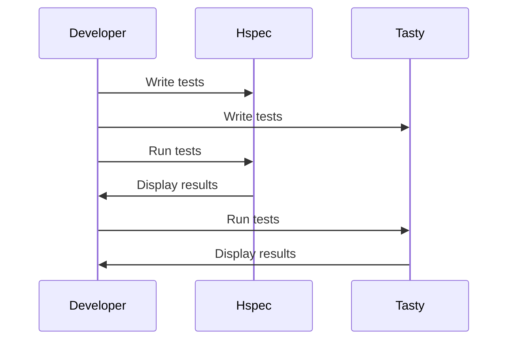

## 14.7 Unit Testing Frameworks in Haskell (Hspec, Tasty)

Unit testing is a cornerstone of software development, ensuring that individual components of a program function correctly. In Haskell, two prominent frameworks for unit testing are **Hspec** and **Tasty**. Both offer unique features and capabilities that cater to different testing needs and preferences. This section delves into these frameworks, providing expert guidance on their usage, setup, and integration into Haskell projects.

### Introduction to Unit Testing in Haskell

Unit testing in Haskell involves writing tests for individual functions or modules to verify their correctness. Given Haskell's strong type system and functional nature, unit tests can be particularly powerful in catching errors early in the development process. Let's explore how Hspec and Tasty facilitate this.

### Hspec: A RSpec-Inspired Testing Framework

**Hspec** is a testing framework for Haskell inspired by Ruby's RSpec. It provides a domain-specific language (DSL) for writing tests, making them readable and expressive. Hspec is particularly popular for its simplicity and ease of use.

#### Key Features of Hspec

- **Expressive Syntax**: Hspec's syntax is designed to be human-readable, making tests easy to write and understand.
- **Integration with QuickCheck**: Hspec can seamlessly integrate with QuickCheck for property-based testing.
- **Extensibility**: Hspec supports custom matchers and hooks, allowing for flexible test configurations.

#### Setting Up Hspec

To get started with Hspec, you need to add it to your project's dependencies. If you're using Stack, add the following to your `stack.yaml`:

```yaml
extra-deps:
- hspec-2.9.4
```

Then, create a test suite in your `package.yaml` or `cabal` file:

```yaml
tests:
  my-test-suite:
    main: Spec.hs
    dependencies:
    - hspec
```

#### Writing Tests with Hspec

Here's a simple example of a test written using Hspec:

```haskell
-- Spec.hs
import Test.Hspec

main :: IO ()
main = hspec $ do
  describe "Prelude.head" $ do
    it "returns the first element of a list" $ do
      head [1, 2, 3] `shouldBe` 1

    it "throws an exception if used with an empty list" $ do
      evaluate (head []) `shouldThrow` anyException
```

In this example, we define a test suite for the `head` function from the Prelude module. The `describe` function groups related tests, while `it` specifies individual test cases.

#### Running Hspec Tests

To run your Hspec tests, use the following command:

```bash
stack test
```

This will compile and execute the tests, providing a summary of the results.

### Tasty: A Modern Testing Framework

**Tasty** is a versatile testing framework that allows you to compose tests from various libraries, including Hspec, QuickCheck, and HUnit. Tasty is known for its flexibility and ability to integrate with different testing styles.

#### Key Features of Tasty

- **Composability**: Tasty allows you to combine tests from different libraries into a single suite.
- **Customizable Output**: Tasty provides various options for customizing test output, including colorized results and detailed reports.
- **Parallel Execution**: Tasty supports running tests in parallel, improving test suite performance.

#### Setting Up Tasty

To use Tasty, add it to your project's dependencies:

```yaml
extra-deps:
- tasty-1.4.2
- tasty-hspec-1.1.7
```

Configure your test suite in `package.yaml` or `cabal`:

```yaml
tests:
  my-tasty-suite:
    main: Main.hs
    dependencies:
    - tasty
    - tasty-hspec
```

#### Writing Tests with Tasty

Here's an example of a test suite using Tasty:

```haskell
-- Main.hs
import Test.Tasty
import Test.Tasty.Hspec

main :: IO ()
main = do
  test <- testSpec "Prelude.head" $ do
    it "returns the first element of a list" $ do
      head [1, 2, 3] `shouldBe` 1

    it "throws an exception if used with an empty list" $ do
      evaluate (head []) `shouldThrow` anyException

  defaultMain test
```

In this example, we use `testSpec` from `tasty-hspec` to define a test suite. The `defaultMain` function runs the tests.

#### Running Tasty Tests

Execute your Tasty tests with:

```bash
stack test
```

Tasty will display the results, including any failures or errors.

### Comparing Hspec and Tasty

Both Hspec and Tasty have their strengths and are suitable for different scenarios. Here's a comparison to help you choose the right framework for your needs:

| Feature             | Hspec                          | Tasty                          |
|---------------------|--------------------------------|--------------------------------|
| **Syntax**          | RSpec-inspired, DSL            | Composable, integrates with multiple libraries |
| **Integration**     | QuickCheck, HUnit              | Hspec, QuickCheck, HUnit, and more |
| **Output**          | Simple, readable               | Customizable, colorized       |
| **Parallelism**     | Limited                        | Supports parallel execution   |
| **Extensibility**   | Custom matchers and hooks      | Plugins and custom reporters  |

### Advanced Testing Techniques

#### Property-Based Testing

Both Hspec and Tasty can integrate with QuickCheck for property-based testing. This technique involves specifying properties that functions should satisfy and generating random test cases to verify them.

#### Mocking and Stubbing

In Haskell, mocking and stubbing can be achieved using type classes and monads. This allows you to replace dependencies with mock implementations during testing.

#### Testing Asynchronous Code

Testing asynchronous code can be challenging. Tasty supports asynchronous tests through libraries like `async` and `STM`, enabling you to test concurrent Haskell code effectively.

### Visualizing Test Execution

To better understand the flow of test execution, consider the following sequence diagram illustrating how tests are run in Hspec and Tasty:



This diagram shows the interaction between the developer and the testing frameworks, highlighting the process of writing and running tests.

### Best Practices for Unit Testing in Haskell

- **Write Clear and Concise Tests**: Ensure that each test case is focused on a single behavior or property.
- **Use Descriptive Names**: Name your tests descriptively to convey their purpose.
- **Leverage Haskell's Type System**: Use types to enforce invariants and reduce the need for certain tests.
- **Test Edge Cases**: Consider edge cases and potential failure points in your tests.
- **Automate Test Execution**: Integrate tests into your build process to catch regressions early.

### References and Further Reading

- [Hspec Documentation](https://hspec.github.io/)
- [Tasty on Hackage](https://hackage.haskell.org/package/tasty)
- [QuickCheck Documentation](https://hackage.haskell.org/package/QuickCheck)

### Try It Yourself

Experiment with the provided code examples by modifying them to test different functions or scenarios. Consider adding new test cases or integrating property-based testing with QuickCheck.

### Knowledge Check

- What are the key differences between Hspec and Tasty?
- How can you integrate QuickCheck with Hspec or Tasty?
- What are some best practices for writing unit tests in Haskell?

### Embrace the Journey

Remember, mastering unit testing in Haskell is a journey. As you become more familiar with Hspec and Tasty, you'll be able to write more robust and maintainable tests. Keep experimenting, stay curious, and enjoy the process!

## Quiz: Unit Testing Frameworks in Haskell (Hspec, Tasty)



### Which of the following is a key feature of Hspec?

- [x] Expressive syntax inspired by RSpec
- [ ] Parallel test execution
- [ ] Integration with Tasty
- [ ] Built-in mocking capabilities

> **Explanation:** Hspec is known for its expressive syntax, which is inspired by RSpec, making tests easy to read and write.

### What is a primary advantage of using Tasty over Hspec?

- [ ] Simpler syntax
- [x] Composability with multiple libraries
- [ ] Faster test execution
- [ ] Built-in property-based testing

> **Explanation:** Tasty's main advantage is its ability to compose tests from various libraries, allowing for greater flexibility.

### How do you run Hspec tests in a Haskell project?

- [ ] `cabal run`
- [x] `stack test`
- [ ] `ghc --run-tests`
- [ ] `tasty run`

> **Explanation:** Hspec tests are typically run using the `stack test` command in a Haskell project.

### Which library can be integrated with both Hspec and Tasty for property-based testing?

- [ ] HUnit
- [x] QuickCheck
- [ ] Tasty-Hspec
- [ ] Hspec-QuickCheck

> **Explanation:** QuickCheck is a library for property-based testing that can be integrated with both Hspec and Tasty.

### What is a common practice when writing unit tests in Haskell?

- [x] Use descriptive names for tests
- [ ] Write tests for every possible input
- [x] Focus on a single behavior per test
- [ ] Avoid testing edge cases

> **Explanation:** It's important to use descriptive names and focus on a single behavior per test to maintain clarity and effectiveness.

### Which of the following is NOT a feature of Tasty?

- [ ] Customizable output
- [ ] Parallel execution
- [x] RSpec-inspired syntax
- [ ] Integration with Hspec

> **Explanation:** Tasty does not have an RSpec-inspired syntax; this is a feature of Hspec.

### How can you test asynchronous code in Haskell?

- [x] Use libraries like `async` and `STM`
- [ ] Use only synchronous tests
- [x] Leverage Tasty's support for asynchronous tests
- [ ] Avoid testing asynchronous code

> **Explanation:** Testing asynchronous code in Haskell can be achieved using libraries like `async` and `STM`, and Tasty supports asynchronous tests.

### What is the purpose of the `describe` function in Hspec?

- [ ] To run tests in parallel
- [x] To group related tests
- [ ] To generate test reports
- [ ] To mock dependencies

> **Explanation:** The `describe` function in Hspec is used to group related tests, making the test suite organized and readable.

### Which command is used to execute Tasty tests?

- [ ] `cabal run`
- [x] `stack test`
- [ ] `ghc --run-tests`
- [ ] `tasty run`

> **Explanation:** Tasty tests are executed using the `stack test` command, similar to Hspec tests.

### True or False: Hspec supports custom matchers and hooks for extensibility.

- [x] True
- [ ] False

> **Explanation:** Hspec indeed supports custom matchers and hooks, allowing for flexible test configurations.


