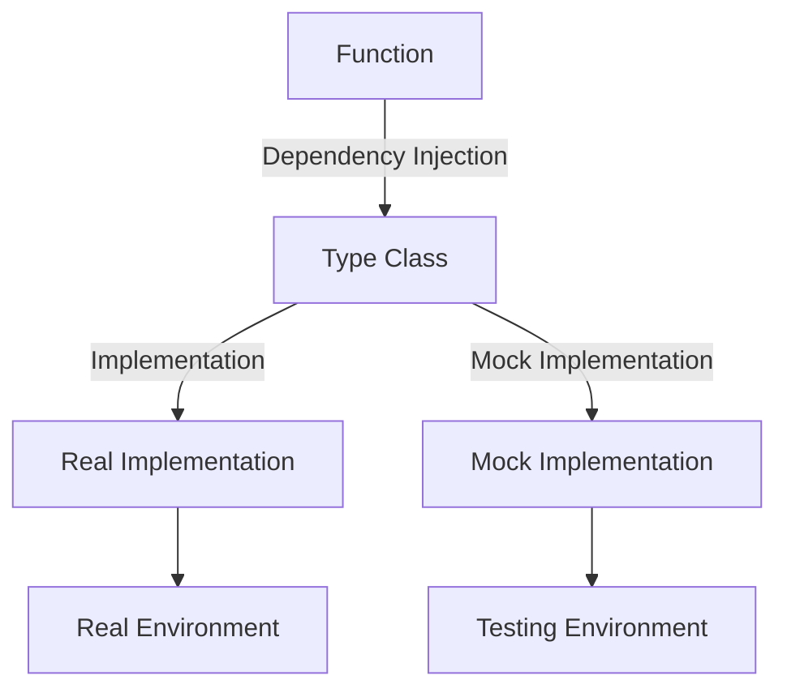

## 14.8 Mocking and Stubbing in a Pure Functional Language

Mocking and stubbing are essential techniques in software testing, allowing developers to isolate and test components independently by simulating the behavior of complex dependencies. However, in a purely functional language like Haskell, these concepts take on a unique form due to the language's emphasis on immutability, pure functions, and type safety. In this section, we will explore the challenges and strategies for implementing mocking and stubbing in Haskell, leveraging the power of functional programming paradigms.

### Challenges in Mocking and Stubbing in Haskell

In traditional object-oriented programming (OOP), mocking and stubbing are often used to replace parts of the system that are difficult to test, such as external services or complex dependencies. This is typically achieved by creating mock objects that mimic the behavior of real objects. However, in Haskell, the concept of pure functions makes traditional mocking unnecessary and even counterproductive. Here are some challenges that arise:

- **Pure Functions**: Haskell's pure functions do not have side effects, meaning they always produce the same output for the same input. This eliminates the need for mocking in many cases, as the function's behavior is deterministic and can be tested directly.
- **Immutability**: Haskell's immutable data structures mean that once a value is created, it cannot be changed. This can make it difficult to simulate state changes that are often required in mocking scenarios.
- **Type Safety**: Haskell's strong type system ensures that many errors are caught at compile time, reducing the need for runtime checks that are often the focus of mocking.

### Strategies for Mocking and Stubbing in Haskell

Despite these challenges, there are effective strategies for simulating effects and dependencies in Haskell. These strategies often involve using dependency injection and monads to abstract over the effects. Let's explore some of these strategies:

#### 1. Dependency Injection

Dependency injection is a technique where dependencies are passed to a function or component rather than being hard-coded. In Haskell, this can be achieved using higher-order functions and type classes.

**Example: Abstracting Over IO Operations**

Suppose we have a function that performs IO operations, such as reading from a file. We can abstract over the IO operations by passing a function as a dependency:

```haskell
-- Define a type class for file operations
class Monad m => FileOperations m where
    readFileContent :: FilePath -> m String

-- Implement the type class for IO
instance FileOperations IO where
    readFileContent = readFile

-- Function that uses the FileOperations type class
processFile :: FileOperations m => FilePath -> m String
processFile path = do
    content <- readFileContent path
    return $ "Processed: " ++ content
```

In this example, `processFile` is a pure function that can be tested by providing a mock implementation of `FileOperations`.

#### 2. Using Monads to Simulate Effects

Monads are a powerful abstraction in Haskell that can be used to simulate effects and manage dependencies. By using monads, we can create a flexible and composable way to handle side effects.

**Example: Simulating a Database**

Let's consider a scenario where we need to test a function that interacts with a database. We can use a monad to simulate the database operations:

```haskell
-- Define a type class for database operations
class Monad m => Database m where
    queryDatabase :: String -> m [String]

-- Implement the type class for a mock database
instance Database (State [String]) where
    queryDatabase _ = get

-- Function that uses the Database type class
fetchData :: Database m => String -> m [String]
fetchData query = do
    results <- queryDatabase query
    return $ map ("Result: " ++) results
```

In this example, `fetchData` can be tested using a mock implementation of the `Database` type class, allowing us to simulate database queries without a real database.

### Code Examples

Let's dive deeper into code examples to illustrate these concepts in action.

#### Example 1: Testing a Function with Mocked IO

Suppose we have a function that reads a configuration file and returns a configuration object. We want to test this function without actually reading a file from the filesystem.

```haskell
{-# LANGUAGE FlexibleInstances #-}

import Control.Monad.Reader

-- Define a type class for configuration operations
class Monad m => ConfigOperations m where
    readConfig :: FilePath -> m String

-- Implement the type class for IO
instance ConfigOperations IO where
    readConfig = readFile

-- Function that uses the ConfigOperations type class
loadConfig :: ConfigOperations m => FilePath -> m String
loadConfig path = do
    content <- readConfig path
    return $ "Loaded config: " ++ content

-- Mock implementation for testing
newtype MockConfig a = MockConfig { runMockConfig :: Reader String a }
    deriving (Functor, Applicative, Monad, MonadReader String)

instance ConfigOperations MockConfig where
    readConfig _ = ask

-- Test function
testLoadConfig :: String -> String
testLoadConfig mockContent = runReader (runMockConfig (loadConfig "mockPath")) mockContent

-- Usage
main :: IO ()
main = do
    let result = testLoadConfig "mocked content"
    putStrLn result
```

In this example, we define a `ConfigOperations` type class and provide a mock implementation using the `Reader` monad. The `testLoadConfig` function uses the mock implementation to test the `loadConfig` function without performing any actual IO.

#### Example 2: Simulating a Web Service

Consider a function that fetches data from a web service. We want to test this function without making real HTTP requests.

```haskell
{-# LANGUAGE FlexibleInstances #-}

import Control.Monad.State

-- Define a type class for HTTP operations
class Monad m => HttpOperations m where
    fetchDataFromService :: String -> m String

-- Implement the type class for IO
instance HttpOperations IO where
    fetchDataFromService url = return $ "Real data from " ++ url

-- Function that uses the HttpOperations type class
getData :: HttpOperations m => String -> m String
getData url = do
    data <- fetchDataFromService url
    return $ "Fetched: " ++ data

-- Mock implementation for testing
newtype MockHttp a = MockHttp { runMockHttp :: State String a }
    deriving (Functor, Applicative, Monad, MonadState String)

instance HttpOperations MockHttp where
    fetchDataFromService _ = get

-- Test function
testGetData :: String -> String
testGetData mockData = evalState (runMockHttp (getData "mockUrl")) mockData

-- Usage
main :: IO ()
main = do
    let result = testGetData "mocked service data"
    putStrLn result
```

In this example, we define an `HttpOperations` type class and provide a mock implementation using the `State` monad. The `testGetData` function uses the mock implementation to test the `getData` function without making real HTTP requests.

### Visualizing Dependency Injection and Monads

To better understand how dependency injection and monads work together to facilitate mocking and stubbing in Haskell, let's visualize the process using a diagram.



**Diagram Description**: This diagram illustrates how dependency injection and type classes allow us to switch between real and mock implementations. The function depends on a type class, which can be implemented by both real and mock implementations, enabling testing in a controlled environment.

### Haskell Unique Features

Haskell's unique features, such as its strong type system, immutability, and monadic abstractions, make it particularly well-suited for functional programming and testing. Here are some key features that facilitate mocking and stubbing:

- **Type Classes**: Type classes provide a powerful way to define interfaces and abstract over different implementations, enabling dependency injection and mocking.
- **Monads**: Monads allow us to encapsulate and manage side effects, making it easier to simulate and test complex dependencies.
- **Immutability**: Immutability ensures that data cannot be changed once created, reducing the need for stateful mocks and making tests more predictable.

### Differences and Similarities with OOP

While mocking and stubbing in Haskell differ from traditional OOP approaches, there are some similarities and differences worth noting:

- **Similarities**:
  - Both approaches aim to isolate and test components independently.
  - Both use abstractions to simulate dependencies and effects.

- **Differences**:
  - Haskell relies on pure functions and immutability, reducing the need for mocks.
  - Haskell uses type classes and monads for abstraction, whereas OOP uses interfaces and inheritance.

### Design Considerations

When implementing mocking and stubbing in Haskell, consider the following design considerations:

- **When to Use**: Use mocking and stubbing when testing functions that interact with external systems or have complex dependencies.
- **Pitfalls**: Avoid overusing mocks, as they can lead to brittle tests that are tightly coupled to implementation details.
- **Best Practices**: Use type classes and monads to abstract over dependencies, and ensure that tests remain focused on behavior rather than implementation.

### Try It Yourself

To deepen your understanding of mocking and stubbing in Haskell, try modifying the code examples provided. Experiment with different monads and type classes to simulate various dependencies and effects. Consider creating your own mock implementations for other scenarios, such as interacting with a message queue or a third-party API.

### Knowledge Check

- What are the key challenges of mocking and stubbing in a purely functional language like Haskell?
- How can dependency injection be used to facilitate mocking in Haskell?
- What role do monads play in simulating effects and dependencies?
- How does Haskell's type system contribute to testing and mocking?
- What are some best practices for implementing mocks in Haskell?

### Embrace the Journey

Remember, mastering mocking and stubbing in Haskell is a journey. As you progress, you'll gain a deeper understanding of functional programming paradigms and how they can be leveraged to create robust and testable software. Keep experimenting, stay curious, and enjoy the process of learning and discovery!

## Quiz: Mocking and Stubbing in a Pure Functional Language



### What is a key challenge of mocking in Haskell?

- [x] Pure functions make traditional mocking unnecessary.
- [ ] Lack of object-oriented features.
- [ ] Absence of a testing framework.
- [ ] Difficulty in creating mock objects.

> **Explanation:** Haskell's pure functions eliminate the need for traditional mocking, as functions are deterministic and can be tested directly.

### How can dependency injection be achieved in Haskell?

- [x] Using higher-order functions and type classes.
- [ ] By creating mock objects.
- [ ] Through inheritance.
- [ ] Using global variables.

> **Explanation:** Dependency injection in Haskell is achieved using higher-order functions and type classes to abstract over dependencies.

### What role do monads play in mocking?

- [x] They simulate effects and manage dependencies.
- [ ] They replace type classes.
- [ ] They provide inheritance.
- [ ] They create mock objects.

> **Explanation:** Monads are used to simulate effects and manage dependencies, making it easier to test functions with side effects.

### How does Haskell's type system aid in testing?

- [x] It ensures many errors are caught at compile time.
- [ ] It allows for dynamic typing.
- [ ] It supports inheritance.
- [ ] It enables runtime checks.

> **Explanation:** Haskell's strong type system catches many errors at compile time, reducing the need for runtime checks.

### What is a best practice for implementing mocks in Haskell?

- [x] Use type classes and monads to abstract over dependencies.
- [ ] Create global variables for state management.
- [ ] Use inheritance for mock objects.
- [ ] Avoid using pure functions.

> **Explanation:** Using type classes and monads to abstract over dependencies is a best practice for implementing mocks in Haskell.

### What is a similarity between mocking in Haskell and OOP?

- [x] Both aim to isolate and test components independently.
- [ ] Both rely on inheritance.
- [ ] Both use global state.
- [ ] Both avoid abstraction.

> **Explanation:** Both approaches aim to isolate and test components independently, though they use different mechanisms to achieve this.

### What is a difference between mocking in Haskell and OOP?

- [x] Haskell uses type classes and monads, while OOP uses interfaces and inheritance.
- [ ] Haskell relies on global state, while OOP does not.
- [ ] Haskell avoids abstraction, while OOP uses it.
- [ ] Haskell uses inheritance, while OOP does not.

> **Explanation:** Haskell uses type classes and monads for abstraction, whereas OOP uses interfaces and inheritance.

### What is a pitfall of overusing mocks?

- [x] It can lead to brittle tests tightly coupled to implementation details.
- [ ] It simplifies the testing process.
- [ ] It enhances code readability.
- [ ] It improves performance.

> **Explanation:** Overusing mocks can lead to brittle tests that are tightly coupled to implementation details, making them less reliable.

### What is a benefit of using pure functions in testing?

- [x] They are deterministic and can be tested directly.
- [ ] They require complex mocking.
- [ ] They depend on global state.
- [ ] They are difficult to test.

> **Explanation:** Pure functions are deterministic, meaning they always produce the same output for the same input, making them easy to test directly.

### True or False: Monads in Haskell replace the need for mocking.

- [ ] True
- [x] False

> **Explanation:** Monads do not replace the need for mocking; they provide a way to simulate effects and manage dependencies, facilitating testing.


