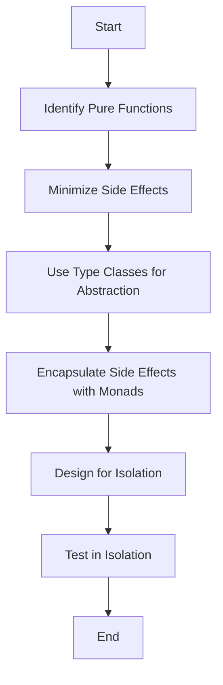

## 14.9 Designing for Testability in Haskell

Designing for testability in Haskell involves leveraging the language's functional programming paradigms to create code that is easy to test, maintain, and extend. In this section, we will explore principles and techniques that enhance testability, focusing on writing pure functions, reducing side effects, and using type classes and monads to abstract dependencies. Let's dive into the world of Haskell testability and discover how to design code that is robust and easy to test.

### Principles of Testability in Haskell

#### Writing Pure Functions

Pure functions are the cornerstone of functional programming and play a crucial role in testability. A pure function is one that, given the same input, will always produce the same output and has no side effects. This predictability makes pure functions inherently testable.

**Benefits of Pure Functions:**

- **Deterministic Behavior:** Pure functions provide consistent results, making them easy to test with unit tests.
- **Isolation:** Since pure functions do not depend on external state, they can be tested in isolation.
- **Composability:** Pure functions can be composed to build more complex functionality, facilitating modular testing.

#### Reducing Side Effects

Side effects, such as modifying a global state or performing I/O operations, can complicate testing. By minimizing side effects, we can create more predictable and testable code.

**Strategies to Reduce Side Effects:**

- **Encapsulation:** Encapsulate side effects within specific modules or functions.
- **Separation of Concerns:** Separate pure logic from impure operations, allowing the pure logic to be tested independently.

### Techniques for Enhancing Testability

#### Using Type Classes to Abstract Dependencies

Type classes in Haskell provide a powerful mechanism for abstracting over different implementations. By defining interfaces through type classes, we can create flexible and testable code.

**Example: Abstracting a Logger**

```haskell
class Monad m => Logger m where
    logInfo :: String -> m ()
    logError :: String -> m ()

-- A concrete implementation using IO
instance Logger IO where
    logInfo = putStrLn
    logError = putStrLn

-- A mock implementation for testing
newtype TestLogger a = TestLogger { runTestLogger :: [String] -> ([String], a) }

instance Logger TestLogger where
    logInfo msg = TestLogger $ \logs -> (logs ++ ["INFO: " ++ msg], ())
    logError msg = TestLogger $ \logs -> (logs ++ ["ERROR: " ++ msg], ())
```

In this example, we define a `Logger` type class with two methods, `logInfo` and `logError`. We provide an `IO` instance for production and a `TestLogger` instance for testing. This abstraction allows us to test logging functionality without performing actual I/O operations.

#### Using Monads to Manage Side Effects

Monads are a fundamental concept in Haskell for managing side effects. By encapsulating side effects within monads, we can control and test them more effectively.

**Example: Using the Reader Monad for Dependency Injection**

```haskell
import Control.Monad.Reader

data Config = Config { configValue :: String }

type App a = Reader Config a

getConfigValue :: App String
getConfigValue = asks configValue

runApp :: Config -> App a -> a
runApp config app = runReader app config

-- Testing the function
testGetConfigValue :: Bool
testGetConfigValue = runApp (Config "test") getConfigValue == "test"
```

In this example, we use the `Reader` monad to inject a `Config` dependency into our application. This approach allows us to test `getConfigValue` by providing a mock configuration, enhancing testability.

### Designing Code for Isolation

Designing code that is easy to test in isolation involves structuring your codebase to separate concerns and dependencies. This separation allows individual components to be tested independently.

#### Example: Isolating Business Logic

Consider a simple application that calculates discounts based on user roles. We can isolate the business logic from external dependencies to enhance testability.

```haskell
data UserRole = Admin | RegularUser

calculateDiscount :: UserRole -> Double -> Double
calculateDiscount Admin price = price * 0.8
calculateDiscount RegularUser price = price * 0.9

-- Testing the business logic
testCalculateDiscount :: Bool
testCalculateDiscount =
    calculateDiscount Admin 100 == 80 &&
    calculateDiscount RegularUser 100 == 90
```

In this example, the `calculateDiscount` function is pure and does not depend on any external state, making it easy to test in isolation.

### Visualizing Testability Concepts

To better understand the flow of designing for testability in Haskell, let's visualize the process using a flowchart.



**Diagram Description:** This flowchart illustrates the process of designing for testability in Haskell, starting from identifying pure functions to testing in isolation.

### Try It Yourself

To reinforce your understanding, try modifying the code examples provided:

1. **Logger Example:** Add a `logWarning` method to the `Logger` type class and implement it in both `IO` and `TestLogger` instances.
2. **Reader Monad Example:** Extend the `Config` data type with additional fields and modify `getConfigValue` to retrieve these fields.
3. **Discount Calculation:** Introduce a new user role and update the `calculateDiscount` function to handle it.

### References and Further Reading

- [Haskell Wiki: Pure Functions](https://wiki.haskell.org/Pure_function)
- [Learn You a Haskell for Great Good! - Monads](http://learnyouahaskell.com/a-fistful-of-monads)
- [Real World Haskell - Testing](http://book.realworldhaskell.org/read/testing-and-quality-assurance.html)

### Knowledge Check

Before we conclude, let's summarize the key takeaways:

- **Pure Functions:** Ensure your functions are pure to enhance testability.
- **Type Classes:** Use type classes to abstract dependencies and create flexible code.
- **Monads:** Leverage monads to manage side effects and improve testability.
- **Isolation:** Design your code to be testable in isolation by separating concerns.

### Embrace the Journey

Remember, designing for testability is an ongoing process. As you continue to develop in Haskell, keep experimenting with different techniques and patterns to improve your code's testability. Stay curious, and enjoy the journey of mastering Haskell's functional programming paradigms!

## Quiz: Designing for Testability in Haskell



### Which of the following is a key benefit of pure functions in Haskell?

- [x] Deterministic behavior
- [ ] Increased side effects
- [ ] Complex dependencies
- [ ] Reduced testability

> **Explanation:** Pure functions provide deterministic behavior, making them easy to test.

### How can type classes enhance testability in Haskell?

- [x] By abstracting dependencies
- [ ] By increasing side effects
- [ ] By reducing code readability
- [ ] By complicating the codebase

> **Explanation:** Type classes abstract dependencies, allowing for flexible and testable code.

### What is the role of the Reader monad in Haskell?

- [x] Managing dependencies
- [ ] Performing I/O operations
- [ ] Increasing side effects
- [ ] Reducing code modularity

> **Explanation:** The Reader monad is used to manage dependencies, enhancing testability.

### Which technique helps in reducing side effects in Haskell?

- [x] Encapsulation
- [ ] Increasing global state
- [ ] Using impure functions
- [ ] Ignoring separation of concerns

> **Explanation:** Encapsulation helps in reducing side effects by isolating them.

### What is a common strategy for designing testable code in Haskell?

- [x] Designing for isolation
- [ ] Increasing dependencies
- [ ] Using global variables
- [ ] Ignoring pure functions

> **Explanation:** Designing for isolation allows components to be tested independently.

### What is the benefit of using monads in Haskell?

- [x] Managing side effects
- [ ] Increasing code complexity
- [ ] Reducing testability
- [ ] Ignoring dependencies

> **Explanation:** Monads help manage side effects, improving testability.

### How can you test a function that uses the Reader monad?

- [x] By providing a mock configuration
- [ ] By performing I/O operations
- [ ] By increasing side effects
- [ ] By ignoring dependencies

> **Explanation:** Providing a mock configuration allows testing of functions using the Reader monad.

### What is a key principle of testability in Haskell?

- [x] Writing pure functions
- [ ] Increasing side effects
- [ ] Using global state
- [ ] Ignoring type classes

> **Explanation:** Writing pure functions is a key principle of testability in Haskell.

### Which of the following is a technique for enhancing testability?

- [x] Using type classes
- [ ] Increasing side effects
- [ ] Using impure functions
- [ ] Ignoring separation of concerns

> **Explanation:** Using type classes enhances testability by abstracting dependencies.

### True or False: Designing for testability in Haskell involves increasing side effects.

- [ ] True
- [x] False

> **Explanation:** Designing for testability involves reducing side effects, not increasing them.


