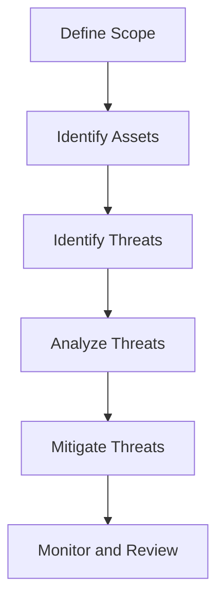

## 15.10 Threat Modeling and Risk Assessment

In the realm of software engineering, particularly when dealing with functional programming languages like Haskell, security is a paramount concern. As systems grow in complexity, so do the potential vulnerabilities. This section delves into the essential practices of threat modeling and risk assessment, providing expert software engineers and architects with the tools to proactively identify and mitigate security risks in Haskell applications.

### Understanding Threat Modeling

**Threat Modeling** is a systematic approach to identifying and addressing potential security threats. It involves understanding the system, identifying potential threats, and determining how to mitigate them. The goal is to anticipate security issues before they manifest, allowing developers to build more secure systems from the ground up.

#### Key Concepts in Threat Modeling

1. **Assets**: Identify what needs protection. In a Haskell application, this could include data, code, and infrastructure.
2. **Threats**: Determine potential threats to these assets. This could range from unauthorized access to data breaches.
3. **Vulnerabilities**: Identify weaknesses that could be exploited by threats.
4. **Attack Vectors**: Understand the paths or methods that could be used to exploit vulnerabilities.
5. **Countermeasures**: Develop strategies to mitigate identified threats.

#### Steps in Threat Modeling

1. **Define the Scope**: Clearly outline the boundaries of the system and what needs to be protected.
2. **Identify Assets and Entry Points**: Determine what assets are critical and where potential threats could enter the system.
3. **Identify Threats**: Use frameworks like STRIDE (Spoofing, Tampering, Repudiation, Information Disclosure, Denial of Service, Elevation of Privilege) to categorize potential threats.
4. **Analyze Threats**: Assess the likelihood and impact of each threat.
5. **Mitigate Threats**: Develop and implement strategies to reduce the risk of threats.

### Risk Assessment in Haskell Systems

**Risk Assessment** involves evaluating the potential impact and likelihood of identified threats. It helps prioritize which threats need immediate attention and which can be monitored over time.

#### Key Components of Risk Assessment

1. **Likelihood**: Estimate the probability of a threat occurring.
2. **Impact**: Determine the potential damage or loss if the threat is realized.
3. **Risk Level**: Calculate the risk level by combining likelihood and impact.
4. **Risk Mitigation**: Develop strategies to reduce risk to an acceptable level.

#### Performing Risk Assessment

1. **Identify Risks**: Based on the threat model, list potential risks.
2. **Analyze Risks**: Evaluate the likelihood and impact of each risk.
3. **Prioritize Risks**: Rank risks based on their severity.
4. **Develop Mitigation Plans**: Create plans to address high-priority risks.
5. **Monitor and Review**: Continuously monitor risks and update assessments as necessary.

### Implementing Threat Modeling and Risk Assessment in Haskell

Implementing these practices in Haskell involves leveraging its unique features, such as strong static typing and pure functions, to enhance security.

#### Using Haskell's Features for Security

- **Strong Static Typing**: Use Haskell's type system to enforce security constraints and prevent common vulnerabilities.
- **Immutability**: Leverage immutable data structures to prevent unauthorized modifications.
- **Pure Functions**: Ensure functions have no side effects, reducing the risk of unintended behavior.
- **Monads**: Use monads like `Maybe` and `Either` for safe error handling and to manage side effects securely.

#### Example: Analyzing a Web Application

Let's consider a Haskell web application and perform a basic threat modeling and risk assessment.

1. **Define the Scope**: The application handles user data and processes transactions.
2. **Identify Assets**: User data, transaction records, and authentication credentials.
3. **Identify Threats**: Unauthorized access, data breaches, and denial of service attacks.
4. **Analyze Threats**: Use STRIDE to categorize threats and assess their impact.
5. **Mitigate Threats**: Implement strong authentication, encrypt sensitive data, and use rate limiting to prevent denial of service.

#### Code Example: Secure Data Handling

```haskell
-- Define a data type for user credentials
data Credentials = Credentials {
    username :: String,
    password :: String
}

-- Function to hash passwords securely
hashPassword :: String -> IO String
hashPassword pwd = do
    -- Use a secure hashing algorithm
    hashed <- bcryptHash pwd
    return hashed

-- Function to authenticate a user
authenticateUser :: Credentials -> IO Bool
authenticateUser creds = do
    storedHash <- getStoredHash (username creds)
    return (verifyPassword (password creds) storedHash)

-- Example usage
main :: IO ()
main = do
    let creds = Credentials "user123" "securePassword"
    isAuthenticated <- authenticateUser creds
    if isAuthenticated
        then putStrLn "Access granted"
        else putStrLn "Access denied"
```

In this example, we use Haskell's IO monad to handle side effects securely, such as hashing passwords and verifying credentials.

### Visualizing Threat Modeling and Risk Assessment

To better understand the process, let's visualize the steps involved in threat modeling and risk assessment using a flowchart.



This flowchart illustrates the iterative nature of threat modeling and risk assessment, emphasizing the need for continuous monitoring and adaptation.

### References and Further Reading

- [OWASP Threat Modeling](https://owasp.org/www-community/Threat_Modeling)
- [Microsoft STRIDE Framework](https://docs.microsoft.com/en-us/azure/security/fundamentals/threat-modeling-tool-threats)
- [NIST Risk Management Framework](https://csrc.nist.gov/publications/detail/sp/800-37/rev-2/final)

### Knowledge Check

Before we conclude, let's reinforce our understanding with a few questions.

1. What is the primary goal of threat modeling?
2. How does Haskell's strong static typing contribute to security?
3. What are the key components of risk assessment?
4. How can monads be used to manage side effects securely?

### Embrace the Journey

Remember, threat modeling and risk assessment are ongoing processes. As you continue to develop and refine your Haskell applications, keep security at the forefront. Stay curious, explore new techniques, and embrace the journey of building secure, resilient systems.

## Quiz: Threat Modeling and Risk Assessment



### What is the primary goal of threat modeling?

- [x] To identify and address potential security threats proactively
- [ ] To develop new features for an application
- [ ] To improve application performance
- [ ] To increase user engagement

> **Explanation:** The primary goal of threat modeling is to identify and address potential security threats proactively.

### How does Haskell's strong static typing contribute to security?

- [x] By enforcing security constraints and preventing common vulnerabilities
- [ ] By making the code run faster
- [ ] By simplifying the user interface
- [ ] By reducing the size of the application

> **Explanation:** Haskell's strong static typing helps enforce security constraints and prevent common vulnerabilities.

### What are the key components of risk assessment?

- [x] Likelihood, Impact, Risk Level, Risk Mitigation
- [ ] Development, Testing, Deployment, Maintenance
- [ ] Design, Implementation, Evaluation, Feedback
- [ ] Planning, Execution, Monitoring, Closure

> **Explanation:** The key components of risk assessment are Likelihood, Impact, Risk Level, and Risk Mitigation.

### How can monads be used to manage side effects securely?

- [x] By encapsulating side effects and providing a controlled environment
- [ ] By increasing the speed of the application
- [ ] By simplifying the code structure
- [ ] By reducing the number of lines of code

> **Explanation:** Monads encapsulate side effects and provide a controlled environment, enhancing security.

### Which framework is commonly used to categorize potential threats?

- [x] STRIDE
- [ ] Agile
- [ ] Waterfall
- [ ] Scrum

> **Explanation:** STRIDE is a framework commonly used to categorize potential threats.

### What is the first step in threat modeling?

- [x] Define the Scope
- [ ] Identify Threats
- [ ] Analyze Threats
- [ ] Mitigate Threats

> **Explanation:** The first step in threat modeling is to define the scope of the system.

### What is the purpose of risk mitigation?

- [x] To reduce risk to an acceptable level
- [ ] To eliminate all risks completely
- [ ] To increase the number of features
- [ ] To improve user experience

> **Explanation:** The purpose of risk mitigation is to reduce risk to an acceptable level.

### How does immutability contribute to security in Haskell?

- [x] By preventing unauthorized modifications
- [ ] By making the code easier to read
- [ ] By reducing the size of the application
- [ ] By increasing the speed of execution

> **Explanation:** Immutability prevents unauthorized modifications, enhancing security.

### What is an attack vector?

- [x] A path or method used to exploit vulnerabilities
- [ ] A new feature in an application
- [ ] A type of user interface
- [ ] A programming language

> **Explanation:** An attack vector is a path or method used to exploit vulnerabilities.

### True or False: Threat modeling and risk assessment are one-time processes.

- [ ] True
- [x] False

> **Explanation:** Threat modeling and risk assessment are ongoing processes that require continuous monitoring and adaptation.




