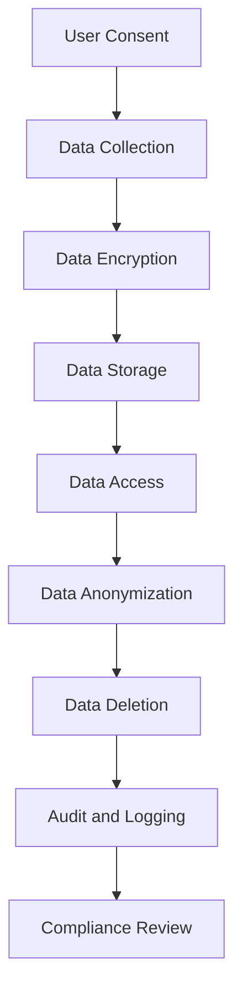

## 15.11 Data Privacy and Compliance (GDPR, HIPAA)

In today's digital age, data privacy and compliance are paramount for any software system handling personal data. As Haskell developers, understanding and implementing the principles of data privacy, especially in the context of regulations like the General Data Protection Regulation (GDPR) and the Health Insurance Portability and Accountability Act (HIPAA), is crucial. This section will guide you through the essential concepts, implementation strategies, and practical examples to ensure your Haskell applications are compliant with these regulations.

### Understanding GDPR and HIPAA

#### GDPR Overview

The General Data Protection Regulation (GDPR) is a comprehensive data protection law in the European Union (EU) that governs how organizations handle personal data. Key principles include:

- **Lawfulness, Fairness, and Transparency**: Data must be processed lawfully, fairly, and transparently.
- **Purpose Limitation**: Data should be collected for specified, explicit, and legitimate purposes.
- **Data Minimization**: Only data necessary for the intended purpose should be collected.
- **Accuracy**: Data must be accurate and kept up to date.
- **Storage Limitation**: Data should be kept in a form that permits identification of data subjects for no longer than necessary.
- **Integrity and Confidentiality**: Data must be processed securely to prevent unauthorized access or processing.

#### HIPAA Overview

The Health Insurance Portability and Accountability Act (HIPAA) is a US law designed to protect sensitive patient health information. Key components include:

- **Privacy Rule**: Establishes standards for the protection of health information.
- **Security Rule**: Sets standards for securing electronic protected health information (ePHI).
- **Breach Notification Rule**: Requires covered entities to notify affected individuals of a data breach.

### Implementing Data Privacy in Haskell

To ensure compliance with GDPR and HIPAA, Haskell applications must incorporate several key practices:

#### Data Encryption

Encrypting sensitive data is a fundamental requirement. Haskell provides libraries such as `cryptonite` for implementing encryption.

```haskell
import Crypto.Cipher.AES (AES256)
import Crypto.Cipher.Types (cipherInit, ecbEncrypt, ecbDecrypt)
import Crypto.Error (CryptoFailable(..))

-- Example of encrypting data using AES256
encryptData :: ByteString -> ByteString -> Either String ByteString
encryptData key plaintext = 
    case cipherInit key of
        CryptoFailed err -> Left (show err)
        CryptoPassed cipher -> Right (ecbEncrypt cipher plaintext)

-- Example of decrypting data
decryptData :: ByteString -> ByteString -> Either String ByteString
decryptData key ciphertext = 
    case cipherInit key of
        CryptoFailed err -> Left (show err)
        CryptoPassed cipher -> Right (ecbDecrypt cipher ciphertext)
```

#### Data Anonymization

Anonymizing data involves removing personally identifiable information (PII) to protect user privacy. This can be achieved by using techniques like hashing or pseudonymization.

```haskell
import Crypto.Hash (hash, Digest, SHA256)
import qualified Data.ByteString.Char8 as BS

-- Example of hashing data for anonymization
anonymizeData :: String -> Digest SHA256
anonymizeData = hash . BS.pack
```

#### User Consent Management

GDPR requires explicit consent from users for data processing. Implementing a consent management system involves tracking user consent and ensuring data processing aligns with the given consent.

```haskell
data UserConsent = UserConsent
    { userId :: Int
    , consentGiven :: Bool
    , consentTimestamp :: UTCTime
    }

-- Function to update user consent
updateUserConsent :: Int -> Bool -> IO ()
updateUserConsent userId consent = do
    currentTime <- getCurrentTime
    let newConsent = UserConsent userId consent currentTime
    -- Save newConsent to database or data store
```

#### Data Deletion and Right to be Forgotten

GDPR grants users the right to request data deletion. Implementing this involves providing mechanisms to delete user data upon request.

```haskell
-- Function to delete user data
deleteUserData :: Int -> IO ()
deleteUserData userId = do
    -- Logic to delete user data from database
    putStrLn $ "User data for user ID " ++ show userId ++ " has been deleted."
```

### Ensuring Compliance with Haskell

#### Auditing and Logging

Maintaining logs of data access and processing activities is essential for compliance. Haskell's `fast-logger` library can be used for efficient logging.

```haskell
import System.Log.FastLogger

-- Example of setting up a logger
setupLogger :: IO LoggerSet
setupLogger = newStdoutLoggerSet defaultBufSize

-- Function to log data access
logDataAccess :: LoggerSet -> String -> IO ()
logDataAccess loggerSet message = do
    time <- getCurrentTime
    pushLogStrLn loggerSet (toLogStr $ show time ++ " - " ++ message)
```

#### Regular Security Audits

Conduct regular security audits to identify vulnerabilities and ensure compliance with security standards. This involves reviewing code, configurations, and access controls.

#### Training and Awareness

Ensure that all team members are aware of data privacy regulations and best practices. Regular training sessions can help maintain compliance and prevent data breaches.

### Visualizing Data Privacy Implementation

Below is a diagram illustrating the flow of data privacy implementation in a Haskell application:



**Diagram Description:** This flowchart represents the stages of data privacy implementation, from obtaining user consent to compliance review, ensuring GDPR and HIPAA requirements are met.

### Try It Yourself

Experiment with the provided code examples by modifying encryption keys, testing data anonymization with different inputs, and implementing a simple consent management system. This hands-on approach will deepen your understanding of data privacy in Haskell.

### Knowledge Check

- Explain the key principles of GDPR and how they apply to data processing.
- Demonstrate how to implement data encryption in Haskell using the `cryptonite` library.
- Describe the process of anonymizing data and its importance in data privacy.
- Provide an example of managing user consent in a Haskell application.

### Summary

In this section, we explored the critical aspects of data privacy and compliance with GDPR and HIPAA in Haskell applications. By implementing encryption, anonymization, consent management, and data deletion mechanisms, we can ensure our applications handle data responsibly and in compliance with regulations. Remember, data privacy is not just a legal requirement but a fundamental aspect of building trust with users.

## Quiz: Data Privacy and Compliance (GDPR, HIPAA)



### What is the primary purpose of GDPR?

- [x] To protect personal data and privacy of individuals within the EU.
- [ ] To regulate financial transactions in the EU.
- [ ] To provide guidelines for software development.
- [ ] To enforce international trade agreements.

> **Explanation:** GDPR is designed to protect personal data and privacy of individuals within the European Union.

### Which Haskell library is commonly used for data encryption?

- [x] cryptonite
- [ ] aeson
- [ ] warp
- [ ] lens

> **Explanation:** The `cryptonite` library is commonly used in Haskell for cryptographic operations, including data encryption.

### What is a key requirement of HIPAA?

- [x] Protecting sensitive patient health information.
- [ ] Regulating software licensing.
- [ ] Managing financial transactions.
- [ ] Enforcing environmental standards.

> **Explanation:** HIPAA is focused on protecting sensitive patient health information.

### How can data anonymization be achieved in Haskell?

- [x] By hashing data using cryptographic functions.
- [ ] By storing data in plain text.
- [ ] By encrypting data without keys.
- [ ] By deleting all data records.

> **Explanation:** Data anonymization can be achieved by hashing data using cryptographic functions to remove personally identifiable information.

### What is the purpose of user consent management?

- [x] To ensure data processing aligns with user consent.
- [ ] To track user login attempts.
- [ ] To manage software licenses.
- [ ] To encrypt user passwords.

> **Explanation:** User consent management ensures that data processing activities align with the consent given by users.

### What is the role of auditing in data privacy?

- [x] To maintain logs of data access and processing activities.
- [ ] To encrypt user data.
- [ ] To anonymize data records.
- [ ] To delete user accounts.

> **Explanation:** Auditing involves maintaining logs of data access and processing activities to ensure compliance with data privacy regulations.

### How often should security audits be conducted?

- [x] Regularly, to identify vulnerabilities and ensure compliance.
- [ ] Once a year, regardless of changes.
- [ ] Only when a breach occurs.
- [ ] Never, if the system is secure.

> **Explanation:** Regular security audits are necessary to identify vulnerabilities and ensure ongoing compliance with data privacy regulations.

### What is the significance of data minimization in GDPR?

- [x] Collecting only data necessary for the intended purpose.
- [ ] Collecting as much data as possible.
- [ ] Storing data indefinitely.
- [ ] Sharing data with third parties.

> **Explanation:** Data minimization involves collecting only the data necessary for the intended purpose, a key principle of GDPR.

### Which of the following is a component of HIPAA?

- [x] Privacy Rule
- [ ] Financial Rule
- [ ] Environmental Rule
- [ ] Trade Rule

> **Explanation:** The Privacy Rule is a component of HIPAA, establishing standards for the protection of health information.

### True or False: GDPR applies only to companies within the EU.

- [ ] True
- [x] False

> **Explanation:** GDPR applies to any company processing the personal data of individuals within the EU, regardless of the company's location.



Remember, this is just the beginning. As you progress, you'll build more complex and interactive systems that adhere to data privacy regulations. Keep experimenting, stay curious, and enjoy the journey!
