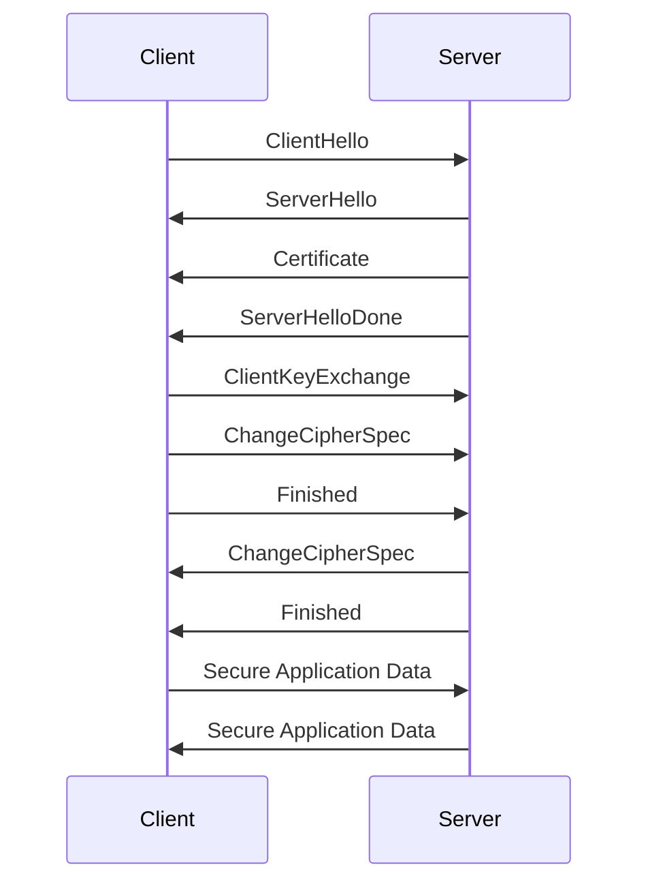

## 15.12 Secure Communication Protocols (TLS/SSL)

In today's digital landscape, ensuring secure communication over networks is paramount. Transport Layer Security (TLS) and its predecessor, Secure Sockets Layer (SSL), are cryptographic protocols designed to provide secure communication over a computer network. This section delves into the intricacies of implementing TLS/SSL in Haskell, focusing on encrypting data in transit, configuring servers and clients, and securing API endpoints with HTTPS.

### Understanding TLS/SSL

**TLS** and **SSL** are protocols that provide a secure channel between two machines operating over the Internet or an internal network. They are widely used for securing web traffic, email, and other forms of data exchange. TLS is the successor to SSL and offers improved security features.

#### Key Concepts

- **Encryption**: Converts data into a secure format that can only be read by someone with the correct decryption key.
- **Authentication**: Verifies the identity of the parties involved in the communication.
- **Integrity**: Ensures that the data has not been altered during transmission.
- **Non-repudiation**: Guarantees that a party cannot deny the authenticity of their signature on a document or a message they sent.

### Implementing TLS/SSL in Haskell

Haskell, with its strong type system and functional paradigm, provides robust libraries for implementing TLS/SSL. The most commonly used library is `tls`, which offers a comprehensive suite of tools for secure communication.

#### Setting Up a TLS Server

To set up a TLS server in Haskell, you need to configure the server to use a certificate and a private key. Here’s a step-by-step guide:

1. **Install the `tls` library**: Ensure you have the `tls` library installed. You can add it to your project using Cabal or Stack.

2. **Generate a Certificate and Private Key**: Use OpenSSL to generate a self-signed certificate and a private key.

   ```bash
   openssl req -x509 -newkey rsa:4096 -keyout key.pem -out cert.pem -days 365 -nodes
   ```

3. **Configure the Server**: Use the `tls` library to configure the server with the generated certificate and key.

   ```haskell
   import Network.TLS
   import Network.TLS.Extra.Cipher
   import qualified Data.ByteString.Lazy as BL

   main :: IO ()
   main = do
       let params = defaultParamsServer
                       { pAllowedVersions = [TLS12]
                       , pCiphers = ciphersuite_default
                       }
       credential <- either error id <$> credentialLoadX509 "cert.pem" "key.pem"
       ctx <- contextNew backend params (credentialLoadX509 "cert.pem" "key.pem")
       handshake ctx
       putStrLn "TLS server is running..."
       -- Handle incoming connections
       where
         backend = undefined -- Define your network backend here
   ```

4. **Handle Connections**: Implement logic to handle incoming connections securely.

#### Setting Up a TLS Client

To set up a TLS client, you need to configure it to trust the server's certificate and establish a secure connection.

1. **Configure the Client**: Use the `tls` library to configure the client.

   ```haskell
   import Network.TLS
   import Network.TLS.Extra.Cipher
   import qualified Data.ByteString.Lazy as BL

   main :: IO ()
   main = do
       let params = defaultParamsClient
                       { pAllowedVersions = [TLS12]
                       , pCiphers = ciphersuite_default
                       }
       ctx <- contextNew backend params
       handshake ctx
       putStrLn "Connected to TLS server"
       -- Send and receive data
       where
         backend = undefined -- Define your network backend here
   ```

2. **Trust the Server's Certificate**: Ensure the client trusts the server's certificate by adding it to the trusted store or using a known CA.

### Securing API Endpoints with HTTPS

Securing API endpoints is crucial for protecting sensitive data. By using HTTPS, you ensure that all data exchanged between the client and server is encrypted.

#### Steps to Secure API Endpoints

1. **Obtain an SSL Certificate**: Acquire an SSL certificate from a trusted Certificate Authority (CA). For development purposes, you can use a self-signed certificate.

2. **Configure the Web Server**: If you're using a web server like Warp or Yesod, configure it to use HTTPS.

   ```haskell
   import Network.Wai.Handler.WarpTLS
   import Network.Wai.Handler.Warp

   main :: IO ()
   main = do
       let tlsSettings = tlsSettings "cert.pem" "key.pem"
       runTLS tlsSettings defaultSettings app
       where
         app = undefined -- Define your WAI application here
   ```

3. **Redirect HTTP to HTTPS**: Ensure that all HTTP requests are redirected to HTTPS to enforce secure communication.

4. **Test the Configuration**: Use tools like `curl` or `Postman` to test the secure endpoints.

### Visualizing TLS/SSL Handshake

The TLS/SSL handshake is a crucial part of establishing a secure connection. It involves several steps to ensure encryption, authentication, and integrity.



**Caption**: The TLS/SSL handshake process involves multiple steps to establish a secure connection between the client and server.

### Design Considerations

When implementing TLS/SSL, consider the following:

- **Performance**: TLS/SSL can introduce latency due to the handshake process. Optimize your server to handle multiple connections efficiently.
- **Compatibility**: Ensure compatibility with different versions of TLS and SSL. Prefer using TLS 1.2 or higher for better security.
- **Certificate Management**: Regularly update and renew certificates to maintain trust.
- **Security Best Practices**: Disable weak ciphers and protocols to prevent vulnerabilities.

### Haskell Unique Features

Haskell's strong type system and functional paradigm offer unique advantages for implementing secure communication protocols:

- **Type Safety**: Haskell's type system helps prevent common programming errors, enhancing security.
- **Immutability**: Immutable data structures reduce the risk of unintended side effects.
- **Concurrency**: Haskell's concurrency model allows efficient handling of multiple secure connections.

### Differences and Similarities with Other Patterns

While TLS/SSL is a security protocol, it shares similarities with other design patterns in terms of modularity and abstraction. For instance, the use of type classes in Haskell can be compared to interfaces in object-oriented programming, providing a way to define secure communication interfaces.

### Try It Yourself

Experiment with the provided code examples by:

- Modifying the server to handle multiple clients concurrently.
- Implementing client-side certificate validation.
- Testing the impact of different cipher suites on performance.

### Knowledge Check

- What are the key components of a TLS/SSL handshake?
- How does Haskell's type system enhance security in TLS/SSL implementations?
- Why is it important to regularly update SSL certificates?

### Embrace the Journey

Remember, mastering secure communication protocols is an ongoing journey. As you continue to explore Haskell's capabilities, you'll discover more ways to enhance security and performance. Stay curious, keep experimenting, and enjoy the process!

## Quiz: Secure Communication Protocols (TLS/SSL)



### What is the primary purpose of TLS/SSL?

- [x] Encrypting data in transit
- [ ] Compressing data for faster transmission
- [ ] Authenticating users
- [ ] Managing network traffic

> **Explanation:** TLS/SSL is primarily used to encrypt data in transit, ensuring secure communication between clients and servers.

### Which Haskell library is commonly used for implementing TLS/SSL?

- [x] tls
- [ ] warp
- [ ] aeson
- [ ] conduit

> **Explanation:** The `tls` library in Haskell provides tools for implementing TLS/SSL secure communication.

### What is a key benefit of using Haskell for TLS/SSL implementation?

- [x] Strong type system
- [ ] Dynamic typing
- [ ] Weak encryption
- [ ] Lack of concurrency support

> **Explanation:** Haskell's strong type system helps prevent common programming errors, enhancing security.

### What is the first step in setting up a TLS server in Haskell?

- [x] Generate a certificate and private key
- [ ] Install the warp library
- [ ] Configure the client
- [ ] Disable weak ciphers

> **Explanation:** Generating a certificate and private key is the first step in setting up a TLS server.

### Which protocol is the successor to SSL?

- [x] TLS
- [ ] HTTP
- [ ] FTP
- [ ] SMTP

> **Explanation:** TLS is the successor to SSL, offering improved security features.

### What does the TLS handshake process ensure?

- [x] Encryption, authentication, and integrity
- [ ] Compression, speed, and reliability
- [ ] User authentication, data storage, and retrieval
- [ ] Network routing, data caching, and load balancing

> **Explanation:** The TLS handshake process ensures encryption, authentication, and integrity of the communication.

### How can you test secure API endpoints?

- [x] Using tools like curl or Postman
- [ ] By disabling SSL
- [ ] By using HTTP instead of HTTPS
- [ ] By ignoring certificate warnings

> **Explanation:** Tools like `curl` or `Postman` can be used to test secure API endpoints.

### What should be disabled to prevent vulnerabilities in TLS/SSL?

- [x] Weak ciphers and protocols
- [ ] Strong encryption
- [ ] Certificate validation
- [ ] Secure connections

> **Explanation:** Disabling weak ciphers and protocols helps prevent vulnerabilities in TLS/SSL.

### What is a common pitfall when implementing TLS/SSL?

- [x] Introducing latency due to the handshake process
- [ ] Increasing data compression
- [ ] Reducing encryption strength
- [ ] Simplifying certificate management

> **Explanation:** The TLS/SSL handshake process can introduce latency, which is a common pitfall.

### True or False: Haskell's immutability reduces the risk of unintended side effects in secure communication.

- [x] True
- [ ] False

> **Explanation:** Haskell's immutability helps reduce the risk of unintended side effects, enhancing security in secure communication.


