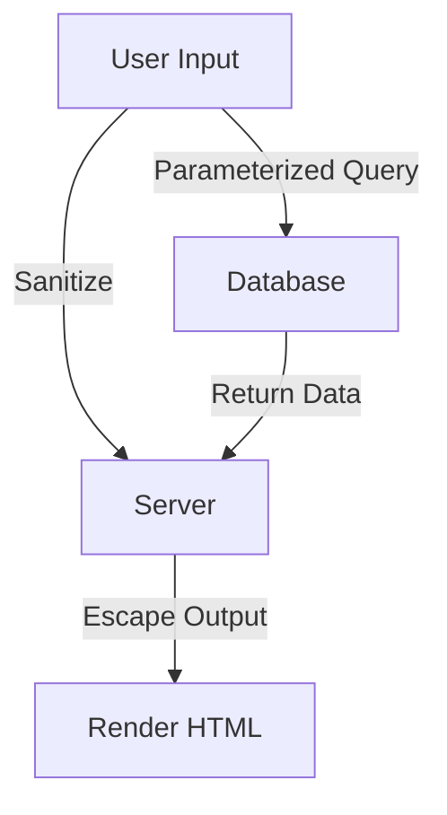

## 15.13 Mitigating Common Vulnerabilities: XSS and SQL Injection in Haskell

In the realm of software security, vulnerabilities such as Cross-Site Scripting (XSS) and SQL Injection are notorious for their potential to compromise systems. As expert software engineers and architects, understanding how to mitigate these vulnerabilities in Haskell applications is crucial. This section delves into the nature of these vulnerabilities, explores prevention techniques, and provides practical examples using Haskell's unique features.

### Understanding Common Vulnerabilities

#### Cross-Site Scripting (XSS)

**XSS** is a security vulnerability that allows attackers to inject malicious scripts into web pages viewed by other users. These scripts can steal cookies, session tokens, or other sensitive information, and can even rewrite the content of the HTML page.

**Types of XSS**:
- **Stored XSS**: Malicious script is stored on the server (e.g., in a database) and served to users.
- **Reflected XSS**: Script is reflected off a web server, such as in an error message or search result.
- **DOM-based XSS**: Occurs when the client-side script modifies the DOM in an unsafe way.

#### SQL Injection

**SQL Injection** is a code injection technique that exploits vulnerabilities in an application's software by inserting malicious SQL statements into an entry field for execution. This can lead to unauthorized access to the database, data leakage, or even data manipulation.

**Common SQL Injection Techniques**:
- **Union-based SQL Injection**: Uses the UNION SQL operator to combine the results of two or more SELECT statements.
- **Error-based SQL Injection**: Forces the database to produce an error message that reveals information about the database structure.
- **Blind SQL Injection**: Exploits the database without error messages, often using boolean conditions to infer data.

### Prevention Techniques

#### Preventing XSS

1. **Sanitize Inputs**: Ensure that all user inputs are sanitized to remove potentially harmful scripts.
2. **Escape Outputs**: Use escaping techniques to ensure that any data rendered in the browser is treated as data, not executable code.
3. **Content Security Policy (CSP)**: Implement CSP headers to restrict the sources from which scripts can be loaded.

#### Preventing SQL Injection

1. **Use Prepared Statements**: Prepared statements with parameterized queries ensure that SQL code is not mixed with data.
2. **Input Validation**: Validate and sanitize all inputs to ensure they conform to expected formats.
3. **Least Privilege Principle**: Ensure that database accounts have the minimum privileges necessary.

### Implementing Security in Haskell

Haskell, with its strong type system and functional paradigm, offers unique advantages in mitigating these vulnerabilities. Let's explore how to implement these security measures in Haskell.

#### Preventing XSS in Haskell

Haskell's type system can be leveraged to ensure that data is properly sanitized and escaped before being rendered in a web application.

```haskell
{-# LANGUAGE OverloadedStrings #-}

import Data.Text (Text)
import qualified Data.Text as T
import Text.Blaze.Html5 as H
import Text.Blaze.Html.Renderer.Text (renderHtml)
import Web.Scotty

-- Function to escape HTML
escapeHtml :: Text -> Html
escapeHtml = H.toHtml . T.concatMap escapeChar
  where
    escapeChar '<' = "&lt;"
    escapeChar '>' = "&gt;"
    escapeChar '&' = "&amp;"
    escapeChar '"' = "&quot;"
    escapeChar '\'' = "&#39;"
    escapeChar c = T.singleton c

main :: IO ()
main = scotty 3000 $ do
  get "/greet" $ do
    name <- param "name"
    html $ renderHtml $ H.docTypeHtml $ do
      H.head $ H.title "Greeting"
      H.body $ H.h1 $ escapeHtml name
```

**Explanation**:
- **escapeHtml Function**: This function escapes special HTML characters to prevent XSS attacks.
- **Scotty Web Framework**: Used to create a simple web server that demonstrates escaping user input.

#### Preventing SQL Injection in Haskell

Haskell's libraries such as `persistent` and `esqueleto` provide mechanisms for safe database interactions.

```haskell
{-# LANGUAGE OverloadedStrings #-}
{-# LANGUAGE GADTs #-}
{-# LANGUAGE FlexibleContexts #-}

import Database.Persist
import Database.Persist.Sqlite
import Database.Persist.TH
import Control.Monad.IO.Class (liftIO)

share [mkPersist sqlSettings, mkMigrate "migrateAll"] [persistLowerCase|
User
    name String
    age Int
    deriving Show
|]

main :: IO ()
main = runSqlite "test.db" $ do
  runMigration migrateAll
  -- Using a parameterized query
  let userName = "John Doe"
  users <- selectList [UserName ==. userName] []
  liftIO $ print users
```

**Explanation**:
- **Persistent Library**: Provides a type-safe way to interact with databases, preventing SQL injection.
- **Parameterized Queries**: Use `==.` to safely construct queries with parameters.

### Visualizing the Security Workflow

Below is a diagram illustrating the workflow for preventing XSS and SQL Injection in a Haskell application.



**Diagram Explanation**:
- **User Input**: Represents data input from the user.
- **Sanitize and Escape**: Steps to sanitize inputs and escape outputs to prevent XSS.
- **Parameterized Query**: Use of prepared statements to prevent SQL Injection.

### Try It Yourself

Experiment with the provided code examples by modifying the input data and observing how the application handles potentially malicious inputs. Try adding new routes or database queries to deepen your understanding.

### References and Further Reading

- [OWASP XSS Prevention Cheat Sheet](https://owasp.org/www-project-cheat-sheets/cheatsheets/Cross_Site_Scripting_Prevention_Cheat_Sheet.html)
- [OWASP SQL Injection Prevention Cheat Sheet](https://owasp.org/www-project-cheat-sheets/cheatsheets/SQL_Injection_Prevention_Cheat_Sheet.html)
- [Haskell Scotty Documentation](https://hackage.haskell.org/package/scotty)
- [Persistent Library Documentation](https://hackage.haskell.org/package/persistent)

### Knowledge Check

- What are the main types of XSS vulnerabilities?
- How does Haskell's type system help in preventing SQL Injection?
- Why is it important to escape HTML output in web applications?

### Embrace the Journey

Remember, mastering security in Haskell is a continuous journey. As you progress, you'll build more secure and robust applications. Keep experimenting, stay curious, and enjoy the journey!

## Quiz: Mitigating Common Vulnerabilities (XSS, SQL Injection)



### What is a common method to prevent XSS attacks?

- [x] Escaping HTML output
- [ ] Using raw user input
- [ ] Disabling JavaScript
- [ ] Ignoring user input

> **Explanation:** Escaping HTML output ensures that any data rendered in the browser is treated as data, not executable code.


### Which Haskell library is commonly used for safe database interactions?

- [x] Persistent
- [ ] Scotty
- [ ] Blaze
- [ ] Warp

> **Explanation:** The Persistent library provides a type-safe way to interact with databases, preventing SQL injection.


### What is the purpose of parameterized queries?

- [x] To prevent SQL Injection
- [ ] To increase database performance
- [ ] To simplify query syntax
- [ ] To allow dynamic table creation

> **Explanation:** Parameterized queries ensure that SQL code is not mixed with data, preventing SQL Injection.


### Which of the following is NOT a type of XSS?

- [x] Blind XSS
- [ ] Stored XSS
- [ ] Reflected XSS
- [ ] DOM-based XSS

> **Explanation:** Blind XSS is not a recognized type of XSS; the common types are Stored, Reflected, and DOM-based.


### How does Haskell's type system aid in security?

- [x] By ensuring type safety and preventing unsafe operations
- [ ] By allowing dynamic typing
- [ ] By enabling runtime type checks
- [ ] By supporting weak typing

> **Explanation:** Haskell's strong type system ensures type safety, preventing many classes of errors and vulnerabilities.


### What is a key benefit of using the Content Security Policy (CSP)?

- [x] Restricting script sources
- [ ] Allowing all scripts
- [ ] Disabling browser security
- [ ] Enabling cross-origin requests

> **Explanation:** CSP restricts the sources from which scripts can be loaded, helping to prevent XSS attacks.


### Which function is used to escape HTML in the provided Haskell example?

- [x] escapeHtml
- [ ] sanitizeInput
- [ ] renderHtml
- [ ] escapeOutput

> **Explanation:** The `escapeHtml` function is used to escape special HTML characters to prevent XSS attacks.


### What is the least privilege principle?

- [x] Ensuring database accounts have minimum necessary privileges
- [ ] Granting all privileges to all users
- [ ] Disabling user accounts
- [ ] Allowing unrestricted access

> **Explanation:** The least privilege principle ensures that database accounts have the minimum privileges necessary, reducing the risk of exploitation.


### True or False: DOM-based XSS occurs on the client side.

- [x] True
- [ ] False

> **Explanation:** DOM-based XSS occurs when the client-side script modifies the DOM in an unsafe way.


### What is a common symptom of SQL Injection?

- [x] Unauthorized access to database data
- [ ] Faster query execution
- [ ] Improved database security
- [ ] Reduced database size

> **Explanation:** SQL Injection can lead to unauthorized access to database data, data leakage, or data manipulation.


