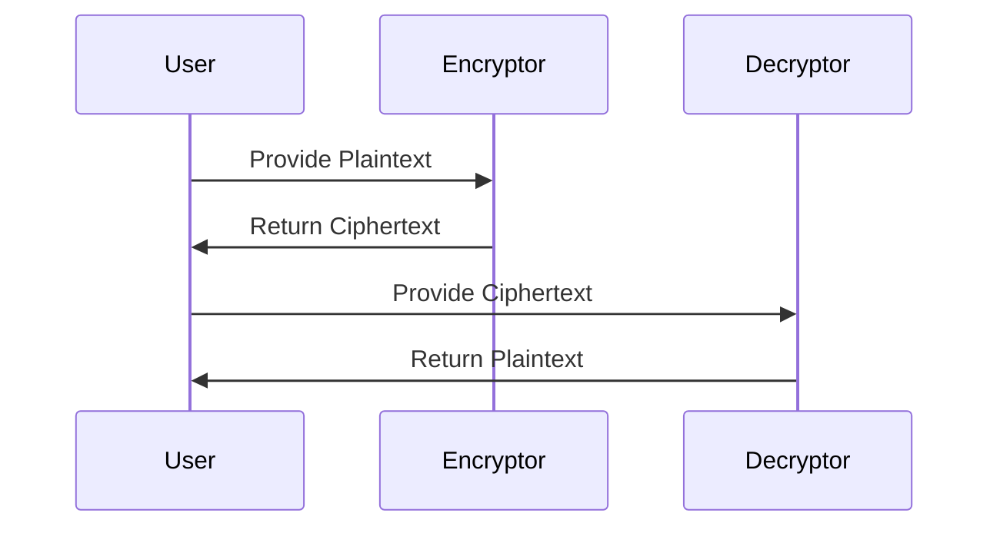

## 15.14 Cryptography and Hashing Functions

In the realm of software engineering, cryptography and hashing functions play a pivotal role in securing data and ensuring integrity. As expert software engineers and architects, understanding these concepts in Haskell can empower you to build robust, secure applications. This section delves into the intricacies of cryptography and hashing functions, providing you with the knowledge and tools to implement these techniques effectively in Haskell.

### Introduction to Cryptography

**Cryptography** is the art of securing information by transforming it into an unreadable format, only to be deciphered by those possessing the correct key. It is essential for protecting sensitive data, ensuring confidentiality, and verifying authenticity.

#### Key Concepts in Cryptography

- **Encryption**: The process of converting plaintext into ciphertext using an algorithm and a key. Encryption ensures that unauthorized parties cannot access the data.
- **Decryption**: The reverse process of encryption, where ciphertext is converted back to plaintext using a key.
- **Symmetric Encryption**: Uses the same key for both encryption and decryption. It is efficient but requires secure key distribution.
- **Asymmetric Encryption**: Uses a pair of keys (public and private) for encryption and decryption. It is more secure for key distribution but computationally intensive.

### Hash Functions

**Hash Functions** are algorithms that take an input and produce a fixed-size string of bytes, typically a digest that appears random. They are used for data integrity checks, password storage, and digital signatures.

#### Key Properties of Hash Functions

- **Deterministic**: The same input will always produce the same output.
- **Fast Computation**: The hash value should be quick to compute.
- **Pre-image Resistance**: It should be infeasible to reverse-engineer the input from the hash output.
- **Collision Resistance**: It should be difficult to find two different inputs that produce the same hash output.

### Implementing Cryptography and Hashing in Haskell

Haskell provides robust libraries for implementing cryptography and hashing functions. One of the most popular libraries is **cryptonite**.

#### Using Cryptonite

**Cryptonite** is a comprehensive library that provides a wide range of cryptographic algorithms and primitives. It is well-suited for both beginners and experts in cryptography.

- **Installation**: You can install cryptonite using Cabal or Stack.

```bash
cabal update
cabal install cryptonite
```

- **Importing Cryptonite**: To use cryptonite in your Haskell program, import the necessary modules.

```haskell
import Crypto.Hash
import Crypto.Cipher.AES
import Crypto.Error
```

#### Example: Hashing Passwords Securely

Hashing passwords is a common use case for cryptographic hash functions. Let's explore how to hash passwords securely using cryptonite.

```haskell
{-# LANGUAGE OverloadedStrings #-}

import Crypto.Hash
import Data.ByteString.Char8 (pack)

-- Function to hash a password using SHA256
hashPassword :: String -> Digest SHA256
hashPassword password = hash (pack password)

main :: IO ()
main = do
    let password = "securepassword"
    let hashedPassword = hashPassword password
    putStrLn $ "Hashed Password: " ++ show hashedPassword
```

In this example, we use the SHA256 algorithm to hash a password. The `hash` function from the `Crypto.Hash` module takes a `ByteString` and returns a `Digest` of the specified hash algorithm.

### Advanced Cryptographic Techniques

Beyond basic hashing and encryption, cryptography encompasses a variety of advanced techniques that enhance security.

#### Symmetric Encryption with AES

AES (Advanced Encryption Standard) is a widely used symmetric encryption algorithm. Here's how to implement AES encryption and decryption in Haskell using cryptonite.

```haskell
{-# LANGUAGE OverloadedStrings #-}

import Crypto.Cipher.AES
import Crypto.Error
import Data.ByteString (ByteString)
import qualified Data.ByteString as B

-- Function to encrypt a plaintext using AES
encryptAES :: ByteString -> ByteString -> ByteString -> ByteString
encryptAES key iv plaintext =
    let cipher = throwCryptoError $ cipherInit key :: AES256
    in ctrCombine cipher iv plaintext

-- Function to decrypt a ciphertext using AES
decryptAES :: ByteString -> ByteString -> ByteString -> ByteString
decryptAES key iv ciphertext =
    let cipher = throwCryptoError $ cipherInit key :: AES256
    in ctrCombine cipher iv ciphertext

main :: IO ()
main = do
    let key = "12345678901234567890123456789012" -- 32 bytes for AES256
    let iv = "1234567890123456" -- 16 bytes for AES
    let plaintext = "This is a secret message."
    let ciphertext = encryptAES key iv (B.pack plaintext)
    putStrLn $ "Ciphertext: " ++ show ciphertext
    let decryptedText = decryptAES key iv ciphertext
    putStrLn $ "Decrypted Text: " ++ show decryptedText
```

In this example, we use AES256 for encryption and decryption. The `ctrCombine` function is used to encrypt and decrypt data in CTR mode, which is a common mode of operation for AES.

### Asymmetric Encryption with RSA

RSA is a popular asymmetric encryption algorithm. It uses a pair of keys for encryption and decryption, making it suitable for secure key exchange.

#### Implementing RSA in Haskell

While cryptonite does not directly support RSA, you can use the `crypto-pubkey` package for RSA operations.

```bash
cabal install crypto-pubkey
```

```haskell
{-# LANGUAGE OverloadedStrings #-}

import Crypto.PubKey.RSA
import Crypto.Random
import Data.ByteString (ByteString)
import qualified Data.ByteString.Char8 as B

-- Function to generate RSA key pair
generateRSAKeys :: IO (PublicKey, PrivateKey)
generateRSAKeys = do
    g <- newGenIO :: IO SystemRandom
    let (pub, priv, _) = generate g 256 65537
    return (pub, priv)

-- Function to encrypt a message using RSA
encryptRSA :: PublicKey -> ByteString -> ByteString
encryptRSA pubKey message = fst $ encrypt g pubKey message
  where
    g = throwCryptoError $ newGenIO :: SystemRandom

-- Function to decrypt a message using RSA
decryptRSA :: PrivateKey -> ByteString -> ByteString
decryptRSA privKey ciphertext = fst $ decrypt g privKey ciphertext
  where
    g = throwCryptoError $ newGenIO :: SystemRandom

main :: IO ()
main = do
    (pubKey, privKey) <- generateRSAKeys
    let message = "Hello, RSA!"
    let ciphertext = encryptRSA pubKey (B.pack message)
    putStrLn $ "Ciphertext: " ++ show ciphertext
    let decryptedMessage = decryptRSA privKey ciphertext
    putStrLn $ "Decrypted Message: " ++ B.unpack decryptedMessage
```

In this example, we generate an RSA key pair and use it to encrypt and decrypt a message. The `crypto-pubkey` package provides the necessary functions for RSA operations.

### Visualizing Cryptographic Processes

To better understand the flow of cryptographic processes, let's visualize the encryption and decryption workflow using Mermaid.js diagrams.



This sequence diagram illustrates the interaction between a user, an encryptor, and a decryptor. The user provides plaintext to the encryptor, receives ciphertext, and then provides the ciphertext to the decryptor to retrieve the original plaintext.

### Design Considerations

When implementing cryptography and hashing functions, consider the following:

- **Algorithm Choice**: Select algorithms based on security requirements and performance considerations.
- **Key Management**: Ensure secure storage and distribution of cryptographic keys.
- **Performance**: Balance security with performance, especially in resource-constrained environments.
- **Compliance**: Adhere to industry standards and regulations for cryptographic implementations.

### Haskell Unique Features

Haskell's strong type system and purity make it well-suited for cryptographic applications. The use of immutable data structures and pure functions ensures that cryptographic operations are predictable and free from side effects.

### Differences and Similarities

Cryptographic patterns in Haskell may differ from those in imperative languages due to Haskell's functional nature. However, the underlying principles of cryptography remain consistent across languages.

### Try It Yourself

Experiment with the provided code examples by modifying the encryption keys, algorithms, or input data. Observe how changes affect the output and behavior of the cryptographic functions.

### Knowledge Check

- What are the key differences between symmetric and asymmetric encryption?
- How does Haskell's type system benefit cryptographic implementations?
- Why is it important to use secure hash functions for password storage?

### Embrace the Journey

Remember, mastering cryptography and hashing functions is a journey. As you explore these concepts in Haskell, you'll gain a deeper understanding of security principles and how to apply them effectively. Keep experimenting, stay curious, and enjoy the journey!

## Quiz: Cryptography and Hashing Functions



### What is the primary purpose of cryptography?

- [x] To secure data by transforming it into an unreadable format
- [ ] To compress data for storage efficiency
- [ ] To enhance data readability
- [ ] To organize data into structured formats

> **Explanation:** Cryptography is primarily used to secure data by transforming it into an unreadable format, ensuring confidentiality and protection from unauthorized access.

### Which of the following is a property of a good hash function?

- [x] Collision resistance
- [ ] Data compression
- [ ] High entropy
- [ ] Variable output length

> **Explanation:** A good hash function should be collision-resistant, meaning it should be difficult to find two different inputs that produce the same hash output.

### What is the main difference between symmetric and asymmetric encryption?

- [x] Symmetric encryption uses the same key for encryption and decryption, while asymmetric encryption uses a pair of keys.
- [ ] Symmetric encryption is slower than asymmetric encryption.
- [ ] Asymmetric encryption uses the same key for encryption and decryption, while symmetric encryption uses a pair of keys.
- [ ] Symmetric encryption is more secure than asymmetric encryption.

> **Explanation:** Symmetric encryption uses the same key for both encryption and decryption, whereas asymmetric encryption uses a pair of keys (public and private) for these operations.

### Which Haskell library is commonly used for cryptographic operations?

- [x] cryptonite
- [ ] aeson
- [ ] lens
- [ ] warp

> **Explanation:** The `cryptonite` library is commonly used in Haskell for cryptographic operations, providing a wide range of cryptographic algorithms and primitives.

### What is the purpose of the `ctrCombine` function in AES encryption?

- [x] To encrypt and decrypt data in CTR mode
- [ ] To generate cryptographic keys
- [ ] To hash data using SHA256
- [ ] To compress data for storage

> **Explanation:** The `ctrCombine` function is used to encrypt and decrypt data in CTR (Counter) mode, a common mode of operation for AES encryption.

### Why is it important to use secure hash functions for password storage?

- [x] To prevent unauthorized access by making it difficult to reverse-engineer the original password
- [ ] To reduce the size of stored passwords
- [ ] To enhance the readability of stored passwords
- [ ] To organize passwords into structured formats

> **Explanation:** Secure hash functions make it difficult to reverse-engineer the original password, preventing unauthorized access and ensuring data integrity.

### What is the role of the `Crypto.Error` module in cryptonite?

- [x] To handle errors related to cryptographic operations
- [ ] To generate random numbers for encryption
- [ ] To compress data for storage efficiency
- [ ] To enhance data readability

> **Explanation:** The `Crypto.Error` module in cryptonite is used to handle errors related to cryptographic operations, ensuring robust and secure implementations.

### Which of the following is a key property of asymmetric encryption?

- [x] It uses a pair of keys (public and private) for encryption and decryption.
- [ ] It is faster than symmetric encryption.
- [ ] It uses the same key for encryption and decryption.
- [ ] It is less secure than symmetric encryption.

> **Explanation:** Asymmetric encryption uses a pair of keys (public and private) for encryption and decryption, making it suitable for secure key exchange.

### What is the significance of pre-image resistance in hash functions?

- [x] It ensures that it is infeasible to reverse-engineer the input from the hash output.
- [ ] It allows for fast computation of hash values.
- [ ] It ensures that the same input always produces the same output.
- [ ] It allows for variable output length.

> **Explanation:** Pre-image resistance ensures that it is infeasible to reverse-engineer the input from the hash output, enhancing the security of hash functions.

### True or False: Haskell's strong type system and purity make it well-suited for cryptographic applications.

- [x] True
- [ ] False

> **Explanation:** Haskell's strong type system and purity ensure that cryptographic operations are predictable and free from side effects, making it well-suited for cryptographic applications.


