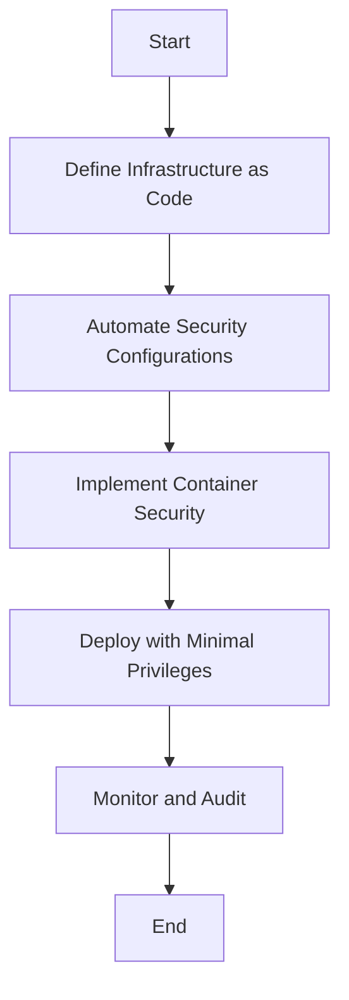

## 15.15 Secure Deployment and Infrastructure

In the realm of software development, ensuring the security of your deployment and infrastructure is paramount. This section delves into the best practices for securing Haskell applications, focusing on minimizing attack surfaces, automating security configurations, and deploying applications with minimal privileges. By the end of this guide, you'll be equipped with the knowledge to build a robust and secure deployment pipeline for your Haskell applications.

### Introduction to Secure Deployment

Secure deployment involves a series of practices and technologies designed to protect applications from unauthorized access and vulnerabilities. In the context of Haskell, a functional programming language known for its strong type system and purity, secure deployment also means leveraging these features to enhance security.

#### Key Concepts

- **Attack Surface**: The sum of different points where an unauthorized user can try to enter data to or extract data from an environment. Minimizing the attack surface reduces the risk of exploitation.
- **Least Privilege**: The principle of granting only the permissions necessary for users or systems to perform their functions, reducing potential damage from compromised accounts.
- **Automation**: Using tools and scripts to automate security configurations, ensuring consistency and reducing human error.

### Best Practices for Secure Deployment

#### Securing Servers

1. **Use Firewalls**: Implement firewalls to control incoming and outgoing network traffic based on predetermined security rules. Firewalls act as a barrier between a trusted network and untrusted networks.

2. **Minimize Attack Surfaces**: Disable unnecessary services and close unused ports to reduce potential entry points for attackers. Regularly audit your systems to identify and mitigate vulnerabilities.

3. **Regular Updates and Patching**: Keep your operating systems, software, and dependencies up to date with the latest security patches. This practice is crucial in protecting against known vulnerabilities.

4. **Secure Configuration**: Harden your server configurations by following security best practices, such as disabling root login over SSH and using strong, unique passwords.

#### Automating Security Configurations

1. **Infrastructure as Code (IaC)**: Use tools like Terraform or Ansible to define and manage your infrastructure through code. This approach ensures consistency and allows for version control of your infrastructure configurations.

2. **Continuous Integration/Continuous Deployment (CI/CD)**: Integrate security checks into your CI/CD pipeline to automatically scan for vulnerabilities and enforce security policies before deploying code to production.

3. **Container Security**: Use containerization tools like Docker to isolate applications and their dependencies. Ensure that containers are built from minimal base images and scanned for vulnerabilities.

#### Deploying with Minimal Privileges

1. **Role-Based Access Control (RBAC)**: Implement RBAC to enforce the principle of least privilege. Define roles and permissions based on the specific needs of users and services.

2. **Service Accounts**: Use dedicated service accounts for applications and services, each with the minimal permissions required to function.

3. **Network Segmentation**: Isolate different parts of your network to limit the spread of an attack. Use virtual private clouds (VPCs) and subnets to separate sensitive data and services.

### Implementation Strategies

#### Automating Security Configurations

Automating security configurations is a critical step in ensuring consistent and repeatable security practices. By using Infrastructure as Code (IaC) tools, you can define your infrastructure in a declarative manner, allowing for easy replication and modification.

##### Example: Using Terraform for Secure Infrastructure

```haskell
# Define a secure AWS VPC with Terraform
provider "aws" {
  region = "us-west-2"
}

resource "aws_vpc" "secure_vpc" {
  cidr_block = "10.0.0.0/16"
  enable_dns_support = true
  enable_dns_hostnames = true
  tags = {
    Name = "secure-vpc"
  }
}

resource "aws_security_group" "web_sg" {
  vpc_id = aws_vpc.secure_vpc.id

  ingress {
    from_port   = 80
    to_port     = 80
    protocol    = "tcp"
    cidr_blocks = ["0.0.0.0/0"]
  }

  egress {
    from_port   = 0
    to_port     = 0
    protocol    = "-1"
    cidr_blocks = ["0.0.0.0/0"]
  }

  tags = {
    Name = "web-sg"
  }
}
```

In this example, we define a secure Virtual Private Cloud (VPC) and a security group using Terraform. This configuration allows for easy replication and modification, ensuring that security settings are consistently applied across environments.

#### Using Containers Securely

Containers provide an isolated environment for applications, making them an excellent choice for secure deployment. However, it's essential to follow best practices to ensure container security.

##### Example: Building a Secure Docker Image

```dockerfile
# Use a minimal base image
FROM alpine:3.12

# Install necessary packages
RUN apk add --no-cache \
    bash \
    curl

# Add application files
COPY ./app /app

# Set permissions
RUN chmod +x /app/start.sh

# Run the application
CMD ["/app/start.sh"]
```

In this Dockerfile, we use a minimal base image (Alpine Linux) to reduce the attack surface. We also ensure that only the necessary packages are installed, and permissions are set appropriately.

### Example: Deploying Applications with Minimal Privileges

Deploying applications with minimal privileges is a crucial aspect of secure deployment. By limiting the permissions granted to applications and services, you reduce the risk of exploitation in case of a security breach.

#### Implementing Role-Based Access Control (RBAC)

RBAC allows you to define roles and permissions for users and services, ensuring that they only have access to the resources they need.

##### Example: Configuring RBAC in Kubernetes

```yaml
# Define a Role with minimal permissions
apiVersion: rbac.authorization.k8s.io/v1
kind: Role
metadata:
  namespace: default
  name: pod-reader
rules:
- apiGroups: [""]
  resources: ["pods"]
  verbs: ["get", "watch", "list"]

# Bind the Role to a ServiceAccount
apiVersion: rbac.authorization.k8s.io/v1
kind: RoleBinding
metadata:
  name: read-pods
  namespace: default
subjects:
- kind: ServiceAccount
  name: pod-reader
  namespace: default
roleRef:
  kind: Role
  name: pod-reader
  apiGroup: rbac.authorization.k8s.io
```

In this example, we define a Kubernetes Role with minimal permissions to read pods. We then bind this role to a ServiceAccount, ensuring that only the necessary permissions are granted.

### Visualizing Secure Deployment

To better understand the concepts of secure deployment, let's visualize the process using a flowchart.



**Figure 1**: Secure Deployment Process Flowchart

This flowchart illustrates the steps involved in secure deployment, from defining infrastructure as code to monitoring and auditing deployed applications.

### Knowledge Check

Before we move on, let's reinforce what we've learned with a few questions:

1. What is the principle of least privilege, and why is it important in secure deployment?
2. How can Infrastructure as Code (IaC) tools like Terraform help in automating security configurations?
3. What are some best practices for using containers securely?
4. How does Role-Based Access Control (RBAC) contribute to deploying applications with minimal privileges?

### Embrace the Journey

Remember, secure deployment is an ongoing process. As you continue to develop and deploy Haskell applications, keep security at the forefront of your mind. By following the best practices outlined in this guide, you'll be well on your way to building secure and resilient applications. Keep experimenting, stay curious, and enjoy the journey!

### Quiz: Secure Deployment and Infrastructure



### What is the primary goal of minimizing the attack surface in secure deployment?

- [x] To reduce the number of potential entry points for attackers
- [ ] To increase the complexity of the system
- [ ] To enhance the performance of the application
- [ ] To simplify the deployment process

> **Explanation:** Minimizing the attack surface reduces the number of potential entry points for attackers, thereby enhancing the security of the system.

### Which tool is commonly used for defining infrastructure as code?

- [x] Terraform
- [ ] Docker
- [ ] Kubernetes
- [ ] Jenkins

> **Explanation:** Terraform is a popular tool for defining infrastructure as code, allowing for consistent and repeatable infrastructure configurations.

### What is the benefit of using a minimal base image in Docker?

- [x] It reduces the attack surface by minimizing unnecessary components
- [ ] It increases the size of the Docker image
- [ ] It simplifies the Dockerfile syntax
- [ ] It enhances the performance of the application

> **Explanation:** Using a minimal base image reduces the attack surface by minimizing unnecessary components, making the container more secure.

### How does Role-Based Access Control (RBAC) enhance security?

- [x] By enforcing the principle of least privilege
- [ ] By granting all users full access to resources
- [ ] By simplifying the user interface
- [ ] By increasing the number of roles

> **Explanation:** RBAC enhances security by enforcing the principle of least privilege, ensuring that users and services only have access to the resources they need.

### What is a key advantage of using Infrastructure as Code (IaC)?

- [x] It allows for version control of infrastructure configurations
- [ ] It increases the complexity of deployment
- [ ] It requires manual configuration of servers
- [ ] It reduces the need for security patches

> **Explanation:** IaC allows for version control of infrastructure configurations, ensuring consistency and enabling easy replication and modification.

### What is the purpose of a firewall in secure deployment?

- [x] To control incoming and outgoing network traffic
- [ ] To increase the speed of data transmission
- [ ] To simplify the network architecture
- [ ] To provide a backup for data

> **Explanation:** A firewall controls incoming and outgoing network traffic based on predetermined security rules, acting as a barrier between trusted and untrusted networks.

### Why is regular updating and patching important in secure deployment?

- [x] To protect against known vulnerabilities
- [ ] To increase the complexity of the system
- [ ] To enhance the user interface
- [ ] To simplify the deployment process

> **Explanation:** Regular updating and patching protect against known vulnerabilities, ensuring that systems remain secure.

### What is the role of a ServiceAccount in Kubernetes?

- [x] To provide a dedicated identity for applications and services
- [ ] To increase the number of users in the system
- [ ] To simplify the user interface
- [ ] To enhance the performance of the application

> **Explanation:** A ServiceAccount provides a dedicated identity for applications and services, allowing for fine-grained access control.

### How can network segmentation enhance security?

- [x] By isolating different parts of the network to limit the spread of an attack
- [ ] By increasing the number of network devices
- [ ] By simplifying the network architecture
- [ ] By enhancing the performance of the application

> **Explanation:** Network segmentation isolates different parts of the network, limiting the spread of an attack and enhancing security.

### True or False: Automating security configurations reduces human error.

- [x] True
- [ ] False

> **Explanation:** Automating security configurations reduces human error by ensuring consistency and repeatability in security practices.



By implementing these secure deployment practices, you'll be well-equipped to protect your Haskell applications and infrastructure from potential threats. Keep learning, stay vigilant, and continue to refine your security strategies.
