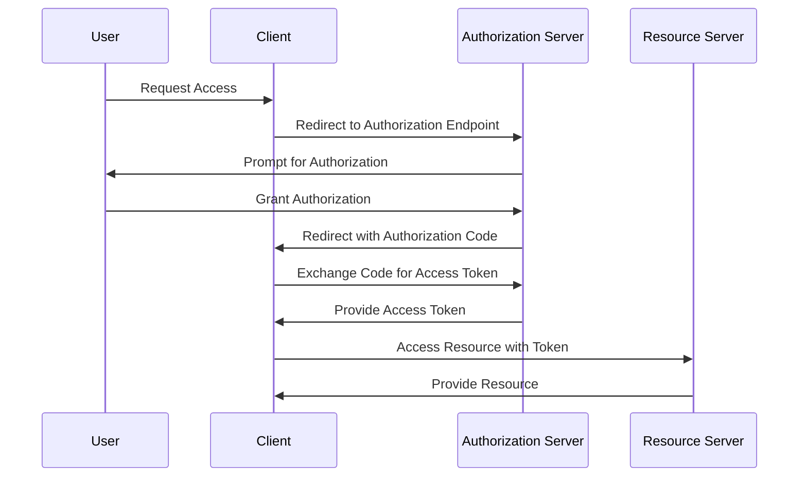

## 15.2 Implementing OAuth2 and OpenID Connect in Haskell

In today's digital landscape, secure authentication and authorization are paramount. OAuth2 and OpenID Connect are two widely adopted standards that facilitate these processes. In this section, we will delve into implementing OAuth2 and OpenID Connect in Haskell, providing expert developers with the knowledge to integrate these protocols into their applications effectively.

### Understanding OAuth2 and OpenID Connect

#### OAuth2: An Authorization Framework

OAuth2 is an open standard for access delegation, commonly used as a way to grant websites or applications limited access to a user's information without exposing passwords. It provides a secure and efficient way to authorize third-party applications to access user data.

- **Roles in OAuth2**:
  - **Resource Owner**: The user who authorizes an application to access their account.
  - **Client**: The application requesting access to the user's account.
  - **Authorization Server**: The server issuing access tokens to the client after successfully authenticating the resource owner.
  - **Resource Server**: The server hosting the protected resources, capable of accepting and responding to protected resource requests using access tokens.

#### OpenID Connect: An Authentication Layer

OpenID Connect is an identity layer on top of the OAuth2 protocol. It allows clients to verify the identity of the end-user based on the authentication performed by an authorization server, as well as to obtain basic profile information about the end-user.

- **Key Components**:
  - **ID Token**: A JSON Web Token (JWT) that contains claims about the authentication of an end-user by an authorization server.
  - **UserInfo Endpoint**: An endpoint that returns claims about the authenticated end-user.

### Implementing OAuth2 in Haskell

#### Setting Up the Environment

Before diving into the implementation, ensure you have the necessary Haskell environment set up. You will need:

- **GHC (Glasgow Haskell Compiler)**: The Haskell compiler.
- **Cabal or Stack**: Build tools for managing Haskell projects.
- **HTTP Client Libraries**: Such as `http-client` or `wreq` for making HTTP requests.

#### Integrating OAuth2

To integrate OAuth2 in a Haskell application, follow these steps:

1. **Register Your Application**: Register your application with the OAuth2 provider (e.g., Google, Facebook) to obtain a client ID and client secret.

2. **Implement the Authorization Code Flow**:
   - **Step 1: Redirect the User**: Redirect the user to the OAuth2 provider's authorization endpoint.
   - **Step 2: Handle the Callback**: After the user authorizes the application, the provider redirects back to your application with an authorization code.
   - **Step 3: Exchange the Authorization Code**: Exchange the authorization code for an access token by making a POST request to the provider's token endpoint.

3. **Access Protected Resources**: Use the access token to access the user's protected resources.

#### Sample Code Snippet

Below is a simplified example of implementing the OAuth2 authorization code flow in Haskell:

```haskell
{-# LANGUAGE OverloadedStrings #-}

import Network.HTTP.Client
import Network.HTTP.Client.TLS
import Data.ByteString.Char8 as BS
import Data.Aeson (decode)
import Control.Monad.IO.Class (liftIO)

-- Define the OAuth2 configuration
data OAuth2Config = OAuth2Config
  { clientId     :: String
  , clientSecret :: String
  , redirectUri  :: String
  , authEndpoint :: String
  , tokenEndpoint :: String
  }

-- Function to get the authorization URL
getAuthorizationUrl :: OAuth2Config -> String -> String
getAuthorizationUrl config state =
  authEndpoint config ++ "?response_type=code&client_id=" ++ clientId config ++
  "&redirect_uri=" ++ redirectUri config ++ "&state=" ++ state

-- Function to exchange authorization code for access token
exchangeCodeForToken :: OAuth2Config -> String -> IO (Maybe String)
exchangeCodeForToken config code = do
  manager <- newManager tlsManagerSettings
  let request = parseRequest_ $ tokenEndpoint config
  let request' = urlEncodedBody
        [ ("grant_type", "authorization_code")
        , ("code", BS.pack code)
        , ("redirect_uri", BS.pack $ redirectUri config)
        , ("client_id", BS.pack $ clientId config)
        , ("client_secret", BS.pack $ clientSecret config)
        ] request
  response <- httpLbs request' manager
  let body = responseBody response
  return $ decode body >>= \obj -> obj .: "access_token"
```

### Implementing OpenID Connect in Haskell

#### Integrating OpenID Connect

OpenID Connect builds upon OAuth2, so the initial steps are similar. However, OpenID Connect introduces additional steps to handle authentication.

1. **Obtain an ID Token**: During the token exchange, request an ID token by including the `openid` scope.

2. **Validate the ID Token**: Verify the ID token's signature and claims to ensure its authenticity.

3. **Access User Information**: Use the ID token to access the UserInfo endpoint and retrieve user profile information.

#### Sample Code Snippet

Here's an example of how to handle OpenID Connect authentication in Haskell:

```haskell
{-# LANGUAGE OverloadedStrings #-}

import Network.HTTP.Client
import Network.HTTP.Client.TLS
import Data.Aeson (decode)
import Data.Text (Text)
import Control.Monad.IO.Class (liftIO)

-- Function to validate the ID token
validateIdToken :: String -> IO Bool
validateIdToken idToken = do
  -- Implement JWT validation logic here
  return True

-- Function to retrieve user information
getUserInfo :: OAuth2Config -> String -> IO (Maybe Text)
getUserInfo config accessToken = do
  manager <- newManager tlsManagerSettings
  let request = parseRequest_ $ "https://provider.com/userinfo"
  let request' = request { requestHeaders = [("Authorization", "Bearer " <> BS.pack accessToken)] }
  response <- httpLbs request' manager
  let body = responseBody response
  return $ decode body >>= \obj -> obj .: "name"
```

### Visualizing OAuth2 and OpenID Connect Flow

To better understand the flow of OAuth2 and OpenID Connect, let's visualize the process using a sequence diagram.



### Design Considerations

When implementing OAuth2 and OpenID Connect, consider the following:

- **Security**: Ensure secure storage of client secrets and tokens. Use HTTPS for all communication.
- **User Experience**: Provide clear instructions and feedback during the authentication process.
- **Error Handling**: Implement robust error handling to manage authentication failures gracefully.

### Haskell Unique Features

Haskell's strong type system and purity offer unique advantages when implementing OAuth2 and OpenID Connect:

- **Type Safety**: Use Haskell's type system to enforce correct handling of tokens and user data.
- **Immutability**: Leverage Haskell's immutable data structures to prevent accidental modification of sensitive information.
- **Concurrency**: Utilize Haskell's concurrency features to handle multiple authentication requests efficiently.

### Differences and Similarities

OAuth2 and OpenID Connect are often confused due to their close relationship. Here's a quick comparison:

- **OAuth2**: Primarily focused on authorization, allowing third-party applications to access user data.
- **OpenID Connect**: Adds authentication capabilities to OAuth2, enabling user identity verification.

### Try It Yourself

To deepen your understanding, try modifying the sample code to:

- Implement additional OAuth2 flows, such as the implicit flow.
- Add error handling for token validation failures.
- Integrate with different identity providers, such as GitHub or LinkedIn.

### Knowledge Check

- What are the main roles in the OAuth2 framework?
- How does OpenID Connect extend OAuth2?
- What are some security considerations when implementing OAuth2?

### Embrace the Journey

Implementing OAuth2 and OpenID Connect in Haskell is a rewarding journey that enhances your application's security and user experience. Remember, this is just the beginning. As you progress, you'll build more secure and robust systems. Keep experimenting, stay curious, and enjoy the journey!

## Quiz: Implementing OAuth2 and OpenID Connect



### What is the primary purpose of OAuth2?

- [x] Authorization
- [ ] Authentication
- [ ] Data Encryption
- [ ] Data Storage

> **Explanation:** OAuth2 is primarily an authorization framework, allowing third-party applications to access user data.

### What does OpenID Connect add to OAuth2?

- [x] Authentication
- [ ] Data Encryption
- [ ] Data Storage
- [ ] Authorization

> **Explanation:** OpenID Connect adds an authentication layer on top of OAuth2, enabling user identity verification.

### Which component issues access tokens in OAuth2?

- [x] Authorization Server
- [ ] Resource Server
- [ ] Client
- [ ] Resource Owner

> **Explanation:** The Authorization Server is responsible for issuing access tokens after authenticating the resource owner.

### What is an ID Token in OpenID Connect?

- [x] A JSON Web Token containing claims about the user's authentication
- [ ] A token for accessing protected resources
- [ ] A token for encrypting data
- [ ] A token for storing user data

> **Explanation:** An ID Token is a JSON Web Token that contains claims about the authentication of an end-user by an authorization server.

### What is the role of the Resource Server in OAuth2?

- [x] Host protected resources and accept requests using access tokens
- [ ] Issue access tokens
- [ ] Authenticate users
- [ ] Store user data

> **Explanation:** The Resource Server hosts protected resources and accepts requests using access tokens.

### Which Haskell feature helps prevent accidental modification of sensitive information?

- [x] Immutability
- [ ] Concurrency
- [ ] Laziness
- [ ] Type Inference

> **Explanation:** Haskell's immutable data structures prevent accidental modification of sensitive information.

### What is a key security consideration when implementing OAuth2?

- [x] Secure storage of client secrets and tokens
- [ ] Using HTTP for communication
- [ ] Storing passwords in plain text
- [ ] Ignoring error handling

> **Explanation:** Secure storage of client secrets and tokens is crucial for maintaining security in OAuth2 implementations.

### How can Haskell's type system be leveraged in OAuth2 implementation?

- [x] Enforce correct handling of tokens and user data
- [ ] Increase code verbosity
- [ ] Reduce code readability
- [ ] Simplify error handling

> **Explanation:** Haskell's type system can enforce correct handling of tokens and user data, enhancing security and reliability.

### What is the first step in the OAuth2 authorization code flow?

- [x] Redirect the user to the authorization endpoint
- [ ] Exchange the authorization code for an access token
- [ ] Access protected resources
- [ ] Validate the ID token

> **Explanation:** The first step in the OAuth2 authorization code flow is to redirect the user to the authorization endpoint.

### True or False: OpenID Connect can be used without OAuth2.

- [ ] True
- [x] False

> **Explanation:** OpenID Connect is built on top of OAuth2 and cannot be used independently.


