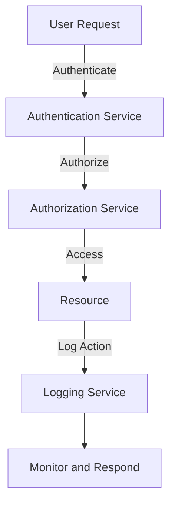

## 15.3 Zero Trust Security Models

In today's rapidly evolving digital landscape, security is paramount. The traditional perimeter-based security model, which assumes that everything inside the network is trustworthy, is no longer sufficient. Enter the Zero Trust Security Model, a paradigm shift that emphasizes the principle of "never trust, always verify." This section delves into the Zero Trust Security Model, its principles, implementation strategies, and how it can be effectively applied in Haskell to build secure, robust applications.

### Zero Trust Principles

The Zero Trust Security Model is built on a few core principles that guide its implementation:

- **Never Trust, Always Verify**: Assume that threats could be both external and internal. Every request must be authenticated and authorized, regardless of its origin.
- **Least Privilege Access**: Users and systems should only have the minimum level of access necessary to perform their tasks. This minimizes the potential damage from compromised credentials.
- **Micro-Segmentation**: Break down security perimeters into smaller zones to maintain separate access controls for different parts of the network.
- **Continuous Monitoring and Validation**: Constantly monitor and validate user and system activities to detect and respond to threats in real-time.
- **Assume Breach**: Design systems with the assumption that a breach has already occurred, and focus on minimizing damage and ensuring rapid recovery.

### Implementing Zero Trust in Haskell

Implementing Zero Trust in Haskell involves leveraging its strong type system, functional paradigms, and concurrency capabilities to create secure applications. Here are some strategies and patterns to consider:

#### Authentication and Authorization

In a Zero Trust model, every request must be authenticated and authorized. Haskell's type system can be used to enforce these checks at compile time, reducing runtime errors and vulnerabilities.

```haskell
-- Define a type for authenticated users
data AuthenticatedUser = AuthenticatedUser { userId :: Int, userRole :: UserRole }

-- Define a function to authenticate a user
authenticateUser :: Request -> IO (Maybe AuthenticatedUser)
authenticateUser request = do
    -- Extract credentials from the request
    let credentials = extractCredentials request
    -- Validate credentials against a user database
    user <- validateCredentials credentials
    return user

-- Define a function to authorize a user action
authorizeAction :: AuthenticatedUser -> Action -> Bool
authorizeAction user action =
    case userRole user of
        Admin -> True
        User -> action `elem` userAllowedActions
        Guest -> action == View
```

In this example, we define an `AuthenticatedUser` type and functions for authentication and authorization. The `authenticateUser` function validates user credentials, while `authorizeAction` checks if the user is permitted to perform a specific action.

#### Micro-Segmentation with Type Classes

Haskell's type classes can be used to implement micro-segmentation by defining different access levels for various parts of the application.

```haskell
class Accessible a where
    access :: AuthenticatedUser -> a -> Bool

data ResourceA = ResourceA
data ResourceB = ResourceB

instance Accessible ResourceA where
    access user _ = userRole user == Admin

instance Accessible ResourceB where
    access user _ = userRole user `elem` [Admin, User]
```

Here, we define a type class `Accessible` that specifies access rules for different resources. Each resource implements the `access` function to enforce its specific access control logic.

#### Continuous Monitoring with Logging

Continuous monitoring is crucial in a Zero Trust model. Haskell's logging libraries can be used to track user activities and system events.

```haskell
import System.Log.Logger

logUserAction :: AuthenticatedUser -> Action -> IO ()
logUserAction user action = do
    let logMessage = "User " ++ show (userId user) ++ " performed action: " ++ show action
    infoM "SecurityLogger" logMessage
```

In this example, we use Haskell's logging capabilities to record user actions. This information can be used for auditing and detecting suspicious activities.

### Example: Designing a Secure Service

Let's design a simple service in Haskell that adheres to Zero Trust principles. This service will authenticate users, authorize actions, and log activities.

```haskell
import Network.Wai
import Network.Wai.Handler.Warp
import Network.HTTP.Types (status200, status401)
import Data.ByteString.Lazy.Char8 as BL

-- Define a simple web application
app :: Application
app request respond = do
    -- Authenticate the user
    mUser <- authenticateUser request
    case mUser of
        Nothing -> respond $ responseLBS status401 [] "Unauthorized"
        Just user -> do
            -- Authorize the action
            let action = extractAction request
            if authorizeAction user action
                then do
                    -- Log the action
                    logUserAction user action
                    -- Respond to the request
                    respond $ responseLBS status200 [] "Action performed"
                else respond $ responseLBS status401 [] "Forbidden"

main :: IO ()
main = run 8080 app
```

This example demonstrates a simple web service that authenticates and authorizes users before allowing them to perform actions. It logs each action for monitoring purposes.

### Visualizing Zero Trust Architecture

To better understand the Zero Trust Security Model, let's visualize its architecture using a diagram.



**Diagram Description**: This flowchart illustrates the Zero Trust architecture. A user request is authenticated and authorized before accessing a resource. Each action is logged, and the system continuously monitors and responds to activities.

### Haskell Unique Features

Haskell offers several unique features that make it well-suited for implementing Zero Trust Security Models:

- **Strong Static Typing**: Haskell's type system can enforce security policies at compile time, reducing runtime vulnerabilities.
- **Pure Functions**: Pure functions ensure that code is predictable and side-effect-free, making it easier to reason about security.
- **Concurrency**: Haskell's concurrency model allows for efficient handling of multiple requests, essential for real-time monitoring and validation.
- **Monads**: Monads provide a powerful way to manage side effects, such as logging and authentication, in a controlled manner.

### Design Considerations

When implementing Zero Trust in Haskell, consider the following:

- **Performance**: Ensure that security checks do not introduce significant latency, especially in high-traffic applications.
- **Scalability**: Design the system to handle increasing loads without compromising security.
- **Usability**: Balance security with user experience to avoid overly complex authentication processes.
- **Compliance**: Ensure that the system meets relevant security standards and regulations.

### Differences and Similarities

Zero Trust Security Models can be confused with traditional perimeter-based security models. The key difference is that Zero Trust assumes no implicit trust, even within the network, whereas perimeter-based models trust internal traffic. Both models aim to protect resources, but Zero Trust provides a more granular and robust approach.

### Try It Yourself

To deepen your understanding, try modifying the code examples:

- **Add New Resources**: Implement additional resources with different access controls.
- **Enhance Logging**: Include more detailed logging information, such as timestamps and IP addresses.
- **Implement Rate Limiting**: Add rate limiting to prevent abuse and enhance security.

### Knowledge Check

- **Question**: What are the core principles of Zero Trust Security Models?
- **Exercise**: Implement a simple Haskell service that authenticates users and logs their actions.

### Embrace the Journey

Remember, implementing Zero Trust is a journey, not a destination. As threats evolve, so must your security strategies. Stay curious, keep learning, and continue to refine your approach to building secure applications.

## Quiz: Zero Trust Security Models



### What is the primary principle of Zero Trust Security Models?

- [x] Never trust, always verify.
- [ ] Trust but verify.
- [ ] Trust internal traffic.
- [ ] Verify external traffic only.

> **Explanation:** Zero Trust Security Models operate on the principle of "never trust, always verify," ensuring that every request is authenticated and authorized.

### How does Haskell's type system contribute to Zero Trust implementation?

- [x] By enforcing security policies at compile time.
- [ ] By allowing dynamic typing.
- [ ] By enabling runtime type checks.
- [ ] By supporting weak typing.

> **Explanation:** Haskell's strong static typing allows security policies to be enforced at compile time, reducing runtime vulnerabilities.

### What is micro-segmentation in Zero Trust?

- [x] Breaking down security perimeters into smaller zones.
- [ ] Combining multiple security zones into one.
- [ ] Eliminating all security zones.
- [ ] Using a single security zone for the entire network.

> **Explanation:** Micro-segmentation involves breaking down security perimeters into smaller zones to maintain separate access controls.

### Which Haskell feature helps manage side effects in Zero Trust implementations?

- [x] Monads
- [ ] Lists
- [ ] Arrays
- [ ] Strings

> **Explanation:** Monads in Haskell provide a way to manage side effects, such as logging and authentication, in a controlled manner.

### What is the role of continuous monitoring in Zero Trust?

- [x] To detect and respond to threats in real-time.
- [ ] To eliminate the need for authentication.
- [ ] To simplify authorization processes.
- [ ] To reduce system performance.

> **Explanation:** Continuous monitoring is crucial in Zero Trust to detect and respond to threats in real-time.

### What is the purpose of least privilege access in Zero Trust?

- [x] To minimize potential damage from compromised credentials.
- [ ] To grant maximum access to all users.
- [ ] To simplify user management.
- [ ] To eliminate the need for authorization.

> **Explanation:** Least privilege access ensures users and systems have only the minimum level of access necessary, minimizing potential damage.

### How can Haskell's concurrency model benefit Zero Trust implementations?

- [x] By efficiently handling multiple requests.
- [ ] By reducing the need for authentication.
- [ ] By simplifying authorization processes.
- [ ] By eliminating side effects.

> **Explanation:** Haskell's concurrency model allows for efficient handling of multiple requests, essential for real-time monitoring and validation.

### What is a key difference between Zero Trust and perimeter-based security models?

- [x] Zero Trust assumes no implicit trust, even within the network.
- [ ] Perimeter-based models assume no implicit trust.
- [ ] Zero Trust trusts internal traffic.
- [ ] Perimeter-based models trust external traffic.

> **Explanation:** Zero Trust assumes no implicit trust, even within the network, unlike perimeter-based models that trust internal traffic.

### Why is it important to balance security with user experience in Zero Trust?

- [x] To avoid overly complex authentication processes.
- [ ] To eliminate the need for authorization.
- [ ] To simplify system design.
- [ ] To reduce system performance.

> **Explanation:** Balancing security with user experience is important to avoid overly complex authentication processes that could hinder usability.

### True or False: Zero Trust Security Models eliminate the need for authentication.

- [ ] True
- [x] False

> **Explanation:** Zero Trust Security Models emphasize the need for authentication and authorization for every request, regardless of its origin.



By embracing the Zero Trust Security Model, you can build more secure and resilient applications in Haskell. Continue exploring and applying these principles to enhance your systems' security posture.
