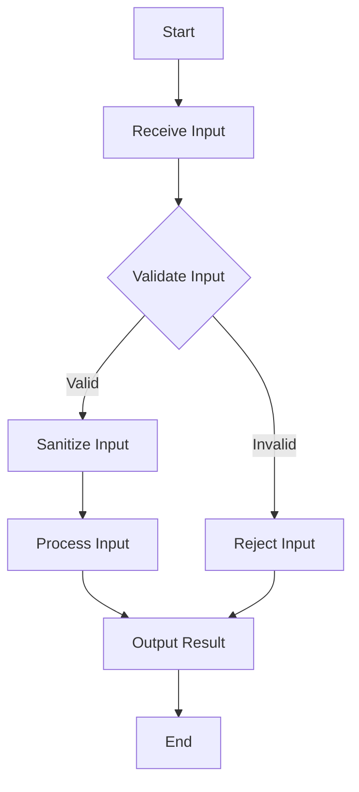

## 15.4 Secure Coding Practices in Haskell

In the realm of software development, security is paramount. Haskell, with its strong type system and functional paradigm, offers unique advantages for writing secure code. In this section, we will explore secure coding practices in Haskell, focusing on avoiding common vulnerabilities, implementing robust input validation, and leveraging type safety to prevent errors.

### Introduction to Secure Coding in Haskell

Secure coding is the practice of writing software that is resilient to attacks and vulnerabilities. In Haskell, secure coding involves using the language's features to enforce safety and correctness. Let's delve into the key aspects of secure coding in Haskell.

### Best Practices for Secure Coding

#### Avoiding Common Vulnerabilities

1. **Buffer Overflows**: Haskell's memory management and lack of pointers eliminate buffer overflow vulnerabilities, common in languages like C and C++.

2. **SQL Injection**: Use parameterized queries and libraries like `persistent` or `beam` to interact with databases safely.

3. **Cross-Site Scripting (XSS)**: When developing web applications, ensure all user inputs are properly escaped. Libraries like `blaze-html` automatically escape HTML content.

4. **Cross-Site Request Forgery (CSRF)**: Implement CSRF tokens in web applications to prevent unauthorized actions.

5. **Insecure Deserialization**: Avoid using unsafe deserialization methods. Use libraries like `aeson` for JSON parsing, which provides type-safe deserialization.

#### Input Validation and Sanitization

Input validation is crucial to prevent malicious data from entering your system. In Haskell, we can leverage the type system to enforce validation rules.

- **Type Safety**: Use custom data types to represent validated input. This ensures that only valid data can be constructed.

```haskell
-- Define a newtype for validated email addresses
newtype Email = Email String deriving (Show)

-- Function to validate email format
validateEmail :: String -> Maybe Email
validateEmail input =
  if isValidEmailFormat input
    then Just (Email input)
    else Nothing

-- Example usage
main :: IO ()
main = do
  let email = "example@example.com"
  case validateEmail email of
    Just validEmail -> putStrLn $ "Valid email: " ++ show validEmail
    Nothing -> putStrLn "Invalid email format"
```

- **Sanitization**: Ensure all inputs are sanitized before processing. This can be done using libraries or custom functions to remove or escape unwanted characters.

```haskell
sanitizeInput :: String -> String
sanitizeInput = filter (`notElem` "<>\"'")

-- Example usage
main :: IO ()
main = do
  let userInput = "<script>alert('xss')</script>"
  putStrLn $ "Sanitized input: " ++ sanitizeInput userInput
```

### Implementation of Secure Coding Practices

#### Using Type Safety to Prevent Errors

Haskell's type system is a powerful tool for ensuring code correctness and security. By using types effectively, we can prevent many classes of errors.

- **Phantom Types**: Use phantom types to enforce additional compile-time checks without affecting runtime performance.

```haskell
{-# LANGUAGE DataKinds #-}
{-# LANGUAGE KindSignatures #-}

data UserType = Admin | Regular

newtype User (a :: UserType) = User { userName :: String }

-- Function restricted to Admin users
adminAction :: User 'Admin -> String
adminAction (User name) = "Admin action performed by " ++ name

-- Example usage
main :: IO ()
main = do
  let adminUser = User "Alice" :: User 'Admin
  putStrLn $ adminAction adminUser
```

- **Smart Constructors**: Use smart constructors to ensure that only valid data can be created.

```haskell
newtype PositiveInt = PositiveInt Int deriving (Show)

mkPositiveInt :: Int -> Maybe PositiveInt
mkPositiveInt n
  | n > 0     = Just (PositiveInt n)
  | otherwise = Nothing

-- Example usage
main :: IO ()
main = do
  let num = 5
  case mkPositiveInt num of
    Just posInt -> putStrLn $ "Positive integer: " ++ show posInt
    Nothing -> putStrLn "Number is not positive"
```

#### Ensuring All Inputs Are Validated and Sanitized

Validation and sanitization are critical steps in secure coding. By ensuring that all inputs are validated and sanitized, we can prevent a wide range of attacks.

- **Validation**: Use pattern matching and guards to enforce validation rules.

```haskell
validatePassword :: String -> Bool
validatePassword pwd = length pwd >= 8 && any isDigit pwd && any isUpper pwd

-- Example usage
main :: IO ()
main = do
  let password = "Secure123"
  if validatePassword password
    then putStrLn "Password is valid"
    else putStrLn "Password is invalid"
```

- **Sanitization**: Use libraries or custom functions to sanitize inputs.

```haskell
sanitizeHtml :: String -> String
sanitizeHtml = escapeHtml

-- Example usage
main :: IO ()
main = do
  let htmlInput = "<div>Hello</div>"
  putStrLn $ "Sanitized HTML: " ++ sanitizeHtml htmlInput
```

### Visualizing Secure Coding Practices

To better understand the flow of secure coding practices, let's visualize the process using a flowchart.



**Figure 1**: Flowchart illustrating the process of input validation and sanitization.

### References and Further Reading

- [OWASP Secure Coding Practices](https://owasp.org/www-project-secure-coding-practices-quick-reference-guide/)
- [Haskell Security Libraries](https://hackage.haskell.org/packages/#cat:Security)
- [Aeson Library for JSON Parsing](https://hackage.haskell.org/package/aeson)

### Knowledge Check

Let's reinforce our understanding with a few questions:

1. What are the benefits of using Haskell's type system for secure coding?
2. How can input validation prevent security vulnerabilities?
3. Why is it important to sanitize user inputs in web applications?

### Embrace the Journey

Remember, secure coding is an ongoing journey. As you continue to develop in Haskell, keep exploring new techniques and libraries to enhance the security of your applications. Stay curious, experiment with different approaches, and enjoy the process of building secure and robust software.

### Quiz: Secure Coding Practices in Haskell



### What is a common vulnerability that Haskell's memory management helps prevent?

- [x] Buffer Overflow
- [ ] SQL Injection
- [ ] Cross-Site Scripting (XSS)
- [ ] Cross-Site Request Forgery (CSRF)

> **Explanation:** Haskell's memory management and lack of pointers eliminate buffer overflow vulnerabilities.

### Which library is recommended for safe JSON parsing in Haskell?

- [x] Aeson
- [ ] Persistent
- [ ] Blaze-HTML
- [ ] Warp

> **Explanation:** The Aeson library provides type-safe JSON parsing in Haskell.

### What is the purpose of using smart constructors in Haskell?

- [x] To ensure only valid data can be created
- [ ] To improve runtime performance
- [ ] To simplify code readability
- [ ] To enforce lazy evaluation

> **Explanation:** Smart constructors are used to ensure that only valid data can be created, enhancing type safety.

### How can cross-site scripting (XSS) be prevented in Haskell web applications?

- [x] By escaping HTML content
- [ ] By using phantom types
- [ ] By implementing CSRF tokens
- [ ] By using smart constructors

> **Explanation:** Escaping HTML content prevents cross-site scripting (XSS) attacks.

### What is the role of phantom types in Haskell?

- [x] To enforce additional compile-time checks
- [ ] To improve runtime performance
- [ ] To simplify code readability
- [ ] To manage side effects

> **Explanation:** Phantom types are used to enforce additional compile-time checks without affecting runtime performance.

### Why is input validation important in secure coding?

- [x] To prevent malicious data from entering the system
- [ ] To improve code readability
- [ ] To enhance runtime performance
- [ ] To enforce lazy evaluation

> **Explanation:** Input validation is crucial to prevent malicious data from entering the system, reducing security risks.

### Which of the following is a benefit of using Haskell's type system?

- [x] Preventing many classes of errors
- [ ] Improving runtime performance
- [ ] Simplifying code readability
- [ ] Enforcing lazy evaluation

> **Explanation:** Haskell's type system helps prevent many classes of errors, enhancing code safety and security.

### What is the purpose of sanitizing inputs in web applications?

- [x] To remove or escape unwanted characters
- [ ] To improve runtime performance
- [ ] To simplify code readability
- [ ] To enforce lazy evaluation

> **Explanation:** Sanitizing inputs removes or escapes unwanted characters, preventing security vulnerabilities.

### True or False: Haskell's strong type system can help prevent SQL injection attacks.

- [x] True
- [ ] False

> **Explanation:** Haskell's strong type system, when combined with libraries like Persistent, can help prevent SQL injection attacks by using parameterized queries.

### Which of the following practices is essential for secure coding in Haskell?

- [x] Input validation and sanitization
- [ ] Using global variables
- [ ] Ignoring type safety
- [ ] Relying on runtime checks

> **Explanation:** Input validation and sanitization are essential practices for secure coding in Haskell.



By following these secure coding practices, you can leverage Haskell's strengths to build secure and robust applications. Keep exploring and refining your skills to stay ahead in the ever-evolving landscape of software security.
