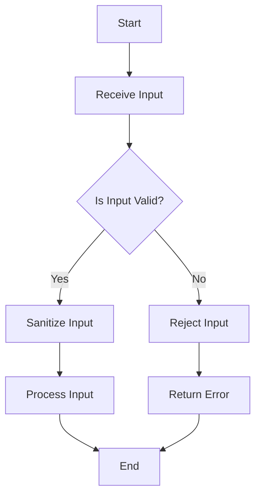

## 15.5 Input Validation and Sanitization

In the realm of software development, ensuring the security and integrity of applications is paramount. Input validation and sanitization are critical components in safeguarding applications against malicious attacks, such as injection attacks, which can compromise data and system integrity. In this section, we will delve into the importance of input validation and sanitization, explore various techniques for implementing these practices in Haskell, and provide practical examples to illustrate these concepts.

### Importance of Input Validation and Sanitization

Input validation and sanitization are essential for several reasons:

- **Preventing Injection Attacks**: Injection attacks, such as SQL injection and command injection, occur when untrusted input is executed as part of a command or query. Proper validation and sanitization can prevent these attacks by ensuring that input is safe to use.
- **Ensuring Data Integrity**: By validating input, we can ensure that the data conforms to expected formats and constraints, reducing the risk of data corruption.
- **Enhancing User Experience**: Validating input can provide immediate feedback to users, helping them correct errors and submit valid data.
- **Compliance with Security Standards**: Many security standards and regulations require input validation as part of their compliance criteria.

### Implementation Strategies

Implementing input validation and sanitization in Haskell involves several strategies:

1. **Validating Data Formats**: Ensure that input data matches expected formats using regular expressions or custom validation functions.
2. **Escaping Special Characters**: Prevent injection attacks by escaping special characters in input data.
3. **Using Type Systems**: Leverage Haskell's strong type system to enforce data constraints at compile time.
4. **Sanitizing Input**: Remove or encode potentially harmful characters from input data.
5. **Utilizing Libraries**: Use existing libraries and frameworks that provide built-in validation and sanitization functions.

### Validating Data Formats

Validating data formats is the first line of defense against invalid input. In Haskell, we can use pattern matching, regular expressions, and custom validation functions to ensure that input data conforms to expected formats.

#### Example: Validating Email Addresses

Let's consider an example of validating email addresses in a Haskell application. We can use regular expressions to check if an input string is a valid email address.

```haskell
import Text.Regex.Posix ((=~))

-- Function to validate email addresses
isValidEmail :: String -> Bool
isValidEmail email = email =~ "^[a-zA-Z0-9._%+-]+@[a-zA-Z0-9.-]+\\.[a-zA-Z]{2,}$"

main :: IO ()
main = do
    let email1 = "example@example.com"
    let email2 = "invalid-email"
    putStrLn $ "Is " ++ email1 ++ " a valid email? " ++ show (isValidEmail email1)
    putStrLn $ "Is " ++ email2 ++ " a valid email? " ++ show (isValidEmail email2)
```

In this example, we use a regular expression to validate email addresses. The `isValidEmail` function returns `True` if the input string matches the email pattern and `False` otherwise.

### Escaping Special Characters

Escaping special characters is crucial to prevent injection attacks. In Haskell, we can use libraries to escape characters in input data.

#### Example: Escaping SQL Queries

When dealing with SQL databases, it's important to escape special characters in user input to prevent SQL injection attacks.

```haskell
import Database.HDBC
import Database.HDBC.Sqlite3 (connectSqlite3)

-- Function to escape SQL input
escapeSqlInput :: String -> String
escapeSqlInput = concatMap escapeChar
  where
    escapeChar '\'' = "''"
    escapeChar c    = [c]

main :: IO ()
main = do
    conn <- connectSqlite3 "example.db"
    let userInput = "O'Reilly"
    let escapedInput = escapeSqlInput userInput
    let query = "SELECT * FROM users WHERE last_name = '" ++ escapedInput ++ "'"
    putStrLn $ "Executing query: " ++ query
    -- Execute the query using the database connection
    -- ...
```

In this example, we define a function `escapeSqlInput` that escapes single quotes in SQL input by replacing them with two single quotes. This prevents SQL injection by ensuring that user input is treated as a literal string.

### Using Type Systems

Haskell's strong type system can be leveraged to enforce data constraints at compile time, reducing the risk of invalid input.

#### Example: Using Newtypes for Validation

We can use Haskell's `newtype` feature to create distinct types for validated input, ensuring that only valid data is used in our application.

```haskell
newtype Email = Email String deriving (Show)

-- Function to create a validated Email
mkEmail :: String -> Maybe Email
mkEmail email
    | isValidEmail email = Just (Email email)
    | otherwise          = Nothing

main :: IO ()
main = do
    let email1 = "example@example.com"
    let email2 = "invalid-email"
    case mkEmail email1 of
        Just validEmail -> putStrLn $ "Valid email: " ++ show validEmail
        Nothing         -> putStrLn "Invalid email"
    case mkEmail email2 of
        Just validEmail -> putStrLn $ "Valid email: " ++ show validEmail
        Nothing         -> putStrLn "Invalid email"
```

In this example, we define a `newtype` `Email` to represent validated email addresses. The `mkEmail` function returns a `Maybe Email`, indicating whether the input string is a valid email address.

### Sanitizing Input

Sanitizing input involves removing or encoding potentially harmful characters from input data. This is especially important when dealing with HTML or XML data to prevent cross-site scripting (XSS) attacks.

#### Example: Sanitizing HTML Input

We can use libraries like `blaze-html` to sanitize HTML input in Haskell applications.

```haskell
import Text.Blaze.Html
import Text.Blaze.Html.Renderer.String (renderHtml)
import Text.Blaze.Html5 as H
import Text.Blaze.Html5.Attributes as A

-- Function to sanitize HTML input
sanitizeHtml :: String -> Html
sanitizeHtml input = H.p (H.toHtml input)

main :: IO ()
main = do
    let userInput = "<script>alert('XSS');</script>"
    let sanitizedHtml = sanitizeHtml userInput
    putStrLn $ "Sanitized HTML: " ++ renderHtml sanitizedHtml
```

In this example, we use the `blaze-html` library to sanitize HTML input by converting it to a safe HTML representation. The `sanitizeHtml` function wraps the input in a paragraph tag, escaping any potentially harmful characters.

### Utilizing Libraries

Haskell offers several libraries that provide built-in validation and sanitization functions. These libraries can simplify the implementation of input validation and sanitization in your applications.

#### Example: Using `aeson` for JSON Validation

The `aeson` library provides tools for parsing and validating JSON data in Haskell applications.

```haskell
{-# LANGUAGE OverloadedStrings #-}

import Data.Aeson
import Data.Text (Text)
import qualified Data.ByteString.Lazy as B

-- Define a data type for user input
data UserInput = UserInput
    { username :: Text
    , email    :: Text
    } deriving (Show)

instance FromJSON UserInput where
    parseJSON = withObject "UserInput" $ \v -> UserInput
        <$> v .: "username"
        <*> v .: "email"

-- Function to validate JSON input
validateJsonInput :: B.ByteString -> Either String UserInput
validateJsonInput input = eitherDecode input

main :: IO ()
main = do
    let jsonInput = "{\"username\": \"john_doe\", \"email\": \"john@example.com\"}"
    case validateJsonInput (B.pack jsonInput) of
        Right userInput -> putStrLn $ "Valid input: " ++ show userInput
        Left err        -> putStrLn $ "Invalid input: " ++ err
```

In this example, we define a `UserInput` data type and implement the `FromJSON` instance to parse JSON input. The `validateJsonInput` function uses `eitherDecode` to validate the JSON input and return a `UserInput` object if the input is valid.

### Visualizing Input Validation and Sanitization

To better understand the process of input validation and sanitization, let's visualize the workflow using a flowchart.



**Figure 1**: This flowchart illustrates the process of input validation and sanitization. Input is first validated, and if valid, it is sanitized before being processed. Invalid input is rejected with an error message.

### Key Takeaways

- **Input validation and sanitization are critical** for preventing injection attacks and ensuring data integrity.
- **Validate data formats** using regular expressions, pattern matching, and custom functions.
- **Escape special characters** to prevent injection attacks in SQL and other contexts.
- **Leverage Haskell's type system** to enforce data constraints at compile time.
- **Sanitize input** to remove or encode potentially harmful characters, especially in HTML and XML contexts.
- **Utilize libraries** like `aeson` and `blaze-html` for built-in validation and sanitization functions.

### Try It Yourself

Experiment with the provided code examples by modifying the input data and observing the results. Try creating your own validation and sanitization functions for different data types and contexts.

### References and Further Reading

- [OWASP Input Validation Cheat Sheet](https://cheatsheetseries.owasp.org/cheatsheets/Input_Validation_Cheat_Sheet.html)
- [Haskell Regular Expressions](https://hackage.haskell.org/package/regex-posix)
- [Aeson Library Documentation](https://hackage.haskell.org/package/aeson)
- [Blaze-HTML Library Documentation](https://hackage.haskell.org/package/blaze-html)

### Embrace the Journey

Remember, mastering input validation and sanitization is a journey. As you progress, you'll build more secure and robust applications. Keep experimenting, stay curious, and enjoy the journey!

## Quiz: Input Validation and Sanitization



### What is the primary purpose of input validation?

- [x] To ensure data conforms to expected formats and constraints
- [ ] To improve application performance
- [ ] To enhance user interface design
- [ ] To reduce code complexity

> **Explanation:** Input validation ensures that data conforms to expected formats and constraints, preventing invalid data from entering the system.

### Which of the following is a common technique for escaping special characters in SQL input?

- [x] Replacing single quotes with two single quotes
- [ ] Removing all spaces from the input
- [ ] Converting input to uppercase
- [ ] Adding a semicolon at the end of the input

> **Explanation:** Escaping special characters in SQL input often involves replacing single quotes with two single quotes to prevent SQL injection.

### How can Haskell's type system be used to enforce data constraints?

- [x] By using `newtype` to create distinct types for validated input
- [ ] By using global variables
- [ ] By using dynamic typing
- [ ] By using runtime checks

> **Explanation:** Haskell's type system can enforce data constraints by using `newtype` to create distinct types for validated input, ensuring only valid data is used.

### What is the purpose of sanitizing input in web applications?

- [x] To remove or encode potentially harmful characters
- [ ] To increase application speed
- [ ] To reduce memory usage
- [ ] To simplify code structure

> **Explanation:** Sanitizing input in web applications involves removing or encoding potentially harmful characters to prevent attacks like XSS.

### Which library is commonly used in Haskell for JSON validation?

- [x] Aeson
- [ ] Blaze-HTML
- [ ] QuickCheck
- [ ] Hspec

> **Explanation:** The `aeson` library is commonly used in Haskell for parsing and validating JSON data.

### What is a benefit of using regular expressions for input validation?

- [x] They allow for pattern matching on strings
- [ ] They improve application performance
- [ ] They reduce code size
- [ ] They simplify user interfaces

> **Explanation:** Regular expressions allow for pattern matching on strings, making them useful for input validation.

### What is a potential risk of not sanitizing HTML input?

- [x] Cross-site scripting (XSS) attacks
- [ ] Increased application speed
- [ ] Reduced memory usage
- [ ] Simplified code structure

> **Explanation:** Not sanitizing HTML input can lead to cross-site scripting (XSS) attacks, where malicious scripts are executed in the user's browser.

### Which function is used in the `aeson` library to decode JSON input?

- [x] eitherDecode
- [ ] renderHtml
- [ ] escapeSqlInput
- [ ] mkEmail

> **Explanation:** The `eitherDecode` function in the `aeson` library is used to decode JSON input and return a parsed object or an error.

### What is the role of the `blaze-html` library in Haskell?

- [x] To sanitize and render HTML input
- [ ] To parse JSON data
- [ ] To perform unit testing
- [ ] To manage database connections

> **Explanation:** The `blaze-html` library in Haskell is used to sanitize and render HTML input, preventing XSS attacks.

### True or False: Input validation and sanitization are only necessary for web applications.

- [ ] True
- [x] False

> **Explanation:** Input validation and sanitization are necessary for all types of applications, not just web applications, to ensure data integrity and security.


