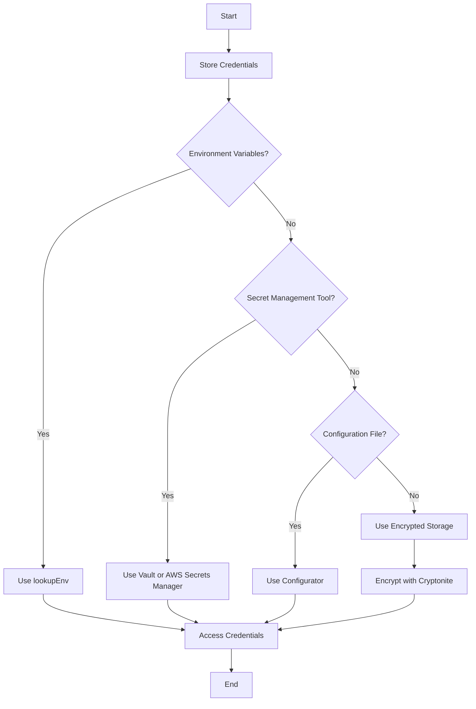

## 15.6 Secure Storage of Credentials and Secrets

In today's digital landscape, safeguarding sensitive information such as API keys, passwords, and other credentials is paramount. In Haskell, as in any programming language, the secure storage of credentials and secrets is a critical aspect of application security. This section will guide you through the challenges, strategies, and best practices for securely managing sensitive information in Haskell applications.

### Understanding the Challenges

Before diving into the strategies for secure storage, it's essential to understand the challenges associated with managing credentials and secrets:

- **Exposure Risk**: Hardcoding credentials in source code can lead to accidental exposure, especially in open-source projects.
- **Unauthorized Access**: Without proper security measures, sensitive information can be accessed by unauthorized users.
- **Data Breaches**: Inadequate protection of credentials can lead to data breaches, compromising user data and trust.
- **Compliance Requirements**: Many industries have strict compliance requirements for handling sensitive information, such as GDPR and HIPAA.

### Strategies for Secure Storage

To mitigate these challenges, several strategies can be employed to securely store and manage credentials and secrets in Haskell applications:

#### 1. Environment Variables

Environment variables are a simple and effective way to manage sensitive information. By storing credentials in environment variables, you can keep them separate from your source code.

**Advantages**:
- Easy to implement and manage.
- Keeps sensitive information out of version control.

**Disadvantages**:
- Not suitable for all deployment environments.
- Can be inadvertently exposed if not handled carefully.

**Example**:

```haskell
import System.Environment (lookupEnv)

main :: IO ()
main = do
    apiKey <- lookupEnv "API_KEY"
    case apiKey of
        Just key -> putStrLn $ "API Key: " ++ key
        Nothing  -> putStrLn "API Key not found!"
```

In this example, the `lookupEnv` function is used to retrieve the API key from the environment variables. This approach ensures that the API key is not hardcoded in the source code.

#### 2. Secret Management Tools

Secret management tools provide a more robust solution for managing credentials and secrets. These tools offer features such as encryption, access control, and auditing.

**Popular Tools**:
- **HashiCorp Vault**: Provides secure storage, access control, and audit logging.
- **AWS Secrets Manager**: Manages secrets for AWS applications with automatic rotation.
- **Azure Key Vault**: Stores and manages access to secrets, keys, and certificates.

**Example with HashiCorp Vault**:

To use HashiCorp Vault with Haskell, you can use the `hvault` library. Here's a basic example of how to retrieve a secret:

```haskell
import Network.VaultTool

main :: IO ()
main = do
    let config = VaultConfig "http://127.0.0.1:8200" "my-token"
    secret <- runVaultT config $ readSecret "secret/my-api-key"
    case secret of
        Just s  -> putStrLn $ "Retrieved secret: " ++ show s
        Nothing -> putStrLn "Secret not found!"
```

In this example, the `VaultConfig` is used to configure the connection to the Vault server, and `readSecret` retrieves the secret from the specified path.

#### 3. Configuration Files

Storing credentials in configuration files is another common approach. However, it's crucial to ensure that these files are not included in version control and are encrypted.

**Best Practices**:
- Use `.gitignore` to exclude configuration files from version control.
- Encrypt configuration files using tools like GPG.

**Example**:

```haskell
import Data.Configurator
import Data.Configurator.Types

main :: IO ()
main = do
    config <- load [Required "config.cfg"]
    apiKey <- require config "api.key"
    putStrLn $ "API Key: " ++ apiKey
```

In this example, the `configurator` library is used to load and read the configuration file. The `require` function retrieves the API key from the configuration.

#### 4. Encrypted Storage

Encrypting sensitive information before storing it in a database or file system adds an additional layer of security.

**Encryption Libraries**:
- **cryptonite**: A comprehensive cryptography library for Haskell.
- **hsopenssl**: Provides bindings to OpenSSL for encryption and decryption.

**Example with Cryptonite**:

```haskell
import Crypto.Cipher.AES
import Crypto.Error
import Data.ByteString (ByteString)
import qualified Data.ByteString.Char8 as BS

encryptData :: ByteString -> ByteString -> ByteString
encryptData key plaintext = case cipherInit key of
    CryptoPassed cipher -> ecbEncrypt cipher plaintext
    CryptoFailed err    -> error $ show err

main :: IO ()
main = do
    let key = BS.pack "mysecretkey12345"  -- 16 bytes key for AES-128
    let plaintext = BS.pack "Sensitive Data"
    let ciphertext = encryptData key plaintext
    putStrLn $ "Encrypted Data: " ++ show ciphertext
```

In this example, the `cryptonite` library is used to encrypt data using AES encryption. The `cipherInit` function initializes the cipher with the provided key, and `ecbEncrypt` encrypts the plaintext.

### Best Practices for Secure Storage

To ensure the secure storage of credentials and secrets, consider the following best practices:

- **Minimize Exposure**: Limit the exposure of sensitive information by keeping it out of source code and version control.
- **Access Control**: Implement strict access control measures to ensure that only authorized users can access sensitive information.
- **Audit and Monitoring**: Regularly audit access to sensitive information and monitor for unauthorized access attempts.
- **Regular Rotation**: Regularly rotate credentials and secrets to minimize the impact of potential exposure.
- **Use Strong Encryption**: Use strong encryption algorithms to protect sensitive information in storage and transit.

### Visualizing Secure Storage Strategies

To better understand the flow of secure storage strategies, let's visualize the process using a flowchart:



This flowchart illustrates the decision-making process for selecting a secure storage strategy based on the available options.

### Haskell Unique Features

Haskell's strong type system and functional programming paradigm offer unique advantages for secure storage:

- **Immutability**: Haskell's immutable data structures reduce the risk of accidental modification of sensitive information.
- **Type Safety**: Haskell's type system ensures that only valid operations are performed on sensitive data.
- **Pure Functions**: Pure functions in Haskell help isolate side effects, making it easier to reason about the security of your code.

### Differences and Similarities with Other Languages

While the principles of secure storage are similar across programming languages, Haskell's functional nature and type system provide distinct advantages:

- **Functional Paradigm**: Haskell's emphasis on pure functions and immutability aligns well with security best practices.
- **Type System**: Haskell's strong type system offers additional safety guarantees compared to dynamically typed languages.
- **Libraries**: Haskell's ecosystem includes libraries specifically designed for secure storage, such as `cryptonite` and `hvault`.

### Try It Yourself

To reinforce your understanding, try modifying the code examples provided in this section. Experiment with different encryption algorithms, secret management tools, and storage strategies. Consider the following exercises:

- Modify the environment variable example to handle missing or malformed credentials gracefully.
- Implement a function to decrypt data encrypted with `cryptonite`.
- Explore the `hvault` library further by storing and retrieving multiple secrets.

### Knowledge Check

- What are the advantages and disadvantages of using environment variables for secure storage?
- How can secret management tools enhance the security of your application?
- Why is it important to encrypt sensitive information before storing it?

### Embrace the Journey

Remember, securing credentials and secrets is an ongoing process. As you continue to develop and deploy Haskell applications, stay vigilant and proactive in protecting sensitive information. Keep experimenting, stay curious, and enjoy the journey!

## Quiz: Secure Storage of Credentials and Secrets



### What is a key advantage of using environment variables for storing credentials?

- [x] Keeps sensitive information out of version control
- [ ] Provides automatic encryption
- [ ] Ensures credentials are always available
- [ ] Simplifies access control

> **Explanation:** Environment variables keep sensitive information separate from the source code, preventing accidental exposure through version control.

### Which Haskell library can be used for encryption?

- [ ] Aeson
- [x] Cryptonite
- [ ] Conduit
- [ ] Warp

> **Explanation:** Cryptonite is a comprehensive cryptography library for Haskell, providing encryption and decryption functionalities.

### What is a disadvantage of using configuration files for storing credentials?

- [ ] Easy to implement
- [ ] Can be encrypted
- [x] May be inadvertently included in version control
- [ ] Provides access control

> **Explanation:** Configuration files can be accidentally committed to version control if not properly excluded, exposing sensitive information.

### Which tool is NOT a secret management tool?

- [ ] HashiCorp Vault
- [ ] AWS Secrets Manager
- [x] HLint
- [ ] Azure Key Vault

> **Explanation:** HLint is a tool for linting Haskell code, not for managing secrets.

### What is a benefit of using secret management tools?

- [x] Provides access control and auditing
- [ ] Simplifies code structure
- [ ] Eliminates the need for encryption
- [ ] Reduces application size

> **Explanation:** Secret management tools offer features like access control, encryption, and auditing to enhance security.

### How does Haskell's type system contribute to secure storage?

- [x] Ensures only valid operations on sensitive data
- [ ] Automatically encrypts data
- [ ] Provides built-in secret management
- [ ] Simplifies environment variable access

> **Explanation:** Haskell's strong type system ensures that only valid operations are performed on data, enhancing security.

### What is a common practice to prevent configuration files from being included in version control?

- [ ] Encrypt the files
- [x] Use .gitignore
- [ ] Store them in a database
- [ ] Use environment variables

> **Explanation:** Using `.gitignore` prevents configuration files from being committed to version control, protecting sensitive information.

### Which of the following is a Haskell library for interacting with HashiCorp Vault?

- [ ] Aeson
- [ ] Warp
- [x] hvault
- [ ] QuickCheck

> **Explanation:** The `hvault` library provides Haskell bindings for interacting with HashiCorp Vault.

### What is a key feature of Haskell that aids in secure storage?

- [ ] Dynamic typing
- [x] Immutability
- [ ] Automatic garbage collection
- [ ] Built-in encryption

> **Explanation:** Haskell's immutability reduces the risk of accidental modification of sensitive information.

### True or False: Encrypting sensitive information before storage is unnecessary if using environment variables.

- [ ] True
- [x] False

> **Explanation:** Encrypting sensitive information is always recommended, regardless of the storage method, to protect against unauthorized access.



---
