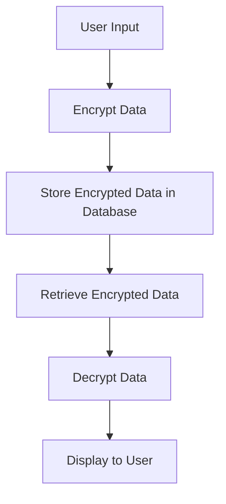

## 15.7 Handling Sensitive Data and Privacy

In today's digital age, handling sensitive data and ensuring privacy is paramount for any software system. As expert software engineers and architects, we must design systems that not only meet functional requirements but also protect user data from unauthorized access and breaches. In this section, we will explore how to handle sensitive data and ensure privacy in Haskell applications, focusing on data protection, compliance, and secure implementation.

### Data Protection

Data protection involves safeguarding data from corruption, compromise, or loss. It encompasses both data at rest (stored data) and data in transit (data being transferred over a network).

#### Encrypting Data at Rest

Encrypting data at rest ensures that even if unauthorized access to storage occurs, the data remains unreadable without the decryption key. In Haskell, we can use libraries like `cryptonite` to perform encryption and decryption.

**Example: Encrypting User Data in a Database**

```haskell
{-# LANGUAGE OverloadedStrings #-}

import Crypto.Cipher.AES (AES256)
import Crypto.Cipher.Types (BlockCipher(..), Cipher(..), makeIV)
import Crypto.Error (CryptoFailable(..))
import qualified Data.ByteString as BS
import qualified Data.ByteString.Char8 as C8

-- Encrypt data using AES256
encryptData :: AES256 -> BS.ByteString -> BS.ByteString
encryptData cipher plaintext = ecbEncrypt cipher plaintext

-- Decrypt data using AES256
decryptData :: AES256 -> BS.ByteString -> BS.ByteString
decryptData cipher ciphertext = ecbDecrypt cipher ciphertext

main :: IO ()
main = do
    let key = "thisisaverysecretkey1234567890" -- 32 bytes for AES256
    let plaintext = "Sensitive User Data"
    
    -- Initialize AES256 cipher
    case cipherInit (C8.pack key) of
        CryptoFailed err -> putStrLn $ "Cipher initialization failed: " ++ show err
        CryptoPassed cipher -> do
            let ciphertext = encryptData cipher (C8.pack plaintext)
            putStrLn $ "Encrypted: " ++ show ciphertext
            
            let decryptedText = decryptData cipher ciphertext
            putStrLn $ "Decrypted: " ++ C8.unpack decryptedText
```

In this example, we use the `cryptonite` library to encrypt and decrypt data using AES256. The key must be kept secure and should not be hardcoded in production systems.

#### Encrypting Data in Transit

Data in transit should be encrypted to prevent interception by unauthorized parties. Secure communication protocols like TLS (Transport Layer Security) are used to encrypt data being transmitted over networks.

**Implementation with Haskell**

Haskell provides libraries such as `tls` for implementing secure communication channels. Here's a basic example of setting up a TLS client:

```haskell
import Network.TLS
import Network.TLS.Extra.Cipher
import qualified Data.ByteString.Lazy as LBS

-- Establish a TLS connection
establishTLSConnection :: IO ()
establishTLSConnection = do
    let params = defaultParamsClient
                    { clientSupported = def { supportedCiphers = ciphersuite_all }
                    }
    context <- contextNewOnHandle handle params
    handshake context
    sendData context (LBS.pack "Hello, secure world!")
    bye context
```

This code snippet demonstrates how to establish a TLS connection using the `tls` library. Always ensure that the server's certificate is verified to prevent man-in-the-middle attacks.

### Compliance

Compliance with data protection laws and regulations is crucial for any organization handling sensitive data. Regulations like GDPR (General Data Protection Regulation) and HIPAA (Health Insurance Portability and Accountability Act) set standards for data protection and privacy.

#### GDPR Compliance

GDPR is a regulation in EU law on data protection and privacy. It mandates that organizations protect personal data and uphold the privacy rights of individuals.

**Key GDPR Requirements:**

- **Data Minimization**: Collect only the data necessary for the intended purpose.
- **Consent**: Obtain explicit consent from users before collecting their data.
- **Right to Access**: Allow users to access their data and know how it is being used.
- **Right to Erasure**: Enable users to request the deletion of their data.

#### HIPAA Compliance

HIPAA is a US law designed to protect sensitive patient health information. It requires that healthcare providers implement safeguards to ensure the confidentiality, integrity, and availability of electronic protected health information (ePHI).

**Key HIPAA Requirements:**

- **Access Control**: Implement technical policies to limit access to ePHI.
- **Audit Controls**: Record and examine access and other activity in information systems.
- **Integrity Controls**: Protect ePHI from improper alteration or destruction.

### Implementation

Implementing data protection and privacy measures involves using encryption libraries, secure communication protocols, and adhering to best practices for secure coding.

#### Using Encryption Libraries

Haskell offers several libraries for encryption, such as `cryptonite` and `tls`. These libraries provide robust cryptographic functions to secure data at rest and in transit.

#### Secure Communication Protocols

Protocols like TLS ensure that data transmitted over networks is encrypted and secure. Always use well-established libraries and frameworks to implement these protocols.

#### Secure Coding Practices

- **Input Validation**: Validate all input to prevent injection attacks.
- **Error Handling**: Avoid exposing sensitive information in error messages.
- **Access Control**: Implement role-based access control to restrict data access.

### Example: Encrypting User Data in a Database

Let's revisit the example of encrypting user data in a database. We'll use the `cryptonite` library to encrypt sensitive information before storing it in a database.

```haskell
{-# LANGUAGE OverloadedStrings #-}

import Crypto.Cipher.AES (AES256)
import Crypto.Cipher.Types (BlockCipher(..), Cipher(..), makeIV)
import Crypto.Error (CryptoFailable(..))
import qualified Data.ByteString as BS
import qualified Data.ByteString.Char8 as C8
import Database.SQLite.Simple

-- Encrypt data using AES256
encryptData :: AES256 -> BS.ByteString -> BS.ByteString
encryptData cipher plaintext = ecbEncrypt cipher plaintext

-- Decrypt data using AES256
decryptData :: AES256 -> BS.ByteString -> BS.ByteString
decryptData cipher ciphertext = ecbDecrypt cipher ciphertext

-- Store encrypted data in the database
storeEncryptedData :: Connection -> AES256 -> String -> IO ()
storeEncryptedData conn cipher plaintext = do
    let ciphertext = encryptData cipher (C8.pack plaintext)
    execute conn "INSERT INTO users (data) VALUES (?)" (Only ciphertext)

main :: IO ()
main = do
    let key = "thisisaverysecretkey1234567890" -- 32 bytes for AES256
    conn <- open "users.db"
    
    -- Initialize AES256 cipher
    case cipherInit (C8.pack key) of
        CryptoFailed err -> putStrLn $ "Cipher initialization failed: " ++ show err
        CryptoPassed cipher -> do
            storeEncryptedData conn cipher "Sensitive User Data"
            putStrLn "Data stored securely."
    
    close conn
```

In this example, we encrypt user data before storing it in an SQLite database. This ensures that even if the database is compromised, the data remains secure.

### Visualizing Data Protection Workflow

To better understand the data protection workflow, let's visualize the process of encrypting and decrypting data in a Haskell application.



**Description:** This diagram illustrates the workflow of handling sensitive data in a Haskell application. Data is encrypted before storage and decrypted upon retrieval, ensuring security throughout the process.

### References and Links

- [Cryptonite Library Documentation](https://hackage.haskell.org/package/cryptonite)
- [TLS Library Documentation](https://hackage.haskell.org/package/tls)
- [GDPR Overview](https://gdpr.eu/)
- [HIPAA Compliance Guide](https://www.hhs.gov/hipaa/for-professionals/index.html)

### Knowledge Check

- **Question:** What is the primary purpose of encrypting data at rest?
  - **Answer:** To ensure that data remains unreadable without the decryption key, even if unauthorized access occurs.

- **Question:** Name two key requirements of GDPR.
  - **Answer:** Data Minimization and Right to Access.

### Embrace the Journey

Handling sensitive data and ensuring privacy is a critical responsibility for software engineers and architects. As you continue to build secure systems, remember to stay informed about the latest security practices and regulations. Keep experimenting, stay curious, and enjoy the journey of creating secure and privacy-conscious applications!

## Quiz: Handling Sensitive Data and Privacy



### What is the primary purpose of encrypting data at rest?

- [x] To ensure data remains unreadable without the decryption key
- [ ] To improve data retrieval speed
- [ ] To reduce storage costs
- [ ] To comply with all international laws

> **Explanation:** Encrypting data at rest ensures that even if unauthorized access occurs, the data remains unreadable without the decryption key.

### Which library can be used in Haskell for encryption?

- [x] Cryptonite
- [ ] Pandas
- [ ] NumPy
- [ ] React

> **Explanation:** Cryptonite is a Haskell library that provides cryptographic functions for encryption and decryption.

### What does GDPR stand for?

- [x] General Data Protection Regulation
- [ ] Global Data Privacy Regulation
- [ ] General Data Privacy Rights
- [ ] Global Data Protection Rights

> **Explanation:** GDPR stands for General Data Protection Regulation, which is a regulation in EU law on data protection and privacy.

### Which protocol is commonly used to encrypt data in transit?

- [x] TLS
- [ ] HTTP
- [ ] FTP
- [ ] SMTP

> **Explanation:** TLS (Transport Layer Security) is a protocol used to encrypt data being transmitted over networks.

### What is a key requirement of HIPAA?

- [x] Access Control
- [ ] Data Minimization
- [ ] Right to Erasure
- [ ] Consent

> **Explanation:** HIPAA requires implementing technical policies to limit access to electronic protected health information (ePHI).

### What should be avoided in error messages to ensure security?

- [x] Exposing sensitive information
- [ ] Using technical jargon
- [ ] Providing detailed stack traces
- [ ] Logging error codes

> **Explanation:** Avoid exposing sensitive information in error messages to prevent potential security breaches.

### What is the role of the `tls` library in Haskell?

- [x] To implement secure communication channels
- [ ] To manage database connections
- [ ] To handle file I/O operations
- [ ] To perform data serialization

> **Explanation:** The `tls` library in Haskell is used to implement secure communication channels using the TLS protocol.

### What is the purpose of data minimization under GDPR?

- [x] To collect only the data necessary for the intended purpose
- [ ] To reduce data storage costs
- [ ] To improve data processing speed
- [ ] To comply with HIPAA regulations

> **Explanation:** Data minimization under GDPR mandates collecting only the data necessary for the intended purpose.

### Which of the following is a secure coding practice?

- [x] Input Validation
- [ ] Hardcoding encryption keys
- [ ] Using default passwords
- [ ] Disabling security features

> **Explanation:** Input validation is a secure coding practice that helps prevent injection attacks.

### True or False: TLS is used to encrypt data at rest.

- [ ] True
- [x] False

> **Explanation:** TLS is used to encrypt data in transit, not data at rest.


