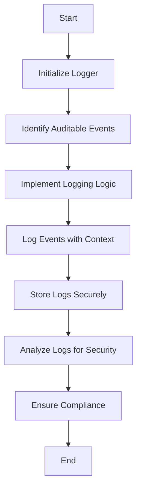

## 15.8 Auditing and Logging for Security

In today's digital landscape, ensuring the security of applications is paramount. Auditing and logging are critical components of a robust security strategy. They provide insights into system behavior, help detect anomalies, and ensure compliance with regulatory requirements. In this section, we will explore how to effectively implement auditing and logging in Haskell applications, leveraging its functional programming paradigms.

### Purpose of Auditing and Logging

The primary purpose of auditing and logging is to track actions within an application for analysis and compliance. This involves recording significant events, such as user logins, data access, and system errors, along with the context in which they occur. By maintaining comprehensive logs, organizations can:

- **Detect Security Breaches**: Identify unauthorized access or suspicious activities.
- **Ensure Compliance**: Meet regulatory requirements such as GDPR, HIPAA, or PCI DSS.
- **Facilitate Incident Response**: Provide a trail of evidence for forensic analysis.
- **Improve System Reliability**: Monitor system performance and detect issues early.

### Key Concepts in Auditing and Logging

Before diving into implementation, let's clarify some key concepts:

- **Log Levels**: Different levels of logging (e.g., DEBUG, INFO, WARN, ERROR) help categorize the importance and urgency of log messages.
- **Log Rotation**: Managing log file sizes by archiving old logs and creating new ones.
- **Structured Logging**: Using a consistent format (e.g., JSON) to make logs machine-readable and easily searchable.
- **Contextual Information**: Including metadata such as timestamps, user IDs, and request IDs to provide context for log entries.

### Implementation in Haskell

Haskell's strong type system and functional nature make it well-suited for implementing secure and efficient logging mechanisms. Let's explore how to set up auditing and logging in a Haskell application.

#### Setting Up a Logging Framework

To begin, we need a logging framework. One popular choice in the Haskell ecosystem is the `fast-logger` library, which provides a performant and flexible logging solution.

```haskell
{-# LANGUAGE OverloadedStrings #-}

import System.Log.FastLogger

main :: IO ()
main = do
    -- Initialize a logger with a file output
    timeCache <- newTimeCache simpleTimeFormat
    loggerSet <- newTimedFastLogger timeCache (LogFileNoRotate "app.log" 4096)

    -- Log an informational message
    loggerSet (\time -> toLogStr time <> " [INFO] Application started\n")

    -- Log an error message
    loggerSet (\time -> toLogStr time <> " [ERROR] An error occurred\n")

    -- Flush the logger
    flushLogStr loggerSet
```

In this example, we initialize a logger that writes to a file named `app.log`. We use `newTimedFastLogger` to create a logger that includes timestamps in each log entry. The `toLogStr` function converts strings to the `LogStr` type, which is used by `fast-logger`.

#### Structured Logging

Structured logging enhances the readability and searchability of logs. By using a consistent format like JSON, we can easily parse and analyze log data.

```haskell
{-# LANGUAGE OverloadedStrings #-}

import Data.Aeson (encode, object, (.=))
import System.Log.FastLogger

logStructured :: TimedFastLogger -> IO ()
logStructured loggerSet = do
    let logEntry = object
            [ "timestamp" .= ("2024-11-23T10:00:00Z" :: String)
            , "level" .= ("INFO" :: String)
            , "message" .= ("User login successful" :: String)
            , "userId" .= (12345 :: Int)
            ]
    loggerSet (\_ -> toLogStr (encode logEntry) <> "\n")
```

In this example, we create a JSON object representing a log entry and use `encode` from the `aeson` library to convert it to a `ByteString`. This structured format allows for easy integration with log analysis tools.

#### Contextual Logging

Including contextual information in logs is crucial for understanding the circumstances of each event. We can achieve this by passing additional metadata to our logging functions.

```haskell
{-# LANGUAGE OverloadedStrings #-}

import Data.Aeson (encode, object, (.=))
import System.Log.FastLogger

logWithContext :: TimedFastLogger -> String -> Int -> IO ()
logWithContext loggerSet message userId = do
    let logEntry = object
            [ "timestamp" .= ("2024-11-23T10:00:00Z" :: String)
            , "level" .= ("INFO" :: String)
            , "message" .= message
            , "userId" .= userId
            ]
    loggerSet (\_ -> toLogStr (encode logEntry) <> "\n")

main :: IO ()
main = do
    timeCache <- newTimeCache simpleTimeFormat
    loggerSet <- newTimedFastLogger timeCache (LogFileNoRotate "app.log" 4096)

    -- Log a message with context
    logWithContext loggerSet "User login successful" 12345
```

Here, we define a `logWithContext` function that takes a message and a user ID as parameters. This allows us to include relevant context in each log entry.

### Auditing for Security

Auditing involves more than just logging; it requires a systematic approach to track and analyze security-related events. Let's explore some best practices for implementing auditing in Haskell applications.

#### Identifying Auditable Events

The first step in auditing is identifying which events need to be tracked. Common auditable events include:

- **Authentication Attempts**: Successful and failed login attempts.
- **Authorization Checks**: Access to sensitive resources.
- **Data Modifications**: Changes to critical data.
- **System Errors**: Exceptions and failures.

#### Implementing Auditing Logic

Once we've identified auditable events, we can implement the logic to record them. This often involves integrating auditing into existing application workflows.

```haskell
{-# LANGUAGE OverloadedStrings #-}

import Data.Aeson (encode, object, (.=))
import System.Log.FastLogger

auditLoginAttempt :: TimedFastLogger -> String -> Bool -> IO ()
auditLoginAttempt loggerSet username success = do
    let logEntry = object
            [ "timestamp" .= ("2024-11-23T10:00:00Z" :: String)
            , "event" .= ("login_attempt" :: String)
            , "username" .= username
            , "success" .= success
            ]
    loggerSet (\_ -> toLogStr (encode logEntry) <> "\n")

main :: IO ()
main = do
    timeCache <- newTimeCache simpleTimeFormat
    loggerSet <- newTimedFastLogger timeCache (LogFileNoRotate "audit.log" 4096)

    -- Audit a login attempt
    auditLoginAttempt loggerSet "john_doe" True
```

In this example, we define an `auditLoginAttempt` function that logs login attempts, including the username and whether the attempt was successful.

#### Ensuring Compliance

Compliance with regulatory requirements often mandates specific auditing practices. Here are some tips to ensure compliance:

- **Data Retention**: Determine how long logs should be retained based on legal requirements.
- **Access Control**: Restrict access to logs to authorized personnel only.
- **Integrity**: Ensure logs are tamper-proof by using cryptographic techniques.
- **Regular Reviews**: Conduct regular audits of log data to identify potential security issues.

### Visualizing Logging and Auditing

To better understand the flow of logging and auditing in a Haskell application, let's visualize the process using a Mermaid.js flowchart.



**Figure 1**: This flowchart illustrates the process of setting up logging and auditing in a Haskell application, from initialization to compliance.

### Best Practices for Auditing and Logging

To maximize the effectiveness of auditing and logging, consider the following best practices:

- **Use Log Levels Wisely**: Differentiate between informational messages, warnings, and errors.
- **Automate Log Analysis**: Use tools to automatically analyze logs and detect anomalies.
- **Integrate with Monitoring Systems**: Combine logging with monitoring tools for real-time alerts.
- **Regularly Review Logs**: Schedule periodic reviews of log data to identify trends and potential issues.
- **Document Logging Policies**: Clearly define logging policies and procedures for your organization.

### Haskell-Specific Considerations

Haskell's unique features, such as its strong type system and lazy evaluation, offer both advantages and challenges for logging and auditing:

- **Type Safety**: Use Haskell's type system to enforce structured logging formats and prevent errors.
- **Lazy Evaluation**: Be mindful of lazy evaluation when logging, as it may delay the execution of logging statements.
- **Concurrency**: Leverage Haskell's concurrency features to handle high-volume logging efficiently.

### Try It Yourself

To deepen your understanding, try modifying the provided code examples:

- **Experiment with Different Log Levels**: Add additional log levels (e.g., DEBUG, WARN) and observe how they affect log output.
- **Implement Additional Auditable Events**: Extend the auditing logic to cover more events, such as data modifications or system errors.
- **Integrate with a Monitoring Tool**: Connect your logging system to a monitoring tool like Prometheus or Grafana for real-time analysis.

### Conclusion

Auditing and logging are essential components of a secure application. By implementing effective logging strategies in Haskell, you can enhance security, ensure compliance, and gain valuable insights into system behavior. Remember, this is just the beginning. As you progress, you'll build more complex and secure systems. Keep experimenting, stay curious, and enjoy the journey!

## Quiz: Auditing and Logging for Security



### What is the primary purpose of auditing and logging in applications?

- [x] To track actions for analysis and compliance
- [ ] To improve application performance
- [ ] To reduce code complexity
- [ ] To enhance user interface design

> **Explanation:** Auditing and logging are primarily used to track actions within an application for analysis and compliance purposes.

### Which Haskell library is commonly used for logging?

- [x] fast-logger
- [ ] aeson
- [ ] lens
- [ ] conduit

> **Explanation:** The `fast-logger` library is commonly used in Haskell for logging due to its performance and flexibility.

### What is structured logging?

- [x] Logging using a consistent format like JSON
- [ ] Logging without any specific format
- [ ] Logging only error messages
- [ ] Logging with random data

> **Explanation:** Structured logging involves using a consistent format, such as JSON, to make logs machine-readable and easily searchable.

### Why is contextual information important in logs?

- [x] It provides context for understanding the circumstances of each event
- [ ] It increases the size of log files
- [ ] It makes logs harder to read
- [ ] It is not important

> **Explanation:** Contextual information is crucial for understanding the circumstances of each logged event, such as the user ID or timestamp.

### What is the purpose of log rotation?

- [x] To manage log file sizes by archiving old logs
- [ ] To delete all logs periodically
- [ ] To increase log verbosity
- [ ] To reduce log file sizes by compressing them

> **Explanation:** Log rotation is used to manage log file sizes by archiving old logs and creating new ones.

### What is an auditable event?

- [x] An event that needs to be tracked for security or compliance
- [ ] Any event that occurs in the application
- [ ] A user interface event
- [ ] A performance optimization event

> **Explanation:** An auditable event is one that needs to be tracked for security or compliance purposes, such as login attempts or data access.

### How can you ensure logs are tamper-proof?

- [x] By using cryptographic techniques
- [ ] By storing them in plain text
- [ ] By deleting them regularly
- [ ] By not logging sensitive information

> **Explanation:** Using cryptographic techniques can help ensure that logs are tamper-proof and maintain their integrity.

### What is the benefit of integrating logging with monitoring systems?

- [x] It allows for real-time alerts and analysis
- [ ] It reduces the need for logging
- [ ] It makes logs harder to read
- [ ] It increases log file sizes

> **Explanation:** Integrating logging with monitoring systems allows for real-time alerts and analysis, enhancing security and system reliability.

### Which of the following is a best practice for auditing and logging?

- [x] Use log levels wisely
- [ ] Log everything at the DEBUG level
- [ ] Avoid logging errors
- [ ] Never review logs

> **Explanation:** Using log levels wisely is a best practice for auditing and logging, as it helps categorize the importance and urgency of log messages.

### True or False: Lazy evaluation in Haskell can delay the execution of logging statements.

- [x] True
- [ ] False

> **Explanation:** Lazy evaluation in Haskell can indeed delay the execution of logging statements, which is important to consider when implementing logging.


