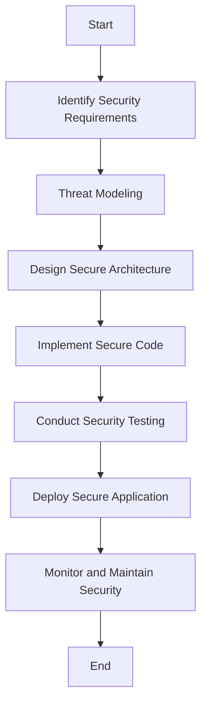

## 15.9 Security by Design Principles

In today's digital landscape, security is not just an afterthought but a critical component of software development. As expert software engineers and architects, it is imperative to integrate security considerations from the very beginning of the software development lifecycle. This approach, known as "Security by Design," ensures that security is embedded into the architecture and code, minimizing vulnerabilities and enhancing the overall robustness of the system.

### Understanding Security by Design

Security by Design is a proactive approach that emphasizes the importance of incorporating security measures during the initial stages of software development. This principle advocates for designing systems with security as a core component, rather than retrofitting security features after the system has been built. By doing so, developers can prevent security breaches and reduce the risk of exploitation.

#### Key Concepts of Security by Design

1. **Incorporating Security from the Start**: Security considerations should be integrated into the design and development process from the outset. This involves identifying potential threats and vulnerabilities early on and addressing them through secure coding practices and architectural decisions.

2. **Designing with Security as a Priority**: Security should be a primary focus during the design phase. This means selecting secure design patterns, using secure libraries and frameworks, and adhering to best practices for secure coding.

3. **Applying the Principle of Least Privilege**: This principle dictates that users and systems should have the minimum level of access necessary to perform their functions. By limiting access, the potential impact of a security breach is reduced.

### Implementing Security by Design in Haskell

Haskell, with its strong static typing and functional programming paradigm, offers unique advantages for implementing Security by Design principles. Its type system can be leveraged to enforce security constraints and ensure that code adheres to security policies.

#### Designing Secure Architecture

1. **Threat Modeling**: Begin by identifying potential threats and vulnerabilities in the system. Use threat modeling techniques to assess risks and prioritize security measures.

2. **Secure Design Patterns**: Choose design patterns that inherently support security. For example, use the Singleton pattern to manage sensitive resources, ensuring controlled access and preventing unauthorized use.

3. **Type Safety**: Leverage Haskell's type system to enforce security constraints. Use type classes and data types to represent security policies and ensure that code adheres to these policies.

4. **Immutable Data Structures**: Utilize Haskell's immutable data structures to prevent unauthorized modifications and ensure data integrity.

#### Secure Coding Practices

1. **Input Validation and Sanitization**: Always validate and sanitize user inputs to prevent injection attacks and other vulnerabilities. Use Haskell's strong typing to enforce input constraints.

2. **Error Handling with Monads**: Use monads like `Maybe` and `Either` for error handling, ensuring that errors are handled gracefully and do not expose sensitive information.

3. **Access Control**: Implement access control mechanisms using Haskell's type system. Use type classes to define roles and permissions, and enforce these constraints at compile time.

4. **Secure Communication**: Ensure that all communication between components is secure. Use encryption libraries to protect data in transit and prevent eavesdropping.

### Example: Applying the Principle of Least Privilege

The principle of least privilege is a cornerstone of Security by Design. It involves granting users and systems only the access necessary to perform their tasks, reducing the risk of unauthorized access and data breaches.

#### Implementing Least Privilege in Haskell

Consider a Haskell application that manages user accounts. We can apply the principle of least privilege by defining roles and permissions using Haskell's type system.

```haskell
-- Define roles using data types
data Role = Admin | User | Guest deriving (Eq, Show)

-- Define permissions using type classes
class HasAccess a where
    canView :: a -> Bool
    canEdit :: a -> Bool
    canDelete :: a -> Bool

-- Implement permissions for each role
instance HasAccess Role where
    canView Admin = True
    canView User  = True
    canView Guest = True

    canEdit Admin = True
    canEdit User  = True
    canEdit Guest = False

    canDelete Admin = True
    canDelete User  = False
    canDelete Guest = False

-- Function to check access
checkAccess :: Role -> String -> Bool
checkAccess role action = case action of
    "view"   -> canView role
    "edit"   -> canEdit role
    "delete" -> canDelete role
    _        -> False

-- Example usage
main :: IO ()
main = do
    let userRole = User
    putStrLn $ "Can user view? " ++ show (checkAccess userRole "view")
    putStrLn $ "Can user edit? " ++ show (checkAccess userRole "edit")
    putStrLn $ "Can user delete? " ++ show (checkAccess userRole "delete")
```

In this example, we define roles and permissions using data types and type classes. The `checkAccess` function enforces access control based on the user's role, ensuring that users have only the permissions necessary for their tasks.

### Visualizing Security by Design

To better understand the flow of Security by Design principles, let's visualize the process using a flowchart. This diagram illustrates the steps involved in integrating security into the software development lifecycle.



**Diagram Description**: This flowchart represents the Security by Design process, starting with identifying security requirements and ending with monitoring and maintaining security post-deployment.

### References and Further Reading

- [OWASP Security by Design Principles](https://owasp.org/www-project-security-by-design/)
- [NIST Cybersecurity Framework](https://www.nist.gov/cyberframework)
- [Haskell Security Libraries](https://hackage.haskell.org/packages/#cat:Security)

### Knowledge Check

To reinforce your understanding of Security by Design principles, consider the following questions:

1. What are the key benefits of incorporating security from the start of the software development lifecycle?
2. How can Haskell's type system be leveraged to enforce security constraints?
3. What is the principle of least privilege, and how can it be implemented in a Haskell application?

### Exercises

1. **Exercise 1**: Modify the provided code example to add a new role, "Manager," with specific permissions. Test the code to ensure that the new role behaves as expected.

2. **Exercise 2**: Implement a simple Haskell application that uses encryption to secure data in transit. Use a Haskell library like `cryptonite` to encrypt and decrypt messages.

3. **Exercise 3**: Conduct a threat modeling exercise for a Haskell web application. Identify potential threats and propose security measures to mitigate them.

### Embrace the Journey

Remember, Security by Design is an ongoing process. As you continue to develop software, keep security at the forefront of your mind. Stay informed about the latest security threats and best practices, and continuously improve your security measures. By doing so, you'll build robust, secure applications that stand the test of time.

## Quiz: Security by Design Principles



### What is the primary goal of Security by Design?

- [x] To integrate security measures from the start of the software development lifecycle.
- [ ] To add security features after the system is built.
- [ ] To focus solely on encryption for security.
- [ ] To prioritize performance over security.

> **Explanation:** Security by Design aims to incorporate security considerations from the beginning of the development process, ensuring that security is a core component of the system.

### How can Haskell's type system be used to enforce security constraints?

- [x] By using type classes and data types to represent security policies.
- [ ] By writing insecure code and fixing it later.
- [ ] By ignoring type safety and focusing on performance.
- [ ] By using dynamic typing to enforce constraints.

> **Explanation:** Haskell's type system allows developers to define security policies using type classes and data types, ensuring that code adheres to these policies at compile time.

### What is the principle of least privilege?

- [x] Granting users and systems only the access necessary to perform their tasks.
- [ ] Allowing all users full access to the system.
- [ ] Disabling all security features for performance.
- [ ] Using the most complex security measures available.

> **Explanation:** The principle of least privilege involves limiting access to the minimum necessary, reducing the risk of unauthorized access and data breaches.

### Which of the following is a secure coding practice?

- [x] Input validation and sanitization.
- [ ] Ignoring user inputs.
- [ ] Hardcoding sensitive information.
- [ ] Disabling error handling.

> **Explanation:** Input validation and sanitization are essential practices to prevent injection attacks and other vulnerabilities.

### What is the purpose of threat modeling?

- [x] To identify potential threats and vulnerabilities in the system.
- [ ] To focus solely on performance optimization.
- [ ] To ignore security concerns.
- [ ] To design user interfaces.

> **Explanation:** Threat modeling helps identify potential threats and vulnerabilities, allowing developers to prioritize security measures.

### How can the principle of least privilege be implemented in Haskell?

- [x] By defining roles and permissions using data types and type classes.
- [ ] By granting all users full access.
- [ ] By ignoring access control.
- [ ] By using dynamic typing.

> **Explanation:** In Haskell, roles and permissions can be defined using data types and type classes, enforcing access control at compile time.

### What is a benefit of using immutable data structures in Haskell?

- [x] They prevent unauthorized modifications and ensure data integrity.
- [ ] They allow for dynamic typing.
- [ ] They enable hardcoding of sensitive information.
- [ ] They disable error handling.

> **Explanation:** Immutable data structures in Haskell prevent unauthorized modifications, ensuring data integrity and enhancing security.

### What is the role of encryption in secure communication?

- [x] To protect data in transit and prevent eavesdropping.
- [ ] To disable security features.
- [ ] To focus solely on performance.
- [ ] To allow unauthorized access.

> **Explanation:** Encryption protects data in transit, preventing eavesdropping and ensuring secure communication between components.

### What is the first step in the Security by Design process?

- [x] Identifying security requirements.
- [ ] Ignoring security concerns.
- [ ] Focusing solely on performance.
- [ ] Disabling security features.

> **Explanation:** The first step in Security by Design is identifying security requirements, which sets the foundation for a secure system.

### True or False: Security by Design is a one-time process.

- [ ] True
- [x] False

> **Explanation:** Security by Design is an ongoing process that requires continuous monitoring and improvement to address new threats and vulnerabilities.




