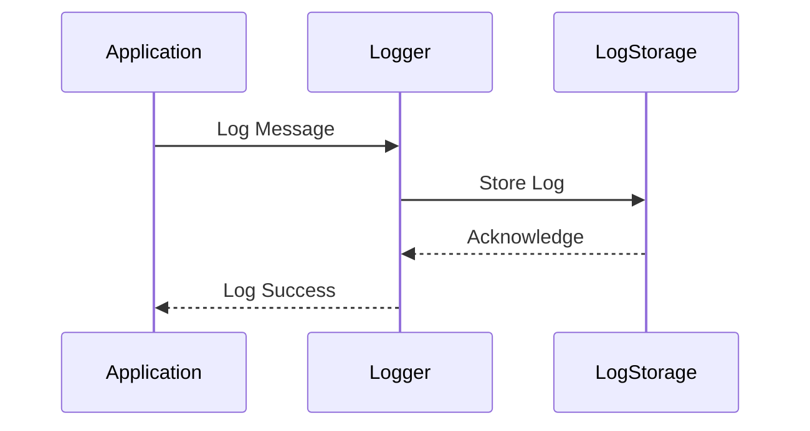

## 16.1 Logging Best Practices in Haskell

In the realm of software development, logging is an indispensable tool that aids in diagnosing issues, auditing, and tracking application behavior. As expert software engineers and architects, understanding and implementing effective logging practices in Haskell can significantly enhance the maintainability and reliability of your applications.

### Importance of Logging

Logging serves multiple purposes in software systems:

- **Diagnostics**: Logs provide insights into the application's behavior, helping developers identify and troubleshoot issues.
- **Auditing**: Logs can serve as a record of events, useful for compliance and security audits.
- **Monitoring**: Logs enable real-time monitoring of applications, allowing for proactive issue detection and resolution.

### Best Practices for Logging in Haskell

To leverage logging effectively in Haskell, consider the following best practices:

#### Consistent Log Format

Ensure that logs are structured and standardized. A consistent log format facilitates easier parsing and analysis, especially when using log aggregation tools. Consider using JSON or other structured formats for logs.

```haskell
{-# LANGUAGE OverloadedStrings #-}

import Data.Aeson (encode, object, (.=))
import qualified Data.ByteString.Lazy.Char8 as BL

logMessage :: String -> String -> IO ()
logMessage level message = BL.putStrLn $ encode $ object
    [ "level" .= level
    , "message" .= message
    , "timestamp" .= "2024-11-23T10:00:00Z"
    ]

main :: IO ()
main = logMessage "INFO" "Application started"
```

#### Log Levels

Use appropriate log levels to categorize log messages. Common log levels include:

- **Debug**: Detailed information, typically of interest only when diagnosing problems.
- **Info**: Confirmation that things are working as expected.
- **Warning**: An indication that something unexpected happened, or indicative of some problem in the near future.
- **Error**: Due to a more serious problem, the software has not been able to perform some function.

```haskell
data LogLevel = Debug | Info | Warning | Error deriving (Show)

logWithLevel :: LogLevel -> String -> IO ()
logWithLevel level message = putStrLn $ "[" ++ show level ++ "] " ++ message

main :: IO ()
main = do
    logWithLevel Info "Application started"
    logWithLevel Warning "Low disk space"
    logWithLevel Error "Failed to connect to database"
```

#### Avoiding Sensitive Data

Ensure that no sensitive information, such as passwords or personal data, is logged. This is crucial for maintaining user privacy and complying with data protection regulations.

### Implementation with Haskell Libraries

Haskell offers several libraries that facilitate efficient logging. Two popular choices are `fast-logger` and `monad-logger`.

#### Using `fast-logger`

`fast-logger` is a high-performance logging library that provides a simple API for logging messages.

```haskell
import System.Log.FastLogger

main :: IO ()
main = do
    loggerSet <- newStdoutLoggerSet defaultBufSize
    let logStr = toLogStr "INFO: Application started\n"
    pushLogStrLn loggerSet logStr
    rmLoggerSet loggerSet
```

#### Using `monad-logger`

`monad-logger` integrates logging with monadic computations, allowing for more flexible and context-aware logging.

```haskell
{-# LANGUAGE OverloadedStrings #-}

import Control.Monad.Logger

main :: IO ()
main = runStdoutLoggingT $ do
    logInfoN "Application started"
    logWarnN "Low disk space"
    logErrorN "Failed to connect to database"
```

### Visualizing Logging Workflow

To better understand the logging process, let's visualize the workflow of a logging system using a sequence diagram.



**Diagram Description**: This sequence diagram illustrates the flow of a log message from the application to the logger and finally to the log storage. The logger acknowledges the successful storage of the log back to the application.

### References and Further Reading

- [fast-logger](https://hackage.haskell.org/package/fast-logger)
- [monad-logger](https://hackage.haskell.org/package/monad-logger)

### Knowledge Check

- Why is it important to use structured log formats?
- How can log levels help in managing log verbosity?
- What precautions should be taken to avoid logging sensitive data?

### Try It Yourself

Experiment with the provided code examples by modifying log levels or adding additional fields to the structured log format. Consider integrating these logging practices into your existing Haskell projects.

### Embrace the Journey

Remember, effective logging is just the beginning. As you progress, you'll build more robust and maintainable applications. Keep experimenting, stay curious, and enjoy the journey!

## Quiz: Logging Best Practices in Haskell



### What is the primary purpose of logging in software systems?

- [x] Diagnostics, auditing, and monitoring
- [ ] Data storage
- [ ] User authentication
- [ ] Network communication

> **Explanation:** Logging is primarily used for diagnostics, auditing, and monitoring, helping developers understand application behavior and troubleshoot issues.

### Which log format is recommended for easier parsing and analysis?

- [x] Structured formats like JSON
- [ ] Plain text
- [ ] XML
- [ ] Binary

> **Explanation:** Structured formats like JSON are recommended as they facilitate easier parsing and analysis, especially when using log aggregation tools.

### What is the role of log levels in logging?

- [x] Categorizing log messages by severity
- [ ] Encrypting log data
- [ ] Compressing log files
- [ ] Archiving old logs

> **Explanation:** Log levels categorize log messages by severity, helping developers filter and prioritize logs based on their importance.

### Why should sensitive data be avoided in logs?

- [x] To maintain user privacy and comply with data protection regulations
- [ ] To reduce log file size
- [ ] To improve log readability
- [ ] To enhance log performance

> **Explanation:** Avoiding sensitive data in logs is crucial for maintaining user privacy and complying with data protection regulations.

### Which library is known for high-performance logging in Haskell?

- [x] fast-logger
- [ ] monad-logger
- [ ] warp
- [ ] aeson

> **Explanation:** `fast-logger` is known for high-performance logging in Haskell, providing a simple API for logging messages efficiently.

### How does `monad-logger` enhance logging in Haskell?

- [x] By integrating logging with monadic computations
- [ ] By providing a graphical user interface
- [ ] By compressing log files
- [ ] By encrypting log data

> **Explanation:** `monad-logger` integrates logging with monadic computations, allowing for more flexible and context-aware logging.

### What is a key benefit of using structured log formats?

- [x] Easier parsing and analysis
- [ ] Reduced log file size
- [ ] Faster log writing
- [ ] Enhanced security

> **Explanation:** Structured log formats, such as JSON, make it easier to parse and analyze logs, especially when using log aggregation tools.

### What should be included in a log message to provide context?

- [x] Timestamp, log level, and message
- [ ] User password
- [ ] Network IP address
- [ ] Database schema

> **Explanation:** Including a timestamp, log level, and message in a log entry provides essential context for understanding the log's significance.

### Which of the following is a common log level?

- [x] Debug
- [ ] Encrypt
- [ ] Compress
- [ ] Archive

> **Explanation:** "Debug" is a common log level used to provide detailed information for diagnosing problems.

### True or False: Logging can be used for real-time monitoring of applications.

- [x] True
- [ ] False

> **Explanation:** Logging can indeed be used for real-time monitoring, allowing developers to detect and resolve issues proactively.


