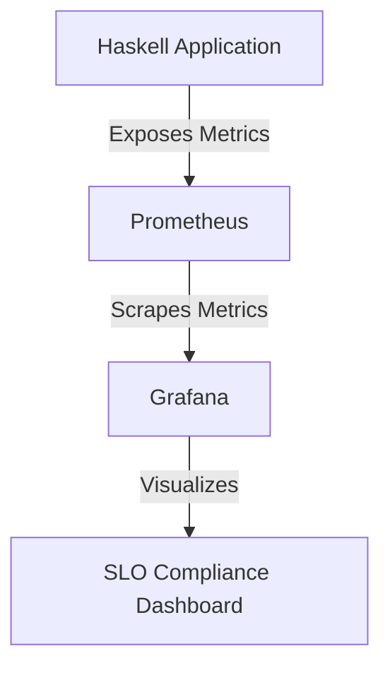

## 16.10 Health Checks and Service Level Objectives (SLOs)

In the realm of software engineering, ensuring that systems are both reliable and performant is paramount. Health Checks and Service Level Objectives (SLOs) are two critical components that help achieve these goals. In this section, we'll delve into how these concepts can be effectively implemented in Haskell, leveraging its unique features to build robust systems.

### Understanding Health Checks

**Health Checks** are automated tests that verify whether a service is running correctly. They are essential for maintaining the availability and reliability of applications. Health checks can be categorized into two main types:

1. **Liveness Checks**: These determine if the application is running. A failed liveness check indicates that the application needs to be restarted.
2. **Readiness Checks**: These determine if the application is ready to handle requests. A failed readiness check means the application should not receive traffic.

#### Implementing Health Checks in Haskell

To implement health checks in Haskell, we can expose HTTP endpoints that return the status of the application. Let's explore a basic example using the `warp` web server library.

```haskell
{-# LANGUAGE OverloadedStrings #-}

import Network.Wai
import Network.Wai.Handler.Warp (run)
import Network.HTTP.Types (status200, status503)
import Data.IORef

-- A simple health check application
main :: IO ()
main = do
    healthStatus <- newIORef True -- Initial health status
    let app = healthCheckApp healthStatus
    run 8080 app

-- Define the health check application
healthCheckApp :: IORef Bool -> Application
healthCheckApp healthStatus req respond = do
    isHealthy <- readIORef healthStatus
    let status = if isHealthy then status200 else status503
    respond $ responseLBS status [("Content-Type", "text/plain")] "Health Check"
```

In this example, we create a simple web server that exposes a health check endpoint. The health status is stored in an `IORef`, which can be updated based on the application's state.

#### Try It Yourself

Experiment with the code by modifying the health status dynamically. For instance, you can simulate a failure by setting the `IORef` to `False` after a certain condition is met.

### Service Level Objectives (SLOs)

**Service Level Objectives (SLOs)** are defined performance and availability targets that a service aims to meet. They are part of a broader Service Level Agreement (SLA) and are crucial for setting expectations with users and stakeholders.

#### Defining SLOs

When defining SLOs, consider the following metrics:

- **Availability**: The percentage of time the service is operational.
- **Latency**: The time it takes to process a request.
- **Error Rate**: The percentage of failed requests.

#### Monitoring SLOs in Haskell

To monitor compliance with SLOs, we can use a combination of logging, metrics collection, and alerting. Haskell's strong typing and functional nature make it well-suited for building reliable monitoring solutions.

##### Example: Monitoring with Prometheus

Prometheus is a popular monitoring tool that can be integrated with Haskell applications to track SLOs. Here's a basic example of how to expose metrics using the `prometheus` library.

```haskell
{-# LANGUAGE OverloadedStrings #-}

import Network.Wai
import Network.Wai.Handler.Warp (run)
import Network.HTTP.Types (status200)
import Prometheus

-- Define a counter for request metrics
requestCounter :: IO Counter
requestCounter = register $ counter (Info "http_requests_total" "Total HTTP requests")

-- A simple application with Prometheus metrics
main :: IO ()
main = do
    counter <- requestCounter
    let app = metricsApp counter
    run 8080 app

-- Define the application with metrics
metricsApp :: Counter -> Application
metricsApp counter req respond = do
    incCounter counter
    respond $ responseLBS status200 [("Content-Type", "text/plain")] "Hello, World!"
```

In this example, we define a counter metric to track the total number of HTTP requests. This metric can be scraped by Prometheus and used to monitor SLOs.

#### Visualizing SLO Compliance

To visualize SLO compliance, you can use tools like Grafana to create dashboards that display metrics collected by Prometheus. This allows you to track performance and availability over time.



### Kubernetes Liveness and Readiness Probes

Kubernetes provides built-in support for health checks through liveness and readiness probes. These probes can be configured to call the health check endpoints of your Haskell application.

#### Configuring Probes

Here's an example of how to configure liveness and readiness probes in a Kubernetes deployment:

```yaml
apiVersion: apps/v1
kind: Deployment
metadata:
  name: haskell-app
spec:
  replicas: 1
  selector:
    matchLabels:
      app: haskell-app
  template:
    metadata:
      labels:
        app: haskell-app
    spec:
      containers:
      - name: haskell-app
        image: haskell-app-image
        ports:
        - containerPort: 8080
        livenessProbe:
          httpGet:
            path: /health
            port: 8080
          initialDelaySeconds: 5
          periodSeconds: 10
        readinessProbe:
          httpGet:
            path: /health
            port: 8080
          initialDelaySeconds: 5
          periodSeconds: 10
```

In this configuration, Kubernetes will periodically call the `/health` endpoint to check the application's liveness and readiness.

### Design Considerations

When implementing health checks and SLOs, consider the following:

- **Granularity**: Determine the appropriate level of granularity for health checks. Too coarse, and you might miss issues; too fine, and you might overwhelm the system.
- **Alerting**: Set up alerts for when SLOs are breached. This allows for proactive issue resolution.
- **Scalability**: Ensure that your health check and monitoring solutions scale with your application.

### Haskell Unique Features

Haskell's strong type system and functional nature provide unique advantages for implementing health checks and SLOs:

- **Immutability**: Reduces the risk of state-related bugs in monitoring logic.
- **Concurrency**: Haskell's concurrency primitives can be leveraged to efficiently handle health check requests.
- **Type Safety**: Ensures that monitoring code is robust and less prone to runtime errors.

### Differences and Similarities

Health checks and SLOs are often confused with each other, but they serve different purposes:

- **Health Checks**: Focus on the current state of the application.
- **SLOs**: Focus on long-term performance and availability targets.

Both are essential for maintaining reliable systems, but they operate on different timescales and levels of abstraction.

### Knowledge Check

- **Question**: What is the difference between liveness and readiness checks?
- **Question**: How can Prometheus be used to monitor SLOs in a Haskell application?
- **Question**: Why is immutability advantageous for implementing health checks in Haskell?

### Embrace the Journey

Implementing health checks and SLOs is a journey towards building more reliable and performant systems. As you continue to refine your approach, remember that these tools are just the beginning. Keep exploring, stay curious, and enjoy the process of creating robust applications.

## Quiz: Health Checks and Service Level Objectives (SLOs)



### What is the primary purpose of a liveness check?

- [x] To determine if the application is running
- [ ] To determine if the application is ready to handle requests
- [ ] To monitor long-term performance
- [ ] To track error rates

> **Explanation:** A liveness check determines if the application is running and needs to be restarted if it fails.


### What does an SLO define?

- [ ] The current state of the application
- [x] Performance and availability targets
- [ ] The number of HTTP requests
- [ ] The application's memory usage

> **Explanation:** An SLO defines performance and availability targets that a service aims to meet.


### How can Prometheus be integrated with a Haskell application?

- [x] By exposing metrics using the `prometheus` library
- [ ] By using the `warp` library
- [ ] By implementing liveness checks
- [ ] By configuring Kubernetes probes

> **Explanation:** Prometheus can be integrated with a Haskell application by exposing metrics using the `prometheus` library.


### What is the advantage of using Haskell's strong type system for monitoring?

- [x] It ensures monitoring code is robust and less prone to runtime errors
- [ ] It allows for dynamic typing
- [ ] It simplifies string manipulation
- [ ] It increases memory usage

> **Explanation:** Haskell's strong type system ensures that monitoring code is robust and less prone to runtime errors.


### What is the role of Kubernetes readiness probes?

- [ ] To restart the application if it fails
- [x] To determine if the application is ready to handle requests
- [ ] To monitor long-term performance
- [ ] To track error rates

> **Explanation:** Readiness probes determine if the application is ready to handle requests.


### Why is immutability beneficial for health checks?

- [x] It reduces the risk of state-related bugs
- [ ] It increases the complexity of the code
- [ ] It allows for mutable state
- [ ] It simplifies string manipulation

> **Explanation:** Immutability reduces the risk of state-related bugs in monitoring logic.


### What is the difference between health checks and SLOs?

- [x] Health checks focus on the current state, while SLOs focus on long-term targets
- [ ] Health checks focus on long-term targets, while SLOs focus on the current state
- [ ] Both focus on the current state
- [ ] Both focus on long-term targets

> **Explanation:** Health checks focus on the current state of the application, while SLOs focus on long-term performance and availability targets.


### How can you visualize SLO compliance?

- [x] By using tools like Grafana to create dashboards
- [ ] By implementing liveness checks
- [ ] By using the `warp` library
- [ ] By configuring Kubernetes probes

> **Explanation:** SLO compliance can be visualized by using tools like Grafana to create dashboards that display metrics.


### What is a key consideration when implementing health checks?

- [x] Determining the appropriate level of granularity
- [ ] Using mutable state
- [ ] Simplifying string manipulation
- [ ] Increasing memory usage

> **Explanation:** Determining the appropriate level of granularity is a key consideration when implementing health checks.


### True or False: Health checks and SLOs operate on the same timescale.

- [ ] True
- [x] False

> **Explanation:** Health checks and SLOs operate on different timescales; health checks focus on the current state, while SLOs focus on long-term targets.


