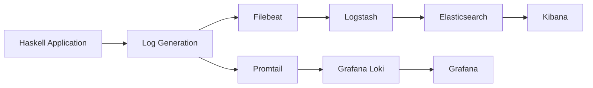

## 16.11 Logging Infrastructure: ELK Stack and Grafana for Haskell Applications

In today's complex software ecosystems, effective logging and monitoring are crucial for maintaining system health, diagnosing issues, and ensuring optimal performance. This section delves into the integration of the ELK Stack and Grafana with Haskell applications, providing a robust logging infrastructure.

### Introduction to ELK Stack

The **ELK Stack** is a powerful suite of tools designed for centralized logging and analytics. It comprises three main components:

- **Elasticsearch**: A distributed, RESTful search and analytics engine capable of storing and searching large volumes of data quickly.
- **Logstash**: A server-side data processing pipeline that ingests data from multiple sources, transforms it, and sends it to a "stash" like Elasticsearch.
- **Kibana**: A data visualization dashboard that works on top of Elasticsearch, allowing users to create visualizations and dashboards.

#### Why Use ELK Stack?

The ELK Stack provides several benefits:

- **Centralized Logging**: Aggregate logs from various sources into a single location for easier management and analysis.
- **Scalability**: Handle large volumes of log data efficiently.
- **Real-Time Analysis**: Perform real-time search and analytics on log data.
- **Visualization**: Create interactive dashboards to visualize log data and gain insights.

### Introduction to Grafana Loki

**Grafana Loki** is a horizontally scalable, highly available log aggregation system inspired by Prometheus. It is designed to be cost-effective and easy to operate, focusing on storing and querying logs from applications.

#### Key Features of Grafana Loki

- **Scalability**: Easily scale to handle large volumes of log data.
- **Integration with Grafana**: Seamlessly integrates with Grafana for visualization.
- **Multi-Tenancy**: Supports multi-tenancy, allowing multiple users to access and manage their logs.
- **Query Language**: Uses a Prometheus-inspired query language for log queries.

### Integrating ELK Stack with Haskell Applications

Integrating the ELK Stack with Haskell applications involves several steps, including log generation, collection, and visualization.

#### Step 1: Log Generation in Haskell

To generate logs in Haskell, you can use libraries such as `fast-logger` or `katip`. These libraries provide efficient logging capabilities and can be configured to output logs in various formats.

```haskell
import System.Log.FastLogger

main :: IO ()
main = do
    logger <- newStdoutLoggerSet defaultBufSize
    let logStr = toLogStr "This is a log message\n"
    pushLogStr logger logStr
    flushLogStr logger
```

#### Step 2: Sending Logs to ELK Stack

Logs generated by Haskell applications can be sent to the ELK Stack using **Filebeat** or directly from the application.

- **Filebeat**: A lightweight shipper for forwarding and centralizing log data. It can be configured to monitor log files and send data to Logstash or Elasticsearch.

- **Direct Integration**: Use libraries or custom code to send logs directly to Logstash or Elasticsearch.

#### Step 3: Configuring Logstash

Logstash acts as a data pipeline, processing logs before sending them to Elasticsearch. A typical Logstash configuration file might look like this:

```plaintext
input {
  beats {
    port => 5044
  }
}

filter {
  # Add filters here
}

output {
  elasticsearch {
    hosts => ["http://localhost:9200"]
    index => "haskell-logs-%{+YYYY.MM.dd}"
  }
}
```

#### Step 4: Visualizing Logs with Kibana

Once logs are stored in Elasticsearch, you can use Kibana to create visualizations and dashboards. Kibana provides a user-friendly interface for exploring and analyzing log data.

### Integrating Grafana Loki with Haskell Applications

Grafana Loki can be integrated with Haskell applications to provide a scalable logging solution.

#### Step 1: Setting Up Grafana Loki

Install and configure Grafana Loki to collect and store logs. Loki can be configured to receive logs via various methods, including Promtail, Fluentd, and directly from applications.

#### Step 2: Sending Logs to Grafana Loki

Use a log shipper like **Promtail** to send logs from Haskell applications to Grafana Loki. Promtail can be configured to monitor log files and send data to Loki.

#### Step 3: Visualizing Logs with Grafana

Grafana provides a powerful interface for visualizing logs stored in Loki. You can create dashboards and alerts based on log data, providing insights into application performance and issues.

### Code Example: Sending Logs to ELK Stack

Here's a complete example of a Haskell application sending logs to the ELK Stack using `fast-logger` and Filebeat.

```haskell
import System.Log.FastLogger
import System.IO

main :: IO ()
main = do
    logger <- newFileLoggerSet defaultBufSize "application.log"
    let logStr = toLogStr "This is a log message\n"
    pushLogStr logger logStr
    flushLogStr logger
    hClose (loggerSetHandle logger)
```

### Code Example: Sending Logs to Grafana Loki

To send logs to Grafana Loki, you can use a similar approach, configuring Promtail to monitor the log file generated by the Haskell application.

```haskell
import System.Log.FastLogger
import System.IO

main :: IO ()
main = do
    logger <- newFileLoggerSet defaultBufSize "loki-application.log"
    let logStr = toLogStr "This is a log message for Loki\n"
    pushLogStr logger logStr
    flushLogStr logger
    hClose (loggerSetHandle logger)
```

### Visualizing the Logging Infrastructure

Below is a diagram illustrating the flow of log data from a Haskell application to the ELK Stack and Grafana Loki.



### References and Further Reading

- [ELK Stack](https://www.elastic.co/what-is/elk-stack)
- [Grafana Loki](https://grafana.com/oss/loki/)
- [FastLogger Documentation](https://hackage.haskell.org/package/fast-logger)
- [Katip Documentation](https://hackage.haskell.org/package/katip)

### Knowledge Check

- Explain the role of each component in the ELK Stack.
- Demonstrate how to configure Filebeat to send logs to Logstash.
- Provide an example of a Kibana dashboard for visualizing log data.

### Summary

In this section, we've explored how to integrate the ELK Stack and Grafana Loki with Haskell applications for centralized logging and monitoring. By implementing these tools, you can gain valuable insights into your application's performance and behavior, enabling you to diagnose issues and optimize performance effectively.

Remember, this is just the beginning. As you progress, you'll build more complex and interactive logging solutions. Keep experimenting, stay curious, and enjoy the journey!

## Quiz: Logging Infrastructure (ELK Stack, Grafana)



### What are the main components of the ELK Stack?

- [x] Elasticsearch, Logstash, Kibana
- [ ] Elasticsearch, Logstash, Kafka
- [ ] Elasticsearch, Kafka, Kibana
- [ ] Logstash, Kafka, Grafana

> **Explanation:** The ELK Stack consists of Elasticsearch, Logstash, and Kibana.

### What is the primary function of Grafana Loki?

- [x] Log aggregation and querying
- [ ] Data visualization
- [ ] Real-time analytics
- [ ] Data storage

> **Explanation:** Grafana Loki is designed for log aggregation and querying.

### How can logs be sent from a Haskell application to the ELK Stack?

- [x] Using Filebeat
- [ ] Using Kafka
- [ ] Using Prometheus
- [ ] Using Grafana

> **Explanation:** Filebeat is a lightweight shipper for forwarding logs to the ELK Stack.

### What is the role of Logstash in the ELK Stack?

- [x] Data processing and transformation
- [ ] Data storage
- [ ] Data visualization
- [ ] Data querying

> **Explanation:** Logstash processes and transforms data before sending it to Elasticsearch.

### Which tool is used to visualize logs in the ELK Stack?

- [x] Kibana
- [ ] Grafana
- [ ] Prometheus
- [ ] Loki

> **Explanation:** Kibana is used for visualizing logs in the ELK Stack.

### What is Promtail used for in the context of Grafana Loki?

- [x] Sending logs to Loki
- [ ] Visualizing logs
- [ ] Storing logs
- [ ] Analyzing logs

> **Explanation:** Promtail is a log shipper that sends logs to Grafana Loki.

### Which language is used for querying logs in Grafana Loki?

- [x] PromQL-inspired query language
- [ ] SQL
- [ ] Elasticsearch Query DSL
- [ ] JSONPath

> **Explanation:** Grafana Loki uses a PromQL-inspired query language for querying logs.

### What is the main advantage of using Grafana with Loki?

- [x] Seamless integration for visualization
- [ ] Data storage
- [ ] Real-time analytics
- [ ] Data transformation

> **Explanation:** Grafana provides seamless integration with Loki for log visualization.

### How does Filebeat send logs to Logstash?

- [x] By monitoring log files and forwarding data
- [ ] By querying databases
- [ ] By visualizing data
- [ ] By storing data

> **Explanation:** Filebeat monitors log files and forwards data to Logstash.

### True or False: Grafana Loki is designed to replace Elasticsearch in the ELK Stack.

- [ ] True
- [x] False

> **Explanation:** Grafana Loki is not designed to replace Elasticsearch; it is a separate log aggregation system.


