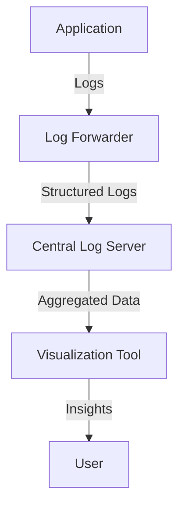

## 16.2 Structured Logging and Data Aggregation

In the realm of software development, logging is an indispensable tool for monitoring, debugging, and understanding the behavior of applications. As systems grow in complexity, traditional logging methods often fall short in providing the necessary insights. This is where **structured logging** and **data aggregation** come into play, offering a more robust and scalable approach to log management.

### Understanding Structured Logging

**Structured logging** involves recording log data in a structured format, such as JSON or XML, rather than plain text. This approach allows logs to be easily parsed, queried, and analyzed by log management systems. Structured logs can include additional metadata, such as timestamps, log levels, and contextual information, making them more informative and actionable.

#### Benefits of Structured Logging

1. **Enhanced Queryability**: Structured logs can be easily queried and filtered based on specific fields, enabling more precise and efficient log analysis.
2. **Improved Integration**: Many modern log management systems, such as ELK Stack and Splunk, are designed to work seamlessly with structured logs, providing powerful visualization and analysis tools.
3. **Contextual Information**: By including additional context in logs, developers can gain deeper insights into application behavior and quickly identify issues.
4. **Consistency**: Structured logging enforces a consistent format across logs, reducing ambiguity and improving readability.

### Implementing Structured Logging in Haskell with Katip

Haskell, with its strong emphasis on type safety and functional programming paradigms, offers several libraries for structured logging. One of the most popular and powerful libraries is **`katip`**. Katip provides a flexible and extensible framework for structured logging in Haskell applications.

#### Getting Started with Katip

To begin using Katip, you need to add it to your project's dependencies. You can do this by adding the following line to your `cabal` file:

```haskell
build-depends: base >=4.7 && <5, katip >=0.8
```

Once Katip is included in your project, you can start setting up structured logging.

#### Basic Setup

Here's a simple example to demonstrate how to set up and use Katip for structured logging:

```haskell
{-# LANGUAGE OverloadedStrings #-}

import Control.Monad (void)
import Katip

main :: IO ()
main = do
    -- Initialize a Katip environment
    handleScribe <- mkHandleScribe ColorIfTerminal stdout (permitItem InfoS) V2
    let mkLogEnv = registerScribe "stdout" handleScribe defaultScribeSettings =<< initLogEnv "MyApp" "production"

    -- Run a Katip context
    void $ runKatipContext mkLogEnv () "main" $ do
        logMsg "myNamespace" InfoS "This is an info message"
        logMsg "myNamespace" ErrorS "This is an error message"
```

**Explanation**:
- **`mkHandleScribe`**: Creates a scribe that outputs logs to the console. The `ColorIfTerminal` option adds color to the logs if the output is a terminal.
- **`initLogEnv`**: Initializes the logging environment with the application name and environment.
- **`runKatipContext`**: Runs a block of code within a Katip context, allowing you to log messages with additional context.
- **`logMsg`**: Logs a message with a specified namespace and severity level.

#### Adding Contextual Information

One of the key advantages of structured logging is the ability to include contextual information in logs. Katip makes this easy with the `KatipContext` typeclass.

```haskell
{-# LANGUAGE OverloadedStrings #-}
{-# LANGUAGE DeriveGeneric #-}

import Control.Monad (void)
import Data.Aeson (ToJSON, toJSON, object, (.=))
import GHC.Generics (Generic)
import Katip

data UserContext = UserContext
    { userId :: Int
    , userName :: String
    } deriving (Show, Generic)

instance ToJSON UserContext where
    toJSON (UserContext uid uname) =
        object ["userId" .= uid, "userName" .= uname]

main :: IO ()
main = do
    handleScribe <- mkHandleScribe ColorIfTerminal stdout (permitItem InfoS) V2
    let mkLogEnv = registerScribe "stdout" handleScribe defaultScribeSettings =<< initLogEnv "MyApp" "production"

    let userCtx = UserContext 42 "Alice"
    void $ runKatipContext mkLogEnv () "main" $ do
        katipAddContext (sl "user" userCtx) $
            logMsg "myNamespace" InfoS "User action logged"
```

**Explanation**:
- **`UserContext`**: A custom data type representing user-related information.
- **`ToJSON` Instance**: Defines how to convert `UserContext` to JSON for inclusion in logs.
- **`katipAddContext`**: Adds additional context to log messages within a block of code.

### Data Aggregation

While structured logging provides a powerful way to capture detailed log information, data aggregation is essential for analyzing logs from multiple sources. Aggregating logs allows you to centralize log data, making it easier to monitor and analyze system-wide behavior.

#### Centralized Log Management

Centralized log management involves collecting logs from various sources, such as application servers, databases, and network devices, into a single location. This can be achieved using log management systems like the ELK Stack (Elasticsearch, Logstash, Kibana) or Splunk.

#### Setting Up Log Aggregation

To set up log aggregation, you need to:

1. **Configure Log Forwarders**: Use tools like Filebeat or Fluentd to forward logs from your applications to a central log server.
2. **Centralize Logs**: Store logs in a centralized location, such as Elasticsearch, for easy querying and analysis.
3. **Visualize and Analyze**: Use tools like Kibana or Grafana to visualize log data and gain insights into system behavior.

### Visualizing Structured Logging and Data Aggregation

To better understand the flow of structured logging and data aggregation, let's visualize the process using a Mermaid.js diagram.



**Diagram Explanation**:
- **Application**: Generates structured logs.
- **Log Forwarder**: Collects and forwards logs to a central server.
- **Central Log Server**: Aggregates logs from multiple sources.
- **Visualization Tool**: Provides insights through dashboards and reports.
- **User**: Analyzes the visualized data to make informed decisions.

### References and Further Reading

- [Katip Library Documentation](https://hackage.haskell.org/package/katip)
- [ELK Stack Overview](https://www.elastic.co/what-is/elk-stack)
- [Splunk Log Management](https://www.splunk.com/en_us/products/splunk-enterprise.html)

### Knowledge Check

Before we wrap up, let's reinforce what we've learned with a few questions:

1. What are the key benefits of structured logging?
2. How does Katip facilitate structured logging in Haskell?
3. Why is data aggregation important in log management?
4. What tools can be used for centralized log management?

### Try It Yourself

Now that you have a solid understanding of structured logging and data aggregation, try implementing these concepts in your own Haskell projects. Experiment with different log formats, add contextual information, and set up a simple log aggregation system using tools like ELK Stack or Splunk. Remember, the key to mastering these techniques is practice and experimentation.

## Quiz: Structured Logging and Data Aggregation



### What is a primary benefit of structured logging?

- [x] Enhanced queryability and integration with log management systems.
- [ ] Reduced log file size.
- [ ] Increased log generation speed.
- [ ] Simplified log file storage.

> **Explanation:** Structured logging allows logs to be easily queried and integrated with log management systems, providing enhanced insights.

### Which Haskell library is commonly used for structured logging?

- [x] Katip
- [ ] Aeson
- [ ] Conduit
- [ ] Warp

> **Explanation:** Katip is a popular library in Haskell for structured logging, providing a flexible framework for log management.

### What format is typically used for structured logs?

- [x] JSON
- [ ] Plain text
- [ ] CSV
- [ ] XML

> **Explanation:** JSON is a common format for structured logs due to its ease of parsing and readability.

### What is the role of a log forwarder in data aggregation?

- [x] Collects and forwards logs to a central server.
- [ ] Visualizes log data.
- [ ] Stores logs locally.
- [ ] Analyzes log data.

> **Explanation:** A log forwarder collects logs from various sources and forwards them to a central server for aggregation.

### Which tool is part of the ELK Stack for log visualization?

- [x] Kibana
- [ ] Logstash
- [ ] Filebeat
- [ ] Fluentd

> **Explanation:** Kibana is the visualization tool in the ELK Stack, used for creating dashboards and analyzing log data.

### What is the purpose of adding contextual information to logs?

- [x] To provide additional insights and make logs more informative.
- [ ] To reduce log file size.
- [ ] To increase log generation speed.
- [ ] To simplify log file storage.

> **Explanation:** Adding contextual information to logs provides additional insights, making them more informative and actionable.

### Which of the following is a benefit of centralized log management?

- [x] Easier monitoring and analysis of system-wide behavior.
- [ ] Reduced log file size.
- [ ] Increased log generation speed.
- [ ] Simplified log file storage.

> **Explanation:** Centralized log management allows for easier monitoring and analysis of system-wide behavior by aggregating logs in one location.

### What is the function of the `katipAddContext` function in Katip?

- [x] Adds additional context to log messages within a block of code.
- [ ] Initializes the logging environment.
- [ ] Creates a scribe for log output.
- [ ] Runs a block of code within a Katip context.

> **Explanation:** `katipAddContext` is used to add additional context to log messages within a block of code, enhancing the information provided in logs.

### True or False: Structured logging enforces a consistent format across logs.

- [x] True
- [ ] False

> **Explanation:** Structured logging enforces a consistent format across logs, improving readability and reducing ambiguity.

### Which of the following is NOT a component of the ELK Stack?

- [x] Splunk
- [ ] Elasticsearch
- [ ] Logstash
- [ ] Kibana

> **Explanation:** Splunk is not a component of the ELK Stack; it is a separate log management system.



Remember, structured logging and data aggregation are powerful tools in your software development arsenal. As you continue to explore these concepts, you'll find new ways to enhance your applications' observability and maintainability. Keep experimenting, stay curious, and enjoy the journey!
