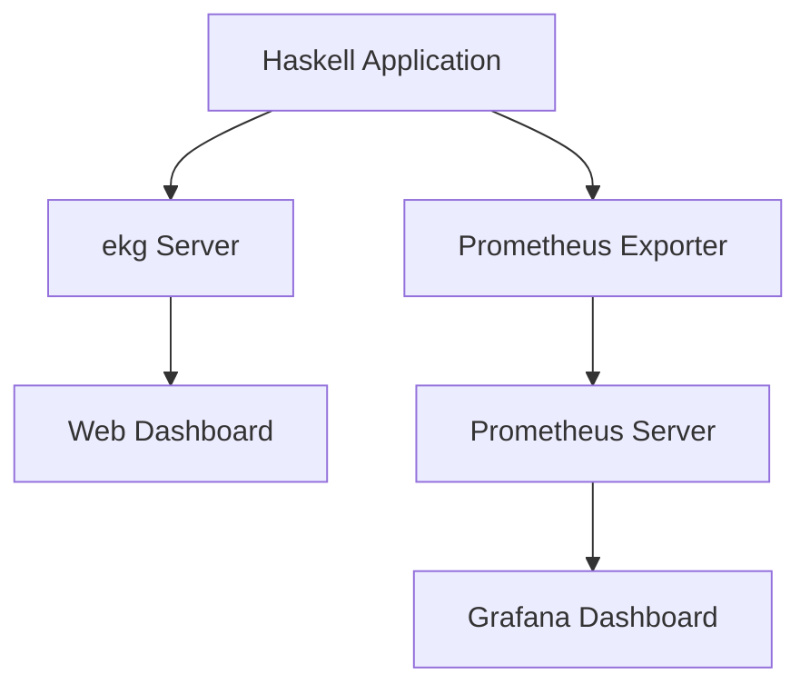

## 16.3 Monitoring Functional Applications

Monitoring functional applications is a critical aspect of maintaining system health and ensuring optimal performance. In this section, we will delve into the concepts, key metrics, and implementation strategies for monitoring applications built using Haskell. We will explore the use of tools like `ekg` and `Prometheus` to effectively track and analyze performance metrics.

### Monitoring Concepts

Monitoring is the process of continuously observing a system's behavior to ensure it operates as expected. It involves collecting data on various aspects of the system, such as resource usage, response times, and error rates, to identify potential issues before they impact users. In functional programming, monitoring takes on additional significance due to the unique characteristics of functional languages like Haskell, such as immutability and lazy evaluation.

#### Importance of Monitoring

- **Proactive Issue Detection**: By monitoring key metrics, you can detect anomalies and potential issues before they escalate into critical problems.
- **Performance Optimization**: Monitoring helps identify bottlenecks and areas for improvement, enabling you to optimize performance.
- **Resource Management**: Understanding resource usage patterns allows for better capacity planning and resource allocation.
- **User Experience**: Ensuring system reliability and responsiveness directly impacts user satisfaction.

### Key Metrics

When monitoring functional applications, several key metrics should be tracked to gain insights into system performance and health:

- **CPU Usage**: Measures the percentage of CPU resources utilized by the application. High CPU usage may indicate inefficient code or resource-intensive operations.
- **Memory Consumption**: Tracks the amount of memory used by the application. Monitoring memory usage helps identify memory leaks and optimize memory allocation.
- **Request Rates**: Monitors the number of requests processed by the application over time. This metric helps assess the application's ability to handle load.
- **Error Rates**: Measures the frequency of errors encountered by the application. High error rates may indicate bugs or issues with external dependencies.

### Implementation

Implementing monitoring in Haskell applications involves integrating monitoring tools and libraries that can collect and report metrics. Two popular tools for monitoring Haskell applications are `ekg` and `Prometheus`.

#### Using `ekg`

`ekg` is a Haskell library that provides a simple way to monitor and visualize application metrics. It offers a web-based dashboard to view real-time metrics, making it easy to track system performance.

**Installation and Setup**

To use `ekg`, add it to your project's dependencies:

```haskell
-- Add to your .cabal file
build-depends: base >=4.7 && <5, ekg >=0.4
```

**Basic Usage**

Here's a simple example of how to set up `ekg` in a Haskell application:

```haskell
import System.Remote.Monitoring (forkServer, serverMetricStore)
import System.Metrics (newStore, registerGcMetrics)

main :: IO ()
main = do
    -- Start the ekg server on port 8000
    server <- forkServer "localhost" 8000

    -- Register GC metrics
    let store = serverMetricStore server
    registerGcMetrics store

    putStrLn "ekg server running on http://localhost:8000"
    -- Your application logic here
```

**Key Features**

- **Real-Time Monitoring**: View metrics in real-time through a web interface.
- **GC Metrics**: Automatically collects garbage collection metrics.
- **Custom Metrics**: Define and track custom metrics specific to your application.

#### Using `Prometheus`

`Prometheus` is a powerful monitoring and alerting toolkit that can be used to monitor Haskell applications. It provides a flexible query language and integrates with various visualization tools.

**Installation and Setup**

To integrate `Prometheus` with a Haskell application, use the `prometheus-haskell` library:

```haskell
-- Add to your .cabal file
build-depends: base >=4.7 && <5, prometheus-haskell >=2.0
```

**Basic Usage**

Here's an example of setting up `Prometheus` in a Haskell application:

```haskell
import Prometheus (register, Counter, counter, incCounter, defaultRegistry)
import Prometheus.Metric.GHC (ghcMetrics)

main :: IO ()
main = do
    -- Register GHC metrics
    register ghcMetrics

    -- Create a counter metric
    requestCounter <- register $ counter (Info "http_requests_total" "Total number of HTTP requests")

    -- Increment the counter
    incCounter requestCounter

    putStrLn "Prometheus metrics registered"
    -- Your application logic here
```

**Key Features**

- **Flexible Query Language**: Use PromQL to query and analyze metrics.
- **Alerting**: Set up alerts based on specific conditions.
- **Integration**: Works seamlessly with Grafana for visualization.

### Visualizing Monitoring Architecture

To better understand how monitoring tools like `ekg` and `Prometheus` fit into a Haskell application's architecture, let's visualize the monitoring setup:



**Diagram Explanation**

- The Haskell application sends metrics to both the `ekg` server and the `Prometheus` exporter.
- The `ekg` server provides a web dashboard for real-time monitoring.
- The `Prometheus` exporter sends metrics to the `Prometheus` server, which stores and processes them.
- The `Prometheus` server integrates with Grafana for advanced visualization and analysis.

### References

- [ekg](https://hackage.haskell.org/package/ekg)
- [prometheus-haskell](https://hackage.haskell.org/package/prometheus)

### Knowledge Check

- **What are the key metrics to monitor in a functional application?**
- **How does `ekg` help in monitoring Haskell applications?**
- **What advantages does `Prometheus` offer for monitoring?**

### Exercises

1. **Set up `ekg` in a sample Haskell application** and monitor CPU and memory usage. Experiment with different workloads to observe changes in metrics.
2. **Integrate `Prometheus` with a Haskell application** and create custom metrics. Use Grafana to visualize these metrics and set up alerts for specific conditions.

### Summary

Monitoring functional applications in Haskell is crucial for maintaining system health and performance. By leveraging tools like `ekg` and `Prometheus`, you can gain valuable insights into your application's behavior and make informed decisions to optimize performance. Remember, monitoring is an ongoing process that requires continuous attention and adaptation to changing system dynamics.

### Embrace the Journey

Monitoring is just one aspect of building robust and reliable applications. As you continue your journey in functional programming, keep exploring new tools and techniques to enhance your skills. Stay curious, experiment with different approaches, and enjoy the process of learning and growing as a developer.

## Quiz: Monitoring Functional Applications



### What is the primary purpose of monitoring functional applications?

- [x] To ensure system health and performance
- [ ] To increase code complexity
- [ ] To reduce application size
- [ ] To eliminate the need for testing

> **Explanation:** Monitoring functional applications helps ensure system health and performance by tracking key metrics and identifying potential issues.

### Which of the following is a key metric to monitor in Haskell applications?

- [x] CPU usage
- [x] Memory consumption
- [ ] Number of lines of code
- [ ] Developer productivity

> **Explanation:** CPU usage and memory consumption are critical metrics for assessing the performance and health of Haskell applications.

### What tool provides a web-based dashboard for real-time monitoring in Haskell?

- [x] ekg
- [ ] Prometheus
- [ ] Grafana
- [ ] Cabal

> **Explanation:** `ekg` provides a web-based dashboard for real-time monitoring of Haskell applications.

### How does `Prometheus` enhance monitoring capabilities?

- [x] By offering a flexible query language and alerting features
- [ ] By reducing application size
- [ ] By eliminating the need for testing
- [ ] By increasing code complexity

> **Explanation:** `Prometheus` enhances monitoring capabilities with its flexible query language and alerting features, allowing for advanced analysis and notifications.

### Which library is used to integrate `Prometheus` with Haskell applications?

- [x] prometheus-haskell
- [ ] ekg
- [ ] Grafana
- [ ] Cabal

> **Explanation:** The `prometheus-haskell` library is used to integrate `Prometheus` with Haskell applications for monitoring purposes.

### What is the role of Grafana in the monitoring architecture?

- [x] To provide advanced visualization and analysis
- [ ] To reduce application size
- [ ] To eliminate the need for testing
- [ ] To increase code complexity

> **Explanation:** Grafana provides advanced visualization and analysis capabilities, integrating with `Prometheus` to display metrics in a user-friendly manner.

### What is the benefit of monitoring error rates in applications?

- [x] To identify bugs and issues with external dependencies
- [ ] To increase code complexity
- [ ] To reduce application size
- [ ] To eliminate the need for testing

> **Explanation:** Monitoring error rates helps identify bugs and issues with external dependencies, allowing for timely resolution and improved application reliability.

### How can custom metrics be defined in `ekg`?

- [x] By using the `System.Metrics` module
- [ ] By modifying the Haskell compiler
- [ ] By changing the operating system settings
- [ ] By increasing code complexity

> **Explanation:** Custom metrics can be defined in `ekg` using the `System.Metrics` module, allowing for tailored monitoring of specific application aspects.

### What is the significance of garbage collection metrics in monitoring?

- [x] To understand memory management and optimize performance
- [ ] To increase code complexity
- [ ] To reduce application size
- [ ] To eliminate the need for testing

> **Explanation:** Garbage collection metrics provide insights into memory management, helping optimize performance and identify potential memory leaks.

### True or False: Monitoring is a one-time setup process.

- [ ] True
- [x] False

> **Explanation:** Monitoring is an ongoing process that requires continuous attention and adaptation to changing system dynamics.


