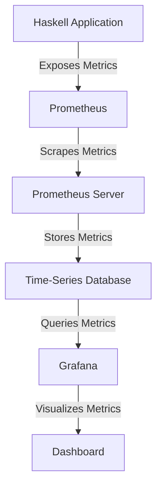

## 16.4 Metrics Collection and Visualization

In the realm of software engineering, particularly when working with Haskell, understanding and monitoring the performance of your applications is crucial. Metrics collection and visualization play a pivotal role in achieving this. This section will guide you through the process of collecting metrics in Haskell applications and visualizing them using powerful tools like Prometheus and Grafana. We'll explore the concepts, provide code examples, and offer insights into best practices for implementing these techniques in your projects.

### Introduction to Metrics Collection

Metrics collection involves gathering quantitative data about various aspects of your application's performance. This data can include response times, error rates, memory usage, and more. By collecting and analyzing these metrics, you can gain valuable insights into the behavior of your application, identify bottlenecks, and make informed decisions to optimize performance.

#### Key Concepts

- **Quantitative Data**: Metrics provide numerical data that can be measured and analyzed.
- **Performance Monitoring**: Metrics help track the performance of your application over time.
- **Alerting**: Metrics can trigger alerts when certain thresholds are exceeded, allowing for proactive issue resolution.

### Visualization Tools

Visualization is the process of representing metrics data in a graphical format, making it easier to understand and analyze. Two popular tools for visualizing metrics are Grafana and Prometheus.

#### Grafana

Grafana is an open-source platform for monitoring and observability. It allows you to create dashboards and visualize metrics data from various sources. With Grafana, you can create interactive and customizable visualizations that provide real-time insights into your application's performance.

#### Prometheus

Prometheus is an open-source monitoring and alerting toolkit. It is designed to collect and store metrics data, which can then be queried and visualized using tools like Grafana. Prometheus provides a powerful query language (PromQL) for extracting and analyzing metrics data.

### Implementing Metrics Collection in Haskell

To implement metrics collection in a Haskell application, you need to expose metrics endpoints and configure data sources. Let's walk through the process step by step.

#### Step 1: Setting Up Prometheus

1. **Install Prometheus**: Download and install Prometheus from the [official website](https://prometheus.io/).
2. **Configure Prometheus**: Create a configuration file (`prometheus.yml`) to define the metrics endpoints you want to scrape. Here's an example configuration:

   ```yaml
   global:
     scrape_interval: 15s

   scrape_configs:
     - job_name: 'haskell_app'
       static_configs:
         - targets: ['localhost:8080']
   ```

3. **Run Prometheus**: Start Prometheus using the configuration file:

   ```bash
   ./prometheus --config.file=prometheus.yml
   ```

#### Step 2: Exposing Metrics in Haskell

To expose metrics in a Haskell application, you can use libraries like `prometheus-haskell`. This library provides a simple interface for defining and exporting metrics.

1. **Install the Library**: Add `prometheus-haskell` to your project's dependencies.

   ```haskell
   cabal install prometheus-haskell
   ```

2. **Define Metrics**: Use the library to define the metrics you want to collect. Here's an example of defining a counter metric:

   ```haskell
   import Prometheus

   requestCounter :: IO Counter
   requestCounter = register $ counter (Info "http_requests_total" "Total number of HTTP requests")

   incrementRequestCounter :: Counter -> IO ()
   incrementRequestCounter counter = inc counter
   ```

3. **Expose Metrics Endpoint**: Create an HTTP endpoint to expose the metrics in a format that Prometheus can scrape.

   ```haskell
   import Network.Wai
   import Network.Wai.Handler.Warp (run)
   import Prometheus.Metric.GHC (ghcMetrics)
   import Prometheus.Metric.Wai (metricsApp)

   main :: IO ()
   main = do
     _ <- ghcMetrics -- Collect GHC runtime metrics
     run 8080 $ metricsApp
   ```

#### Step 3: Visualizing Metrics with Grafana

1. **Install Grafana**: Download and install Grafana from the [official website](https://grafana.com/).
2. **Configure Data Source**: Add Prometheus as a data source in Grafana.
3. **Create Dashboards**: Use Grafana's dashboard editor to create visualizations of your metrics data. You can use PromQL to query the data and create graphs, tables, and alerts.

### Code Example: Complete Haskell Application with Metrics

Here's a complete example of a Haskell application that collects and exposes metrics using `prometheus-haskell`:

```haskell
{-# LANGUAGE OverloadedStrings #-}

import Network.Wai
import Network.Wai.Handler.Warp (run)
import Prometheus
import Prometheus.Metric.GHC (ghcMetrics)
import Prometheus.Metric.Wai (metricsApp)
import Network.HTTP.Types (status200)
import Network.Wai.Middleware.RequestLogger (logStdoutDev)

-- Define a counter metric
requestCounter :: IO Counter
requestCounter = register $ counter (Info "http_requests_total" "Total number of HTTP requests")

-- Increment the counter for each request
incrementRequestCounter :: Counter -> IO Middleware
incrementRequestCounter counter = return $ \app req sendResponse -> do
  inc counter
  app req sendResponse

-- Main application
app :: Application
app _ respond = respond $ responseLBS status200 [("Content-Type", "text/plain")] "Hello, World!"

main :: IO ()
main = do
  _ <- ghcMetrics -- Collect GHC runtime metrics
  counter <- requestCounter
  middleware <- incrementRequestCounter counter
  run 8080 $ logStdoutDev $ middleware app
```

### Try It Yourself

To experiment with the code example, try modifying the application to collect additional metrics, such as response times or error rates. You can also explore different visualization options in Grafana to gain deeper insights into your application's performance.

### Visualizing Metrics Collection and Visualization

To better understand the flow of metrics collection and visualization, let's look at a diagram that illustrates the process:



**Diagram Description**: This diagram shows the flow of metrics collection and visualization. The Haskell application exposes metrics, which are scraped by Prometheus. The metrics are stored in a time-series database and queried by Grafana for visualization on a dashboard.

### Best Practices for Metrics Collection and Visualization

- **Define Clear Metrics**: Clearly define the metrics you want to collect and ensure they align with your application's performance goals.
- **Use Labels Wisely**: Use labels to add dimensions to your metrics, but avoid excessive cardinality, which can impact performance.
- **Monitor Resource Usage**: Keep an eye on the resource usage of your metrics collection and visualization setup to ensure it doesn't become a bottleneck.
- **Set Alerts**: Configure alerts in Grafana to notify you of any anomalies or performance issues.
- **Regularly Review Dashboards**: Regularly review your Grafana dashboards to ensure they provide the insights you need.

### References and Further Reading

- [Grafana](https://grafana.com/)
- [Prometheus](https://prometheus.io/)
- [Prometheus Haskell Library](https://hackage.haskell.org/package/prometheus)
- [Grafana Documentation](https://grafana.com/docs/)
- [Prometheus Documentation](https://prometheus.io/docs/)

### Knowledge Check

Before we conclude, let's reinforce what we've learned with a few questions:

- What are the key benefits of collecting metrics in a Haskell application?
- How does Prometheus collect and store metrics data?
- What role does Grafana play in the visualization of metrics?
- How can you expose metrics in a Haskell application?
- What are some best practices for defining and using metrics?

### Embrace the Journey

Remember, mastering metrics collection and visualization is an ongoing journey. As you continue to explore and implement these techniques, you'll gain deeper insights into your applications and become more adept at optimizing their performance. Keep experimenting, stay curious, and enjoy the process!

## Quiz: Metrics Collection and Visualization



### What is the primary purpose of metrics collection in a Haskell application?

- [x] To gather quantitative data about application performance
- [ ] To generate random data for testing
- [ ] To replace logging functionality
- [ ] To create user interfaces

> **Explanation:** Metrics collection is primarily used to gather quantitative data about application performance, which helps in monitoring and optimizing the application.

### Which tool is commonly used for visualizing metrics data in real-time?

- [x] Grafana
- [ ] Hadoop
- [ ] Docker
- [ ] Kubernetes

> **Explanation:** Grafana is a popular tool for visualizing metrics data in real-time, providing interactive dashboards and visualizations.

### How does Prometheus collect metrics data from a Haskell application?

- [x] By scraping metrics endpoints exposed by the application
- [ ] By directly accessing the application's database
- [ ] By intercepting network traffic
- [ ] By modifying the application's source code

> **Explanation:** Prometheus collects metrics data by scraping metrics endpoints exposed by the application, which are configured in its configuration file.

### What is a key feature of Grafana that enhances its usability for metrics visualization?

- [x] Customizable dashboards
- [ ] Built-in email client
- [ ] Integrated development environment
- [ ] File storage system

> **Explanation:** Grafana's customizable dashboards allow users to create interactive and tailored visualizations of their metrics data.

### Which Haskell library is commonly used to expose metrics for Prometheus?

- [x] prometheus-haskell
- [ ] aeson
- [ ] warp
- [ ] lens

> **Explanation:** The `prometheus-haskell` library is commonly used to define and expose metrics in a format that Prometheus can scrape.

### What is the role of labels in metrics collection?

- [x] To add dimensions to metrics data
- [ ] To encrypt metrics data
- [ ] To compress metrics data
- [ ] To delete old metrics data

> **Explanation:** Labels are used to add dimensions to metrics data, allowing for more granular analysis and filtering.

### What should be considered when using labels in metrics?

- [x] Avoiding excessive cardinality
- [ ] Using only numeric labels
- [ ] Encrypting all labels
- [ ] Using labels for authentication

> **Explanation:** Excessive cardinality in labels can impact performance, so it's important to use them wisely.

### What is a best practice for monitoring resource usage in a metrics setup?

- [x] Regularly review resource usage to prevent bottlenecks
- [ ] Ignore resource usage as it's not important
- [ ] Use only default settings
- [ ] Disable alerts to reduce noise

> **Explanation:** Regularly reviewing resource usage helps ensure that the metrics setup does not become a bottleneck.

### What is the purpose of setting alerts in Grafana?

- [x] To notify of anomalies or performance issues
- [ ] To automatically fix application bugs
- [ ] To generate random metrics data
- [ ] To replace manual testing

> **Explanation:** Alerts in Grafana are used to notify users of any anomalies or performance issues, allowing for proactive resolution.

### True or False: Metrics collection and visualization are only useful during the development phase of an application.

- [ ] True
- [x] False

> **Explanation:** Metrics collection and visualization are useful throughout the entire lifecycle of an application, including development, testing, and production.


