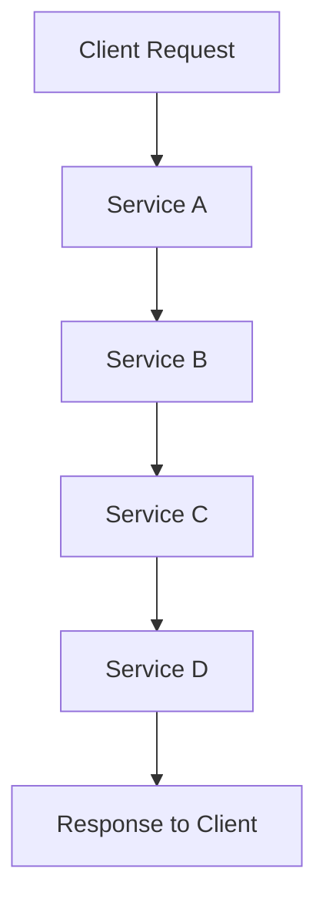

## 16.5 Distributed Tracing with OpenTelemetry in Haskell

Distributed systems have become the backbone of modern applications, enabling scalability and resilience. However, with this complexity comes the challenge of understanding how requests traverse through these systems. Distributed tracing is a powerful technique that allows us to track requests as they flow through various services, providing insights into system behavior and performance bottlenecks. In this section, we will explore how to implement distributed tracing in Haskell using OpenTelemetry, a vendor-neutral framework for observability.

### Understanding Distributed Tracing

Distributed tracing involves capturing the journey of a request as it traverses through different services in a distributed system. Each step in this journey is called a "span," and a collection of spans forms a "trace." By analyzing traces, we can identify performance bottlenecks, understand service dependencies, and improve system reliability.

#### Key Concepts

- **Trace**: A collection of spans representing a single request's journey through the system.
- **Span**: A single operation within a trace, representing a unit of work.
- **Context Propagation**: The mechanism of passing trace context across service boundaries.

### Introduction to OpenTelemetry

OpenTelemetry is an open-source observability framework that provides tools for collecting, processing, and exporting telemetry data such as traces, metrics, and logs. It is designed to be vendor-neutral, allowing integration with various backends like Jaeger, Zipkin, and Prometheus.

#### Benefits of OpenTelemetry

- **Standardization**: Provides a unified API for telemetry data collection.
- **Flexibility**: Supports multiple languages and backends.
- **Extensibility**: Easily integrates with existing observability tools.

### Implementing Distributed Tracing in Haskell

To implement distributed tracing in Haskell, we will use the OpenTelemetry Haskell SDK. This SDK provides the necessary tools to instrument Haskell applications for tracing.

#### Setting Up the Environment

Before we begin, ensure you have the following prerequisites:

- Haskell installed on your system.
- Access to a tracing backend like Jaeger or Zipkin.
- The OpenTelemetry Haskell SDK.

#### Installing the OpenTelemetry Haskell SDK

To start using OpenTelemetry in your Haskell project, add the following dependencies to your `cabal` or `stack` configuration:

```haskell
dependencies:
  - opentelemetry
  - opentelemetry-exporter-jaeger
```

#### Instrumenting a Haskell Application

Let's walk through the process of instrumenting a simple Haskell application with OpenTelemetry.

##### Step 1: Initialize the Tracer

First, we need to initialize a tracer that will be responsible for creating and managing spans.

```haskell
import OpenTelemetry.Trace
import OpenTelemetry.Trace.Core

main :: IO ()
main = do
  tracerProvider <- createTracerProvider
  let tracer = getTracer tracerProvider "example-tracer" "1.0.0"
  runApp tracer
```

##### Step 2: Create and Manage Spans

Once the tracer is initialized, we can create spans to represent operations within our application.

```haskell
runApp :: Tracer -> IO ()
runApp tracer = do
  inSpan tracer "main-operation" defaultSpanArguments $ \span -> do
    -- Simulate some work
    putStrLn "Performing main operation"
    inSpan tracer "sub-operation" defaultSpanArguments $ \subSpan -> do
      putStrLn "Performing sub-operation"
```

##### Step 3: Export Traces

To visualize traces, we need to export them to a tracing backend. Here, we'll use Jaeger as an example.

```haskell
import OpenTelemetry.Exporter.Jaeger

setupJaegerExporter :: IO ()
setupJaegerExporter = do
  let config = defaultJaegerConfig { serviceName = "haskell-service" }
  _ <- initJaegerExporter config
  return ()
```

#### Complete Example

Here's a complete example that ties everything together:

```haskell
import OpenTelemetry.Trace
import OpenTelemetry.Trace.Core
import OpenTelemetry.Exporter.Jaeger

main :: IO ()
main = do
  setupJaegerExporter
  tracerProvider <- createTracerProvider
  let tracer = getTracer tracerProvider "example-tracer" "1.0.0"
  runApp tracer

runApp :: Tracer -> IO ()
runApp tracer = do
  inSpan tracer "main-operation" defaultSpanArguments $ \span -> do
    putStrLn "Performing main operation"
    inSpan tracer "sub-operation" defaultSpanArguments $ \subSpan -> do
      putStrLn "Performing sub-operation"

setupJaegerExporter :: IO ()
setupJaegerExporter = do
  let config = defaultJaegerConfig { serviceName = "haskell-service" }
  _ <- initJaegerExporter config
  return ()
```

### Visualizing Traces

Once the application is instrumented and running, you can visualize the traces using a tool like Jaeger. This will provide a graphical representation of the request flow, making it easier to identify bottlenecks and optimize performance.

#### Diagram: Trace Visualization



*Caption: Visual representation of a distributed trace across multiple services.*

### Benefits of Distributed Tracing

Implementing distributed tracing with OpenTelemetry in Haskell offers several benefits:

- **Performance Optimization**: Identify slow services and optimize them for better performance.
- **Dependency Mapping**: Understand service dependencies and interactions.
- **Error Diagnosis**: Quickly pinpoint the source of errors and failures.

### Challenges and Considerations

While distributed tracing provides valuable insights, there are challenges to consider:

- **Overhead**: Tracing can introduce performance overhead, so it's important to balance the level of detail with performance impact.
- **Data Volume**: Traces can generate large volumes of data, requiring efficient storage and processing solutions.

### References and Further Reading

- [OpenTelemetry Haskell SDK](https://github.com/iovisor/bpftrace)
- [Jaeger Documentation](https://www.jaegertracing.io/docs/)
- [OpenTelemetry Specification](https://opentelemetry.io/docs/specs/)

### Try It Yourself

Experiment with the code examples provided by modifying the span names and adding additional spans to represent more complex operations. Observe how these changes affect the trace visualization in your chosen backend.

### Knowledge Check

- What is the purpose of distributed tracing?
- How does OpenTelemetry help in implementing distributed tracing?
- What are the key components of a trace in OpenTelemetry?

### Embrace the Journey

Remember, distributed tracing is a powerful tool for understanding complex systems. As you continue to explore and implement tracing in your applications, you'll gain deeper insights into system performance and behavior. Keep experimenting, stay curious, and enjoy the journey!

## Quiz: Distributed Tracing with OpenTelemetry



### What is a trace in distributed tracing?

- [x] A collection of spans representing a request's journey
- [ ] A single operation within a request
- [ ] A mechanism for passing trace context
- [ ] A tool for visualizing system performance

> **Explanation:** A trace is a collection of spans that represent the journey of a request through a distributed system.

### What is a span in the context of distributed tracing?

- [x] A single operation within a trace
- [ ] A collection of traces
- [ ] A tool for exporting telemetry data
- [ ] A mechanism for context propagation

> **Explanation:** A span represents a single operation within a trace, capturing details about that specific unit of work.

### What is the role of OpenTelemetry in distributed tracing?

- [x] It provides a vendor-neutral framework for observability
- [ ] It is a backend for storing trace data
- [ ] It is a language-specific tool for tracing
- [ ] It is a visualization tool for traces

> **Explanation:** OpenTelemetry is a vendor-neutral framework that provides tools for collecting, processing, and exporting telemetry data.

### How do you initialize a tracer in Haskell using OpenTelemetry?

- [x] By creating a tracer provider and getting a tracer from it
- [ ] By directly creating a span
- [ ] By exporting traces to a backend
- [ ] By visualizing traces in a tool

> **Explanation:** To initialize a tracer, you create a tracer provider and then get a tracer from it, which is used to create and manage spans.

### What is the purpose of context propagation in distributed tracing?

- [x] To pass trace context across service boundaries
- [ ] To visualize traces in a backend
- [ ] To create spans within a trace
- [ ] To export telemetry data

> **Explanation:** Context propagation is the mechanism of passing trace context across service boundaries, ensuring that traces are linked correctly.

### Which tool can be used to visualize traces exported by OpenTelemetry?

- [x] Jaeger
- [ ] Prometheus
- [ ] Grafana
- [ ] Kubernetes

> **Explanation:** Jaeger is a tool commonly used to visualize traces exported by OpenTelemetry.

### What is a potential challenge of implementing distributed tracing?

- [x] Performance overhead
- [ ] Lack of standardization
- [ ] Incompatibility with Haskell
- [ ] Limited language support

> **Explanation:** Distributed tracing can introduce performance overhead, so it's important to balance the level of detail with performance impact.

### What is the benefit of using OpenTelemetry for distributed tracing?

- [x] It supports multiple languages and backends
- [ ] It is specific to Haskell
- [ ] It only works with Jaeger
- [ ] It is a proprietary tool

> **Explanation:** OpenTelemetry is flexible and supports multiple languages and backends, making it a versatile choice for distributed tracing.

### How can you reduce the data volume generated by traces?

- [x] By sampling traces
- [ ] By increasing the level of detail
- [ ] By exporting traces to multiple backends
- [ ] By visualizing traces in real-time

> **Explanation:** Sampling traces can help reduce the data volume generated, making it more manageable.

### True or False: Distributed tracing is only useful for identifying errors in a system.

- [ ] True
- [x] False

> **Explanation:** Distributed tracing is useful for identifying errors, but it also helps in understanding system performance, dependencies, and behavior.


