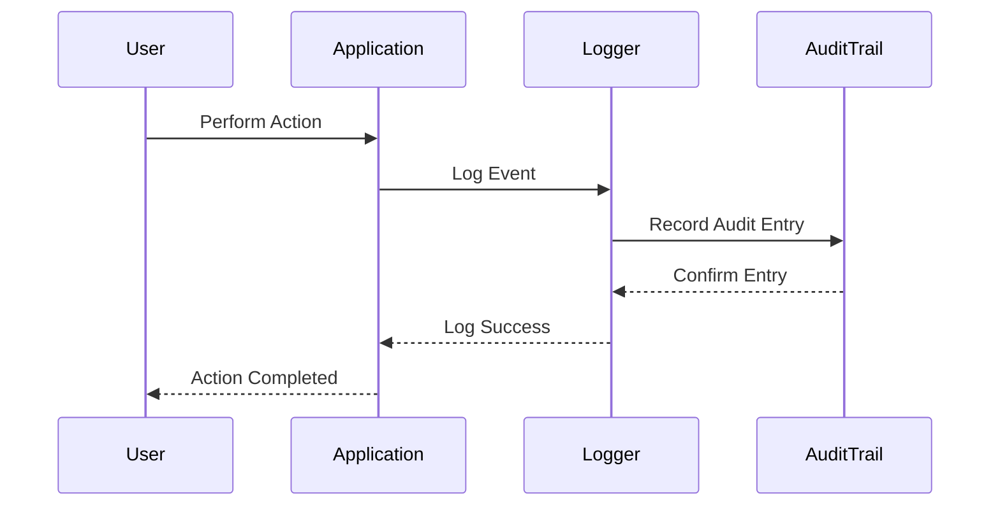

## 16.6 Event Logging and Audit Trails

In the realm of software engineering, particularly within the Haskell ecosystem, event logging and audit trails play a crucial role in maintaining system integrity, ensuring compliance, and facilitating debugging and analysis. This section delves into the intricacies of implementing robust event logging and audit trails in Haskell, leveraging its unique features to create secure, efficient, and compliant systems.

### Understanding Event Logging and Audit Trails

#### Event Logging

Event logging involves recording significant events that occur within an application. These events can range from user actions and system errors to security breaches and performance metrics. The primary purpose of event logging is to provide a detailed account of the application's behavior over time, which can be invaluable for debugging, performance tuning, and understanding user interactions.

#### Audit Trails

Audit trails, on the other hand, are a specific type of logging focused on maintaining a secure, chronological record of activities within a system. They are particularly important in environments where compliance with regulations such as GDPR, HIPAA, or SOX is required. Audit trails ensure that every action taken within the system is recorded in a way that is tamper-proof and verifiable.

### Key Concepts and Terminology

- **Write-Once Storage**: A storage mechanism where data, once written, cannot be altered or deleted. This is crucial for maintaining the integrity of audit trails.
- **Secure Logging**: Implementing logging practices that protect the confidentiality and integrity of log data.
- **Regulatory Compliance**: Ensuring that logging practices meet the legal and regulatory requirements relevant to the industry or region.

### Implementing Event Logging in Haskell

Haskell's strong type system, immutability, and functional programming paradigms provide unique advantages when implementing event logging. Let's explore how to leverage these features effectively.

#### Choosing a Logging Library

Haskell offers several libraries for logging, such as `hslogger`, `fast-logger`, and `katip`. Each has its strengths, and the choice depends on the specific requirements of your application.

- **hslogger**: A simple and flexible logging library that supports multiple backends.
- **fast-logger**: Known for its performance, suitable for high-throughput applications.
- **katip**: Provides structured logging with support for JSON output, making it ideal for complex applications requiring detailed logs.

#### Setting Up a Basic Logger

Here's a simple example using `fast-logger` to set up a basic logging system in Haskell:

```haskell
import System.Log.FastLogger

main :: IO ()
main = do
    -- Initialize the logger with a file backend
    timeCache <- newTimeCache simpleTimeFormat
    (logger, cleanup) <- newTimedFastLogger timeCache (LogFileNoRotate "application.log" 4096)

    -- Log an informational message
    logger $ \time -> toLogStr time <> " [INFO] Application started\n"

    -- Perform cleanup on exit
    cleanup
```

**Explanation:**

- **Time Cache**: Used to format timestamps efficiently.
- **Logger Initialization**: Sets up a logger that writes to a file with no rotation.
- **Logging**: Logs an informational message with a timestamp.

#### Structured Logging

Structured logging involves logging data in a structured format, such as JSON, which allows for easier parsing and analysis. `katip` is a popular choice for structured logging in Haskell.

```haskell
import Katip

main :: IO ()
main = do
    handleScribe <- mkHandleScribe ColorIfTerminal stdout (permitItem InfoS) V2
    let makeLogEnv = registerScribe "stdout" handleScribe defaultScribeSettings =<< initLogEnv "MyApp" "production"
    bracket makeLogEnv closeScribes $ \le -> do
        runKatipContextT le () mempty $ logMsg "main" InfoS "Application started"
```

**Explanation:**

- **Handle Scribe**: A scribe that writes logs to the console.
- **Log Environment**: Initializes the logging environment with application and environment names.
- **Logging Context**: Logs a message with contextual information.

### Implementing Audit Trails

Audit trails require a more rigorous approach to ensure data integrity and security. Here are some best practices for implementing audit trails in Haskell.

#### Ensuring Data Integrity

- **Write-Once Storage**: Use append-only data structures or databases that support write-once semantics, such as immutable logs or blockchain-based storage.
- **Digital Signatures**: Sign log entries to prevent tampering. Haskell's cryptographic libraries can be used to implement digital signatures.

#### Example: Using Append-Only Logs

```haskell
import Data.Time.Clock
import Data.ByteString.Char8 (pack)
import Crypto.Hash.SHA256 (hash)

data AuditEntry = AuditEntry
    { timestamp :: UTCTime
    , userId    :: String
    , action    :: String
    , hashValue :: String
    }

createAuditEntry :: UTCTime -> String -> String -> AuditEntry
createAuditEntry time user action =
    let entryData = pack (show time ++ user ++ action)
        entryHash = show (hash entryData)
    in AuditEntry time user action entryHash

main :: IO ()
main = do
    currentTime <- getCurrentTime
    let entry = createAuditEntry currentTime "user123" "login"
    print entry
```

**Explanation:**

- **AuditEntry**: A data structure representing an audit log entry.
- **Hashing**: Uses SHA-256 to hash the entry data, ensuring integrity.

### Compliance and Security Considerations

#### Regulatory Compliance

- **Data Retention Policies**: Ensure logs are retained for the required duration as per regulatory standards.
- **Access Controls**: Implement strict access controls to ensure only authorized personnel can view or modify logs.

#### Security Best Practices

- **Encryption**: Encrypt logs to protect sensitive information.
- **Anonymization**: Anonymize user data where possible to enhance privacy.

### Visualizing Event Logging and Audit Trails

To better understand the flow of event logging and audit trails, let's visualize the process using a sequence diagram.



**Diagram Explanation:**

- **User Action**: Initiates an action within the application.
- **Event Logging**: The application logs the event.
- **Audit Trail Recording**: The logger records an audit entry.
- **Confirmation**: The audit trail confirms the entry, ensuring integrity.

### Try It Yourself

Experiment with the provided code examples by modifying the log messages, changing the logging format, or implementing additional security measures such as encryption. Consider integrating these logging practices into a small Haskell application to see how they enhance observability and security.

### Knowledge Check

- What are the key differences between event logging and audit trails?
- How does Haskell's type system benefit the implementation of logging systems?
- Why is write-once storage important for audit trails?
- What are some security measures you can implement to protect log data?

### Summary

In this section, we've explored the critical role of event logging and audit trails in Haskell applications. By leveraging Haskell's unique features, such as its strong type system and functional paradigms, we can implement robust logging solutions that enhance system observability, ensure compliance, and protect against security threats. Remember, this is just the beginning. As you continue to develop your Haskell applications, keep experimenting with different logging strategies and stay curious about new technologies and practices.

## Quiz: Event Logging and Audit Trails



### What is the primary purpose of event logging in applications?

- [x] To provide a detailed account of the application's behavior over time
- [ ] To replace audit trails
- [ ] To encrypt user data
- [ ] To manage application configurations

> **Explanation:** Event logging records significant application events for analysis, debugging, and performance tuning.

### Which Haskell library is known for structured logging with JSON support?

- [ ] hslogger
- [ ] fast-logger
- [x] katip
- [ ] warp

> **Explanation:** Katip provides structured logging with support for JSON output, making it ideal for complex applications.

### What is a key feature of write-once storage in audit trails?

- [x] Data, once written, cannot be altered or deleted
- [ ] It allows for real-time data modification
- [ ] It supports dynamic data encryption
- [ ] It enables data compression

> **Explanation:** Write-once storage ensures the integrity of audit trails by preventing data alteration or deletion.

### How can digital signatures be used in audit trails?

- [x] To prevent tampering with log entries
- [ ] To encrypt log entries
- [ ] To anonymize user data
- [ ] To compress log files

> **Explanation:** Digital signatures ensure the authenticity and integrity of log entries by preventing tampering.

### What is an advantage of structured logging?

- [x] Easier parsing and analysis of log data
- [ ] Reduced log file size
- [ ] Increased log entry speed
- [ ] Automatic log encryption

> **Explanation:** Structured logging formats data in a way that is easier to parse and analyze, often using formats like JSON.

### Why is encryption important in logging?

- [x] To protect sensitive information in logs
- [ ] To increase logging speed
- [ ] To reduce storage requirements
- [ ] To anonymize user data

> **Explanation:** Encryption protects sensitive information in logs from unauthorized access.

### What is the role of access controls in logging?

- [x] To ensure only authorized personnel can view or modify logs
- [ ] To speed up log entry processing
- [ ] To anonymize log data
- [ ] To compress log files

> **Explanation:** Access controls restrict log access to authorized personnel, enhancing security.

### What does the `fast-logger` library in Haskell prioritize?

- [x] Performance
- [ ] Structured logging
- [ ] JSON support
- [ ] Real-time log analysis

> **Explanation:** Fast-logger is known for its performance, making it suitable for high-throughput applications.

### Which of the following is a security measure for protecting log data?

- [x] Anonymization
- [ ] Real-time modification
- [ ] Dynamic compression
- [ ] Automatic deletion

> **Explanation:** Anonymization enhances privacy by removing identifiable information from logs.

### True or False: Audit trails are primarily used for debugging purposes.

- [ ] True
- [x] False

> **Explanation:** Audit trails are used to maintain a secure, chronological record of activities, often for compliance and security purposes.




